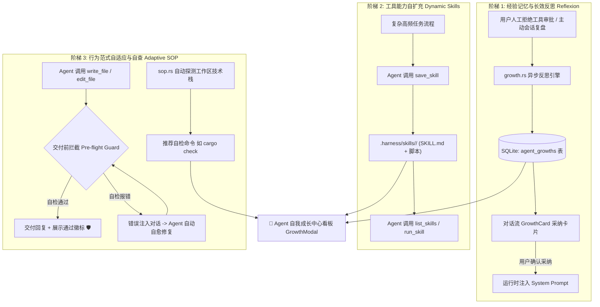

# Agent 自动成长与自我进化完整体系方案（三阶成长闭环）

本文档详细记录 `harness_mini` 中 **Agent 自我成长三阶体系** 的完整架构设计、数据持久化机制、执行状态机与前后端落地实现。

---

## 一、 体系背景与设计理念

### 1. 传统通用 Coding Agent 的三大痛点
1. **“屡教不改”（无经验记忆）**：用户在上一会话中纠正了编码习惯或路径约束，开启新会话后 Agent 依然重蹈覆辙；
2. **“能力定死”（无动态扩展）**：Agent 内置工具出厂即固化，面对项目特有的复杂打包、数据迁移或代码生成脚本，无法自我扩充工具箱；
3. **“交付带毒”（无自检自查）**：Agent 在修改代码后直接向用户邀功，用户一拉代码才发现缺少括号、类型不匹配或测试跑不通，信任成本极高。

### 2. 核心架构设计原则
- **极致轻量（Zero Heavy Services）**：不引入重型向量数据库（Vector DB）或 Python 常驻后台进程，冷启动耗时 `< 100ms`，内存占用增量 `< 10MB`；
- **人在回路（Human-in-the-Loop）**：所有反思提炼出的经验、生成的技能脚本全部以可视化卡片呈现，用户拥有一票否决权，随时可在线编辑或停用；
- **全链路持久化（Strict Persistence）**：经验沉淀至本地 SQLite 数据库，技能文件化至 `.harness/skills/`（随 Git 版本控制），保证跨重启、跨设备完全持久。

---

## 二、 三阶成长体系全景架构图



---

## 三、 阶梯 1 深度解析：经验记忆与长效反思 (Reflexion)

### 1. 触发源与提炼流程
1. **被动触发（拦截纠偏）**：在审批模式下，当用户点击“拒绝（Reject）”Agent 的某个工具调用并输入拒绝理由（如 *“不要直接删表，先做数据备份”*）时，后台静默启动异步反思引擎。
2. **主动触发（会话复盘）**：用户在会话菜单中点击“复盘提炼经验”，系统抽取当前会话完整的上下文与工具交互记录发起提炼。

### 2. 反思提炼引擎 ([`src-tauri/src/growth.rs`](file:///d:/WorkSpace/Project/harness_mini/src-tauri/src/growth.rs))
- 引擎调用当前激活的模型，注入结构化 Few-Shot Prompt，强制输出严格 JSON：
  ```json
  {
    "reflection_process": "用户拒绝了直接修改生产配置，指出必须先复制备份...",
    "rule_category": "safety",
    "rule_content": "修改 config.prod.json 前，必须先创建带有时间戳的副本进行备份。"
  }
  ```
- 提炼完成后落库为 `pending` 状态，并通过事件 `growth:proposed` 广播给前端。

### 3. 数据持久化结构 ([`src-tauri/src/store.rs`](file:///d:/WorkSpace/Project/harness_mini/src-tauri/src/store.rs))
在 SQLite 中建立 `agent_growths` 表：
```sql
CREATE TABLE IF NOT EXISTS agent_growths (
    id TEXT PRIMARY KEY,
    project_id TEXT,
    session_id TEXT,
    trigger_type TEXT NOT NULL,         -- 'rejection' | 'review' | 'manual'
    trigger_context TEXT NOT NULL,      -- 触发时的上下文/拒绝原因
    reflection_process TEXT NOT NULL,   -- AI 内部反思推导逻辑
    rule_category TEXT NOT NULL,        -- 'safety' | 'style' | 'workflow' | 'preference'
    rule_content TEXT NOT NULL,         -- 提炼出的正向经验规则
    is_active INTEGER NOT NULL DEFAULT 1, -- 1: 生效, 0: 停用
    applied_count INTEGER NOT NULL DEFAULT 0, -- 生效次数统计
    created_at INTEGER NOT NULL,
    updated_at INTEGER NOT NULL
);
CREATE INDEX IF NOT EXISTS idx_growths_project ON agent_growths(project_id);
```

### 4. 运行时装配与自增生效
- 在 [`src-tauri/src/agent.rs`](file:///d:/WorkSpace/Project/harness_mini/src-tauri/src/agent.rs) 的 `build_project_section` 中：
  - 每次执行前从 SQLite 查询当前项目所有 `is_active = 1` 的规则；
  - 按分类格式化为 `## 项目演进经验（必须严格遵守）` 段落，注入系统提示词的第 0 位（永不被截断）；
  - 原子性累加对应规则的 `applied_count`，记录经验带来的价值。

---

## 四、 阶梯 2 深度解析：工具能力自扩充 (Dynamic Skills)

### 1. 规范化技能目录规范
所有技能采用透明的本地文件化组织方式，存放于项目根目录：
```text
<workspace>/
└── .harness/
    └── skills/
        ├── deploy-preview/
        │   ├── SKILL.md       # 元数据（名称、描述、脚本类型、使用说明）
        │   └── run.ps1        # 实际执行脚本 (Windows)
        └── check-links/
            ├── SKILL.md
            └── run.py         # Python 校验脚本
```
- **天然版本化**：随代码一起提交 Git，团队成员 `git pull` 后立即可用；
- **零运行时开销**：不占用任何后台常驻进程与内存。

### 2. Agent 动态工具集成 ([`src-tauri/src/tools.rs`](file:///d:/WorkSpace/Project/harness_mini/src-tauri/src/tools.rs))
向 Agent 开放原生三件套工具：
1. **`list_skills`**：Agent 在面临复杂任务前，主动查询项目是否已有封装好的技能工具；
2. **`save_skill`**：Agent 发现用户下发了高频或多步骤流程，自主编写脚本并固化为技能；
3. **`run_skill`**：执行技能脚本，底层复用进程管理管道，支持实时流式日志输出、超时拦截（默认遵循设置）与强行终止。

### 3. 跨平台脚本调度 ([`src-tauri/src/skills.rs`](file:///d:/WorkSpace/Project/harness_mini/src-tauri/src/skills.rs))
- 自动适配 Windows、macOS 与 Linux：
  - `ps1` -> `powershell -ExecutionPolicy Bypass -File ...`
  - `bat` -> `cmd /C ...`
  - `sh` -> `bash ...`
  - `py` -> `python ...`
  - `js` -> `node ...`

---

## 五、 阶梯 3 深度解析：行为范式自适应与自查 (Adaptive SOP)

### 1. 技术栈自适应探测引擎 ([`src-tauri/src/sop.rs`](file:///d:/WorkSpace/Project/harness_mini/src-tauri/src/sop.rs))
无需用户手工配置，系统智能扫描工作区并提取最适自检命令：
- **Rust 项目**（检测到 `Cargo.toml`）: 推荐 `cargo check`；
- **Node / TypeScript 项目**（检测到 `package.json`）: 
  - 优先检测 `pnpm-lock.yaml` / `yarn.lock` / `bun.lockb` 选择对应包管理器；
  - 检查 `scripts` 字段，优先提取 `test`、`build` 或 `check` 脚本（如 `npm run build`）；
- **Go 项目**（检测到 `go.mod`）: 推荐 `go test ./...`；
- **Python 项目**（检测到 `pyproject.toml` / `requirements.txt`）: 推荐 `pytest`。

### 2. 交付前自检拦截与自愈闭环
在 [`src-tauri/src/agent.rs`](file:///d:/WorkSpace/Project/harness_mini/src-tauri/src/agent.rs) 的核心执行循环中：
1. **变更追踪**：当 Agent 命中 `write_file` 或 `edit_file` 时，标记 `files_modified = true`；
2. **交付拦截**：在模型停止调用工具、准备输出自然语言总结前，若 `files_modified == true` 且 SOP 守卫开启，系统挂起当前回复，自动启动后台子进程运行自检命令；
3. **自愈流向**：
   - **自检通过**：广播 `sop:status(passed)`，展示绿色通过徽标并完成最终交付；
   - **自检失败**：广播 `sop:status(failed)`，将编译器/测试报错注入上下文（`【🛡️ 交付前 SOP 自检未通过】...`），Agent 自动进入下一轮循环，分析报错并就地自愈修复代码（最多重试 2 次），严禁将无法编译的代码交差。

---

## 六、 前端可视化与交互体系

### 1. 成长中心看板 ([`src/components/GrowthModal.tsx`](file:///d:/WorkSpace/Project/harness_mini/src/components/GrowthModal.tsx))
点击顶部工具栏的 **“🌱 成长中心”** 按钮打开模态窗口，包含三大标签页：
- **🌱 经验规则库**：
  - 支持按项目、分类（安全、规范、工作流、偏好）、状态（已生效/已停用）多维筛选与搜索；
  - 支持直接在界面上对规则正文进行二次编辑；
  - 显示规则被调用的真实生效次数（`applied_count`）；
  - 提供一键删除与会话溯源跳转。
- **⚡ 技能工具库**：
  - 展示工作区已定义的所有技能列表与详细说明；
  - 支持在线代码语法高亮预览；
  - 提供“新建技能”向导（自带 bat/ps1/sh/py/js 模板）；
  - 支持在系统资源管理器中直接打开技能所在目录。
- **🛡️ 交付自检 SOP**：
  - 显示自动识别出的技术栈（如 `Node.js / TypeScript (npm run build)`）；
  - 提供 SOP 守卫全局总开关；
  - 支持用户自定义覆盖自检命令；
  - 提供 **“▶️ 立即测试运行自检”** 按钮，可当场预览命令执行输出。

### 2. 对话流实时卡片与状态指示
- **经验采纳卡片 ([`src/components/GrowthCard.tsx`](file:///d:/WorkSpace/Project/harness_mini/src/components/GrowthCard.tsx))**：反思引擎提炼出新规则时，在对话流中直接呈现卡片，用户点击“采纳规则”立即生效。
- **SOP 脉冲指示器 ([`src/components/ChatView.tsx`](file:///d:/WorkSpace/Project/harness_mini/src/components/ChatView.tsx))**：实时显示 `🛡️ 交付前 SOP 自检中...` -> `🛡️ 交付自检未通过，Agent 正在自动排查并自愈修复...` -> `🛡️ 交付前 SOP 自检已通过`，全过程对用户透明可视。

---

## 七、 文件与数据结构速查表

| 功能领域 | 后端核心实现 | 前端 UI 与交互 | 数据持久化位置 |
| :--- | :--- | :--- | :--- |
| **阶梯 1：反思与经验** | [`growth.rs`](file:///d:/WorkSpace/Project/harness_mini/src-tauri/src/growth.rs) | [`GrowthCard.tsx`](file:///d:/WorkSpace/Project/harness_mini/src/components/GrowthCard.tsx), `GrowthModal.tsx` | SQLite: `agent_growths` 表 |
| **阶梯 2：动态技能** | [`skills.rs`](file:///d:/WorkSpace/Project/harness_mini/src-tauri/src/skills.rs) | `GrowthModal.tsx` (Tab 2) | 本地文件: `<workspace>/.harness/skills/` |
| **阶梯 3：自适应自查** | [`sop.rs`](file:///d:/WorkSpace/Project/harness_mini/src-tauri/src/sop.rs) | `GrowthModal.tsx` (Tab 3), `ChatView.tsx` | SQLite: `projects.sop_config` 字段 |
| **临时空间与自举** | [`temp.rs`](file:///d:/WorkSpace/Project/harness_mini/src-tauri/src/temp.rs) | [`TempActions.tsx`](file:///d:/WorkSpace/Project/harness_mini/src/components/TempActions.tsx), `DiffModal.tsx` | 本地数据目录: `temp-project/<code >/` |
