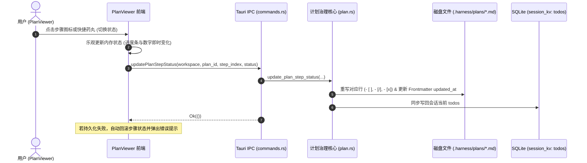

# 内置独立窗体文件与变更查看器架构设计与演进规范
# Built-in Multi-Tab File & Diff Viewer Architecture & Evolution Specification

本文档系统性记录 `harness_mini` 中 **内置独立窗体文件与变更查看器（File & Diff Viewer）** 的完整架构演进、前后端协同设计、多页签管理机制、专业 IDE 级研读审查功能以及工程验证规范。

---

## 目录
- [一、背景与核心痛点剖析](#一背景与核心痛点剖析)
- [二、业内领先工具方案调研与选型基准](#二业内领先工具方案调研与选型基准)
- [三、整体架构全景图：Tauri v2 双窗拓扑模型](#三整体架构全景图tauri-v2-双窗拓扑模型)
  - [1. 窗口拓扑与生命周期控制](#1-窗口拓扑与生命周期控制)
  - [2. 跨进程与跨窗口通信机制（IPC + Event）](#2-跨进程与跨窗口通信机制ipc--event)
  - [3. 路由设计与独立渲染隔离](#3-路由设计与独立渲染隔离)
- [四、多页签体系与状态持久化设计](#四多页签体系与状态持久化设计)
  - [1. 页签类型定义与模型设计](#1-页签类型定义与模型设计)
  - [2. 基于工作区哈希的持久化模型（Zustand + LocalStorage）](#2-基于工作区哈希的持久化模型zustand--localstorage)
  - [3. 原生拖拽重排序机制（Tab Drag & Drop）](#3-原生拖拽重排序机制tab-drag--drop)
  - [4. 页签交互上下文菜单与快捷键](#4-页签交互上下文菜单与快捷键)
- [五、代码研读与深度审查引擎（CodeViewer）](#五代码研读与深度审查引擎codeviewer)
  - [1. 真实语法着色与行渲染（highlight.js）](#1-真实语法着色与行渲染highlightjs)
  - [2. 精准锚点定位与连续行范围高亮（#L10-L25）](#2-精准锚点定位与连续行范围高亮l10-l25)
  - [3. 代码符号大纲抽屉导航（get_file_outline）](#3-代码符号大纲抽屉导航get_file_outline)
  - [4. 外部编辑器无缝联动（open_in_external_editor）](#4-外部编辑器无缝联动open_in_external_editor)
- [六、任务方案计划看板中枢（PlanViewer）](#六任务方案计划看板中枢planviewer)
  - [1. 方案文档结构化与分步进度看板](#1-方案文档结构化与分步进度看板)
  - [2. 步骤交互勾选与磁盘双向同步（update_plan_step_status）](#2-步骤交互勾选与磁盘双向同步update_plan_step_status)
  - [3. 乐观 UI 更新与自愈防失真](#3-乐观-ui-更新与自愈防失真)
- [七、代码变更差量对比引擎（DiffViewer）](#七代码变更差量对比引擎diffviewer)
  - [1. 双模视图：统一视图 (Unified) 与并排对比 (Split)](#1-双模视图统一视图-unified-与并排对比-split)
  - [2. 差异块快速寻址跳转（Hunk Jumper）](#2-差异块快速寻址跳转hunk-jumper)
  - [3. 行内字符级细化差量高亮（Intra-line Word-level Diff）](#3-行内字符级细化差量高亮intra-line-word-level-diff)
  - [4. 差异块级撤销恢复写回磁盘（revert_file_hunk）](#4-差异块级撤销恢复写回磁盘revert_file_hunk)
- [八、多模态资产查看器（ImageViewer）](#八多模态资产查看器imageviewer)
  - [1. 图像无损解析与 Base64 资产传输](#1-图像无损解析与-base64-资产传输)
  - [2. 漫游与缩放控制（Pan & Zoom）](#2-漫游与缩放控制pan--zoom)
  - [3. 物理分辨率与格式检测](#3-物理分辨率与格式检测)
- [九、全局触点挂载与无缝联动体系](#九全局触点挂载与无缝联动体系)
  - [1. Markdown 链接智能捕获与超链接胶囊](#1-markdown-链接智能捕获与超链接胶囊)
  - [2. Agent ToolCard 工具卡片直达挂载](#2-agent-toolcard-工具卡片直达挂载)
  - [3. 悬浮面板与变更区协同](#3-悬浮面板与变更区协同)
- [十、测试体系与工程验证](#十测试体系与工程验证)

---

## 一、背景与核心痛点剖析

在基于 AI Coding Agent 推进软件开发与系统演进时，人机交互的高频诉求主要集中在**阅读代码上下文**、**审查方案计划**与**核验改动差量**。然而，传统集成模式暴露出显著的体验与架构短板：

1. **对话视口拥挤与上下文被冲刷**：
   - 源码片段、长篇方案或大范围 Diff 嵌入在对话流中会急剧占用纵向滚动空间；随着多轮交互产生新消息，用户需要反复向上翻找之前阅读的文件，信息获取极易中断。
2. **多文件审查缺乏并行能力与历史记忆**：
   - 审查一个跨模块重构任务通常涉及 3~10 个关联文件；主界面单视口无法保留历史查看标签，切换文件即丢失滚动位置、高亮行号或搜索上下文。
3. **计划文档缺乏直观看板与双向闭环**：
   - Agent 生成的 `.harness/plans/*.md` 具有严格的执行步骤清单；如果用户只能作为静态文本阅读，无法手动勾选确认已完成步骤，导致人工审查与 Agent 执行脱节。
4. **代码变更审查粗糙，缺乏精细度与纠错手段**：
   - 现存 Diff 展示通常仅为行级别的整行增删，在相邻代码微调场景下无法直观发现修改了哪个字符或变量名；
   - 审查时若发现局部差异块（Hunk）改动不合理，必须重新向 Agent 描述或手动开编辑器修改，缺乏“一键局部撤销该块改动”的闭环手段。

---

## 二、业内领先工具方案调研与选型基准

通过对 Cursor、VS Code、Zed、Windsurf 及 Claude Artifacts 等业界领先工具的系统性调研，梳理出如下架构形态：

| 工具产品 | 查看器承载形态 | 多页签与持久化 | 语法与差异能力 | 评价与借鉴点 |
| :--- | :--- | :--- | :--- | :--- |
| **Cursor / VS Code** | 主工作区多 Editor Tab / Secondary Window | 强持久化（工作区隔离） | Monaco 编辑器，词法高亮，行内 Word Diff，Hunk 级暂存/丢弃 | **体验标杆**：多页签、拖拽排序、字符级差量与 Hunk 级撤销。 |
| **Claude Artifacts** | 主对话右侧抽屉式伴侣面板 (Sidecar) | 单一活动 Artifact，支持版本滑块 | 静态代码/富文本预览，无独立窗口 | **优点**：与对话紧密结合；**缺点**：受限于主窗体大小，无法多文件并行。 |
| **Windsurf (Cascade)** | 独立 Preview Tab 与 Diff Reviewer | 随执行流程动态唤起 | 并排/统一双视图，代码跳查 | **优点**：审查流程平滑；**缺点**：多屏工作流下无法拖拽至副屏。 |
| **Zed Editor** | Multibuffer 虚拟多缓冲区 | 瞬态缓冲区，按需保存 | 极其轻量高速，自研语法树解析 | **性能标杆**：快速唤起、秒级响应。 |

### 架构设计选型
`harness_mini` 选择**独立常驻窗体（Auxiliary Standalone Window）+ 多页签中枢（Multi-Tab Hub）**模式：
1. **多屏友好**：独立窗口可自由拖拽至副屏或与主会话窗体并排摆放，极大提升多显示器审查效率；
2. **轻量高效**：无需引入庞大厚重的完整 Monaco Editor（体积数十 MB），采用轻量化 `highlight.js` + `similar` 差量引擎，保持毫秒级启动与极低内存开销；
3. **闭环治理**：统一聚合【普通源码】、【任务方案】、【文件变更 Diff】与【多模态图片】，打造全功能审查中心。

---

## 三、整体架构全景图：Tauri v2 双窗拓扑模型

```mermaid
flowchart TD
    subgraph HostApp [Tauri v2 运行时 Host]
        MainWin[主会话窗口 label: main]
        ViewerWin[独立查看器窗口 label: file_viewer]
        RustBackend[Rust 核心指令中枢 commands.rs / plan.rs]
        AppState[共享状态 AppState: file_viewer_init_tab]
    end

    subgraph UserAction [主窗口交互触发点]
        MdLink["Markdown 超链接点击 (path#L10-L25)"]
        ToolCardBtn["ToolCard 工具卡片 (查看/对比/看板)"]
        FloatPanel["FloatingTaskPanel 方案按钮"]
        TempAction["TempActions 变更审查"]
    end

    subgraph ViewerFrontend [查看器前端 src/file-viewer/]
        TabStore[Zustand Store: 页签状态与持久化]
        TabBar[多页签栏 TabBar (D&D 拖拽/右键菜单)]
        CodeView[CodeViewer 代码审查与符号大纲]
        PlanView[PlanViewer 任务方案与状态写回]
        DiffView[DiffViewer 差量比对与 Hunk 撤销]
        ImgView[ImageViewer 多模态图片漫游]
    end

    UserAction -->|ipc.openFileViewer| RustBackend
    RustBackend -->|窗口不存在: 创建无边框窗体| ViewerWin
    RustBackend -->|窗口已存在: unminimize + show + set_focus| ViewerWin
    RustBackend -->|预置初始数据| AppState
    RustBackend -->|广播事件 file_viewer:open_tab| ViewerWin

    ViewerWin --> TabStore
    TabStore --> TabBar
    TabStore --> CodeView & PlanView & DiffView & ImgView

    CodeView -->|get_file_outline| RustBackend
    CodeView -->|open_in_external_editor| RustBackend
    PlanView -->|update_plan_step_status| RustBackend
    DiffView -->|revert_file_hunk| RustBackend
    ImgView -->|read_file_base64| RustBackend
```

### 1. 窗口拓扑与生命周期控制
- **无边框与自研标题栏**：独立窗口采用 `decorations: false`，顶部采用统一风格的 `WindowHeader` 组件，提供标题、副标题展示与窗口拖拽、最小化、最大化、关闭功能。
- **单例常驻与后台保活机制**：
  - 在 `src-tauri/src/lib.rs` 中拦截窗口的 `CloseRequested` 事件，将原生销毁操作改写为 `window.hide()`；
  - 窗体在整个应用生命周期内常驻内存，二次打开时无需重新初始化 Webview 与重新挂载 React DOM，达到 0 延迟即时呈现。
- **权限安全治理**：
  - 在 `src-tauri/capabilities/default.json` 中配置 `"windows": ["*"]`，放行所有辅助窗口的窗口控制（`drag`, `minimize`, `maximize`, `close`, `show`, `hide`, `set_focus`）权限。

### 2. 跨进程与跨窗口通信机制（IPC + Event）
主窗口向查看器窗口传递打开目标时，面临**窗口冷启动尚未就绪**与**窗口已运行处于热态**两种场景：
- **热态通信（Event Bus）**：窗口已激活时，Rust 后端向 `file_viewer` 窗口定向派发 `file_viewer:open_tab` 事件，前端 `listen` 监听到后无缝推入新 Tab 并置为激活；
- **冷态启动（Init State Stash）**：在 `WebviewWindowBuilder` 构建完成但 Webview 内部 React 尚未完成 `mount` 的微秒级窗口期，若直接广播事件极易发生丢包。为此在 Rust `AppState` 中设计 `file_viewer_init_tab: Mutex<Option<Value>>`：
  1. `open_file_viewer` 在建窗前将初始页签数据存入 `AppState`；
  2. `file-viewer` 前端应用在挂载初期通过 `ipc.getFileViewerInitTab()` 消费并清空该数据；
  3. 彻底消除窗口冷启动竞争条件（Race Condition）。

### 3. 路由设计与独立渲染隔离
`src/main.tsx` 根据 URL 参数 `window.location.search` 判定当前窗口上下文：
```tsx
const params = new URLSearchParams(window.location.search);
const isFileViewerWindow = params.get("window") === "file_viewer";

ReactDOM.createRoot(document.getElementById("root")!).render(
  <React.StrictMode>
    {isFileViewerWindow ? <FileViewerApp /> : <App />}
  </React.StrictMode>
);
```
查看器运行在完全隔离的 DOM 树与渲染上下文中，主会话的大模型流式输出、音频合成或会话切换不会引发查看器的重新渲染；反之查看器内的大文件高亮计算也不会阻碍主对话线程。

---

## 四、多页签体系与状态持久化设计

### 1. 页签类型定义与模型设计
在 `src/types.ts` 中定义可扩展的统一页签多态联合类型：

```typescript
export type ViewerTabType = "file" | "plan" | "diff" | "image";

export interface BaseViewerTab {
  id: string;              // 唯一标识 (如 file:abs_path / plan:id / diff:path)
  type: ViewerTabType;
  title: string;           // 页签显示标题 (如 basename)
  subtitle?: string;        // 路径辅助说明 (用于悬浮提示)
  workspacePath?: string;  // 归属工作区物理根路径
  pinned?: boolean;        // 是否固定防关闭
}

export interface FileViewerTab extends BaseViewerTab {
  type: "file";
  path: string;
  highlightLine?: number;
  highlightRange?: { start: number; end?: number };
}

export interface ImageViewerTab extends BaseViewerTab {
  type: "image";
  path: string;
}

export interface PlanViewerTab extends BaseViewerTab {
  type: "plan";
  planId?: string;
  sessionId?: string;
  filename?: string;
}

export interface DiffViewerTab extends BaseViewerTab {
  type: "diff";
  diffSource: "temp" | "git" | "custom";
  path: string;
  projectKey?: string;
  sessionId?: string;
  oldContent?: string;
  newContent?: string;
  defaultMode?: "unified" | "split";
}

export type ViewerTabItem = FileViewerTab | PlanViewerTab | DiffViewerTab | ImageViewerTab;
```

### 2. 基于工作区哈希的持久化模型（Zustand + LocalStorage）
为防止开发者在不同工程项目间切换时发生页签混淆，持久化存储采用**工作区路径哈希隔离**方案：
- Storage Key 规则：`harness_file_viewer_tabs_${Math.abs(hash(workspacePath))}`；
- 窗口初始化或接收到新工作区任务时，自动加载该工作区上一次会话遗留的历史 Tab 清单及当前激活项；
- 页签状态（增删、固定、排序）变更时以防抖机制自动同步序列化至本地存储。

### 3. 原生拖拽重排序机制（Tab Drag & Drop）
- 基于 HTML5 原生 Drag & Drop API，无需引入重型外部拖拽库；
- 在 `TabBar.tsx` 中为非 `pinned` 页签赋予 `draggable={!tab.pinned}`；
- 拖拽过程中展示半透明位移态与目标落点高亮线（`border-accent bg-accent/15`）；
- 释放后调用 Store 的 `reorderTabs(fromIndex, toIndex)`，就地调整数组索引并持久化。

### 4. 页签交互上下文菜单与快捷键
- **关闭策略**：
  - 点击关闭按钮或快捷键 `Ctrl+W` / `Cmd+W`：关闭当前激活页签，自动聚焦相邻前驱页签；
  - 鼠标中键单击（`onAuxClick button === 1`）：直接关闭目标页签；
- **右键上下文菜单**：
  - 【关闭当前页签】/【关闭其他页签】/【关闭所有页签】（保留已固定项 `pinned`）；
  - 【固定页签 / 取消固定】；
  - 【复制文件完整路径】；
  - 【在文件管理器中定位】。
- **键盘快捷循环**：`Ctrl+Tab`（正向切换）、`Ctrl+Shift+Tab`（逆向切换）。

---

## 五、代码研读与深度审查引擎（CodeViewer）

### 1. 真实语法着色与行渲染（highlight.js）
- 后端 Rust `read_text_file` 先行进行 8KB 嗅探检测二进制文件（检查空字符 `\0`），大文件施加 2MB 安全截断保护并返回 `isTruncated`；
- 前端利用 `highlight.js` 进行全词法染色：
  ```typescript
  const lang = data.language && hljs.getLanguage(data.language) ? data.language : undefined;
  const highlightedHtml = lang
    ? hljs.highlight(data.content, { language: lang, ignoreIllegals: true }).value
    : hljs.highlightAuto(data.content).value;
  ```
- 按换行符切分为行数组，以 `<table>` 结构保持行号列与代码列完美对齐，原生支持跨行划词选择与整行复制。

### 2. 精准锚点定位与连续行范围高亮（#L10-L25）
- 支持从超链接中解析 `#L10` 单行定位，或 `#L10-L25` 范围定位；
- 匹配行赋予琥珀色发光边框与半透明高亮背景（`bg-amber-500/15 border-l-2 border-amber-400`）；
- 首目标行通过 React `ref` 自动调用 `scrollIntoView({ behavior: "smooth", block: "center" })` 平滑居中。

### 3. 代码符号大纲抽屉导航（get_file_outline）
Rust 后端 `commands::get_file_outline` 复用自研词法特征提取算法，按语言特性提炼符号骨架：

| 语言 | 识别模式与规则 | 符号归类 (Kind) |
| :--- | :--- | :--- |
| **Rust (.rs)** | `fn`, `struct`, `enum`, `trait`, `impl`, `type` | `fn`, `struct`, `enum`, `interface`, `impl`, `type` |
| **TS / JS (.ts, .tsx, .js)** | `class`, `interface`, `type`, `enum`, `function`, `const x = () =>` | `class`, `interface`, `type`, `enum`, `fn` |
| **Python (.py)** | `def `, `async def `, `class ` | `fn`, `class` |
| **Go (.go)** | `func `, `type ... struct`, `type ... interface` | `fn`, `struct`, `interface` |
| **C / C++ / Java** | `class `, `struct `, `enum `, `interface `, 签名带括号函数 | `class`, `struct`, `enum`, `interface`, `fn` |
| **Markdown (.md)** | `# ` ~ `###### ` 多级标题 | `heading` |

- 前端在 `CodeViewer` 右侧提供**可折叠大纲抽屉**；
- 支持实时模糊搜索过滤符号；
- 各类符号使用专属彩色药丸徽章（如蓝色 `fn`、紫色 `class`、绿 `iface`、黄 `struct`）；
- 点击任一符号平滑跳转至对应行并短暂聚焦。

### 4. 外部编辑器无缝联动（open_in_external_editor）
Rust 端实现跨平台多策略唤起：
1. 优先尝试 VS Code：`code --goto <path>:<line>`；
2. 尝试 Cursor：`cursor --goto <path>:<line>`；
3. 回退系统默认绑定（Windows: `explorer`，macOS: `open`，Linux: `xdg-open`）。

### 5. Markdown 文档富文本排版与三模态查看体系（Markdown Tri-Modal Hub）
针对 Markdown 格式文件（`.md` / `.markdown` / `.harness/memory/*.md` / `docs/*.md` 等），`CodeViewer` 引入专业级三态视图流转模型：
- **格式预览（Rendered Preview）**：
  - 默认打开模式（无锚点行号参数时默认激活）；
  - 基于 `react-markdown` + `remark-gfm` + `rehype-highlight` + `SafeImage` 构建完整富文本渲染树；
  - 呈现精细化标题字阶（`h1` ~ `h4`）、斑马纹自适应表格、优雅引用块、GFM 任务清单（`- [ ]` / `- [x]`）与代码块高亮；
  - 各级标题自动注入源码对应行号 `id={`md-line-${line}`}`，与符号大纲抽屉无缝联动；
  - 支持即时编辑渲染（Live Preview）：若在编辑模式修改内容，切换回预览模式即时呈现最新排版效果，并展示脏状态横幅与快捷保存入口。
- **源码模式（Source Code）**：
  - 保留带行号的语法高亮代码表格；若以特定行锚点打开（如 `SPEC.md#L45-L60`），智能优先唤起源码模式并平滑滚动高亮行。
- **编辑模式（Edit）**：
  - 暗色代码编辑器，支持 Tab 智能缩进、`Ctrl+S` 即时落盘与脏数据提示。

---

## 六、任务方案计划看板中枢（PlanViewer）

### 1. 方案文档结构化与分步进度看板
`PlanViewer` 专为审阅与推进 `.harness/plans/*.md` 打造：
- **元数据横幅**：展示方案标题、版本号（v1, v2...）、生命周期状态徽标（执行中、已结案、已挂起等）、归属物理文件路径与最后更新时间；
- **分步执行看板**：自动提取步骤清单，顶部实时计算完成百分比与平滑进度条；
- **Markdown 全文渲染**：方案的架构背景、文件映射与变更历史以 Markdown 规范完整呈现。

### 2. 步骤交互勾选与磁盘双向同步（update_plan_step_status）
打破传统文档“只读不可写”的壁垒，支持用户直接干预任务推进：


### 3. 乐观 UI 更新与自愈防失真
- 前端在发起 IPC 调用的同时瞬间更新本地状态，保证点击 0 延迟响应；
- 底层保存不仅修改物理 Markdown，还实时同步到当前会话的 `todos` 队列中，使主窗口悬浮任务条与 Agent 运行时的 System Prompt 权威锚点始终完全一致。

---

## 七、代码变更差量对比引擎（DiffViewer）

### 1. 双模视图：统一视图 (Unified) 与并排对比 (Split)
- 底层计算基于 Rust `similar::TextDiff` 库，并按 `grouped_ops(3)` 生成保留 ±3 行上下文的标准差异块；
- 统一视图适合小屏幕纵向通读；并排对比适合宽屏或大段逻辑替换时左右对照；
- 用户选择偏好实时记忆并跟随页签。

### 2. 差异块快速寻址跳转（Hunk Jumper）
- 顶部工具栏展示当前块位置及总块数（如 `块 2/5`）；
- 提供【上一处】/【下一处】按钮；
- 绑定全局键盘快捷键 `F7`（下一处变更）与 `Shift+F7`（上一处变更），视口平滑居中滚动至目标块。

### 3. 行内字符级细化差量高亮（Intra-line Word-level Diff）
当相邻行为一条删除（`del`）与一条新增（`add`）时，启动行内字符差量细化算法：
```typescript
function renderWordDiff(delText: string, addText: string) {
  // 1. 查找最长公共前缀
  let p = 0;
  while (p < delText.length && p < addText.length && delText[p] === addText[p]) p++;
  
  // 2. 查找最长公共后缀
  let s = 0;
  while (s < delText.length - p && s < addText.length - p && delText[delText.length - 1 - s] === addText[addText.length - 1 - s]) s++;

  // 3. 将中间不相同的子串以深色背景突出标记
  ...
}
```
使变量名拼写修正、参数调换、单字符变更一目了然。

### 4. 差异块级撤销恢复写回磁盘（revert_file_hunk）
为 Diff 审查带来生产级的“局部纠错”能力：
1. 每个差异块头部集成【撤销此块】按钮与两段式确认交互；
2. Rust 后端 `commands::revert_file_hunk` 接收当前目标文件路径与 `DiffHunk`；
3. 将该差异块中的当前存在行（`tag != "del"`）与目标文件中 `new_start` 附近的上下文滑动窗口精确匹配；
4. 替换还原为原始行（`tag != "add"`），自动保持原有换行符风格（CRLF / LF）并落盘；
5. 前端在撤销完成后自动重新请求最新差量，展示平滑过渡与动态状态通知。

---

## 八、多模态资产查看器（ImageViewer）

### 1. 图像无损解析与 Base64 资产传输
- 针对 `.png`, `.jpg`, `.jpeg`, `.gif`, `.svg`, `.webp`, `.ico`, `.bmp` 自动识别为 `image` 页签；
- 调用后端 `read_file_base64` 将磁盘二进制安全转码为 Data URL，规避 WebView 跨域与绝对路径访问限制。

### 2. 漫游与缩放控制（Pan & Zoom）
- **画布背景**：采用工业标准深色棋盘透明格背景（Checkerboard Pattern），清晰展示透明 PNG / SVG 轮廓；
- **控制模式**：
  - 滚轮无级缩放（10% ~ 500%）；
  - 鼠标左键按住拖拽漫游（Pan）；
  - 工具栏提供【放大】、【缩小】、【适应窗口 (Fit)】与【1:1 像素尺寸】。

### 3. 物理分辨率与格式检测
- 图片加载完成后利用 `HTMLImageElement.naturalWidth` 与 `naturalHeight` 提取真实物理尺寸并在顶部实时标注（如 `2560 × 1440 px`）。

---

## 九、全局触点挂载与无缝联动体系

根据工程规范，查看器取消了主界面顶栏无目的的常驻按钮，转而在业务链路的关键节点上实现“按需唤起”：

1. **Markdown 超链接智能捕获 (`Markdown.tsx`)**：
   - 自动识别正文提及的相对路径、绝对路径与锚点（如 `src/auth.rs#L20-L40`）；
   - 自动识别任务方案路径（`.harness/plans/*.md`）；
   - 点击即调用 `ipc.openFileViewer` 打开独立窗口并跳转高亮对应行。
2. **ToolCard 工具执行卡片联动 (`ToolCard.tsx`)**：
   - `read_file` 产物卡片右上角增加【独立查看】按钮；
   - `write_file` / `edit_file` 修改产物卡片右上角增加【对比 Diff】按钮；
   - `create_plan` / `update_plan` / `switch_plan` 卡片右上角增加【方案看板】按钮。
3. **悬浮任务条与变更暂存区 (`FloatingTaskPanel.tsx` / `TempActions.tsx`)**：
   - 任务看板点击【独立窗体】可将方案直接投射到副屏；
   - 临时工作区审查变更时，支持脱离主视口在独立窗体中大屏对比。

---

## 十、测试体系与工程验证

### 1. 自动化单元测试验证（Rust Backend）
全工程通过 `cargo test` 检验，累计 **86 个后端自动化测试 100% 通过**，关键覆盖用例：
- `commands::tests::test_get_file_outline_and_revert_hunk`：
  - 构造包含结构体与实现的真实 Rust 文件，验证 `get_file_outline` 能精确抓取 `struct Account`、`impl Account`、`fn new` 及准确行号；
  - 构造局部修改，执行 `revert_file_hunk`，验证目标文件在磁盘上被精准还原且未破坏其他未修改行。
- `plan::tests::test_plan_crud_and_steps`：
  - 验证任务方案全生命周期流转、步骤提取、以及独立调用 `update_plan_step_status` 修改步骤状态后的 Markdown 复选框同步与 `updated_at` 时间戳刷新。
- `commands::tests::test_read_file_base64_logic`：
  - 验证多模态图片文件二进制到 Base64 的无损读取。

### 2. 前端静态类型与打包验证
- 执行 `tsc --noEmit`：全项目 TypeScript 类型检查 0 错误；
- 执行 `vite build`：生产打包成功，分块与资源加载零告警，构建产物体积极致优化。

---

## 总结
通过阶段一至阶段四的完整落地，`harness_mini` 内置的文件与变更查看器已演进为具备专业 IDE 审查水准的核心系统模块，为大模型长程复杂任务的“研读代码 ➔ 拟定计划 ➔ 审查变更 ➔ 局部纠偏”提供了坚实高效的闭环工程基石。
