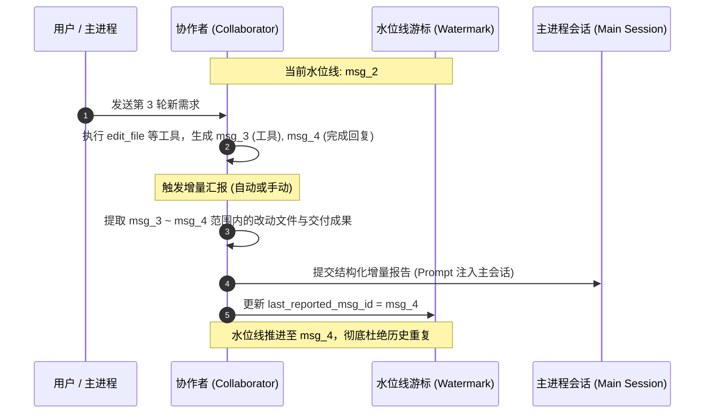

# 协作者与子进程双轨分化架构规范与实施方案 (COLLABORATOR_AND_SUBPROCESS_SPEC)

| 项目 | 内容 |
| --- | --- |
| 文档名称 | 协作者 (Collaborator) 与子进程 (Subprocess) 双轨分化架构规范与实施方案 |
| 版本 | v1.0 |
| 状态 | 实施规划 |
| 关联模块 | `src-tauri` (Rust 引擎/存储/工具), `src` (Zustand/React/IPC/组件交互) |

---

## 1. 背景与核心价值

在现有的 `harness_mini` 系统中，“子进程”承担了多重混杂职责：既作为主 Agent 自主派生的一次性临时任务工人（如并发读取分析），又作为用户手动在顶部创建的多轮专家助手。

这种职责混杂带来了以下痛点：
1. **界面与心智混淆**：主 Agent 自行派生的一大堆临时子任务全堆在顶部栏，导致顶部栏拥挤膨胀；
2. **生命周期错位**：临时任务只需要执行完只读查看结果，而用户创建的专家角色需要持续多轮交互；
3. **多轮汇报污染**：长期常驻专家在多轮对话后，粗暴地汇报最后一条或全部历史，导致主进程上下文被重复旧信息严重污染。

本规范将该能力拆分为 **「协作者 (Collaborator)」** 与 **「子进程 (Subprocess)」** 两套既独立又协同的双轨机制，并在当前项目中达成完整闭环。

---

## 2. 双轨概念定位与职责边界

```mermaid
graph TD
    User([开发者 / 用户])
    Main[主进程 / 总架构师 (Main Agent)]
    CollabBar[顶部协作者栏 (Collaborators Bar)]
    Collab[常驻协作者 (Collaborator)<br>前端专家 / 测试专家 / 审阅专家]
    Subproc[临时子进程 (Subprocess)<br>一次性代码排查 / 并发独立测试]
    ChatFlow[主会话对话流 (ChatView)]

    User -->|手动创建与多轮对话| Collab
    CollabBar -->|鼠标滚轮平滑横向浏览| Collab
    User -->|提出综合需求| Main
    Main -->|根据特长与空闲状态委派| Collab
    Collab -->|基于水位线增量汇报| Main
    Main -->|自主派生临时并行任务| Subproc
    Subproc -->|内嵌只读卡片展示| ChatFlow
    Subproc -->|工具执行完毕汇聚结果| Main
```

### 2.1 子进程 (Subprocess)
- **定位**：主 Agent 的**临时任务工人（Task-level Ephemeral Worker）**。
- **发起机制**：**仅由 Agent 自主决策调用工具创建**，外部用户界面不提供“新建子进程”按钮。
- **生命周期**：原子化、短生命周期，随主任务需要而创建，执行完毕产出结果后终结。
- **界面展现**：**不进入顶部栏**；完全内嵌于主对话流的消息列表中（`SubprocessCard`），支持展开查看折叠的只读执行步骤与日志。
- **交互限制**：外部不可调整（不提供输入框和消息编辑），仅提供防死循环的“终止 (Stop)”兜底。

### 2.2 协作者 (Collaborator)
- **定位**：用户的**常驻专家团队（Role-level Persistent Companion）**。
- **发起机制**：由用户在顶部栏**手动创建并命名**（如“前端组件专家”、“API 接口专家”、“测试回归专家”）。
- **生命周期**：长生命周期，跨越整个工程开发过程，长期保持专属设定与领域知识。
- **界面展现**：固定显示在**界面顶部（协作者栏）**，采用**无滚动条、纯鼠标滚轮横向滚动**交互；点击卡片在右侧唤出独立分屏交互面板。
- **交互能力**：支持与用户进行完整的多轮对话迭代，支持手动或自动增量成果汇报。

---

## 3. 核心机制设计

### 3.1 协作者增量汇报机制（基于水位线 Cursor）

#### 痛点解决
协作者经过 5 轮对话后，第 1~3 轮的内容此前可能已经汇报过了。若此时再次汇报，绝不能把第 1~3 轮重复推给主进程；若协作者第 5 轮最后一句话是“好的，收到”，也不能只把这一句话发给主进程而丢弃第 4 轮的实际代码改动。

#### 水位线设计模型
在 `sessions` 表中增加游标字段：
- `last_reported_msg_id`: 上次已汇报成功的最新消息 ID（默认为 NULL）。
- `auto_report`: 自动汇报开关（1 为启用，0 为手动，默认 1）。



#### 增量汇报算法逻辑
1. 汇报触发点：
   - **自动汇报模式**：协作者会话单轮执行结束（`runStatus` 从 `running` 变为 `idle`）时，若检测到存在 `id > last_reported_msg_id` 的未汇报回复，后端自动触发增量推送；
   - **手动汇报模式**：用户点击协作者面板顶部的【汇报成果 (+N)】按钮时触发。
2. 提取内容：
   - 过滤消息范围：`created_at > last_reported_msg.created_at`；
   - 提取增量任务描述（User prompt）；
   - 聚合增量内所有工具事件涉及的文件修改清单（去重）；
   - 提取最新的总结结论（Assistant 回复）；
3. 注入主进程：
   - 组装标准增量格式文本；
   - 调用 `send_message` 推入主进程。若主进程正在运行，该汇报自动进入主进程的 `PendingQueue`（待执行队列），主进程当前步骤完成后自动读取整合，保证无缝衔接。

---

### 3.2 主进程统筹与协作者智能调度

1. **主进程感知机制 (System Prompt 注入)**：
   主进程在构建系统提示词时，由后端动态扫描当前已存在的协作者列表及其当前运行状态：
   ```text
   ## 可用项目协作者名录 (Collaborators)
   - 【前端专家】(ID: col_1, 状态: 空闲/idle): 专注 React 组件与 UI 交互实现
   - 【测试工程师】(ID: col_2, 状态: 运行中/busy): 专注单元测试与回归用例
   ```
2. **主进程协同调度工具集**：
   - `dispatch_collaborator(collaborator_id, task)`：向指定空闲协作者下发任务；
   - `wait_collaborators(collaborator_ids, timeout_seconds)`：等待指定协作者完成增量产出并汇聚；
   - `get_collaborator_status(collaborator_id)`：查询协作者状态与当前未汇报增量；
3. **临时子进程工具集**：
   - `spawn_subprocess(title, task, subpath, workspace)`：派生临时子进程，不进顶部栏；
   - `wait_subprocesses(subprocess_ids, timeout_seconds)`：等待临时子任务完成并汇总。

---

### 3.3 顶部协作者栏与鼠标滚轮交互

1. **视觉去噪**：
   - 使用 Tailwind `scrollbar-none` 彻底隐藏水平滚动条；
2. **滚轮平滑横向滚动**：
   - 监听容器 `onWheel` 事件，捕获垂直方向滚轮位移 `deltaY`，无缝转化为 `scrollLeft` 平移：
   ```typescript
   const handleWheel = (e: React.WheelEvent<HTMLDivElement>) => {
     if (Math.abs(e.deltaY) > Math.abs(e.deltaX)) {
       e.currentTarget.scrollLeft += e.deltaY;
     }
   };
   ```

---

### 3.4 主对话流内嵌子进程卡片 (SubprocessCard)

1. **嵌入式呈现**：
   - 主 Agent 调用 `spawn_subprocess` 或 `wait_subprocesses` 时，对话流中渲染专属卡片；
2. **状态与交互**：
   - **折叠态**：展示子任务名称、角色徽章、运行耗时、状态指示（运行中动画 / 绿色完成勾 / 红色异常叉）及改动文件摘要；
   - **展开态（只读）**：点击卡片平滑展开，以只读时间线形式展示该子进程的每一步思考、工具执行与输出；外部不可插入消息，仅保留“强制停止”按钮。

---

## 4. 实施阶段与改造计划

### 阶段一：数据层与后端接口改造 (Rust & SQLite)
1. 数据库升级：`sessions` 表扩展 `last_reported_msg_id` 和 `auto_report` 字段；`session_type` 支持 `"collaborator"` 和 `"subprocess"`。
2. 接口分流：新增 `list_collaborators`、`create_collaborator`、`report_collaborator_increment`、`dispatch_collaborator` 等 Tauri 命令。
3. 工具集解耦：分离 `collaborator` 相关工具与 `subprocess` 相关工具。

### 阶段二：增量水位线汇报与调度编排实现
1. 实现增量消息提炼与文件改动去重算法；
2. 建立协作者执行完毕后的自动触发链路（对接 `PendingQueue`）；
3. 主 Agent 提示词动态注入当前协作者名录及 SOP 规则。

### 阶段三：前端状态管理与顶部协作者栏改造
1. Zustand Store 增加 `collaborators` 与 `activeCollaboratorId` 状态分离；
2. 升级顶部栏为 `CollaboratorBar`，实现无滚动条鼠标横向滚轮交互；
3. 升级右侧抽屉为 `CollaboratorView`，提供增量汇报按钮与自动汇报开关。

### 阶段四：对话流内嵌子进程卡片与闭环验证
1. 实现 `SubprocessCard`，内嵌至 `MessageItem` 与 `ToolCard`；
2. 移除旧的子进程顶部展示，完成系统全局构建与端到端协同测试。
