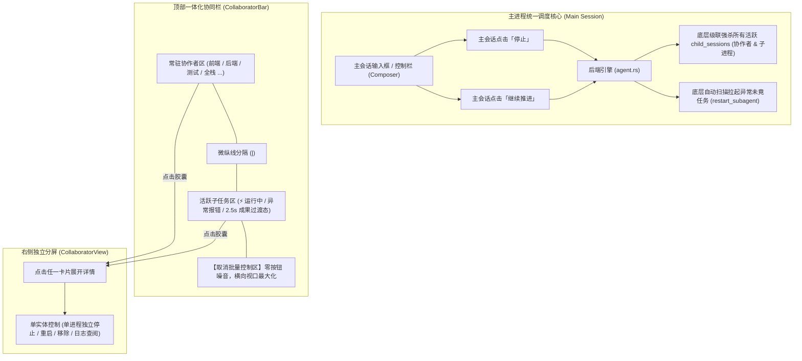
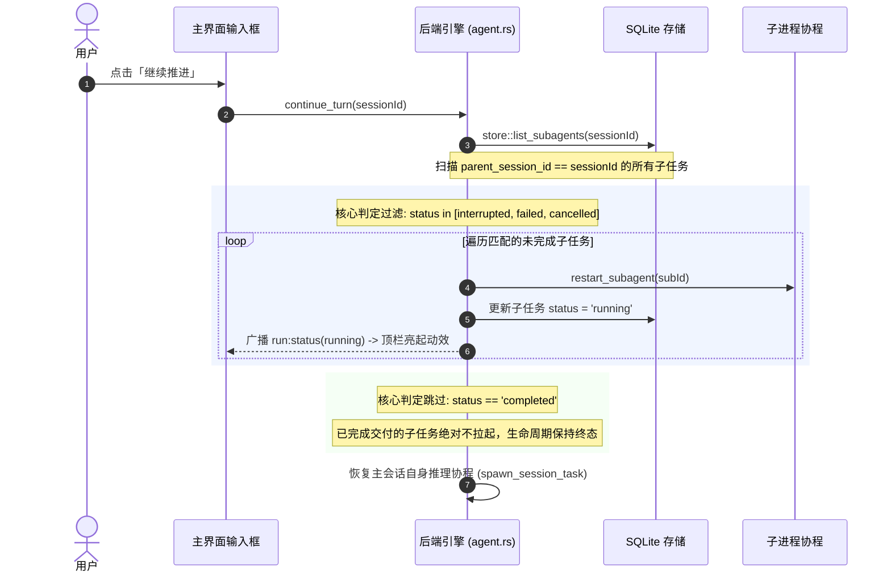
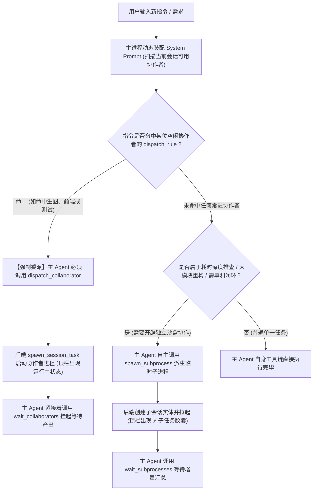

# 顶部协作者栏与子任务合并收敛暨主进程关联拉起调度规范 (COLLABORATOR_UNIFIED_BAR_AND_STARTUP_DISPATCH_SPEC)

| 项目 | 内容 |
| --- | --- |
| 文档名称 | 顶部协作者栏与子任务合并收敛暨主进程关联拉起调度规范 |
| 版本 | v1.0 |
| 状态 | 方案确立 / 规范发布 |
| 关联模块 | `src/components/CollaboratorBar.tsx`, `src/components/TaskBar.tsx`, `src-tauri/src/agent.rs`, `src-tauri/src/tools.rs`, `src-tauri/src/store.rs`, `src/store.ts` |
| 核心目标 | 实现子任务并入协作者栏单栏一体化呈现、完成态自动优雅收敛、批量控制权收归主进程、明确主进程启动时子进程与协作者关联拉起决策流 |

---

## 1. 背景与核心演进诉求

在 `harness_mini` 多智能体协同开发体系中，主界面顶栏先后演进出了常驻协作者栏（`CollaboratorBar`）与协作子任务栏（`TaskBar`）。但在实际开发交互中，旧架构暴露出以下关键问题：

1. **纵向空间双栏堆叠浪费**：
   - 顶栏下方同时垂直堆叠两个高度为 40px 的水平栏（共 80px），严重挤压主对话流与代码阅读的有效视口；
   - 两栏的卡片样式、横向滚轮机制、状态微标与分屏操作高度同质化，造成严重的认知冗余。
2. **临时子任务生命周期未及时收敛**：
   - 协作者（Collaborator）属于长期配置的项目角色，理应常驻；
   - 派生子进程（Subprocess / Subagent）属于按需派发的临时任务，完成（`completed`）后却永久滞留在栏内（标绿勾显示“已就绪”），无法自动释放。
3. **批量控制权职责混淆**：
   - 顶栏两处独立设置“全部停止”与“全部重启”按钮，造成操作路径割裂；
   - 用户与系统心智应以**主进程为唯一统筹指挥中心**，所有子进程的并发强杀与恢复应收拢归由主进程统一级联调度。
4. **主进程启动时的拉起判定缺乏成文规范**：
   - 系统在不同场景下（主会话重新唤醒推进 vs 接收新指令推理启动）如何确认哪些子进程/协作者需要关联启动，缺少清晰严谨的状态机与决策规则定义。

本规范确立了“单栏融合、完成收敛、主控级联、智能调度”的技术与交互设计标准。

---

## 2. 总体架构与交互规范

### 2.1 单栏一体化与控制流收敛模型



### 2.2 核心设计规范要点
1. **单栏一体化呈现**：
   - 将派生子任务（`subprocesses` / `subagents`）合并至 `CollaboratorBar.tsx`；
   - 栏内通过微细纵线（`border-l border-edge/60 pl-1.5`）将【常驻协作者区】与【动态活跃子任务区】逻辑隔开；
   - 子任务卡片增加 `⚡` 前缀与对应领域 SVG 图标，与常驻协作者形成直观视觉区分。
2. **彻底取消顶栏批量控制区**：
   - 彻底移除顶栏右侧的“全部停止”与“全部重启”按钮容器；
   - 顶栏横向全宽 100% 用于卡片展示与滚轮平移，杜绝按钮挤压；
   - 批量控制权完全由主进程主宰，单进程控制保留在点击展开的右侧分屏内。
3. **原 TaskBar 纯化**：
   - 剥离原 `TaskBar.tsx` 中的子任务平铺渲染逻辑；
   - 纯化为专属的 **LongTask 宏观目标进度看板**，仅在存在未完成的阶段路线图长任务（`activeTasks[currentId]`）时浮现，日常对话完全不占空间（`height: 0`）。

---

## 3. 子任务“完成后自动优雅收敛”生命周期规范

临时子任务具备严格的时效性，其生命周期状态流转定义如下：

```mermaid
stateDiagram-v2
    [*] --> Pending: 工具派生创建 (spawn_subprocess)
    Pending --> Running: 调度执行 (顶栏出现 ⚡ 胶囊 + Loader2 旋转动效)
    
    Running --> Failed: 执行遇阻 / 门禁报错 (保留在栏内，红标 AlertCircle，等待用户排查)
    Running --> Interrupted: 主进程级联中止 (保留在栏内，琥珀标，支持主进程继续时自愈)
    Running --> Cancelled: 用户主动取消 (保留在栏内，支持重新启用)
    
    Running --> Completed: 执行交付闭环 (RunOutcome::Done)
    
    state Completed {
        [*] --> GracePeriod: 触发 2.5s 成果展示 (绿勾 CheckCircle2)
        GracePeriod --> FadeOut: 倒计时结束，触发淡出动画 (opacity 0)
        FadeOut --> Exited: 从协作者栏 DOM 节点完全移除
    }
```

### 3.1 关键边界与防护规范
1. **2.5 秒成果展示延时（Graceful Exit）**：
   - 子任务变为 `completed` 后，严禁生硬“闪退”；
   - 必须通过内存暂存列表（`recentlyCompleted`）在协作者栏内保留 2.5 秒，显示绿色打勾与“已完成”微标，给用户明确的正向反馈，随后平滑淡出。
2. **异常任务免退场机制**：
   - 状态为 `failed`、`interrupted`、`cancelled` 的子任务**绝不自动消失**；
   - 必须常驻在协作者栏内，以便用户一眼识别执行中断，可直接点击查看错误日志或通过主进程继续唤醒。
3. **右侧分屏查阅保护**：
   - 若子任务自动消失时，用户正在右侧分屏中浏览该子任务（`activeSubprocessId === sub.id`）：
   - **右侧分屏严禁强制关闭**，确保用户的代码审查与报告查阅连贯性，分屏关闭权完全交给用户点击分屏自身的 `X` 按钮。
4. **对话流历史追溯保全**：
   - 子任务从顶栏消失只是释放顶栏空间，主对话流中的 `SubprocessBranchTree`、执行卡片与交付报告工件（`.harness/subtasks/*_report.md`）永久保全。

---

## 4. 主进程关联启动与调度判定深度解析

主进程启动分为两类典型业务时机：**“恢复推进 / 中断唤醒时”** 与 **“接收新指令推理启动时”**。两者的判定依据截然不同。

---

### 4.1 场景一：主进程“恢复推进 / 中断唤醒时”的关联拉起机制 (`continue_turn`)

当主会话因网络超时、异常中断，或用户在输入框点击“继续推进”时，系统调用 [`agent::continue_turn`](file:///f:/WorkSpace/Other/harness_mini/src-tauri/src/agent.rs#L455)。



#### 关联拉起准则：
- **血缘约束**：严格限定 `parent_session_id == session_id`，绝不跨会话越权拉起。
- **状态准入**：
  - ⭕ **判定为必须启动**：`status ∈ {"interrupted", "failed", "cancelled"}`。主任务此前中断造成子任务协同受阻，恢复时必须协同将子任务重启拉起，保证整体任务闭环。
  - ❌ **判定为跳过不启动**：`status == "completed"`（已完成不再启动）或 `status == "running"`（已在执行不重复拉起）。
- **长任务联动**：若存在关联的长任务（`LongTask`）处于 `interrupted` / `failed` / `paused`，协同调用 `crate::task::resume_long_task` 恢复。

---

### 4.2 场景二：主进程“接收新输入启动推理时”的按需调度机制 (`start_run`)

当用户输入一条全新任务，主进程进入推理执行循环时，严格遵循 **“常驻协作者规则匹配优先，临时子进程按需自主派生”** 的分级决策模型。



#### 1. 常驻协作者（Collaborators）的意图触发机制：
- **动态名录与规则感知**：
  主进程在 [`agent.rs`](file:///f:/WorkSpace/Other/harness_mini/src-tauri/src/agent.rs#L1008-L1048) 中组装系统提示词时，实时从数据库获取该会话已绑定的协作者列表及其运行状态，生成标准化名录：
  ```text
  ## 可用项目协作者名录 (Collaborators)
  - 【前端开发】(ID: `col_1` | 角色: frontend)
    - 当前状态: 🟢 空闲 (idle，可立即委派)
    - 主进程调度触发规则（命中即委派）: 涉及 React 组件、UI 交互实现、样式排版与动画开发
  - 【AI 绘画师】(ID: `col_2` | 角色: image_gen)
    - 当前状态: 🟢 空闲 (idle，可立即委派)
    - 主进程调度触发规则（命中即委派）: 涉及图像生成、Logo 设计、UI 原画绘制
  ```
- **命中即委派原则**：
  大模型在第一步决策时对照 `dispatch_rule`。一旦命中且目标处于 `idle` 状态，主 Agent **被物理约束严禁自行执行，必须调用 `dispatch_collaborator(collaborator_id, task)`**；
- **关联拉起**：后端工具实现向协作者会话注入任务快照后，直接调用 `spawn_session_task`，协作者正式关联启动。

#### 2. 临时子进程（Subprocesses）的派生机制：
- 未命中常驻协作者、但涉及复杂独立探索时，主 Agent 自主调用 `spawn_subprocess`；
- 后端创建临时会话并分配执行协程，向前端广播 `subprocess:created`，顶栏子任务区即时挂载新胶囊并进入执行。

---

### 4.3 核心状态与启动判定矩阵

| 实体对象 | 存储状态 (`status`) | 主进程启动场景 | 是否关联启动 | 驱动行为与依据 |
| :--- | :--- | :--- | :---: | :--- |
| **临时子进程** | `interrupted` / `failed` / `cancelled` | 场景一：继续推进 | **是** | 自动执行 `restart_subagent` 协同拉起未竟任务 |
| **临时子进程** | `completed` | 场景一 / 场景二 | **否** | 任务已终结闭环，且从协作者栏完全退出 |
| **常驻协作者** | `idle` 且命中需求 | 场景二：接收新指令 | **是** | 主 Agent 调用 `dispatch_collaborator` 强制委派拉起 |
| **常驻协作者** | `idle` 但未命中需求 | 场景二：接收新指令 | **否** | 无需专职角色参与，保持待命就绪状态 |
| **常驻协作者** | `running` | 场景二：接收新指令 | **否** | 正在后台执行中，主 Agent 仅调用 `wait_collaborators` 等待 |
| **自主长任务** | `interrupted` / `paused` | 场景一：继续推进 | **是** | 调用 `resume_long_task` 恢复流水线与阶段路线图 |

---

## 5. 模块改造与实施方案

### 5.1 `CollaboratorBar.tsx` 改造要点
- **数据源扩展**：
  从 `store.subprocesses` 与 `store.subagents` 提取从属于当前主会话的子任务，排除已属于协作者的 ID；
- **优雅退场机制**：
  维护 `exitingIds` 本地状态与定时器，当子任务变为 `completed` 时，展示 2.5 秒绿色成果动画后再行剔除；
- **布局整合**：
  在滚动容器中先渲染 `collaborators`，若存在活跃/退场中的子任务，渲染垂直分隔线并依次渲染 `subprocesses`；
- **移除批量控制区**：
  完全删除原有的 `handleStopAll` 批量按钮容器，保留左侧标题区、新增按钮与中段全宽滚动区。

### 5.2 `TaskBar.tsx` 改造要点
- 移除场景 B（协作子任务展示与批量控制）；
- 仅保留 `task && hasUnfinishedLongSubtasks`（自主规划长任务模式）；
- 普通对话场景下直接返回 `null`，不再产生任何高度占用。

---

## 6. 验证与回归基线

1. **界面视口验证**：
   - 普通对话且无子任务时，仅保留一行 40px 的协作者栏，TaskBar 完全隐匿；
   - 顶栏无“全部停止”或“全部重启”按钮，右侧干净整洁。
2. **子任务合并呈现验证**：
   - 派发 `spawn_subprocess` 后，子任务胶囊即时出现在协作者栏右侧并带旋转动效；
   - 点击任一子任务，右侧分屏正常开启并呈现该子任务完整对话流。
3. **完成收敛验证**：
   - 子任务执行完毕，打绿勾停留 2.5 秒后平滑消失，协作者栏平稳恢复常态；
   - 若用户正在分屏阅读该子任务，分屏保持开启，不被强制关闭。
4. **主进程级联控制验证**：
   - 在主会话点击“停止”，所有进行中的协作者与子任务瞬间同步停止；
   - 在主会话点击“继续推进”，所有因中断中止的子任务自动协同拉起，状态恢复为 `running`。
