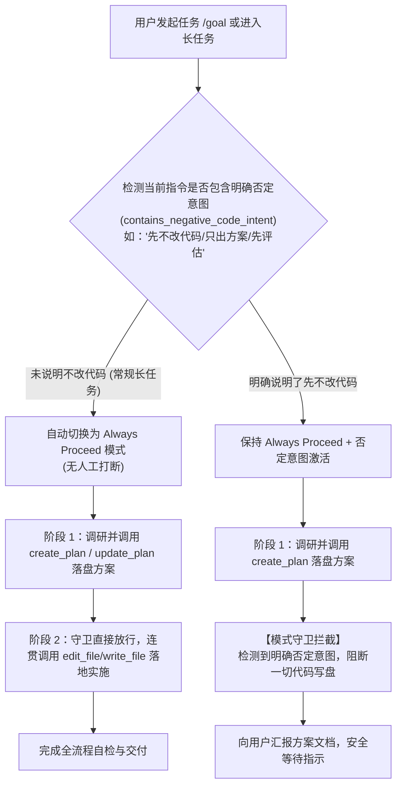

# 会话原生自主长循环与文件级影子快照回滚系统架构规范
# Conversational Autonomous Loop & Shadow Snapshot Rollback Specification

本文档系统性定义 `harness_mini` 项目中 **长任务会话原生化重构（Conversational Autonomous Loop）** 与 **全会话通用的文件级影子快照及双向撤回系统（Shadow Snapshot & Two-Way Rollback Engine）** 的技术架构、数据契约、状态流转、交互规范、模式守卫联动及最终落地验证成果。

---

## 目录
- [一、背景与重构动因](#一背景与重构动因)
- [二、系统设计定调与架构哲学](#二系统设计定调与架构哲学)
- [三、会话原生自主长循环（In-Chat Autonomous Loop）](#三会话原生自主长循环in-chat-autonomous-loop)
- [四、文件级影子快照引擎（Shadow Snapshot Engine）](#四文件级影子快照引擎shadow-snapshot-engine)
- [五、代码撤回与多轮连续时光机（Rollback & Multi-Turn Undo）](#五代码撤回与多轮连续时光机rollback--multi-turn-undo)
- [六、对话与代码双向联动的软撤回与重做（Soft Undo & Redo）](#六对话与代码双向联动的软撤回与重做soft-undo--redo)
- [七、存储设计与滑动窗口垃圾回收（CAS & Lifecycle GC）](#七存储设计与滑动窗口垃圾回收cas--lifecycle-gc)
- [八、长任务自主推进与模式守卫动态联动机制](#八长任务自主推进与模式守卫动态联动机制)
- [九、数据契约与接口定义](#九数据契约与接口定义)
- [十、落地验证与质量工程记录](#十落地验证与质量工程记录)

---

## 一、背景与重构动因

在以往的实现中，系统采用了一套相对独立、外挂式的长任务编排系统（`task.rs` + `TaskBar` + `TaskDetailModal`），在实际业务开发中暴露出四项体验缺陷：

1. **黑盒阻塞等待（Blackbox Latency）**：
   - 输入 `/goal` 后，系统启动独立的 `decompose_goal`，在无流式反馈的情况下静默阻塞 5~10 秒，用户无法获知工具当前动作；
2. **上下文割裂断层（Context Disconnection）**：
   - 目标解构器未继承前文对话讨论的技术细节与既有方案（`.harness/plans/`），脱离工程实际并捏造出空泛的“从零初始化项目骨架”；
   - 执行阶段由后台独立线程向数据库伪造插入 `user` 角色消息（`【长任务自主推进阶段 X/Y】`），使得聊天气泡流沦为机器人的内部自言自语；
3. **视觉与交互冗余（UI Clutter）**：
   - 全局滑出的二级顶栏 `TaskBar` 和任务路线图弹窗破坏了清爽集中的对话视觉焦点，增加了操作心智负担；
4. **安全可逆能力错位与 Git 污染（Git Pollution & Reversibility Misplacement）**：
   - 之前的检查点强依赖宿主工作区的 `git add -A && git commit`，严重污染了 Git 提交历史，且在非 Git 项目中彻底失效；
   - 代码时光机回滚本是保障开发者免受 AI 幻觉误改的底座能力，却被错误地绑定为长任务专属特权，日常普通对话一旦代码被改坏反而无法一键撤回。

为解决上述问题，本项目执行了系统级重构：**长任务回归当前会话的原生连续自主推进，代码时光机下沉为全会话通用的基础设施。**

---

## 二、系统设计定调与架构哲学

```
                 【用户输入需求 / 指令】
                           │
                           ▼
          ┌───────────────────────────────────┐
          │ 1. 会话原生自主长循环 (In-Chat)   │
          │  - 0 秒黑盒等待，立即流式思考     │
          │  - 共享完整前文与既有方案上下文   │
          │  - 消息流内置 Todo/执行卡片呈现   │
          └────────────────┬──────────────────┘
                           │
                           ▼
          ┌───────────────────────────────────┐
          │ 2. 工具层写前影子快照 (Pre-write) │
          │  - write_file / edit_file 拦截    │
          │  - CAS 磁盘哈希去重存储           │
          │  - 零 Git 污染，非 Git 项目亦支持 │
          └────────────────┬──────────────────┘
                           │
                           ▼
          ┌───────────────────────────────────┐
          │ 3. 消息与工具级双向撤回 (Undo/Redo)│
          │  - 支持单工具/整轮消息两级粒度    │
          │  - 软撤回 (Soft Undo) 跳过模型上下文│
          │  - 人工修改冲突保护 (Conflict)    │
          │  - 一键重新应用 (Redo) 恢复代码   │
          └────────────────┬──────────────────┘
                           │
                           ▼
          ┌───────────────────────────────────┐
          │ 4. 轮次滑动窗口与自动 GC          │
          │  - 以 50 个人机交互轮次 (Turn) 淘汰│
          │  - 会话删除级联清理               │
          │  - 孤儿 Blob 后台安全回收         │
          └───────────────────────────────────┘
```

### 核心设计原则

1. **单一流域原则（Single Conversational Stream）**：
   - 消除“独立长任务引擎”与“普通对话”的人为界限。长任务本质上是当前对话在被授予更高轮次预算后的**自主连续工具循环（Autonomous Execution Loop）**；
   - 保持单一窗口、同屏上下文、实时流式输出，杜绝后台伪造假消息。
2. **非侵入式零污染原则（Zero Git Pollution）**：
   - 彻底废除直接在宿主工作区执行 `git commit` / `git reset` 的做法；
   - 无论项目是否初始化 Git，均采用文件级影子快照，代码改动始终保持在纯净的工作区文件树上。
3. **普惠可逆原则（Universal Reversibility）**：
   - 任何一条触发了文件改动的助手消息，无论是在修单行 Bug 还是在执行长任务，均自动挂载时光机撤回入口。
4. **事务原子性原则（Turn Atomicity）**：
   - 一次人机交互对话（Turn / Run）中修改的全部文件构成一个逻辑事务；撤回生命周期窗口严格以交互轮次（Turn）为单位，杜绝单步截断导致代码撤回一半的不一致问题。

---

## 三、会话原生自主长循环（In-Chat Autonomous Loop）

### 1. 消除前置规划黑盒与即时流式响应
- **用户指令触发**：用户输入 `/goal <任务目标>`、点击推荐指令或在对话中指示任务目标；
- **前端直接发送**：不再调用后端的 `start_long_task` 创建隔离的后台任务实体，而是作为原生会话消息格式化发出（`【长任务目标模式】${goalText}...`）；
- **即时流式思考**：模型立即在当前气泡流输出思考过程（Reasoning Delta），第一步分析代码或调用工具实时可见，告别 5~10 秒的无响应等待。

### 2. 上下文与既有方案无缝继承
- 后端组装上下文（`build_context`）时，完整保留：
  1. 会话内的所有前置对话、分析结论与约束；
  2. 若会话已绑定活动方案文档（`.harness/plans/*.md`），其步骤与改动范围作为明确约束注入，绝不重复生成荒谬的“搭环境”伪任务；
  3. 工作区真实技术栈探测结果（`detect_project_stack`）。

### 3. 轻量化进度呈现（去顶栏看板）
- **废弃组件**：下线全局常驻二级顶栏 `TaskBar` 与外挂大弹窗 `TaskDetailModal`；
- **进度呈现载体**：
  - 由模型在当前消息内通过内置 `todo` 工具或 Markdown Checklist（`- [ ]` / `- [x]`）展示任务拆解与完成状态；
  - 界面通过现有的 `ExecutionProcessBlock` 和工具卡片紧凑呈现“当前正在做什么”，支持一键折叠/展开，保持界面极致清爽。

### 4. 实时动态干预（Interactive Steering）
- 在自主长循环推进期间，用户随时可以在输入框追加输入；
- 用户的输入直接进入输入框上方的待执行列表，可随时点击“引导（Steer）”立即介入当前推进过程，纠正偏航。

---

## 四、文件级影子快照引擎（Shadow Snapshot Engine）

### 1. 写前拦截机制（Pre-write Interception）
在 `src-tauri/src/tools.rs` 中的代码修改工具（`write_file`、`edit_file`）写入物理磁盘前实施拦截：

1. **路径解析**：解析目标文件相对于工作区根目录的规范化相对路径；
2. **写前状态读取**：
   - 若文件已存在：异步读取当前全部字节，计算 `SHA-256` 摘要，原子写入 CAS 磁盘池，记为 `before_hash`；
   - 若文件不存在：记 `is_new_file = true`，`before_hash = None`；
3. **物理写盘与写后快照**：
   - 目标文件物理写盘成功后，计算新内容的 `SHA-256` 摘要，原子写入 CAS 磁盘池，记为 `after_hash`；
4. **元数据持久化登记**：
   - 向 SQLite `tool_file_snapshots` 插入一条记录（绑定 `session_id`, `message_id`, `tool_event_id`, `file_path`, `before_hash`, `after_hash`, `is_new_file`）。

### 2. 存储选型：内容寻址存储池（CAS）
为防止数据库体积急剧膨胀，采用与 Git Objects 相同的 CAS 设计：
* **存储位置**：`<DataDir>/snapshots/blobs/`
* **分级目录格式**：`blobs/{hash[0..2]}/{hash[2..]}`
* **天然全局去重**：同一文件多轮未改或跨会话出现相同内容时，物理磁盘仅保存一份，极大降低磁盘消耗；
* **原子写入保障**：写临时文件 + 原地重命名（Atomic Rename），彻底防止并发写入损坏。

---

## 五、代码撤回与多轮连续时光机（Rollback & Multi-Turn Undo）

### 1. 两级撤回颗粒度
* **L1 · 单工具级撤回（Tool-level Undo）**：
  在具体的 `ToolCard` 上提供 `[⏪ 撤回此项]`，仅将该卡片操作的目标文件恢复为执行前的状态。
* **L2 · 轮次级整轮撤回（Turn-level Rollback，核心主交互）**：
  在每条包含代码变更的 Assistant 消息底部状态行右侧展示：
  `[📄 本轮修改了 N 个文件] · [⏪ 撤回本轮修改]`
  点击后，系统调取该消息关联的所有快照，按后进先出（LIFO）顺序一次性原子写回或删除新建文件。

### 2. 人工修改冲突保护策略（Conflict Guard）
当用户点击撤回或重做时，系统在物理写盘前执行安全校验：
- **撤回校验**：工作区物理文件当前的 Hash 必须等于快照的 `after_hash`；
  - 若一致：说明自 AI 写入后文件未被人工二次修改，执行安全还原；
  - 若不一致：说明用户中途已手动编写代码。系统阻断写盘，返回 `ModifiedSinceSnapshotConflict` 错误；
  - 前端弹出友好确认框，用户可选择取消或传入 `force=true` 强制覆盖还原；
- **重做校验**：工作区物理文件当前的 Hash 必须等于快照的 `before_hash`（或文件不存在），防止重做覆盖用户新的手动修改。

### 3. 多文件审查 Diff 弹窗（TurnDiffModal）
前端 `src/components/TurnDiffModal.tsx` 经过纯化与 Portal 架构升级：
- **Portal 根节点挂载（Stacking Context 突破）**：采用 `createPortal(..., document.body)` 挂载至顶层 DOM，设置 `z-[100]`，彻底消除传统在 ChatView 内部被顶栏、Composer 输入框截断与遮挡穿透的问题；
- **纯化为专注的 Diff 审查器**：弹窗内不再堆砌撤回/重做按钮，专注呈现多文件修改对比、行号增删高亮、以及一键调用系统外部编辑器打开；
- **撤回与重做统一归纳于对话气泡底栏**，实现职责单一与视图聚焦。

---

## 六、对话与代码双向联动的软撤回与重做（Soft Undo & Redo）

### 1. 对话级整轮级联撤回（Conversational Turn Undo）
以往的“撤回本轮修改”仅退回了代码，但用户提问与对话上下文未受影响；以往的“最后一条重新编辑”则会直接物理截断数据库。
本次升级将二者**深度融合为「⏪ 撤回本轮对话」统一模型**：
1. **级联覆盖用户提问**：点击「⏪ 撤回本轮对话」后，后端 `mark_snapshots_reverted_for_turn` 自动通过 `run_id` 强关联同时软撤回用户提问消息与当轮全部助手执行链；
2. **提问自动带入编辑框（Composer）**：前端原子触发 `turnRevertAndEdit`，将该轮用户的原始提问文本与附件即时提取并预填到底部输入框，进入编辑重发模式；
3. **软撤回置灰与大模型上下文遗忘**：用户提问气泡与助手回复气泡同步应用 `opacity-60` 并标记 `[已撤回该轮对话]` 琥珀色标签，大模型在后续对话中完全过滤该轮；
4. **重新应用闭环（Conversational Turn Redo）**：消息气泡底栏同步切换为「↻ 重新应用本轮对话」。若用户放弃重新编辑，点击即可一键将代码写回磁盘并解除软撤回，清空编辑草稿，全流程完全可逆。

### 2. 单工具卡片即时双向撤回与重做（Single Tool Event Undo/Redo）
针对工具调用卡片（`ToolCard`）的单项文件修改撤回：
1. **快照状态实时穿透**：`ToolEvent` 新增透传 `reverted_at` 快照时间戳；
2. **动态按钮切换**：未撤回时显示 `[⏪ 撤回此项]`，点击还原代码后按钮即时变为 `[↻ 重新应用]`，卡片角标同步显示 `已撤回` 并半透明淡化；
3. **单项重做接口**：后端新增 `reapply_tool_event` 接口，支持将单卡片快照内容重新写回磁盘并清除撤回标记；
4. **无需刷新即时响应**：撤回与重做操作完成后直接触发 store 局部重载与广播，界面状态毫秒级无感更新，无需手动 F5 刷新。

---

## 七、存储设计与滑动窗口垃圾回收（CAS & Lifecycle GC）

### 1. 滑动窗口生命周期淘汰机制
* **淘汰基准**：严格以 **50 个人机交互轮次（Turn / `message_id`）** 为单位，**绝非以单步工具调用（Step）为单位**；
* **事务完整性**：同一轮对话内哪怕触发了 30 步工具调用，它们作为一个原子包整体保留。只有当该轮对话被后续 50 次新交互挤出窗口时，其包含的所有快照元数据才统一过期，杜绝文件半退回撕裂。

### 2. 三重垃圾回收（GC）防线
1. **会话级联清理**：SQLite 配置了 `ON DELETE CASCADE`，当用户删除会话时，其名下的所有快照元数据瞬间清理；
2. **50 轮窗口淘汰**：每次产生新快照时，`prune_session_snapshots_sliding_window` 自动统计轮次，超过 50 轮则批量淘汰最旧的轮次元数据；
3. **后台惰性 CAS 垃圾回收（Orphan Blob GC）**：
   - 在程序启动 10 秒后，后台协程自动运行 `gc_orphan_blobs`；
   - 提取数据库全量有效快照引用的 Hash 集合；
   - 遍历 `blobs/{prefix}/{rest}` 物理文件，对未被引用的孤儿文件实施回收；
   - **宽限期保护（Grace Period）**：仅清理修改时间超过 24 小时的孤儿文件，防止与正在并发写入落库的临时 Blob 发生竞争删除。

---

## 八、长任务自主推进与模式守卫动态联动机制

这是本次架构演进中对**长任务自主性与安全门禁边界**做出的关键裁决与最终方案。

### 1. 动因与问题场景
在项目的规划策略中，若配置为 `Always Plan` 强计划模式，要求每版方案生成后必须等待用户确认。但长任务（Goal Mode）的核心诉求是**端到端自主推进**；若长任务在执行中每调用一次 `update_plan` 推进步骤就被模式守卫硬性拦截，会导致自动化长任务频繁中断。

### 2. 最终确认的双轨决策模型



### 3. 具体实现契约
在 `src-tauri/src/agent.rs` 中：
1. **长任务动态升阶识别**：
   - 综合检测 `is_long_task`、最新消息是否包含 `【长任务目标模式】`、以及当前会话是否存在进行中的活动方案文档（`status == "in_progress"`）；
   - 命中上述任一条件，生效模式 `effective_plan_mode` 自动动态切换为 **`"always_proceed"`**；
2. **自动连贯执行（Happy Path）**：
   - 在常规长任务中，Agent 制定或更新计划后，底层模式守卫不设人工门禁阻断，直接放行 `write_file` / `edit_file`，实现长任务连贯自治；
3. **否定意图守卫绝对优先（Safety Override）**：
   - 若用户指令命中了 `contains_negative_code_intent`（识别“先不改代码”、“只出方案”、“先评估”、“仅设计”等 20+ 种典型表达）；
   - 模式守卫精准介入阻断物理写盘，返回：
     > `【模式守卫拦截】: 用户在当前任务中明确说明了先不改动代码（仅出方案/评估）。你已完成计划制定，严格禁止在当前轮次修改代码。请向用户输出方案说明并等待用户指示。`
   - Agent 输出方案文档后优雅停下，绝对尊重用户的限制指示。

---

## 九、数据契约与接口定义

### 1. SQLite 数据表结构 (`store.rs`)
```sql
CREATE TABLE IF NOT EXISTS tool_file_snapshots (
  id TEXT PRIMARY KEY,
  session_id TEXT NOT NULL REFERENCES sessions(id) ON DELETE CASCADE,
  message_id TEXT NOT NULL REFERENCES messages(id) ON DELETE CASCADE,
  tool_event_id TEXT NOT NULL REFERENCES tool_events(id) ON DELETE CASCADE,
  file_path TEXT NOT NULL,         -- 工作区相对路径 (正斜杠规范化)
  before_hash TEXT,                -- 修改前 SHA-256 (新建文件为 NULL)
  after_hash TEXT NOT NULL,        -- 修改后 SHA-256
  is_new_file INTEGER NOT NULL DEFAULT 0, -- 1: 新建文件, 0: 修改已有文件
  reverted_at TEXT,                -- 撤回时间戳 (NULL 表示当前生效)
  created_at TEXT NOT NULL
);
CREATE INDEX IF NOT EXISTS idx_snapshots_event ON tool_file_snapshots(tool_event_id);
CREATE INDEX IF NOT EXISTS idx_snapshots_message ON tool_file_snapshots(message_id);
CREATE INDEX IF NOT EXISTS idx_snapshots_session ON tool_file_snapshots(session_id, created_at);

-- messages 表扩展软撤回字段
ALTER TABLE messages ADD COLUMN reverted_at TEXT;
```

### 2. Tauri IPC 命令契约 (`commands.rs` & `ipc.ts`)
```rust
/// 撤回单项工具操作引起的文件修改
#[tauri::command]
pub async fn revert_tool_event(
    state: tauri::State<'_, AppState>,
    tool_event_id: String,
    force: bool,
) -> Result<RevertResult, String>;

/// 撤回整轮对话引起的所有文件修改并级联标记软撤回
#[tauri::command]
pub async fn revert_message_turn(
    state: tauri::State<'_, AppState>,
    message_id: String,
    force: bool,
) -> Result<RevertResult, String>;

/// 重新应用（重做）整轮修改
#[tauri::command]
pub async fn get_turn_diff(
    state: tauri::State<'_, AppState>,
    message_id: String,
) -> Result<Vec<SnapshotFileDiff>, String>;

/// 编辑并重新发送用户消息（自动回退本次提问产生的所有代码修改并作废后续回复）
#[tauri::command]
pub async fn edit_and_resend(
    state: tauri::State<'_, AppState>,
    app: AppHandle,
    session_id: String,
    message_id: String,
    new_text: String,
    attachments: Option<Vec<Attachment>>,
) -> Result<(), String>;
```

### 3. “重新编辑”（Edit and Resend）自动代码回退机制
* **核心设计原则**：当用户对上一轮提问进行重新编辑（点击笔头图标）并重新发送时，用户的意图是“本轮作废重新来过”。若仅删除消息记录而不还原工作区代码，不仅会导致工作区磁盘代码处于脏状态，更会导致快照记录被级联删除而永远失去回退能力。
* **物理还原保障**：
  1. `commands::edit_and_resend` 在执行 `store::delete_messages_after` 之前，通过 `store::list_snapshots_after_seq(&db, &session_id, m.seq)` 逆序（LIFO）提取此提问之后产生的所有快照；
  2. 调用 `snapshot_revert::revert_snapshots(&ws, &data_dir, &snaps, force: true)`，强制将工作区物理磁盘代码**自动且确定性地无损还原到该提问发出前的一刻**；
  3. 执行 `update_message_content_and_attachments` 更新提问，并通过 `delete_messages_after` 作废后续消息与历史；
  4. 重新触发 `agent::spawn_session_task` 基于干净的工作区与新提问重新运行；
* **界面文案与明确告知**：
  - 前端笔头按钮 Tooltip 明确标注：`编辑并重新发送（将自动回退本次提问产生的所有代码修改，后续回复将被作废并重新运行）`；
  - 输入框顶栏编辑模式横幅明确提示：`正在编辑最后一条提问（重新发送将自动回退本次提问产生的所有代码修改，后续回复作废并重跑）`。

### 4. 前端时光机按钮整轮聚合呈现（Turn Level Aggregation）
* **聚合呈现原理**：
  - 在多步执行流（`ExecutionProcessBlock`）中，前序的所有工具调用步骤会被收拢至折叠抽屉中；
  - 外部呈现的最终交付答复消息（`lastMsg`）通过透传整轮聚合的 `turnToolEvents` 与整轮软撤回标识 `turnRevertedAt`，使外部最终交付消息底栏稳定展示：
    - `[本轮改动 (N个文件)]`：点击弹出 `TurnDiffModal`，统一查看本轮所有文件变更 Diff；
    - `[⏪ 撤回本轮修改]`：一键执行整轮代码快照软撤回（后端按 `run_id` 自动定位该轮所有多步骤生成的快照并逆序还原）；
    - `[↻ 重新应用修改]`：撤回后可随时一键重做还原；
  - 执行过程抽屉（`ExecutionProcessBlock`）头部同样展示 `改动 N 个文件` 徽标，并在无外部消息气泡的特殊截断场景下提供兜底入口。

---

## 十、落地验证与质量工程记录

本系统全量代码已分 6 个阶段完全落地并合入主干，所有质量检查指标均 100% 达标：

| 模块 / 环节 | 验证手段 | 结果状态 | 说明 |
| :--- | :--- | :--- | :--- |
| **CAS 存储底座** | `snapshot_fs::tests` | **PASS** | 验证 SHA-256 寻址、原子落盘、并发重命名去重与双层目录结构 |
| **还原/重做引擎** | `snapshot_revert::tests` | **PASS** | 覆盖修改文件还原、新建文件删除、人工冲突拦截、Force 覆盖 |
| **上下文深度联动** | `agent::tests` | **PASS** | 验证软撤回消息在 `build_context` 中彻底隐形，重做后恢复 |
| **50 轮窗口淘汰** | `snapshot_gc::tests` | **PASS** | 模拟 55 轮对话，验证精确按 Turn 淘汰最早 5 轮，无半撕裂 |
| **孤儿 Blob GC** | `snapshot_gc::tests` | **PASS** | 验证未引用孤儿文件物理删除，活跃引用文件完好无损 |
| **长任务自动推进** | `agent::tests` | **PASS** | 验证长任务自动走 `always_proceed`，否定意图精准触发门禁 |
| **整轮聚合与重新编辑** | `store::tests` | **PASS** | 验证 `list_snapshots_for_turn` 聚合整轮多步及 `list_snapshots_after_seq` 自动回退 |
| **后端全量回归** | `cargo test --lib` | **PASS (113/113)** | 全部 113 个单元与集成测试 100% 通过（0 失败，0 告警） |
| **前端类型完整性** | `npx tsc --noEmit` | **PASS (0 errors)** | 静态类型校验 0 错误 |

---

*文档编纂日期：2026-09-24*  
*知识归档状态：已全量实施并验证交付*
