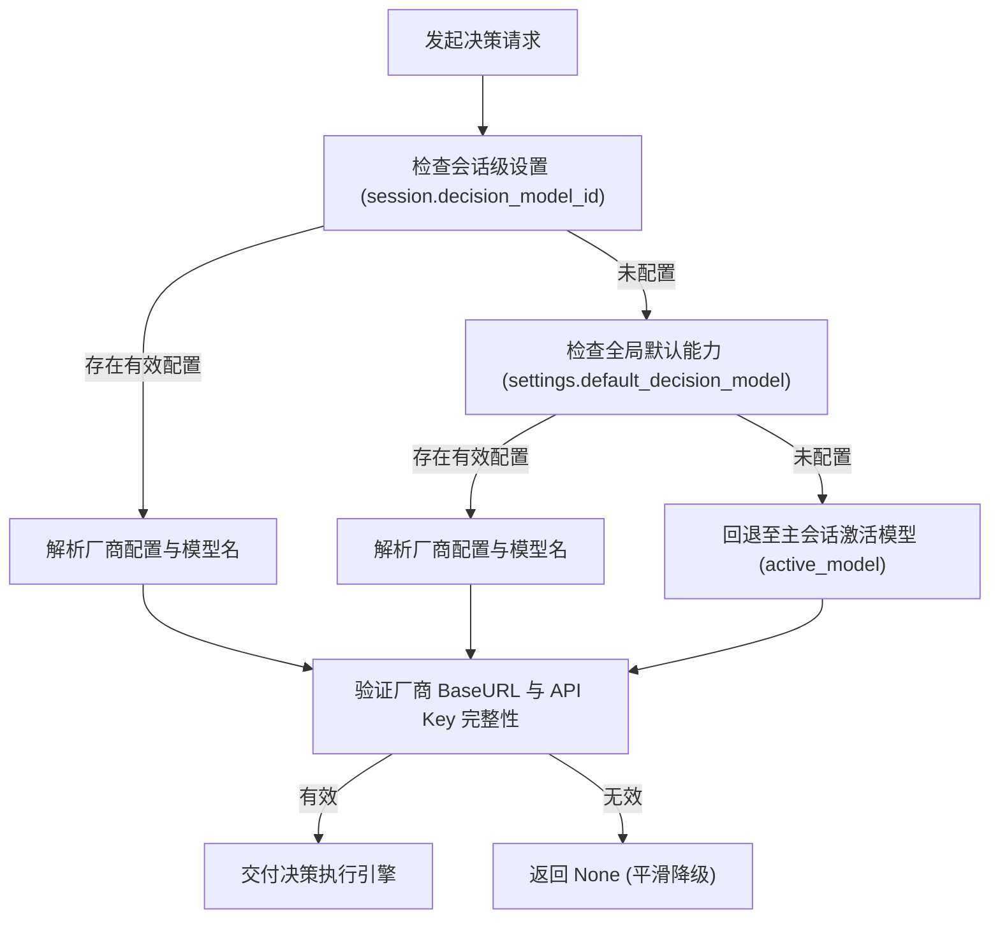
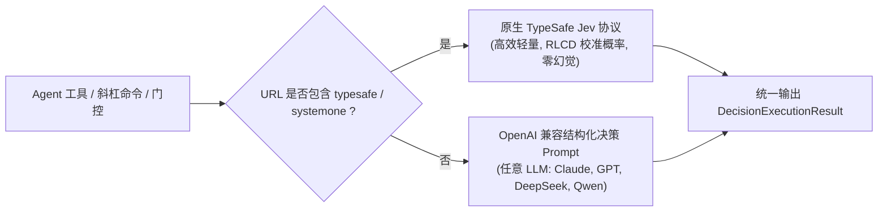
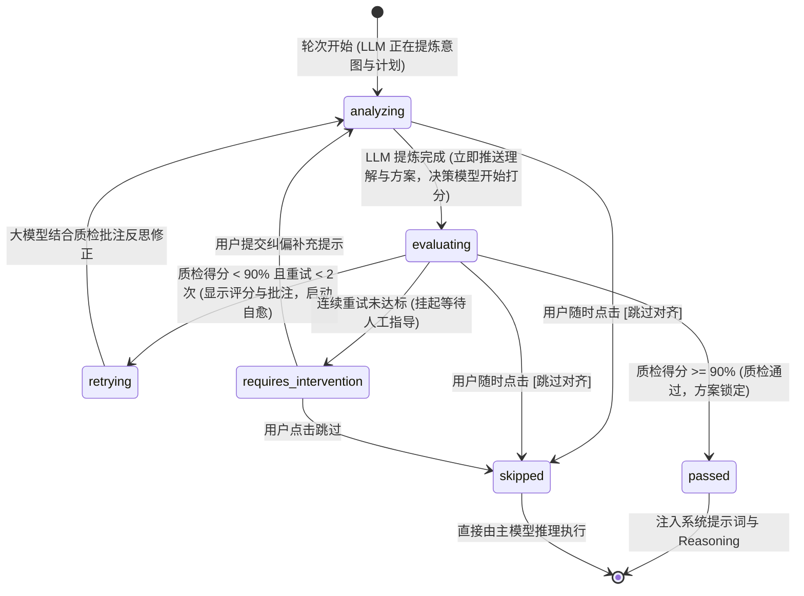

# 决策能力重构、意图对齐门控与 SOP 标准化治理规范 (DECISION_CAPABILITY_ARCHITECTURE_AND_INTENT_ALIGNMENT_SOP_SPEC)

| 属性 | 说明 |
| :--- | :--- |
| **文档代号** | `DECISION_CAPABILITY_ARCHITECTURE_AND_INTENT_ALIGNMENT_SOP_SPEC` |
| **创建时间** | 2026-09-30 |
| **适用范围** | `harness_mini`（Tauri 2 + Rust + React 桌面 AI Agent 编码体系） |
| **关联核心模块** | [`src-tauri/src/agent.rs`](file:///f:/WorkSpace/Other/harness_mini/src-tauri/src/agent.rs), [`src-tauri/src/jev.rs`](file:///f:/WorkSpace/Other/harness_mini/src-tauri/src/jev.rs), [`src-tauri/src/models.rs`](file:///f:/WorkSpace/Other/harness_mini/src-tauri/src/models.rs), [`src-tauri/src/tools.rs`](file:///f:/WorkSpace/Other/harness_mini/src-tauri/src/tools.rs), [`src-tauri/src/commands.rs`](file:///f:/WorkSpace/Other/harness_mini/src-tauri/src/commands.rs), [`src-tauri/src/store.rs`](file:///f:/WorkSpace/Other/harness_mini/src-tauri/src/store.rs), [`src/types.ts`](file:///f:/WorkSpace/Other/harness_mini/src/types.ts), [`src/store.ts`](file:///f:/WorkSpace/Other/harness_mini/src/store.ts), [`src/components/IntentAlignmentCard.tsx`](file:///f:/WorkSpace/Other/harness_mini/src/components/IntentAlignmentCard.tsx), [`src/components/SettingsModal.tsx`](file:///f:/WorkSpace/Other/harness_mini/src/components/SettingsModal.tsx), [`src/components/Composer.tsx`](file:///f:/WorkSpace/Other/harness_mini/src/components/Composer.tsx) |
| **知识密级** | 核心架构演进与全生命周期治理技术沉淀 |

---

## 目录

1. [架构演进背景与痛点复盘](#一架构演进背景与痛点复盘)
2. [决策能力第一公民化与三级配置体系](#二决策能力第一公民化与三级配置体系)
   - 2.1 [模型能力矩阵与槽位扩展](#21-模型能力矩阵与槽位扩展)
   - 2.2 [三级继承解析拓扑流](#22-三级继承解析拓扑流)
   - 2.3 [配置与密钥持久化治理](#23-配置与密钥持久化治理)
3. [决策 Agent 工具体系与斜杠命令](#三决策-agent-工具体系与斜杠命令)
   - 3.1 [Agent 决策三原语工具设计](#31-agent-决策三原语工具设计)
   - 3.2 [双引擎自适应协议执行架构](#32-双引擎自适应协议执行架构)
   - 3.3 [对话框 `/jev:` 斜杠快捷命令系统](#33-对话框-jev-斜杠快捷命令系统)
4. [SOP 规范标准化集成与启闭联动](#四sop-规范标准化集成与启闭联动)
   - 4.1 [意图对齐门控纳入标准 SOP 体系](#41-意图对齐门控纳入标准-sop-体系)
   - 4.2 [运行时配置联动与系统提示词动态注入](#42-运行时配置联动与系统提示词动态注入)
5. [全生命周期流式透明呈现与即时可控机制](#五全生命周期流式透明呈现与即时可控机制)
   - 5.1 [黑盒治理：细粒度六态流式事件模型](#51-黑盒治理细粒度六态流式事件模型)
   - 5.2 [自愈修正与多轮历史比对设计](#52-自愈修正与多轮历史比对设计)
   - 5.3 [零等待全周期即时人工干预（Controllability）](#53-零等待全周期即时人工干预controllability)
   - 5.4 [意图剖析资产持久化沉淀到 Reasoning](#54-意图剖析资产持久化沉淀到-reasoning)
6. [核心数据结构与契约定义](#六核心数据结构与契约定义)
7. [实机排障与工程避坑指南 (Troubleshooting)](#七实机排障与工程避坑指南-troubleshooting)
8. [质量基线与回归验证结论](#八质量基线与回归验证结论)

---

## 一、架构演进背景与痛点复盘

### 1.1 旧版独立“Jev 网关模式”的局限

在系统早期版本中，Jev 作为独立的“系统级硬旁路网关”运行。经过真实业务场景的高频使用，暴露出一系列深层次问题：

1. **触发点不稳定与规则难以维护**：
   旧网关依赖在代码各个分散位置（如写文件前、创建计划前、记忆沉淀前）硬编码 if-else 判定。随着业务逻辑复杂化，很多预期该触发决策的场景没有触发，不该触发的场景却频繁阻断。
2. **上下文语义不对齐导致高频弃权 (`Abstain`)**：
   旧网关直接在底层拦截，调用前未想透应该传什么最小上下文给决策模型，往往传递了过大或过碎的片段，导致决策模型因信息不足而返回弃权。
3. **配置与日志孤岛化**：
   Jev 拥有独立的网关配置页、独立的日志列表和独立的存储通道，与系统的“多厂商/多模型能力路由体系”（Chat、Fast、Vision、ImageGen）严重割裂，增加用户理解和维护的心智负担。
4. **后台执行黑盒化与缺乏掌控感**：
   前置评估纯粹在后台静默运行，用户看不到大模型对意图的剖析过程，也看不到行动计划的具体内容，往往只能等待数秒后直接弹出“评估不合格”警告，过程极度不透明。

### 1.2 新一代架构的设计原则

为了彻底解决上述痛点，系统确立了**“能力第一公民化 + Agent 工具化 + SOP 规范治理 + 交互透明可控”**的整体演进方向：

```
                    ┌───────────────────────────────────────────────┐
                    │  模型能力设置 (Model Capabilities)            │
                    │  [对话] [快速] [视觉] [生图] + 【决策 Decision】│
                    └───────────────────────┬───────────────────────┘
                                            │
               ┌────────────────────────────┼────────────────────────────┐
               ▼                            ▼                            ▼
   ┌───────────────────────┐   ┌──────────────────────────┐   ┌──────────────────────────┐
   │ Agent 决策工具三原语   │   │  /jev: 交互式斜杠命令     │   │ 对话意图对齐门控 SOP     │
   │ - judge_decision      │   │  - /jev:判断 <内容>       │   │ - 独立配置启闭与提示词   │
   │ - choice_decision     │   │  - /jev:选择 <内容>       │   │ - 全生命周期流式透明呈现 │
   │ - score_decision      │   │  - /jev:评分 <细则>       │   │ - 随时可跳过/补充纠偏    │
   └───────────────────────┘   └──────────────────────────┘   └──────────────────────────┘
```

- **统一模型能力底座**：彻底取消独立决策网关配置与独立日志库，将“决策 (Decision)”并入标准能力模型矩阵；
- **能力赋能给 Agent**：将决策能力封装为大模型可主动调用的标准 Agent 工具，让 Agent 按需调用决策模型裁决分支；
- **前置评估透明化**：对话前置意图评估不再是后台黑盒子，而是全流程流式呈现大模型的深层思考与决策模型的质检批注；
- **全周期人工即时介入**：用户无需等待重试超限，可在任意时刻一键跳过或输入纠偏提示，保证完全受控。

---

## 二、决策能力第一公民化与三级配置体系

### 2.1 模型能力矩阵与槽位扩展

系统将决策模型（`decision_model`）作为与聊天（`chat`）、极速（`fast`）、视觉（`vision`）、图像生成（`image_gen`）同级的第 5 种核心模型能力。

- **前端类型扩展**（[`src/types.ts`](file:///f:/WorkSpace/Other/harness_mini/src/types.ts)）：
  ```typescript
  export type ModelCapabilityKind = "chat" | "fast" | "vision" | "image_gen" | "decision";
  ```
- **配置持久化结构**（[`src-tauri/src/models.rs`](file:///f:/WorkSpace/Other/harness_mini/src-tauri/src/models.rs)）：
  - [`SettingsData`](file:///f:/WorkSpace/Other/harness_mini/src-tauri/src/models.rs#L160) 扩展：`pub default_decision_model: Option<String>`，支持存储 `providerId:modelId` 或纯 `modelId`；
  - [`Session`](file:///f:/WorkSpace/Other/harness_mini/src-tauri/src/models.rs#L660) 扩展：`pub decision_model_id: Option<String>`，支持会话专属决策模型覆盖；
  - 协作者（Collaborator）扩展：编辑与创建弹窗中正式开放第 4 个能力插槽（决策能力模型）。

### 2.2 三级继承解析拓扑流

在执行任何决策逻辑（工具调用、前置意图门控、斜杠命令）时，后端通过统一的解析函数 [`resolve_decision_model_for_session`](file:///f:/WorkSpace/Other/harness_mini/src-tauri/src/agent.rs#L810) 实施三级回退寻址：



### 2.3 配置与密钥持久化治理

1. **全局能力配置面板**（[`src/components/SettingsModal.tsx`](file:///f:/WorkSpace/Other/harness_mini/src/components/SettingsModal.tsx)）：
   - 在「模型能力」选项卡中新增「⚖️ 决策模型 (Decision)」配置行；
   - 具备与其他能力完全一致的模型下拉选择、厂商标签标注及空置回退提示；
   - 包含一键配置跳转与全局能力模型矩阵模态框（[`ModelMatrixModal.tsx`](file:///f:/WorkSpace/Other/harness_mini/src/components/ModelMatrixModal.tsx)）。
2. **顶栏能力快速切换**（[`src/components/ModelCapabilitySelect.tsx`](file:///f:/WorkSpace/Other/harness_mini/src/components/ModelCapabilitySelect.tsx)）：
   - 会话顶栏模型面板中支持为当前会话快捷绑定或解绑独立的决策模型。
3. **协作者四能力面板**（[`src/components/CreateCollaboratorModal.tsx`](file:///f:/WorkSpace/Other/harness_mini/src/components/CreateCollaboratorModal.tsx) & [`src/components/EditCollaboratorModal.tsx`](file:///f:/WorkSpace/Other/harness_mini/src/components/EditCollaboratorModal.tsx)）：
   - 专职协作者（如测试开发、架构审阅师）可配置专属的决策模型，提升专业场景的裁决精准度。

---

## 三、决策 Agent 工具体系与斜杠命令

### 3.1 Agent 决策三原语工具设计

在 [`src-tauri/src/tools.rs`](file:///f:/WorkSpace/Other/harness_mini/src-tauri/src/tools.rs) 中，系统向 Agent 工具箱正式注入了 3 个强类型决策原语：

| 工具名称 | 功能定位 | 入参核心字段 | 返回结构 |
| :--- | :--- | :--- | :--- |
| **`judge_decision`** | 二值与是非判断（如方案是否可行、代码是否越界、命令是否危险） | `state`（待判断上下文）, `instruction`（判断准则） | `{"verdict": boolean, "confidence": number, "reason": string}` |
| **`choice_decision`** | 多分支选择与分类（如架构技术栈二选一、重构策略路由） | `state`, `instruction`, `options`（候选选项数组） | `{"choice": string, "confidence": number, "reason": string}` |
| **`score_decision`** | 基于量化细则打分与质检（如代码质量打分、需求契合度评分） | `state`, `instruction`, `rubric`（评分细则阶梯） | `{"score": number, "scorePercent": number, "confidence": number, "reason": string}` |

### 3.2 双引擎自适应协议执行架构

在后端底层实现 [`src-tauri/src/jev.rs`](file:///f:/WorkSpace/Other/harness_mini/src-tauri/src/jev.rs#L660) 中，执行器会自动根据厂商 Base URL 实行**双引擎自适应切换**：



- **原生 TypeSafe 协议**：直接通过 `/api/v1/decide` 交互，响应时间通常在 70~300ms 级别，输出零 Token 计费；
- **通用 OpenAI 兼容协议**：自动组装严格的 System 指令与结构化 JSON Schema 提示词，通过低温度（`temperature: 0.1`）调用任意 OpenAI 兼容大模型完成结构化裁决，确保用户无需绑定特定厂商也可享受决策模型能力。

### 3.3 对话框 `/jev:` 斜杠快捷命令系统

用户在对话输入框（[`src/components/Composer.tsx`](file:///f:/WorkSpace/Other/harness_mini/src/components/Composer.tsx)）输入 `/jev:` 时，前端会自动弹出交互式决策命令补全：

1. `/jev:判断 <待判断文本或问题>`：立即调用已配置的决策模型进行二值判断并打印结论；
2. `/jev:选择 <选项1> | <选项2> ... 【评估上下文】`：由决策模型在多个方案中做出最优裁决；
3. `/jev:评分 <细则要求> 【评估内容】`：对输入内容执行量化质检评估。

后端在接收到以 `/jev:` 开头的指令时，由 [`run_direct_decision`](file:///f:/WorkSpace/Other/harness_mini/src-tauri/src/commands.rs#L1730) 接口直接调用底层引擎并即时推送回答，无需进入复杂的 Agent 循环。

---

## 四、SOP 规范标准化集成与启闭联动

### 4.1 意图对齐门控纳入标准 SOP 体系

系统将“对话前意图深度剖析与计划前置质检”正式标准化为第 7 项核心 Agent SOP 规范（[`src/types.ts`](file:///f:/WorkSpace/Other/harness_mini/src/types.ts#L246-L254)）：

```typescript
export const AGENT_SOPS: AgentSopInfo[] = [
  {
    id: "intent_alignment_gate",
    name: "对话意图对齐与计划前置评估规范",
    category: "thinking",
    categoryLabel: "思考范式",
    description: "在主模型正式执行用户任务前，先提炼对用户意图的深度剖析与下一步行动计划；由决策模型进行严苛质检评分（达标阈值90%），未达标自动自愈迭代修正，全流程透明呈现并支持随时干预或跳过，确保理解与执行零偏差。",
    disableEffect: "禁用后：跳过对话前置的意图剖析与决策质检打分闸门，大模型接收到用户消息后直接开始推理执行。",
  },
  // ... 其他 SOP (plan_first, memory_distill, surgical_code_reading 等)
];
```

在系统设置页的「SOP 规范管理」面板中，用户可以直观地查看其工作范式与关闭影响，并可一键开启或禁用该规范。

### 4.2 运行时配置联动与系统提示词动态注入

1. **执行门控强判定**（[`src-tauri/src/agent.rs`](file:///f:/WorkSpace/Other/harness_mini/src-tauri/src/agent.rs#L1768-L1775)）：
   ```rust
   let is_sop_enabled = !settings.disabled_sops.iter().any(|s| s == "intent_alignment_gate");
   if !is_main_session || !is_sop_enabled {
       // 用户停用了该 SOP，直接绕过前置门控
       false
   }
   ```
2. **系统提示词质量把关注入**（[`src-tauri/src/agent.rs`](file:///f:/WorkSpace/Other/harness_mini/src-tauri/src/agent.rs#L3872-L3878)）：
   若该 SOP 处于启用状态，系统提示词中会自动注入质量把关规则：
   > `【对话意图对齐与计划前置评估 SOP（质量把关）】：在正式执行用户指令前，系统已通过独立质检闸门完成对意图理解与行动计划的严苛校验。在后续对话推理中，请严格遵守已对齐的意图边界与计划清单执行，不得擅自偏离用户核心意图。`

---

## 五、全生命周期流式透明呈现与即时可控机制

针对用户反馈的“后台暗箱评估意图、缺乏思考过程透明度、失控”的问题，本次重构对前置意图门控进行了彻底的**白盒化与可控化**重构。

### 5.1 黑盒治理：细粒度六态流式事件模型

后端 [`run_intent_alignment_gate`](file:///f:/WorkSpace/Other/harness_mini/src-tauri/src/agent.rs#L844) 在整个执行期间，会按毫秒级生命周期推送以下 6 种状态事件（`intent:alignment`）：



### 5.2 自愈修正与多轮历史比对设计

前端组件 [`src/components/IntentAlignmentCard.tsx`](file:///f:/WorkSpace/Other/harness_mini/src/components/IntentAlignmentCard.tsx) 将每轮的执行记录沉淀入 `history: IntentAlignmentRound[]`：

```
┌────────────────────────────────────────────────────────────────────────┐
│ 🔄 质检未达标 (78% < 90%)，正在结合质检建议进行第 2 轮自愈修正...        │
├────────────────────────────────────────────────────────────────────────┤
│ 质检迭代轮次: [ 第 1 轮 (78% ❌) ]  [ 第 2 轮 (96% ✅) ] (可点击切换)  │
├────────────────────────────────────────────────────────────────────────┤
│ 💡 大模型核心意图剖析与约束边界:                                          │
│   用户期望修复登录鉴权失效问题，仅允许改动 src/auth/ 模块，严禁修改 DB 结构 │
│                                                                        │
│ 📋 拟定下一步分步行动计划:                                               │
│   1. 调用 read_file 读取 src/auth/jwt.rs 检查 Token 校验逻辑            │
│   2. 调用 edit_file 修复过期时间判断错误                                │
│   3. 调用 run_command 运行 cargo test auth 验证测试用例                 │
│                                                                        │
│ ⚖️ 决策模型独立质检评估与反思意见: (得分: 78%)                            │
│   意图理解准确，但行动方案中遗漏了前端拦截器响应码对齐，建议补充分步步骤。  │
└────────────────────────────────────────────────────────────────────────┘
```

用户可以任意在「第 1 轮」与「第 2 轮」之间切换，清晰洞察大模型是如何根据质检反思意见进行自我迭代自愈的。

### 5.3 零等待全周期即时人工干预（Controllability）

在旧版逻辑中，用户必须等待后端 2 次重试彻底失败后，界面才会弹出干预弹窗；而在重构后：

1. **首轮即可介入**：门控自第 1 轮启动之初，后端即在内存中分配异步 Oneshot 通道并绑定 `intervention_id`；
2. **`tokio::select!` 竞态响应**：大模型生成与决策模型打分全程处于 `tokio::select!` 监听中；
3. **随时跳过**：用户若在第 1 轮看到意图理解已经基本符合要求，无需等待耗时的质检打分，可直接点击 **[⏩ 跳过对齐，直接执行]**，后台立即安全取消当前评估任务，瞬间进入主循环；
4. **即时纠偏**：点击 **[💡 给予补充提示]** 展开输入框，用户提交提示词后，系统立即丢弃无效推演，将用户提示词作为核心约束立即开启新一轮分析。

### 5.4 意图剖析资产持久化沉淀到 Reasoning

为了彻底解决“评估结果只是在后台用完即扔”的问题：
- 质检通过或人工放行后，系统不仅将意图与计划写入 Agent 的系统提示词；
- 还会把结构化的 `【意图剖析与规划闸门（质检通过）】` 格式化前缀，自动注入到首步 Assistant 消息的 `reasoning`（思考过程）字段；
- 前端对话流中的 [`ReasoningBlock`](file:///f:/WorkSpace/Other/harness_mini/src/components/ExecutionProcessBlock.tsx) 会永久展示该内容，关闭软件后重新打开依然永久保存。

---

## 六、核心数据结构与契约定义

### 6.1 前后端统一事件数据模型

```rust
/// 意图对齐单轮历史记录
#[derive(Serialize, Deserialize, Clone, Debug)]
#[serde(rename_all = "camelCase")]
pub struct IntentAlignmentRound {
    pub attempt: usize,
    pub understanding: String,
    pub plan: String,
    pub score: f32,
    pub score_percent: u32,
    pub critique: String,
    pub passed: bool,
}

/// 日常对话意图对齐评估事件（全生命周期流式透明呈现）
#[derive(Serialize, Deserialize, Clone, Debug)]
#[serde(rename_all = "camelCase")]
pub struct IntentAlignmentEvent {
    pub session_id: String,
    pub run_id: String,
    pub user_message: String,
    /// 状态："analyzing" | "evaluating" | "retrying" | "passed" | "requires_intervention" | "skipped"
    pub status: String,
    pub current_attempt: usize,
    pub max_retries: usize,
    #[serde(default)]
    pub understanding: String,
    #[serde(default)]
    pub plan: String,
    #[serde(default)]
    pub score: f32,
    #[serde(default)]
    pub score_percent: u32,
    #[serde(default)]
    pub reason: String,
    #[serde(default)]
    pub attempt: usize,
    #[serde(default)]
    pub passed: bool,
    #[serde(default)]
    pub history: Vec<IntentAlignmentRound>,
    #[serde(default)]
    pub intervention_id: Option<String>,
}
```

### 6.2 IPC 响应与通道契约

- **命令**：`ipc.respondIntentIntervention(id: string, action: "hint" | "skip", hint?: string)`
- **事件总线**：
  - `intent:alignment`：推送六态流式事件与全量轮次历史；
  - `intent:intervention_required`：超限提示兼容通知。

---

## 七、实机排障与工程避坑指南 (Troubleshooting)

### 7.1 故障一：异步 Oneshot 通道跨轮次泄漏或多次消费导致 Panic

- **症状表现**：用户多次快速点击纠偏或跳过时，后端提示 `channel closed` 或 Tokio 运行时报错。
- **根本原因**：`tokio::sync::oneshot::Receiver` 只能消费一次，若跨迭代轮次复用同一个 Receiver，二次接收会导致 panic；若旧通道未及时清理，会发生幽灵事件劫持。
- **治理方案**：
  - 每一轮迭代循环开始时，必须重新生成唯一的 `intervention_id = format!("intent-{}-{}", session_id, uuid::Uuid::new_v4())` 并构造全新 `(tx, rx)` 对；
  - 存入 `state.intent_interventions` 前，强制调用 `pending.retain(|_, v| v.session_id != session_id)` 清理该会话的历史残留通道；
  - 离开当前轮次或接收到人工输入后，立即从 Map 中移除当前 ID。

### 7.2 故障二：大模型未按严格 JSON 输出导致解析失败与回退

- **症状表现**：大模型输出了带 Markdown 包裹的 ````json ... ````，或者输出了多余的闲聊开场白，导致 JSON 解析器报错。
- **治理方案**：
  - 后端实现专门的清洗解析器 [`parse_understanding_and_plan`](file:///f:/WorkSpace/Other/harness_mini/src-tauri/src/agent.rs#L825)；
  - 先尝试去除代码栅栏（```json 和 ```）；
  - 若解析依然失败，使用局部正则精准定位 `{"understanding"` 起始至闭合花括号，实现安全容错提取；
  - 极端情况下兜底将全文作为意图理解，行动方案赋默认推进语义，杜绝流程因解析错误崩溃。

### 7.3 故障三：未配置独立决策模型时的优雅降级

- **症状表现**：用户安装新系统后尚未配置独立的决策模型，发送消息直接报错或无限挂起。
- **治理方案**：
  - [`resolve_decision_model_for_session`](file:///f:/WorkSpace/Other/harness_mini/src-tauri/src/agent.rs#L810) 实施严密的三级寻址：会话专属 $\to$ 全局默认决策模型 $\to$ 当前会话主聊天模型；
  - 只有在全部有效厂商配置都不存在时才返回 `None`；
  - 若返回 `None`，`run_intent_alignment_gate` 立即安全返回 `None`，Agent 零等待无缝进入正常对话，保证零阻碍可用。

---

## 八、质量基线与回归验证结论

本次重构包含严格的工程测试验证基线：

1. **自动化单元测试全覆盖**：
   - 运行命令：`cargo test --manifest-path src-tauri/Cargo.toml`
   - 验证结论：**134 项单元测试全部通过**（0 失败、0 忽略）；
   - 重点验证了 `system_prompt_respects_disabled_sops` 在启用和禁用 `intent_alignment_gate` 时的系统提示词与门控阻断行为。
2. **前端类型与编译健全性**：
   - 运行命令：`npx tsc --noEmit` & `npm run build`
   - 验证结论：TypeScript **0 错误**，Vite 生产构建顺利打包通过。
3. **交付成效**：
   - 成功将原本独立的决策网关完全收敛为标准能力模型与 Agent 工具；
   - 彻底解决了日常对话前置意图评估的“黑盒”问题，实现了思考过程、行动方案、多轮质检打分的全景可视与零延迟掌控。
