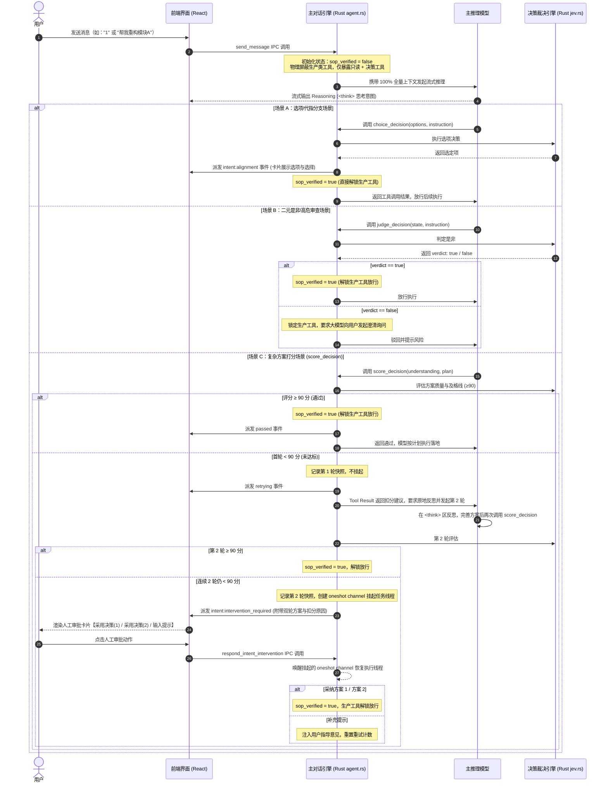
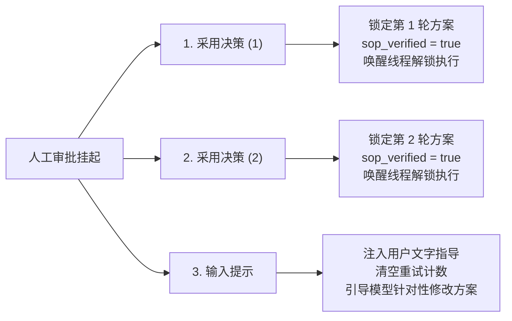

# 原生对话决策工具调度流程与 SOP 准入治理规范 (DECISION_TOOLS_CALLING_WORKFLOW_AND_SOP_SPEC)

| 属性 | 说明 |
| :--- | :--- |
| **文档代号** | `DECISION_TOOLS_CALLING_WORKFLOW_AND_SOP_SPEC` |
| **创建时间** | 2026-10-08 |
| **适用范围** | `harness_mini`（Tauri 2 + Rust + React 桌面 AI Agent 架构体系） |
| **关联核心模块** | [`src-tauri/src/agent.rs`](file:///f:/WorkSpace/Other/harness_mini/src-tauri/src/agent.rs), [`src-tauri/src/tools.rs`](file:///f:/WorkSpace/Other/harness_mini/src-tauri/src/tools.rs), [`src-tauri/src/models.rs`](file:///f:/WorkSpace/Other/harness_mini/src-tauri/src/models.rs), [`src-tauri/src/commands.rs`](file:///f:/WorkSpace/Other/harness_mini/src-tauri/src/commands.rs), [`src/types.ts`](file:///f:/WorkSpace/Other/harness_mini/src/types.ts), [`src/store.ts`](file:///f:/WorkSpace/Other/harness_mini/src/store.ts), [`src/components/IntentAlignmentCard.tsx`](file:///f:/WorkSpace/Other/harness_mini/src/components/IntentAlignmentCard.tsx), [`src/components/ToolCard.tsx`](file:///f:/WorkSpace/Other/harness_mini/src/components/ToolCard.tsx) |
| **知识密级** | 核心架构演进与决策流治理技术规范 |

---

## 目录

1. [架构演进背景与历史痛点复盘](#一架构演进背景与历史痛点复盘)
   - 1.1 [外置门控与切片截断的致命缺陷](#11-外置门控与切片截断的致命缺陷)
   - 1.2 [痛点实例：指代性输入与“信息严重不足”误判](#12-痛点实例指代性输入与信息严重不足误判)
2. [新架构总体设计：原生思考与自主决策闭环](#二新架构总体设计原生思考与自主决策闭环)
   - 2.1 [核心设计原则](#21-核心设计原则)
   - 2.2 [端到端全链路流转图](#22-端到端全链路流转图)
3. [决策三原语规范与自适应调度机制](#三决策三原语规范与自适应调度机制)
   - 3.1 [`choice_decision`（分支/指代抉择）](#31-choice_decision分支指代抉择)
   - 3.2 [`judge_decision`（二元是非判定）](#32-judge_decision二元是非判定)
   - 3.3 [`score_decision`（方案质量打分与双轮自愈）](#33-score_decision方案质量打分与双轮自愈)
4. [物理安全准入与生产工具隔离机制](#四物理安全准入与生产工具隔离机制)
   - 4.1 [工具暴露的动态权限控制](#41-工具暴露的动态权限控制)
   - 4.2 [SOP 提示词规范注入](#42-sop-提示词规范注入)
5. [双轮自愈与三选一人工审批交互体系](#五双轮自愈与三选一人工审批交互体系)
   - 5.1 [第 1 轮 <90 分：原地自愈反思闭环](#51-第-1-轮-90-分原地自愈反思闭环)
   - 5.2 [第 2 轮 <90 分：线程挂起与事件派发](#52-第-2-轮-90-分线程挂起与事件派发)
   - 5.3 [三选一审批动作与状态恢复](#53-三选一审批动作与状态恢复)
6. [前端组件渲染与流式可观测性](#六前端组件渲染与流式可观测性)
   - 6.1 [卡片多态渲染机制](#61-卡片多态渲染机制)
   - 6.2 [双轮方案比对与审批栏交互](#62-双轮方案比对与审批栏交互)
7. [质量基线与回归验证结论](#七质量基线与回归验证结论)

---

## 一、架构演进背景与历史痛点复盘

### 1.1 外置门控与切片截断的致命缺陷

在早期设计中，意图对齐与方案前置审查采用了**“外置旁路网关”**架构：
1. **外置拦截**：在主 Agent 执行用户消息前，由后端强制调用独立的大模型分析函数 `run_intent_alignment_gate`；
2. **上下文切片截断**：由于担心前序多轮上下文超出 token 限制或干扰决策，网关仅截取最近 1~2 轮消息，并对长文本强行执行 `format_recent_context_for_gate` 截断；
3. **黑盒推理与上下文割裂**：网关运行在主对话流之外，主模型无法感知网关的思考过程，且主模型与网关模型看到的上下文完全不对称。

### 1.2 痛点实例：指代性输入与“信息严重不足”误判

这种旧模式在遇到用户极简输入时暴露出严重缺陷：
- **场景**：上一轮助手的回复结尾给出了带编号的动作建议（如 `1. 补充门诊流程文档  2. 输出业务全景图`），用户回复简短的 `1`；
- **旧系统反应**：外置网关对上一轮内容做了截断，编号列表的具体条目被裁剪掉，分析模型判定：“用户回复‘1’，但编号列表在截断处不可见，关键约束是信息严重不足，不能臆测并执行具体操作”，导致陷入反复追问或死循环；
- **根因分析**：
  1. 上下文被人为割裂与截断；
  2. 决策权在外置网关而非主模型；
  3. 无法根据实际问题灵活选用除“打分”之外的决策工具（如用户回复 1 本质上是做选项抉择，却被强行套用打分模型）。

---

## 二、新架构总体设计：原生思考与自主决策闭环

### 2.1 核心设计原则

1. **100% 完整上下文共享**：主模型直接处理全量对话历史、系统提示词与工程记忆，杜绝任何人工切片或预处理截断。
2. **原生透明思考**：流式展示大模型的 `<think>` 推理过程，用户的指代意图与逻辑推导对用户完全可见。
3. **工具调度自适应**：废除单一死板的打分流程，大模型根据实际场景从**决策三原语**中自主选择。
4. **物理准入安全屏障**：在决策通过前，系统自动隔离不可逆生产工具（`write_file`、`edit_file`、`run_command`），仅提供只读调研与决策工具。

### 2.2 端到端全链路流转图



---

## 三、决策三原语规范与自适应调度机制

根据业务场景的差异，系统提供了语义互补的决策三原语：

| 工具名称 | 适用业务场景 | 核心输入参数 | 准入/放行规则 | 交互卡片特征 |
| :--- | :--- | :--- | :--- | :--- |
| **`choice_decision`** | 用户输入编号（如“1”、“B”）、指代消歧、多架构分支路线抉择 | `options` (候选分支列表), `instruction` (选择指令) | 裁决后**直接解锁生产工具放行**，无错误门禁 | 展示候选列表与系统最终选定项标签 |
| **`judge_decision`** | 高危破坏性操作前置审查、“当前上下文信息是否充足可立即执行”等是非断言 | `state` (待审视命题), `instruction` (审核标准) | `verdict: true` 直接放行；`false` 锁定并要求向用户发起澄清 | 绿色通过徽章 / 红色驳回提示与风险原因 |
| **`score_decision`** | 复杂代码重构、多步功能规划、跨文件设计等需评估方案健全度的任务 | `understanding` (需求理解), `plan` (分步行动方案) | $\ge 90$ 分直接放行；首轮 $<90$ 分原地反思自愈；连续 2 轮 $<90$ 分挂起人工审批 | 得分环进度、意图剖析、分步计划、扣分诊断项、双轮方案比对与审批按钮 |

---

## 四、物理安全准入与生产工具隔离机制

### 4.1 工具暴露的动态权限控制

在 Agent 主循环（[`src-tauri/src/agent.rs`](file:///f:/WorkSpace/Other/harness_mini/src-tauri/src/agent.rs)）中，运行时维护 `sop_verified` 标志：
1. **未准入状态（`sop_verified == false`）**：
   - 过滤工具列表：仅保留只读探索工具（`read_file`, `glob`, `grep`, `list_dir`, `file_outline`）以及决策工具（`choice_decision`, `judge_decision`, `score_decision`）；
   - 物理屏蔽修改工具：`write_file`, `edit_file`, `run_command` 等不进入 Tools Schema，模型在语义和协议层面均无法调用。
2. **已准入状态（`sop_verified == true`）**：
   - 恢复暴露全量生产工具，大模型可连贯推进读写与命令执行。

### 4.2 SOP 提示词规范注入

在系统提示词的 SOP 规则区明确告知模型：
```markdown
【对话意图对齐与决策工具自主调度 SOP（原生思考与准入闭环）】：
- 准则一（原生透明思考）：在每次决策或执行前，必须在思考区（<think>）进行深入、透明的推理剖析，明确用户真实需求与上下文指代。
- 准则二（决策准入与生产工具安全锁定）：在获得决策审查准入前，写入文件、编辑代码、运行命令等生产工具已被系统安全锁定。你必须根据实际问题自主挑选并调用适宜的决策工具获得准入：
  • `choice_decision`：当用户回复指代性选项编号（如“1”、“A1”）、或面对多个可行路线需要明确选定时调用。传入 options 与 instruction。选定后系统直接放行解锁。
  • `judge_decision`：当面对破坏性命令、高危操作审查、或需判断“当前信息是否充足可立即执行”等是非命题时调用。判定符合直接放行；不符合将锁定并要求澄清。
  • `score_decision`：当面对复杂需求实现、多步骤规划时调用。传入 understanding 与 plan。及格线为 ≥90 分；若 <90 分，请反思扣分意见后第 2 轮调用；若连续 2 轮仍 <90 分，系统将挂起并转交用户人工审批。
```

---

## 五、双轮自愈与三选一人工审批交互体系

### 5.1 第 1 轮 <90 分：原地自愈反思闭环

- 当 `score_decision` 首轮评分低于 90 分时，后端**不阻断也不向用户打扰报障**；
- Tool Result 返回结构化质检评估意见，驱动大模型在当前同一对话流中原地自愈：
  ```text
  ⚠️【方案质检未达标】当前评分: 75%（低于90%及格线）。
  质检评估意见: 缺少对遗留代码兼容性的分析，缺少分步自检策略。
  请在思考区（<think>）深入反思上述扣分意见，完善你的意图理解与行动计划，并再次调用 `score_decision` 发起第 2 轮审查。
  ```

### 5.2 第 2 轮 <90 分：线程挂起与事件派发

- 若大模型第 2 轮调整后的方案评分仍低于 90 分，系统触发确定性降级机制；
- Rust 后端分配唯一的 `intervention_id`，利用 Tokio `oneshot::channel` 挂起当前任务执行任务：
  ```rust
  let (tx, rx) = tokio::sync::oneshot::channel::<IntentInterventionDecision>();
  state.intent_interventions.lock().unwrap().insert(intervention_id.clone(), PendingIntentIntervention { session_id, tx });
  ```
- 系统向前端发射 `intent:intervention_required` 事件，携带双轮历史快照（`rounds`、`plan1`、`plan2`、`critique`）。

### 5.3 三选一审批动作与状态恢复

用户在前端界面可直接从三项明确操作中裁决：



---

## 六、前端组件渲染与流式可观测性

### 6.1 卡片多态渲染机制

在 [`src/components/IntentAlignmentCard.tsx`](file:///f:/WorkSpace/Other/harness_mini/src/components/IntentAlignmentCard.tsx) 中：
- 顶部徽标统一标识为 **`SOP 准入`**；
- 依据 `event.decision_type` 动态渲染不同子视图：
  - **`choice`**：展示候选分支列表，高亮最终选中的分支条目；
  - **`judge`**：展示被判定的命题与判定理由；
  - **`score`**：展示意图理解卡片、分步计划清单、环形得分进度条及多轮历史切换页签。

### 6.2 双轮方案比对与审批栏交互

当卡片进入 `requires_intervention` 状态时，界面下方固定展示操作栏：
- **【采用决策 (1)】按钮**：直接采纳第 1 轮方案，向后端提交 `adopt_plan_1`；
- **【采用决策 (2)】按钮**：直接采纳第 2 轮方案，向后端提交 `adopt_plan_2`；
- **【输入提示】按钮**：展开文本输入框，用户输入个性化纠偏要求后提交 `hint`。

---

## 七、质量基线与回归验证结论

本规范及相关实现已完成全面工程回归：

1. **Rust 单元测试基线**：
   - 执行命令：`cargo test --lib -- --test-threads=1`
   - 结果：**147 项单元测试全部通过（0 失败，0 告警）**。
2. **前端类型与编译基线**：
   - 执行命令：`npx tsc --noEmit` 与 `npm run build`
   - 结果：**0 TypeScript 类型错误，前端生产包（Vite + React）顺利构建完成**。
3. **架构闭环验证**：
   - 彻底消除了旧版外置网关截断导致的“指代不可见”、“信息严重不足”误判痛点；
   - 实现了思考链路、决策调度、自愈修正与人工干预的全程无缝衔接。

---

## 八、精简演进：轻量单轮决策与安全生产无锁化（2026-10 架构升级）

为了进一步降低认知负荷、消除交互冗余与工具隐藏引发的死锁隐患，系统针对日常对话实施了全链路精简演进：

### 8.1 核心精简原则

1. **取消沉重的准入大卡片，采用轻量内联条**：
   - $\ge 90$ 分（通过）：仅显示微型紧凑绿色状态条（`✓ 意图已对齐 (95%)`），可一键展开查看要点，绝不遮挡视野；
   - $< 90$ 分（需确认）：展示紧凑内联卡片（$\le 4$ 行），仅呈现核心理解、关键动作与 1 句话提示。
2. **严格单轮判断，用户二选一**：
   - 取消内部多轮重试自纠循环，评估模型进行单轮打分；
   - 打分 $<90$ 分时，交由用户直接裁决：
     - **【采用该决策】**：直接采纳放行，立即开始推进；
     - **【输入提示，调整方向】**：展开单行输入框，补充调整要求后重新评估。
3. **决策仅对“用户输入”前置决策**：
   - 仅在用户发送新消息时前置提炼意图，对话执行过程中大模型自主调用生产工具，不再作为阻断性工具打断执行流。
4. **决策内容极致简洁明了**：
   - 核心理解 $\le 40$ 字；拟定动作限定为 2~3 条要点，每条 $\le 25$ 字；
   - 方便用户 2 秒内阅读决策，也利于小尺寸决策模型稳定评估。
5. **彻底消除工具列表隐藏与死锁隐患**：
   - 彻底废除 `step_schemas` 动态过滤隔离，生产类工具（`write_file`, `edit_file`, `run_command`）在 Agent 执行期间 **100% 全量可用**；
   - 根除由于门控遗漏或放开失败导致的对话死锁风险。

