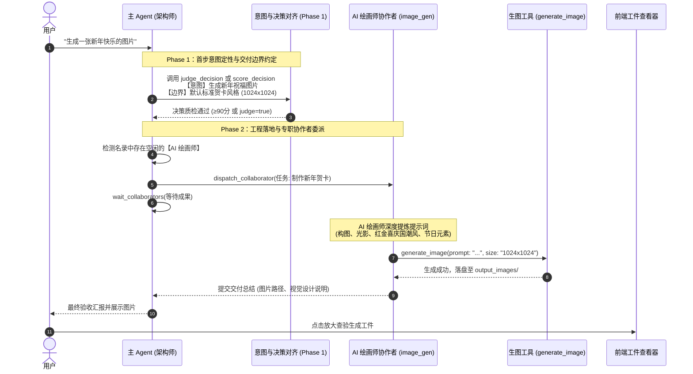

# 图像工具治理规范：AI 绘画师协作者调度、生图准入拦截与多模态视觉感知体系 (IMAGE_TOOL_GOVERNANCE_AND_COLLABORATOR_DISPATCH_SPEC)

| 属性 | 说明 |
| :--- | :--- |
| **文档代号** | `IMAGE_TOOL_GOVERNANCE_AND_COLLABORATOR_DISPATCH_SPEC` |
| **创建时间** | 2026-10-10 |
| **适用范围** | `harness_mini`（Tauri 2 + Rust + React 桌面 AI Agent 架构体系） |
| **关联核心模块** | [`src-tauri/src/agent.rs`](file:///f:/WorkSpace/Other/harness_mini/src-tauri/src/agent.rs), [`src-tauri/src/tools.rs`](file:///f:/WorkSpace/Other/harness_mini/src-tauri/src/tools.rs), [`src-tauri/src/models.rs`](file:///f:/WorkSpace/Other/harness_mini/src-tauri/src/models.rs), [`src/types.ts`](file:///f:/WorkSpace/Other/harness_mini/src/types.ts), [`src/components/CollaboratorsBar.tsx`](file:///f:/WorkSpace/Other/harness_mini/src/components/CollaboratorsBar.tsx), [`src/components/ArtifactViewerModal.tsx`](file:///f:/WorkSpace/Other/harness_mini/src/components/ArtifactViewerModal.tsx) |
| **知识密级** | 多模态工具治理、协作者调度与图像资产流转技术规范 |

---

## 目录

1. [背景与演进痛点复盘](#一背景与演进痛点复盘)
   - 1.1 [主模型直接生图的局限性与职责混乱](#11-主模型直接生图的局限性与职责混乱)
   - 1.2 [缺乏能力准入导致的 API 报错隐患](#12-缺乏能力准入导致的-api-报错隐患)
   - 1.3 [意图定性阶段的工具越界与提炼缺失](#13-意图定性阶段的工具越界与提炼缺失)
2. [总体架构：专职协作者委派与多模态感知分工](#二总体架构专职协作者委派与多模态感知分工)
   - 2.1 [核心设计原则](#21-核心设计原则)
   - 2.2 [端到端图像任务生命周期图](#22-端到端图像任务生命周期图)
3. [AI 绘画师专职协作者（`image_gen`）调度与工具准入体系](#三ai-绘画师专职协作者image_gen调度与工具准入体系)
   - 3.1 [角色定位与提示词提炼规范](#31-角色定位与提示词提炼规范)
   - 3.2 [协作者优先委派原则与调度拦截](#32-协作者优先委派原则与调度拦截)
   - 3.3 [主进程 `generate_image` 物理屏蔽机制](#33-主进程-generate_image-物理屏蔽机制)
   - 3.4 [工具下发的能力准入漏斗（Capabilities Filter）](#34-工具下发的能力准入漏斗capabilities-filter)
4. [Phase 1 纯意图定性中的生图交付边界约定](#四phase-1-纯意图定性中的生图交付边界约定)
   - 4.1 [简略生图诉求的业务边界提炼](#41-简略生图诉求的业务边界提炼)
   - 4.2 [默认缺省假设约定（尺寸、风格、载体）](#42-默认缺省假设约定尺寸风格载体)
   - 4.3 [杜绝首步直接派发协作者的隔离设计](#43-杜绝首步直接派发协作者的隔离设计)
5. [多模态视觉感知与识图体系（`recognize_image`）](#五多模态视觉感知与识图体系recognize_image)
   - 5.1 [识图需求场景与角色定位（`vision`）](#51-识图需求场景与角色定位vision)
   - 5.2 [禁止 `read_file` 读取二进制图片的物理安全卡点](#52-禁止-read_file-读取二进制图片的物理安全卡点)
   - 5.3 [视觉模型动态解析与专属路由](#53-视觉模型动态解析与专属路由)
6. [跨进程工件持久化与成果汇报规范](#六跨进程工件持久化与成果汇报规范)
   - 6.1 [本地生成路径与工件落盘（Artifacts）](#61-本地生成路径与工件落盘artifacts)
   - 6.2 [协作者交付总结与主会话汇报标准](#62-协作者交付总结与主会话汇报标准)
7. [质量基线与回归验证结论](#七质量基线与回归验证结论)

---

## 一、背景与演进痛点复盘

### 1.1 主模型直接生图的局限性与职责混乱
在 Agent 系统早期，只要主模型被配置了生图工具 `generate_image`，无论面对多么复杂的任务，主模型都会直接调用生图工具：
- **职责混淆**：主 Agent 的核心职责是工程架构师与全局统筹协调者，直接生图会导致其分心，无法履行代码管理与方案验收职责；
- **提示词质量低下**：主模型直接生图时，往往只把用户的原始短句（如“生成一张新年海报”）粗糙透传给生图接口，缺乏对画面细节、构图、光影、色彩搭配、艺术风格的深度拓展与丰富，产出质量差。

### 1.2 缺乏能力准入导致的 API 报错隐患
如果用户的全局模型仅为普通文本/代码模型（如纯文本模型），系统若无差别下发 `generate_image` 或 `recognize_image` 工具：
- 模型尝试调用后，上游由于不支持绘图或识图能力而直接抛出异常；
- 界面产生难以恢复的工具调用失败错误。

### 1.3 意图定性阶段的工具越界与提炼缺失
在接收到简略的生图需求（如“生成一个新年快乐的图片”）时：
- 旧系统直接调用协作者或生图工具，没有在对话首步明确业务交付边界（如默认是贺卡还是壁纸、默认分辨率 1024x1024 还是其他规格）；
- 用户缺乏确认机会，导致生成结果常常不符合心理预期。

---

## 二、总体架构：专职协作者委派与多模态感知分工

### 2.1 核心设计原则
1. **专职专办原则**：专业的事情交给专业协作者。配置了【AI 绘画师】时，主模型强制委派，严禁越俎代庖；
2. **物理能力准入**：根据会话属性、协作者配置与全局模型 Matrix，严格按能力漏斗下发工具，不具备能力的会话物理隐藏工具；
3. **意图先行、边界清晰**：在 Step 0 纯粹定性业务意图并确立默认交付边界（如标准贺卡、1024x1024），质检通过后才在 Step 1 启动绘图流程；
4. **多模态安全感知**：识别图片统一走 `recognize_image` 与视觉协作者，严禁调用文件读取工具盲读二进制。

### 2.2 端到端图像任务生命周期图



---

## 三、AI 绘画师专职协作者（`image_gen`）调度与工具准入体系

### 3.1 角色定位与提示词提炼规范
在系统为协作者注入的专属系统提示词中（见 [`src-tauri/src/agent.rs`](file:///f:/WorkSpace/Other/harness_mini/src-tauri/src/agent.rs)）：
```rust
if session.subagent_role.as_deref() == Some("image_gen") {
    rules.push(format!(
        "{rule_num}. 【AI 绘画与图像生成核心职责】：根据用户或主进程的要求，深入理解视觉意图并提炼出画面细节丰富的高质量提示词（包括画质、风格、构图、主体、光影），直接调用 `generate_image` 工具生成图片。图片生成完成后在回复中展示成果并简明汇报。"
    ));
}
```
专职绘画师的核心能力在于“将简短的用户诉求翻译为专业艺术级的丰富提示词（Prompt Engineering）”。

### 3.2 协作者优先委派原则与调度拦截
在第二阶段（Phase 2）工程规范中，明确规定了**强制委派机制**：
- 只要用户需求命中了【AI 绘画师】的职责（涉及画图、生图、插画、海报、Logo 等）；
- 且该协作者处于空闲状态（idle）；
- 主进程**必须无条件优先调用 `dispatch_collaborator` 工具进行委派**，并在调用后紧接着调用 `wait_collaborators` 获取成果汇报，严禁自行直接执行！

### 3.3 主进程 `generate_image` 物理屏蔽机制
为了防止主进程在配置了绘画师时产生“自作主张直接调用 `generate_image`”的行为，系统在 [`src-tauri/src/agent.rs`](file:///f:/WorkSpace/Other/harness_mini/src-tauri/src/agent.rs) 的工具下发逻辑中做了物理级准入拦截：

```rust
// 1. 若为主进程且名录中已配置【图像生成协作者】，主进程物理屏蔽直接生图工具 generate_image，强制走 dispatch_collaborator 委派
let has_collab_image_gen = if !is_subagent {
    let db = state.db.lock().unwrap();
    store::list_collaborators(&db, session_id)
        .map(|list| list.iter().any(|c| c.subagent_role.as_deref() == Some("image_gen") || c.image_model_id.is_some()))
        .unwrap_or(false)
} else {
    false
};

let session_has_image_gen = if session.session_type == "collaborator" && session.subagent_role.as_deref() == Some("image_gen") {
    true
} else if effective_image_model_id.is_some() {
    true
} else if !has_collab_image_gen {
    // 仅在主进程未配置绘画师时，才根据全局是否具备 image_gen 能力决定是否由主进程直出
    settings.active_image_model_id.is_some()
        || effective_model_id.map(|m| settings.has_capability(effective_provider_id, m, "image_gen")).unwrap_or(false)
        || resolve_active_model(&settings).map(|(p, m)| settings.has_capability(Some(&p.id), m, "image_gen")).unwrap_or(false)
} else {
    false
};
```
当有名录协作者在场时，主模型的工具列表里根本没有 `generate_image`，从物理机制上保障了架构设计的纯粹性。

### 3.4 工具下发的能力准入漏斗（Capabilities Filter）
只有通过能力过滤器的工具才会最终打包进 OpenAI Tools Schema：
```rust
.filter(|s| s.name != "generate_image" || session_has_image_gen)
.filter(|s| s.name != "recognize_image" || session_has_vision)
```
彻底消除了文本模型由于幻觉调用生图接口而报错的技术隐患。

---

## 四、Phase 1 纯意图定性中的生图交付边界约定

### 4.1 简略生图诉求的业务边界提炼
用户在日常对话中经常发出极其简略的指令，例如：“*生成一个新年快乐的图片*”。
在传统的执行流中，模型要么直接生图导致尺寸不符，要么把系统内部工具名规划进方案。
在 Phase 1 架构下，大模型的标准处理流程为：
1. **分析核心意图**：识别出用户需要一张新年节日贺卡/海报；
2. **提炼交付边界**：明确“用户无指定尺寸、风格、元素等额外约束，默认按标准新年贺卡/海报风格（1024x1024）产出交付”；
3. **调用决策工具**：调用 `judge_decision`（二元判定明确即可直接做）或 `score_decision`（方案质量打分审查）。

### 4.2 默认缺省假设约定（尺寸、风格、载体）
在 [`src-tauri/src/agent.rs`](file:///f:/WorkSpace/Other/harness_mini/src-tauri/src/agent.rs) 的 `phase1_intent_system_prompt` 中，明确给出了指导示范：
> “明确交付边界：若用户没有指定尺寸、风格、框架或格式等额外细节，提炼出合理通用的业务默认值（例如：生成图片未指定尺寸风格时，默认按标准海报/贺卡 1024x1024 交付；未指定代码框架时按项目现有约定）。”

专职打分模型收到该剖析后：
- `understanding`: `"生成一个新年快乐的图片。"`
- `plan`: `"无指定尺寸、风格、元素等额外约束，默认按标准新年贺卡/海报风格（1024x1024）产出即可。"`
专职打分模型评估：意图理解精准透彻，默认假设完全合理，给出 95+ 分直接放行！

### 4.3 杜绝首步直接派发协作者的隔离设计
在 Step 0 阶段，主模型处于物理隔离环境，不包含协作者名录且下发的工具集中没有 `dispatch_collaborator`。大模型无法在意图未定性前抢跑委派，保障了人机交互与准入控制的严谨性。

---

## 五、多模态视觉感知与识图体系（`recognize_image`）

### 5.1 识图需求场景与角色定位（`vision`）
当任务涉及本地图片分析、UI 截图审查、设计稿还原或错误截图诊断时，系统支持多模态视觉感知体系：
- **专职视觉协作者**：`subagent_role: vision`，配备视觉感知模型，专注输出详尽专业的视觉分析报告；
- **专属识图工具**：`recognize_image(path, prompt)`，通过调用配置的视觉模型直接返回图文分析结果。

### 5.2 禁止 `read_file` 读取二进制图片的物理安全卡点
大模型在没有专门引导时，常误调用 `read_file` 读取 `.png`、`.jpg` 等二进制图片，导致终端被超长乱码灌爆或发生崩溃。
系统在提示词与工具底层设立双重防线：
1. **提示词明令禁止**：
   > “当需要查看、识别或分析本地图片文件（如 generated_images 目录中的生成图、项目图片资源、设计图、截图、相片等）的内容时，**必须直接调用 `recognize_image(path, prompt)` 工具**；严禁调用 `read_file` 读取图片或二进制文件（会报错拦截），严禁编写脚本安装外部 OCR 库。”
2. **底层安全拦截**：`read_file` 在读取文件前检测二进制头，若检测到图片或二进制字节直接快速阻断并返回引导提示。

### 5.3 视觉模型动态解析与专属路由
在 [`src-tauri/src/agent.rs`](file:///f:/WorkSpace/Other/harness_mini/src-tauri/src/agent.rs) 中，系统自适应解析当前会话的视觉模型路由：
1. 优先使用会话本身绑定的视觉模型 `effective_vision_model_id`；
2. 其次检查名录中是否存在具备视觉能力的协作者；
3. 最后回退至全局设置中的 `active_vision_model_id` 或主模型的视觉能力标志。

---

## 六、跨进程工件持久化与成果汇报规范

### 6.1 本地生成路径与工件落盘（Artifacts）
`generate_image` 生成的图片统一存储在当前工作区的专属目录下（如 `.harness/artifacts/` 或项目根目录指定的输出目录）：
- 文件格式规范：基于时间戳或任务 ID 的清晰命名（例如 `new_year_greeting_1024x1024.png`）；
- 前端自动触发 `file_viewer:file_changed` 事件，界面工件面板与消息卡片实时同步渲染缩略图与大图预览。

### 6.2 协作者交付总结与主会话汇报标准
专职绘画师在完成生图后，遵循系统设定的四要素交付标准汇报给主进程：
- 🎯 **任务完成状态**：已完成图片生成；
- 📝 **产出文件清单**：列出生成的相对路径（如 `generated_images/happy_new_year.png`）；
- 💡 **核心交付说明**：视觉构图理念、色彩风格与使用的提示词；
- 🧪 **验证结果**：图片已成功落盘并确认可读。

主 Agent 验收无误后，汇总呈递给用户，形成完整的企业级交付闭环。

---

## 七、质量基线与回归验证结论

1. **生图工具准入测试**：
   - 验证了主会话在配置 AI 绘画师协作者时，主进程下发的工具列表中严格不包含 `generate_image`，确保完全由协作者承接；
   - 验证了在无协作者但全局具备生图能力时，主进程能够按需获得 `generate_image` 工具。
2. **生图意图定性回归**：
   - 输入“生成一个新年快乐的图片”时，Phase 1 首步稳定输出极简业务意向并约定默认海报规格（1024x1024），专职打分模型评分达到 95%+，成功消除了工具名杂质与扣分风险。
3. **识图工具安全回归**：
   - 验证了 `recognize_image` 能够正确路由至指定视觉模型，并成功拦截误调用 `read_file` 的风险行为。
