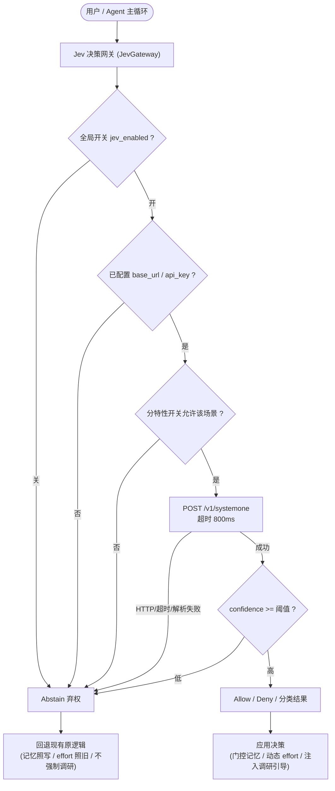

# Jev 决策网关插拔式集成规范与实施方案 (JEV_DECISION_GATEWAY_INTEGRATION_SPEC)

| 项目 | 内容 |
| --- | --- |
| 文档名称 | Jev 决策网关插拔式集成规范与实施方案 (Jev Decision Gateway Integration Specification) |
| 英文代号 | `JEV_DECISION_GATEWAY_INTEGRATION_SPEC` |
| 版本 | v1.0 |
| 状态 | 方案设计待评审 |
| 关联模块 | `src-tauri/Cargo.toml`, `src-tauri/src/jev.rs`(新增), `src-tauri/src/models.rs`, `src-tauri/src/lib.rs`, `src-tauri/src/commands.rs`, `src-tauri/src/secrets.rs`, `src-tauri/src/memory.rs`, `src-tauri/src/tools.rs`, `src-tauri/src/agent.rs`, `src/types.ts`, `src/store.ts`, `src/ipc.ts`, `src/components/SettingsModal.tsx` |
| 运行位置 | `f:\WorkSpace\Other\harness_mini` |

---

## 1. 背景与核心痛点解构

在 `harness_mini` 的长期实机使用中，暴露出三类**非“生成质量”而是“判断质量”**的系统性缺陷。它们共同特征为：**模型具备完成能力，但在“该不该做 / 要做多深 / 值不值得留”的前置判断环节失准**。

### 痛点 1：记忆沉淀质量失控（记垃圾、漏干货）

| 现象 | 无用知识被写入（如模型推测、猜测得出的结论）；项目/功能的必要知识点反而遗漏 |
| --- | --- |
| 代码根因 | 1. `memory.rs::record_memory`（第 208 行）**无任何质量门控**，Agent 一旦调用即无条件落盘；<br/>2. `importance` 提级逻辑极度粗糙——第 265 行仅做 `content.contains("CRITICAL" \|\| "重要" \|\| "必须")` 的字符串匹配；<br/>3. `trigger_auto_distillation`（第 473 行）虽有“已记 digest 则跳过 / 无工作区则跳过”等 if-return 过滤，但**“值不值得记”的终判仍交给同一个生成型 LLM 自行提炼**，导致推测内容混入、必要知识点漏记。 |
| 本质缺口 | 缺少一个**独立、快速、不幻觉、带置信度**的“可信度 + 必要性”判定器。 |

### 痛点 2：小问题过度思考（简单任务深度推理耗时失控）

| 现象 | 本只需改一行代码的小问题，模型却长时间深度思考，浪费上下文与耗时 |
| --- | --- |
| 代码根因 | 1. `reasoning_effort` 为**会话级固定值**：`agent.rs` 第 880–885 行按 `session → settings` 取值，**无法按单轮请求自适应**；<br/>2. `system_prompt` 仅有静态“10~15 步收敛”规则（第 3096 行），**无动态复杂度感知**。 |
| 本质缺口 | 缺少**请求前置的任务复杂度分类**（trivial / small / large / deep_research）。 |

### 痛点 3：大需求思考不足（不查资料、不深入根因）

| 现象 | 本是大需求，模型却仅凭既有知识直接产出结果，不主动查阅资料、不深究问题根本 |
| --- | --- |
| 代码根因 | 与痛点 2 同源——**无前置分类**，故无法识别“该需求已超出模型既有知识、必须调研”。 |
| 本质缺口 | 缺少**“是否超出既有知识 / 是否必须调研”的前置判定**。 |

> **核心洞察**：三大痛点全部落在“结构化判断”区间，而非“文本生成”区间。

---

## 2. Jev 能力本质与可行性边界

**Jev 是 TypeSafe AI 的旗舰模型，也是首个 “System One” 模型**（官网 typesafe.ai / 文档 docs.typesafe.ai）。它与本项目现有接入的所有 LLM **本质不同类**：

| 维度 | 现有接入的 LLM（GLM / DeepSeek / OpenAI / Ollama） | Jev (System One) |
| --- | --- | --- |
| 输出 | 文本流 / 代码 / 工具调用 | **类型化结构化值**（choice / score / noul） |
| 能力 | 对话、写代码、推理 | **只做决策，不生成文本、不写代码** |
| 协议 | OpenAI 兼容 `POST /chat/completions` | 专有 `POST /v1/systemone`（state + questions） |
| 采样 | 顺序采样、可能幻觉 | 并行采样、**不幻觉、无类型错误** |
| 延迟 | 3~329 秒 | **70~500 ms** |
| 成本 | 输出 token ≈ 输入 5 倍 | 输入 $0.042/MTok，**输出 token 免费** |
| 置信度 | 过度自信、不一致 | **每项输出带校准概率 + confidence** |

### 2.1 三种原语（Primitives）

| 原语 | 语义 | 返回 |
| --- | --- | --- |
| `Choice` | 从固定选项集中选一 | `choice` + `probabilities` + `confidence` |
| `Score` | 按 rubric（分级标准）打分 | `score` + `probabilities` + `confidence` |
| `Noul` | 判断某陈述为真的概率 | `noul` (0~1) |

> 单次请求可**混合多个 question 并行求值**，加问题几乎不增耗时；官方建议**原子化提问**（一题一问），复杂判断需拆解后在代码中组合。

### 2.2 可行性边界（必须诚实界定）

**✅ Jev 能解决**：
- 判断“内容是否来自实地验证而非推测”（痛点 1 核心）；
- 判断“是否属于后续会重复用到的必要知识点”（痛点 1 核心）；
- 分类“本轮任务复杂度 / 是否需外部资料”（痛点 2、3 核心）；
- 以 confidence 门控决定“自动放行 / 转人工 / 降级”。

**❌ Jev 不能做到**：
- **不能替代主模型生成**文本与代码（它不生成文本）；
- **不能裁决内容“客观是否正确”**，只能判断“是否像经过验证”——故它只能作为**门控/建议层，而非真相裁判**；
- 对“猜测”的识别依赖 `state` 中携带足够证据上下文。

**⚠️ 接入前提风险**：
1. 项目历史会话使用的是“**opencode 中转站**”的 `jev-1.13-free`（见 `docs/PLAN_AND_TODO_UNIFICATION_*.md`），而官方端点为 `api.typesafe.ai/v1/systemone`。**中转站是否透传该私有端点未经证实**，落地前必须先做连通性验证。
2. `state` 外发存在**隐私/代码泄露风险**，需在文档与 UI 中明示，并支持仅发送裁剪摘要。

---

## 3. 总体架构与插拔式设计

### 3.1 三层开关 + 全失败降级契约



**降级契约（插拔安全性核心）**：`Abstain` 情况下，**所有调用点零副作用地回退到改造前的既有行为**。以此保证：
- 开关关闭 = 系统行为与当前完全一致；
- Jev 服务不可用/超时 = 主流程不阻塞，仅退化为原逻辑。

### 3.2 决策档位

```rust
/// 决策结果三态：明确放行 / 明确拒绝 / 弃权（含一切失败与低置信）
pub enum Gate {
    Allow,
    Deny(String),   // 携带拒绝理由，供 UI 与日志展示
    Abstain,        // 开关关 / 未配置 / 超时 / 失败 / 低置信 —— 触发原逻辑
}
```

---

## 4. 数据结构与持久化设计

### 4.1 后端配置（`src-tauri/src/models.rs`）

在 `SettingsData`（第 60 行起）中新增 `jev` 配置块，`api_key` 沿用 `secrets.rs` 的 AES-256-GCM 独立加密存储（与 providers 同范式，键名如 `jev_api_key`），**不落明文**：

```rust
#[derive(Serialize, Deserialize, Clone, Debug)]
#[serde(rename_all = "camelCase")]
pub struct JevCfg {
    /// 总闸：关闭时网关恒返回 Abstain
    #[serde(default)]
    pub enabled: bool,
    /// 端点基址，默认官方 https://api.typesafe.ai；亦可填中转站
    #[serde(default = "default_jev_base_url")]
    pub base_url: String,
    /// 决策模型名，默认 jev-latest
    #[serde(default = "default_jev_model")]
    pub model: String,
    /// 单次决策超时（毫秒），默认 800，超时即 Abstain
    #[serde(default = "default_jev_timeout")]
    pub timeout_ms: u64,
    /// 置信度下限，低于则 Abstain，默认 0.6
    #[serde(default = "default_jev_min_confidence")]
    pub min_confidence: f32,
    /// 分特性细粒度开关
    #[serde(default)]
    pub features: JevFeatures,
}

#[derive(Serialize, Deserialize, Clone, Debug, Default)]
#[serde(rename_all = "camelCase")]
pub struct JevFeatures {
    /// 痛点 1：记忆写入门控
    #[serde(default)]
    pub memory_gate: bool,
    /// 痛点 2：任务复杂度 → 动态思考深度
    #[serde(default)]
    pub thinking_depth: bool,
    /// 痛点 3：是否强制外部调研
    #[serde(default)]
    pub research_trigger: bool,
}
```

在 `SettingsData` 中追加 `#[serde(default)] pub jev: JevCfg`（放于 `proxy_url` 之后，保持向后兼容——旧配置 JSON 缺失该字段时按 Default 反序列化）。

> 持久化：`app_settings` 以 JSON 存于 `settings` 表（见 `paths.rs` 第 145 行），新增字段**无需 SQLite 迁移**；仅 API Key 需经 `secrets.rs` 加密后单独存取。

### 4.2 开关层级（插拔控制）

| 层级 | 载体 | 语义 |
| --- | --- | --- |
| 全局总闸 | `SettingsData.jev.enabled` | 一键开关整个 Jev 决策能力 |
| 分特性 | `JevCfg.features.{memory_gate, thinking_depth, research_trigger}` | 按痛点逐项开关 |
| 会话级覆盖 | `Session.jev_enabled: Option<bool>`（复用会话表扩展列范式，如 `reasoning_effort`） | 单个对话临时启用/禁用 |
| SOP 兼容 | 复用 `SettingsData.disabled_sops`，追加保留值 `"jev"` | 与现有 SOP 启停机制统一 |

### 4.3 前端类型（`src/types.ts` / `src/store.ts` / `src/ipc.ts`）

新增与后端 camelCase 对齐的 `JevCfg` / `JevFeatures` 类型，设置页 `SettingsModal.tsx` 增加“Jev 决策增强”分组：总开关、端点、模型名、API Key、超时、置信阈值、三个分特性勾选框，并附**隐私提示**（state 将外发给第三方决策模型）。

---

## 5. 分层落地技术方案

### 5.1 新增独立客户端 `src-tauri/src/jev.rs`

**与 `llm.rs` 完全解耦**（协议不同，不可复用 `chat_stream`）：

```rust
pub struct JevClient { base_url: String, api_key: String, model: String, timeout_ms: u64, proxy_url: Option<String> }

/// 单次多问题并行决策；返回 answers 数组，失败返回 Err（由上层转 Abstain）
pub async fn systemone(&self, state: &str, questions: serde_json::Value) -> Result<serde_json::Value, String>;

// 网关封装（读取 settings → 校验开关 → 调用 → 阈值过滤 → Gate）
pub async fn decide_noul(state: &str, instruction: &str, min_conf: f32) -> Gate;
pub async fn decide_choice(state: &str, instruction: &str, options: Vec<(String,String)>, min_conf: f32) -> Option<(String, f32)>;
pub async fn decide_score(state: &str, instruction: &str, rubric: Vec<String>, min_conf: f32) -> Option<(f32, f32)>;
```

- 复用 `llm.rs::get_client(proxy_url)` 复用代理基础设施（`UNIFIED_PROXY_AND_WEB_ACCESS_SPEC` 已确立统一代理底座）；
- 请求体：`{ state, model, questions }`，鉴权头 `Authorization: Bearer <KEY>`；
- 全链路 `result.map_err(...)` 归一为 `Abstain`，**严禁 panic 或阻塞主流程**。

### 5.2 痛点 1 —— 记忆写入门控（收益最直观，优先落地）

**落点**：`tools.rs::record_memory_tool`（第 2136 行，async 环境，可 await）在调用 `memory::record_memory` **之前**插入异步门控；`memory.rs::trigger_auto_distillation`（第 473 行）在提炼候选阶段同样接入。

**判定问题设计**（原子化）：
- `Noul`：「以下内容是否**源自对工作区文件/代码的实地读取与验证**，而非推测或猜测？」（`instructions` 内明确要求“仅当有明确证据支撑时为真”）
- `Noul`：「这是否是**本项目/功能后续会重复用到的必要知识点**？」
- `Score`：「该内容作为长期项目记忆的**可复用价值**」（rubric：1=一次性问题 / 2=局部有用 / 3=关键复用）

**决策规则**：
| 结果 | 动作 |
| --- | --- |
| 有效性问题为真 且 必要性为真 且 价值 ≥ 2 | `Allow` → 正常落盘 |
| 有效性问题为假（疑似推测） | `Deny` → 拒绝写入，返回提示“内容疑似推测，未沉淀” |
| 必要性为假（一次性信息） | `Deny` → 拒绝，避免垃圾碎记 |
| `Abstain` | 回退现有逻辑（照写）+ 保留现有字符串提级 |

**增益**：以“带置信度的语义判定”替换“字符串 contains 提级”，直接治本于“记垃圾/漏干货”。

### 5.3 痛点 2 & 3 —— 思考深度与调研路由

**落点**：`agent.rs::run_once`（第 792 行）**入口处**，在组装 `LlmCfg`（第 880–895 行）之前执行一次前置决策 ≤ 800ms。

**判定问题设计**：
- `Choice`：「本轮用户请求的复杂度属于哪一档？」选项：`trivial`(改一行/纯问答) / `small`(单文件小改) / `large`(多文件/新功能) / `deep_research`(需外部资料/根因不明)
- `Noul`（痛点 3）：「该请求是否**已超出模型既有知识、必须查阅外部资料**才能正确完成？」

**应用规则**（`thinking_depth` 特性开启时）：
| 分类 | 动态动作 |
| --- | --- |
| `trivial` / `small` | **本轮下调** `effective_reasoning_effort`（覆盖第 880–885 行的会话级固定值，如强制 `low`），并注入“轻量任务快收敛、禁止过度探索”引导 |
| `large` | 维持会话设置；注入“方案先行”引导 |
| `deep_research` 或 调研 Noul 为真 | **上调** effort，并**强制注入“先调研再动手”引导**（提示 `fetch_web_page` 优先） |

**实现要点**：将第 880–885 行的取值改为“会话级默认 → Jev 前置分类覆盖”的两段式，确保 `Abstain` 时回落原值。

> 与既有痛点 2 的静态规则（第 3096 行“10~15 步收敛”）叠加而非冲突：Jev 负责“按需动态”，静态规则作为兜底。

---

## 6. 分步实施 Checklist

- [ ] **S0. 连通性验证（前置卡点）**：以 1 个 curl / PowerShell 请求验证 opencode 中转站或官方 key 可调通 `POST /v1/systemone`；失败则暂缓并回归方案评估。
- [ ] **S1. 客户端骨架**：新增 `src-tauri/src/jev.rs`，实现 `systemone()` 与 `JevClient`，`lib.rs` 注册 `mod jev`。
- [ ] **S2. 配置与开关**：`models.rs` 新增 `JevCfg` / `JevFeatures` 及默认值；`SettingsData` 追加 `jev` 字段；API Key 经 `secrets.rs` 加密存取。
- [ ] **S3. 网关与降级**：实现 `Gate` 三态与 `decide_*` 封装，落实超时/失败/低置信 → `Abstain` 契约。
- [ ] **S4. 连接测试命令**：`commands.rs` 新增 `test_jev`（对齐 `test_provider` 范式），`lib.rs` 注册。
- [ ] **S5. 前端开关面板**：`types.ts` / `store.ts` / `ipc.ts` / `SettingsModal.tsx` 增加 Jev 设置区与隐私提示。
- [ ] **S6. 痛点 1 记忆门控**：`tools.rs::record_memory_tool` 前置门控 + `memory.rs::trigger_auto_distillation` 候选过滤。
- [ ] **S7. 痛点 2/3 思考路由**：`agent.rs::run_once` 入口前置分类，动态覆盖 `effective_reasoning_effort` 并注入引导消息。
- [ ] **S8. 构建与单测**：`cargo test --manifest-path src-tauri/Cargo.toml` 全绿；补充 `Gate` 降级与门控规则单测。
- [ ] **S9. 端到端验收**：分别开关 Jev，验证“关=行为与现状一致、开=三痛点改善”。

---

## 7. 风险、约束与验证策略

### 7.1 风险登记

| 风险 | 等级 | 缓解措施 |
| --- | --- | --- |
| 中转站不支持 `/v1/systemone` 私有协议 | 高 | S0 前置验证；不支持则改用官方端点或暂缓 |
| 每轮新增一次决策调用带来的延迟 | 低 | 800ms 超时硬约束；失即 Abstain，不阻塞 |
| `state` 外发导致代码/Prompt 泄露 | 中 | UI 明示；仅发送裁剪摘要；支持整体关闭 |
| 决策误判导致有用记忆被拒 | 中 | `Deny` 时返回理由可追溯；配置 `min_confidence` 可调；支持仅“标记待验证”的温和档 |
| 与现有 `reasoning_effort` 会话级配置冲突 | 低 | 采用“默认值 + 前置覆盖”两段式，Abstain 时回落 |

### 7.2 验收指标

1. **插拔性**：`jev.enabled = false` 时，记忆落盘行为、`reasoning_effort` 取值、调研触发与改造前**逐位一致**；
2. **门控有效性**：构造“推测型”与“必要知识点”两类样本，验证前者被拒、后者被留；
3. **动态深度**：`trivial` 类请求的思考耗时/步数显著下降；`deep_research` 类请求调研工具调用率上升；
4. **健壮性**：拔除网络（模拟超时）时主流程完全不受影响；
5. **构建**：`cargo test --manifest-path src-tauri/Cargo.toml` 通过。

### 7.3 结论

三大痛点均属**结构化判断失误**，正是 Jev（System One）设计目标所在，**可行性高**；但其定位是**决策增强层而非生成替代层**。通过「三层开关 + `Abstain` 全失败降级契约」实现**完全可插拔**：关闭即等价于未引入 Jev。落地须以 **S0 端点连通性验证**为第一前置条件。

---

## 8. 其他可应用方向盘点（除三大痛点外）

**统一判据**：凡“用**阈值 / 正则 / 字符串匹配 / 固定参数**做决策，但语义上本需判断力”的位置，都是 Jev 的高价值落点。全部复用同一套 `JevGateway::decide_*` + `Abstain` 降级契约，并纳入 `JevFeatures` 独立开关。

### 8.1 P0 高价值（改动小、感知强，建议随主方案一并规划）

| 方向 | 现有实现与缺口 | Jev 落点 |
| --- | --- | --- |
| **审批风险语义判定** | `tools.rs::is_high_danger`（第 725 行）仅 11 条正则（`rm -rf` / `del /s` / `format` / `git push --force`…），**规则外的新型危险命令一律漏网**；`agent.rs` 第 1885–1912 行审批链依赖该布尔判定 | `Score`「命令破坏性风险等级」+ `Noul`「是否可能不可逆破坏用户数据/系统」→ 作为**正则漏网时的语义兜底**（正则 ∪ 语义双保险）；低置信仍转人工 |
| **协作者/子进程分派路由** | 分派依赖 `system_prompt` 的自然语言规则 + 模型自行判断，**依从率随基模波动**（官方亦承认负向 Prompt 依从差异大）；落点见 `agent.rs` 委派规则与 `tools.rs::dispatch_collaborator_tool`（第 2844 行） | `Choice`「本任务应交给 主进程 / 前端 / 测试 / 绘画 / 产品 哪一方」→ **Intent routing 硬路由**，与 `MULTI_MODEL_CAPABILITY_ROUTING_SPEC` 能力矩阵天然衔接 |

### 8.2 P1 中价值（推荐纳入，紧随 P0）

| 方向 | 现有实现与缺口 | Jev 落点 |
| --- | --- | --- |
| **上下文压缩选择性保留** | `agent.rs::check_and_trigger_compaction`（第 2326 行）纯按 token 阈值（75% / 一半）整段折叠，**不区分历史信息价值** | `Score`/`Noul`「该段历史对后续任务是否仍有价值」→ 优先压缩低价值段，保留关键决策证据 |
| **自成长反思质量门控** | `growth.rs::trigger_reflection_on_denial`（第 31 行）/ `trigger_manual_reflection`（第 161 行）在用户拒绝后即提炼“1 条通用规则”，**易过拟合当前场景**并污染项目约束 | `Noul`「该反思是否具备跨场景通用性」→ 不通用即不入库（与痛点 1 的记忆门控同构） |

### 8.3 P2 值得储备

| 方向 | 现有实现与缺口 | Jev 落点 |
| --- | --- | --- |
| **长任务目标拆解粒度** | `task.rs::decompose_goal`（第 501 行）/ `replan_subtasks`（第 397 行）由 LLM 一次性拆解，**粒度易过粗或过细** | `Score`「该子任务是否已达可独立验证的粒度」→ 拆解质量校验（配合 `task_subtask_max_steps` 预算） |
| **技能固化判定** | `skills.rs::save_skill`（第 155 行）由 Agent 自决，**易固化一次性脚本** | `Noul`「是否是可复用的高频组合操作」→ 与记忆门控共用判定范式 |
| **验证栈识别校验** | `sop.rs::detect_project_stack`（第 9 行）为纯文件存在性启发式（有 `Cargo.toml` 即判 Rust） | `Choice` 依据目录结构 + 文件内容**校验并纠正**（已有单测覆盖，仅作兜底） |
| **计划步骤完成度判定** | `agent.rs::auto_finish_session_todos`（第 2119 行）在轮次结束即按规则批量置 `done`，曾引发“方案挂起 vs 待办全绿”自相矛盾（见 `PLAN_AND_TODO_UNIFICATION_*`） | `Noul`「该步骤是否真的已被证据证实完成」→ 抑制“假完成” |

### 8.4 反模式提醒

**不要用 Jev 判断“代码是否正确 / 能否编译”**——那属于可验证问题，应交给编译器与测试；Jev 只做“语义倾向”判断。同理，不应让 Jev 承担“内容客观真伪”的裁决（见 2.2 边界）。

### 8.5 落地优先级建议

**P0（审批语义兜底 + 分派路由）→ P1（压缩保留 + 反思门控）→ P2（储备）**。P0 与主方案共用 `jev.rs` 与开关体系，边际成本极低，可作为主方案 S6/S7 之后的自然延伸阶段。

---

## 9. 方案可行性评估接入设计（用户决策点增强）

### 9.1 需求与场景界定

**目标**：在日常决策中，让 Jev 对 LLM 提出的方案做一次**可行性“体检”**，辅助用户判断是否采纳。

**先厘清“方案”的两种载体**（决定接入方式）：

| 载体 | 生成路径 | 是否结构化 | UI 展示 |
| --- | --- | --- | --- |
| **物理方案文档** | `tools.rs::create_plan_tool`（第 2151 行）→ `plan.rs::create_plan`（第 354 行），落盘 `.harness/plans/<slug>.md` | 是（goals / architecture / files / steps / verification） | `FrontmatterCard.tsx` + `FloatingTaskPanel.tsx` 方案卡片 |
| **普通文本方案** | assistant 消息正文（需求分析 / 建议） | 否 | 对话消息流 |

**决策卡点**：`PlanMode = standard \| always_plan \| always_proceed`（`src/types.ts:188`）。其中 `always_plan` 模式下 `create_plan` 后**必然停步等待用户确认**——这是最自然的评估切入点。

### 9.2 手动评估 vs 自动评估（核心结论）

**推荐采用“默认手动 + 可选自动（仅限物理方案）”的分层模式。**

| 维度 | 手动评估（默认） | 自动评估（可选） |
| --- | --- | --- |
| 触发 | 用户在方案卡片点「Jev 体检」按钮 | `create_plan` 成功后按开关自动触发 |
| 成本 | 按需，零无效调用 | 每个物理方案一次（成本仍极低，输出免费） |
| 隐私 | 用户主动发起，可控 | 方案内容自动外发，需明示 |
| 打扰 | 无 | 结果需以非阻塞方式呈现，避免打断 |
| 适配场景 | 普通文本方案 + 用户主动求检 | **仅**物理方案文档（有明确 hook、数量可控） |
| 心智 | 决策权在用户 | 免手动但需信任自动外发 |

**决策依据**：
1. **自动评估只对物理方案文档开启**——它有明确生成 hook（`create_plan` 之后）、数量可控、结构完整（有足够的 state 可供评估）；而普通文本方案自动评估**噪音大**（大量回复并非“方案”），故**一律不自动评估**，仅在用户手动点击时评估。
2. **默认手动**符合“决策权在用户”心智，同时天然规避“方案内容自动外发”的隐私顾虑。
3. 无论手动/自动，均严格复用第 3 节的 **`Abstain` 降级契约**（开关关 / 未配置 / 超时 / 失败 / 低置信 → 不产出任何评估、不干扰原流程）。

### 9.3 Jev 评估的正确语义（必须拆解为原子问题）

> **前提**：`state` 必须携带足够上下文，否则评估失真。

**state 构造**：项目技术栈摘要（复用 `sop.rs::detect_project_stack`）+ `goals` + `architecture` + `files` + `steps` + `verification`。

**questions 设计**（原子化，一次调用并行求值）：

| key | 类型 | 指令 | 判定含义 |
| --- | --- | --- | --- |
| `completeness` | Noul | “该方案的 files 与 steps 是否覆盖 goals 中描述的全部目标？” | 目标覆盖完整性 |
| `consistency` | Noul | “该方案的 steps 是否存在顺序倒置或自相矛盾？” | 步骤自洽性 |
| `verification_gap` | Noul | “该方案是否缺少必要的验证或回滚（失败兜底）步骤？” | 验证/回滚缺失 |
| `context_fit` | Score | “该方案与当前工作区技术栈的匹配度”（rubric：低/中/高） | 上下文匹配度（**依赖 state 带技术栈**） |
| `risk` | Choice | “该方案的整体风险等级”（low / medium / high） | 风险定级 |

**输出**：渲染为一张「方案体检卡」，逐项展示结论 + `confidence`；置信度低于阈值者显式标注“**无法判断**”，避免误导。

### 9.4 接入方式对比（三种候选）

| 方案 | 实现 | 优点 | 缺点 | 结论 |
| --- | --- | --- | --- | --- |
| **A. Agent 工具自评** | 新增工具让 Agent 自己调 Jev 评自己的方案 | 无需前端改动 | **利益冲突**：同源 LLM“王婆卖瓜”；易“自评自过” | ❌ 不采用 |
| **B. 前端手动按钮** | 方案卡片「Jev 体检」→ IPC `evaluate_plan` → 后端调 Jev → 回填卡片 | 决策权在用户、无打扰、隐私可控 | 依赖用户点击 | ✅ **默认采用** |
| **C. 自动触发** | `create_plan_tool` 成功后按开关自动评估，结果经事件推送 | 免手动 | 需示明外发、须非阻塞呈现 | ✅ **可选（仅物理方案）** |

> **关键取舍**：即便采用 C，Jev 结论也**只作为给用户的参考**，绝不写入计划状态、绝不自动放行——避免“AI 自评自过”闭环。

### 9.5 可行性与风险

**✅ 可行**：`Noul`/`Score`/`Choice` 天然适配此类“结构化方案体检”；`plan.rs` 已有现成解析（`PlanMeta` / `PlanStep`）；网关与开关体系复用第 3/4 节设计，边际成本低。

**⚠️ 边界与风险**：

| 项 | 说明 |
| --- | --- |
| **能力边界** | Jev 评的是方案文本的**结构完备性与自洽性**，**不能裁决技术正确性**；不得替代编译 / 测试 / 人工技术评审 |
| 隐私外发 | 方案含文件路径与架构信息，自动模式须 UI 明示；支持仅发送裁剪摘要 |
| 评估失真 | state 未含项目技术栈时 `context_fit` 无意义 → 构造 state 时强制补齐上下文 |
| 误用风险 | 需在 UI 文案中明确“仅供参考，不代表技术评审结论” |

### 9.6 落地建议

在 `JevFeatures` 中追加 `plan_review_manual`（默认 true）与 `plan_review_auto`（默认 false）两个开关；落点：
- 手动：`FrontmatterCard.tsx` / `FloatingTaskPanel.tsx` 方案卡片增加「Jev 体检」按钮 + IPC 命令 `evaluate_plan`（`commands.rs` + `lib.rs` 注册）。
- 自动：`tools.rs::create_plan_tool` 成功后按 `plan_review_auto` 触发，结果经事件推送至方案卡片（非阻塞）。

作为主方案 S6/S7 之后的延伸阶段（建议编号 S10）。