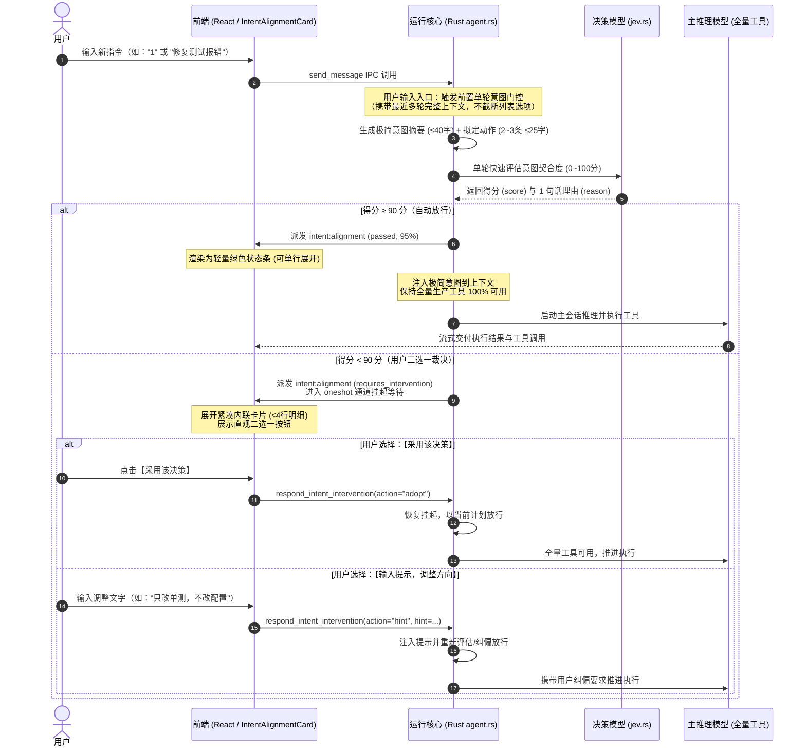
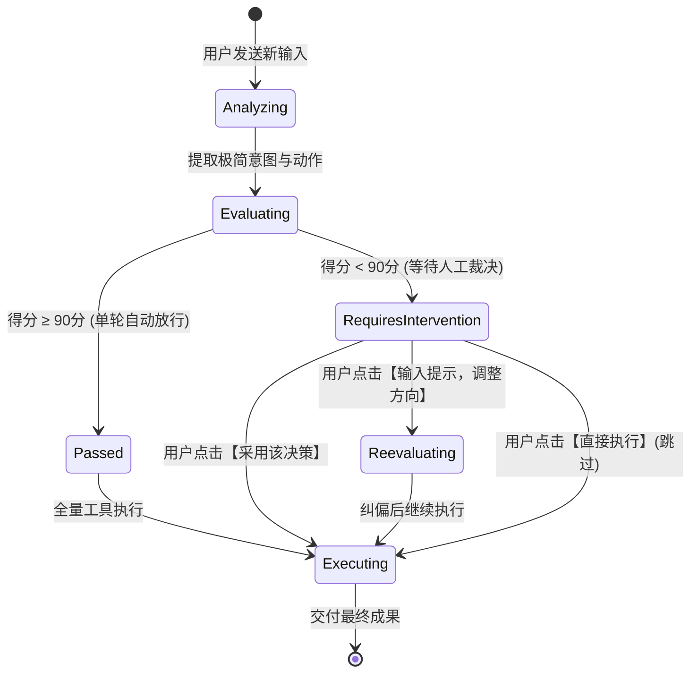

# 轻量化前置意图对齐与生产工具无锁化决策治理规范 (LIGHTWEIGHT_INTENT_ALIGNMENT_AND_SAFE_DECISION_WORKFLOW_SPEC)

| 属性 | 说明 |
| :--- | :--- |
| **文档代号** | `LIGHTWEIGHT_INTENT_ALIGNMENT_AND_SAFE_DECISION_WORKFLOW_SPEC` |
| **创建时间** | 2026-10-09 |
| **适用范围** | `harness_mini`（Tauri 2 + Rust + React 桌面 AI Agent 架构体系） |
| **关联核心模块** | [`src-tauri/src/agent.rs`](file:///f:/WorkSpace/Other/harness_mini/src-tauri/src/agent.rs), [`src-tauri/src/commands.rs`](file:///f:/WorkSpace/Other/harness_mini/src-tauri/src/commands.rs), [`src-tauri/src/jev.rs`](file:///f:/WorkSpace/Other/harness_mini/src-tauri/src/jev.rs), [`src/store.ts`](file:///f:/WorkSpace/Other/harness_mini/src/store.ts), [`src/types.ts`](file:///f:/WorkSpace/Other/harness_mini/src/types.ts), [`src/components/IntentAlignmentCard.tsx`](file:///f:/WorkSpace/Other/harness_mini/src/components/IntentAlignmentCard.tsx), [`src/components/ExecutionProcessBlock.tsx`](file:///f:/WorkSpace/Other/harness_mini/src/components/ExecutionProcessBlock.tsx) |
| **知识密级** | 核心架构升级与意图决策治理技术规范 |

---

## 目录

1. [背景与历史痛点复盘](#一背景与历史痛点复盘)
   - 1.1 [复杂准入卡片与多轮重试的认知负荷](#11-复杂准入卡片与多轮重试的认知负荷)
   - 1.2 [执行中阻断决策对长链路的干扰](#12-执行中阻断决策对长链路的干扰)
   - 1.3 [动态过滤/隐藏工具列表导致的致命死锁隐患](#13-动态过滤隐藏工具列表导致的致命死锁隐患)
2. [重构设计原则与极简架构](#二重构设计原则与极简架构)
   - 2.1 [四大核心精简原则](#21-四大核心精简原则)
   - 2.2 [端到端流转时序图](#22-端到端流转时序图)
   - 2.3 [极简状态流转模型](#23-极简状态流转模型)
3. [后端前置决策与工具无锁化实现](#三后端前置决策与工具无锁化实现)
   - 3.1 [严格单轮前置决策 (`run_intent_alignment_gate`)](#31-严格单轮前置决策-run_intent_alignment_gate)
   - 3.2 [极简规格约束（40 字意图 + 25 字动作）](#32-极简规格约束40-字意图--25-字动作)
   - 3.3 [生产工具 100% 全量暴露与死锁消除](#33-生产工具-100-全量暴露与死锁消除)
   - 3.4 [上下文保留与长列表防截断机制](#34-上下文保留与长列表防截断机制)
4. [前端轻量化交互与组件重构](#四前端轻量化交互与组件重构)
   - 4.1 [轻量内联卡片设计 (`IntentAlignmentCard`)](#41-轻量内联卡片设计-intentalignmentcard)
   - 4.2 [直观二选一裁决：【采用该决策】与【输入提示】](#42-直观二选一裁决采用该决策与输入提示)
   - 4.3 [执行折叠栏联动展开 (`ExecutionProcessBlock`)](#43-执行折叠栏联动展开-executionprocessblock)
5. [数据结构与 IPC 通信协议演进](#五数据结构与-ipc-通信协议演进)
   - 5.1 [干预响应协议扩充 (`adopt` 原语)](#51-干预响应协议扩充-adopt-原语)
   - 5.2 [Zustand 状态与单轮事件派发](#52-zustand-状态与单轮事件派发)
6. [质量基线与回归验证结论](#六质量基线与回归验证结论)

---

## 一、背景与历史痛点复盘

### 1.1 复杂准入卡片与多轮重试的认知负荷

在上一代“准入大卡片 + 内部双轮自愈重试”架构中，系统引入了较为厚重的审查流程：
1. **多轮重试带来额外等待时延**：打分小于 90 分时，系统在后台自动启动最多 2 轮反思和打分。用户经常需要等待 2~3 次模型完整往返，体验迟滞；
2. **大卡片信息过载**：前端卡片包含多轮 Tabs、全方位审阅意见、长篇意图剖析与分步计划。在日常高频对话中，用户往往只想快速推进，面对占据半个屏幕的“准入大卡片”产生严重的视觉疲劳与认知负担；
3. **难以快速做主**：用户在最后面对“采用决策 (1)”、“采用决策 (2)”和“输入提示”时，需要花大量精力对比两轮方案的微妙差异，违背了“辅助用户提效”的初衷。

### 1.2 执行中阻断决策对长链路的干扰

如果在 Agent 任务推进过程中，由模型将决策工具作为阻断性工具反复调用：
- 正常的任务拆解、多步骤工具调用（例如先读文件、再写代码、再跑测试）容易被工具决策多次打断挂起；
- 用户实际上最关心的是**“大模型有没有真正理解我发出的那条指令”**，即对“用户输入”前置对齐，而不是在执行某个写文件动作前再要求用户介入确认。

### 1.3 动态过滤/隐藏工具列表导致的致命死锁隐患

早期设计曾尝试在意图未核准前，通过动态过滤工具 Schema（`step_schemas`）隐藏写文件（`write_file`）、编辑（`edit_file`）、执行命令（`run_command`）等生产工具：
- **致命隐患**：一旦决策状态判定存在边缘分支漏网，或者模型未能以指定格式返回工具调用，系统可能在后续轮次中忘记放开工具列表；
- **死锁后果**：大模型即便做出了完美计划，却因工具列表被死锁而无法调用任何生产工具，陷入“只能反复输出文本解释、无法采取任何行动”的完全死锁不可用状态。

---

## 二、重构设计原则与极简架构

### 2.1 四大核心精简原则

| 原则 | 详细规范与执行标准 |
| :--- | :--- |
| **1. 取消准入大卡片，采用轻量内联条与单轮判断** | 废除多轮内部重试与多页签比对。决策模型严格进行**单轮快速打分**。$\ge 90$ 分时仅展示一行极窄的绿色状态条（`✓ 意图已对齐 (95%)`）；$<90$ 分时展示紧凑 4 行内联卡片。 |
| **2. 决策仅对“用户输入”前置决策** | 意图提炼与打分决策仅发生在用户发送新输入（`trigger_msg`）的入口处。对话执行阶段由大模型自主推进，不再作为阻断性工具打断执行流。 |
| **3. 决策内容极致简洁明了** | 强制限定提取规格为：**1 句话意图（$\le 40$ 字）** + **2~3 条关键动作（每条 $\le 25$ 字）**。方便用户 2 秒扫视理解，同时也便于决策模型稳定评估。 |
| **4. 生产工具 100% 全量暴露，杜绝死锁** | 彻底废除 `step_schemas` 动态裁剪。在整个会话执行生命周期内，所有生产工具永久可用，从架构上根除工具锁死隐患。 |

---

### 2.2 端到端流转时序图



---

### 2.3 极简状态流转模型



---

## 三、后端前置决策与工具无锁化实现

### 3.1 严格单轮前置决策 (`run_intent_alignment_gate`)

在 [`src-tauri/src/agent.rs`](file:///f:/WorkSpace/Other/harness_mini/src-tauri/src/agent.rs) 中，前置门控逻辑重构为单一线性管道：
1. 仅在接收到真实用户输入（`trigger_msg`）时触发；
2. 内部不再执行最多 2 轮的递归重试逻辑，仅执行单轮生成与打分；
3. 一旦打分 $\ge 90$，立即返回 `Some((understanding, plan))` 并注入到提示词中；
4. 打分 $< 90$ 时，创建 `intervention_id` 并挂起线程，等待前端提交裁决。

```rust
// src-tauri/src/agent.rs
let eval_instruction = "请简要评估上述提取的核心意图与动作是否精准契合用户需求。打分区间 0 到 100（以 0.0 到 1.0 表示）。若存在偏差或不明确，请在 reason 中用 1 句话指出具体原因。";
let rubric = vec![
    "90-100: 准确契合用户意图，动作方向明确可行".into(),
    "0-89: 存在歧义、理解偏差或关键动作遗漏".into(),
];
```

### 3.2 极简规格约束（40 字意图 + 25 字动作）

系统严格约束前置模型产出的 JSON 结构，避免生成冗长的长篇大论：

```rust
let parse_prompt = format!(
    "【历史背景】:\n{}\n\n\
    【用户最新输入】: {}\n\n\
    【输出约束】:\n\
    请提炼大模型对用户输入的理解与拟定行动，严格以 JSON 格式输出，内容必须极简明了：\n\
    {{\n  \
      \"understanding\": \"一句话概括用户真实意图与指代目标（不超过40字）\",\n  \
      \"plan\": [\"关键动作1（不超过25字）\", \"关键动作2（不超过25字）\"]\n\
    }}",
    context_block, user_message
);
```

提取函数 `parse_understanding_and_plan` 支持智能降级，当模型未按严格 JSON 返回时，自动将要点归纳为扁平带标号的精简清单。

### 3.3 生产工具 100% 全量暴露与死锁消除

在主 Agent 单步执行循环 `run_turn` 中，彻底移除了过去针对未核准状态的动态工具过滤逻辑：

```rust
// 改造前（存在死锁风险）：
// let step_schemas = if !sop_verified && should_run_intent_alignment {
//     schemas.iter().filter(|s| is_readonly_tool(&s.name)).cloned().collect()
// } else {
//     schemas.clone()
// };

// 改造后（彻底杜绝工具死锁）：
let step_schemas = schemas.clone();
```

所有生产工具（`write_file`, `edit_file`, `run_command` 等）在任何轮次均处于立即可用状态，即使决策逻辑出现边缘异常，主 Agent 也绝不会丢失执行能力。

### 3.4 上下文保留与长列表防截断机制

在 `format_recent_context_for_gate` 中，彻底废除了旧版的短字符截断（如 `.chars().take(400)`）：
- 上下文按 `- 角色: 内容` 的完整格式向后回溯拼接；
- 完整保留上一轮助手回复结尾给出的数字编号选项列表，彻底解决了用户输入简短“1”、“2”时，决策模型因看不到编号定义而误判“信息严重不足”的历史难题。

---

## 四、前端轻量化交互与组件重构

### 4.1 轻量内联卡片设计 (`IntentAlignmentCard`)

在 [`src/components/IntentAlignmentCard.tsx`](file:///f:/WorkSpace/Other/harness_mini/src/components/IntentAlignmentCard.tsx) 中，依据状态实施轻量化渲染：

1. **通过状态（Passed，$\ge 90$ 分）**：
   - 绿色极窄内联条（高度约 28px）；
   - 展示：`🛡️ 意图已对齐 95% | 用户核心意图摘要`；
   - 默认折叠，点击展开可查看 2~3 条动作；绝不喧宾夺主。
2. **待确认状态（Requires Intervention，$< 90$ 分）**：
   - 琥珀色紧凑卡片（整体高度不超过 120px）；
   - 仅显示 3 项内容：
     - `🎯 理解`: 1 句话核心目标；
     - `📋 动作`: 2~3 条要点；
     - `💡 提示`: 1 句话评估建议。

### 4.2 直观二选一裁决：【采用该决策】与【输入提示】

在待确认状态下，卡片底部提供两个视觉重量清晰的直观操作：

| 操作按键 | 视觉形态 | 触发动作与效果 |
| :--- | :--- | :--- |
| **【采用该决策】** | 翡翠绿高亮按钮（含勾选图标） | 触发 `respondIntentIntervention("adopt")`，立即采纳当前决策并放行执行。 |
| **【输入提示，调整方向】** | 琥珀金按钮（含灯泡图标） | 展开单行文本输入框，输入个性化要求（如“不要修改代码，只补充注释”）后提交重新评估。 |
| **【直接执行】（备用）** | 幽灵灰文字链接 | 极简化跳过门控通道，直接按原样执行。 |

### 4.3 执行折叠栏联动展开 (`ExecutionProcessBlock`)

在 [`src/components/ExecutionProcessBlock.tsx`](file:///f:/WorkSpace/Other/harness_mini/src/components/ExecutionProcessBlock.tsx) 中：
- 增加了对 `isRequiresIntervention` 的自动感知；
- 当检测到进入待人工确认状态时，执行折叠栏**自动展开**，确保用户无须手动点击就能立刻看到意图卡片并完成裁决。

---

## 五、数据结构与 IPC 通信协议演进

### 5.1 干预响应协议扩充 (`adopt` 原语)

IPC 通信命令 `respond_intent_intervention` 与后端通道 `IntentInterventionDecision` 升级支持统一的 `"adopt"` 原语：

```rust
// src-tauri/src/agent.rs
pub enum IntentInterventionDecision {
    Adopt,          // 统一采纳当前单轮决策
    AdoptPlan1,     // 兼容双轮旧模式
    AdoptPlan2,     // 兼容双轮旧模式
    Hint(String),   // 用户文字纠偏
    Skip,           // 跳过门控
}
```

### 5.2 Zustand 状态与单轮事件派发

在 [`src/store.ts`](file:///f:/WorkSpace/Other/harness_mini/src/store.ts) 中：
```typescript
respondIntentIntervention: (
  action: "adopt" | "adopt_plan_1" | "adopt_plan_2" | "hint" | "skip",
  hint?: string,
  interventionId?: string
) => Promise<void>;
```

---

## 六、质量基线与回归验证结论

本规范及相关代码重构已经过全量自动化回归验证：

1. **Rust 单元测试基线**：
   - 执行命令：`cargo test --lib -- --test-threads=1`
   - 结果：**147 项单元测试全部通过（0 失败，0 告警）**；
   - 覆盖长任务、指代上下文解析、门控自愈、CAS 文件快照、Token 统计等全部核心测试。
2. **前端类型与打包基线**：
   - 执行命令：`npx tsc --noEmit` 与 `npm run build`
   - 结果：**0 TypeScript 类型错误，生产包 7.00s 顺利完成 Vite 构建**。
3. **架构收敛总结**：
   - 取消了臃肿的准入卡片与无休止的多轮自愈循环，意图对齐轻量化、无感化；
   - 将决策精确限定在“用户输入”前置环节，保障了对话推进的连贯性；
   - 全量暴露生产工具，彻底终结了工具被意外锁死的历史顽疾。
