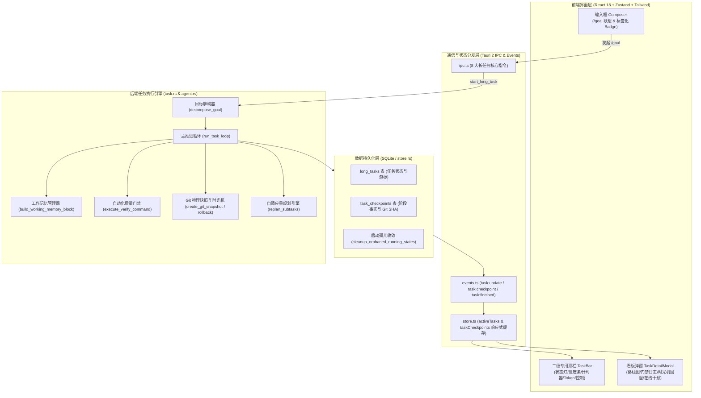
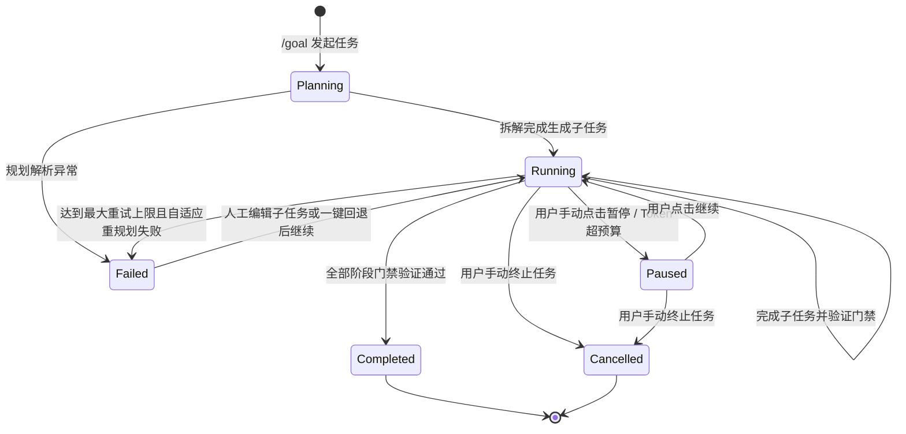

# AI Agent 长任务（Long-Running Autonomous Task）系统架构与实施规范
# Long-Running Autonomous Task Architecture & Execution Specification

本文档系统性梳理并总结 `harness_mini` 项目中 **长任务编排系统（Long-Running Task System）** 的全阶段演进脉络、业内方案对比、核心架构设计、持久化契约、编排引擎与状态机、自动化质量门禁、Git 真实物理时光机、在线交互干预以及前端指令标签化等规范。

---

## 目录
- [一、背景与核心痛点剖析](#一背景与核心痛点剖析)
- [二、业内顶尖长任务 Agent 机制调研](#二业内顶尖长任务-agent-机制调研)
- [三、架构设计与系统核心原则](#三架构设计与系统核心原则)
  - [1. 关键设计定调](#1-关键设计定调)
  - [2. 系统全景架构图](#2-系统全景架构图)
  - [3. 任务生命周期与状态机](#3-任务生命周期与状态机)
- [四、六大推进阶段实现细节与技术突破](#四六大推进阶段实现细节与技术突破)
  - [Phase 1: 核心调度骨架与数据持久化 (MVP)](#phase-1-核心调度骨架与数据持久化-mvp)
  - [Phase 2: 上下文压实与工作记忆沉淀 (Working Memory)](#phase-2-上下文压实与工作记忆沉淀-working-memory)
  - [Phase 3: 自动化质量门禁与闭环自愈 (Quality Gates)](#phase-3-自动化质量门禁与闭环自愈-quality-gates)
  - [Phase 4: Git 物理快照与时光机回退 (Rollback)](#phase-4-git-物理快照与时光机回退-rollback)
  - [Phase 5: 自适应重规划与在线人工干预 (Dynamic Steering)](#phase-5-自适应重规划与在线人工干预-dynamic-steering)
  - [Phase 6: 异常收敛、断点恢复与预算熔断 (Robustness & Guard)](#phase-6-异常收敛断点恢复与预算熔断-robustness--guard)
- [五、交互设计与输入框指令标签化演进](#五交互设计与输入框指令标签化演进)
  - [1. 专有二级顶栏 TaskBar](#1-专有二级顶栏-taskbar)
  - [2. 任务路线图与检查点看板 TaskDetailModal](#2-任务路线图与检查点看板-taskdetailmodal)
  - [3. 输入框交互演进：从常驻按钮到指令标签化 (Tag Badge)](#3-输入框交互演进从常驻按钮到指令标签化-tag-badge)
- [六、数据契约与接口定义](#六数据契约与接口定义)
  - [1. SQLite 数据库表结构](#1-sqlite-数据库表结构)
  - [2. Rust 模型与 TypeScript 类型](#2-rust-模型与-typescript-类型)
  - [3. Tauri IPC 命令与事件通道](#3-tauri-ipc-命令与事件通道)
- [七、工程验证与质量保障](#七工程验证与质量保障)

---

## 一、背景与核心痛点剖析

在传统的单会话 AI 编码对话中，Agent 通常采用“单次提问 - 单次响应”或者仅在局部上下文中进行多轮交互。面对大型需求、跨系统重构、多模块协同或需要经历长耗时的工程任务时，暴露出多项致命缺陷：

1. **上下文膨胀与长程遗忘（Context Bloat & Goal Drift）**：
   - 随交互轮次递增，Prompt 迅速逼近模型上下文窗口极限；
   - 历史中充斥着大量的工具调用中间日志、临时分析排错碎片，导致模型遗忘最初的总目标（Goal），在推进到第 4、5 步时发生目标漂移或推翻前序成果。
2. **缺乏代码级的确定性可逆机制（No Code Reversibility）**：
   - Agent 在长程任务中若在某一步产生错误方向或写坏核心依赖，传统的撤销只能依赖文本级逆向，难以完整恢复文件目录树状态，造成代码库污染，试错成本极大。
3. **缺乏质量验收的自动化闭环（Quality Blindspot）**：
   - 阶段性任务是否真正“完成”，以往全凭模型自述或人工肉眼排查；
   - 缺少由底层执行真实命令（如 `cargo check`, `npm test` 等）自动检验 Exit Code 并捕获 Stderr 的自动化质量门禁机制。
4. **中断与崩溃后的不可续期性（No Crash Recovery）**：
   - 长耗时任务易受网络波动、用户主动退出应用或系统异常重启影响；
   - 缺少持久化断点快照时，一旦中断必须从零重新开始，沉没成本高昂。

为解决上述痛点，`harness_mini` 设计并实现了面向生产环境的 **长任务自主推进编排系统（Long-Running Autonomous Task System）**。

---

## 二、业内顶尖长任务 Agent 机制调研

在架构设计阶段，系统全面调研并借鉴了业内领先工具的工程实践：

| 标杆工具 | 核心机制 | 状态与推进模式 | 检查点与可逆性 | 对本项目的架构启发 |
| :--- | :--- | :--- | :--- | :--- |
| **Cognition Devin** | 侧边栏 Playbook + 多环境执行沙箱 | 分步清单驱动，支持自动展开、重试与失败暂停 | 底层自动触发 Git Commit 与沙箱 Snapshot | **步骤分解可视化**、自动 Commit 与进度条分层设计。 |
| **Claude Code** | `/plan` + Plan Mode 权限硬拦截 | 规划期只读探索，确认后进入 Act Mode 自主推进 | 文件 diff 级别 Hunk Revert | **指令驱动**，通过 `/goal` 明确区分常规对话与长自主任务。 |
| **Google Antigravity** | Planning Mode + Artifacts 沉淀 | Research ➔ Plan ➔ Approval ➔ Loop Execute | 通过 Markdown 报告及版本控制实现任务阶段归档 | **Working Memory 机制**：将历史阶段归纳为结构化事实块注入。 |
| **Cursor Agent** | 任务执行流水线 + 命令行门禁 | 连续多轮工具调用，遇到报错时注入最新 Terminal 报错自愈 | 本地 Local History 与 Git 状态对照 | **质量门禁（Quality Gate）**：把执行命令退出码作为步进硬指标。 |

---

## 三、架构设计与系统核心原则

### 1. 关键设计定调

在方案确认阶段，根据业务场景确立了三条核心设计铁律：

1. **子任务隔离性原则（不直接引用现有协作者）**：
   - 长任务在独立的 Task 上下文中流转，**不直接复用当前对话已建立的主从协作者或子 Agent**；
   - *原因*：长任务需要高度确定性的线性状态机与纯净记忆栈，若强行调度外部协作者，会产生上下文交叉污染、角色职能混淆以及并发等待死锁。
2. **界面专有展示原则（独立专有二级顶栏 TaskBar）**：
   - 任务状态、指标与操作按钮**不挤入现有全局顶栏**，而是在其正下方滑出专用的 `TaskBar`；
   - *原因*：现有顶栏承担工作区路径、会话切换、项目属性与全局状态，若将长任务目标、进度条、计时器、Tokens 统计、暂停/继续/终止操作塞入，将导致界面极度拥挤并破坏视觉层级。
3. **输入触发轻量原则（指令驱动与标签化展示）**：
   - 摒弃输入框左侧占位的常驻切换按钮，采用 `/goal` 与 `/task` 原生斜杠指令；
   - 选定或输入指令后，在输入框首部直接呈现为交互式紫色标签 Badge（`[🎯 /goal ✕]`），标签可视可删，删除标签即自动退出长任务模式。

### 2. 系统全景架构图



### 3. 任务生命周期与状态机

长任务采用确定性单向/可逆状态机驱动：



---

## 四、六大推进阶段实现细节与技术突破

### Phase 1: 核心调度骨架与数据持久化 (MVP)
- **数据落地**：在 SQLite 中构建 `long_tasks` 与 `task_checkpoints` 两张核心表，严格建立外键级联与索引。
- **目标解构（`decompose_goal`）**：后台自动调用模型将总目标科学拆解为 3~5 个边界清晰、可量化验证的阶段子任务（`TaskSubItem`），注入唯一 ID 与序号。
- **异步调度控制**：使用 Tokio `watch::channel` 建立进程内非阻塞控制总线，支持无延迟响应用户的【暂停】与【终止】信号。

### Phase 2: 上下文压实与工作记忆沉淀 (Working Memory)
- **工作记忆块设计**：各子阶段推进完毕后，模型提炼出精炼的事实性摘要（`summary`），写入检查点表。
- **上下文拼接器（`build_working_memory_block`）**：在拉起后续子阶段时，**不再灌入前几轮全部的原始对话和工具调用细节**，而是组装紧凑的记忆块：
  ```markdown
  【总目标锚点】: <User Goal>
  【已完成历史阶段检查点与沉淀事实 (Working Memory)】:
  - 阶段 #1: 结论摘要 -> 数据库表结构与索引创建完成，迁移脚本通过
  - 阶段 #2: 结论摘要 -> 后端 CRUD 接口编写完毕并导出
  ⚠️ 请基于上述已完成成果继续推进，严禁无故推翻或重复已完成修改！
  ```
- **核心价值**：从根本上阻断上下文爆炸，彻底杜绝多阶段执行过程中的目标漂移。

### Phase 3: 自动化质量门禁与闭环自愈 (Quality Gates)
- **命令级硬性检验**：每个子任务支持绑定 `verify_command`（例如 `cargo check --target-dir ./target_tmp` 或 `npm run build`）。
- **进程输出捕获（`execute_verify_command`）**：
  - Windows 环境适配 `cmd /C` 与 `CREATE_NO_WINDOW`（`0x08000000`）；
  - 捕获子进程 Exit Code、Stdout 与 Stderr。
- **失败闭环反馈**：若命令 Exit Code 非 0，引擎拦截子任务完成判定，自动将标准错误日志组装成纠错反馈注入当前会话，触发 Agent 针对编译/测试报错开展自愈修复。

### Phase 4: Git 物理快照与时光机回退 (Rollback)
- **自动物理快照（`create_git_snapshot`）**：若工作区处于 Git 仓库管控下，每成功完成一个阶段，引擎自动执行 `git add -A` 并提交包含任务编号的特定 commit：`checkpoint: task_{task_id}_step_{step_num}`，将生成的 Commit SHA 固化至检查点。
- **时光机回退引擎（`rollback_to_checkpoint`）**：
  - 用户在看板点击历史检查点的【回退】后，引擎自动挂起正在运行的任务；
  - 触发物理硬重置：`git reset --hard <sha>`，瞬间撤销后续所有文件误改；
  - 自动将任务游标回退至该检查点所在步数，清理作废检查点，后续步骤重置为 `pending`，实现可重复推演。

### Phase 5: 自适应重规划与在线人工干预 (Dynamic Steering)
- **动态重规划（`replan_subtasks`）**：当某个子阶段重试耗尽、外部环境剧烈变更或遇到不可抗力时，自动将已完成事实、当前卡点与剩余目标汇总请求模型，重组后续尚未执行的子任务清单。
- **在线人工微调（`update_task_subtasks`）**：
  - 用户在长任务暂停或等待中时，可直接在看板对待执行步骤点击**编辑标题/描述/门禁命令**；
  - 支持删除不必要的子任务，或在末尾点击【添加子任务】插入人工自定义阶段。

### Phase 6: 异常收敛、断点恢复与预算熔断 (Robustness & Guard)
- **孤儿任务收敛（`cleanup_orphaned_running_states`）**：应用启动或退出时，若发现 SQLite 中存在处于 `running` 或 `planning` 的任务，自动批量更新为 `paused`，避免重启后遗留不可控运行假象。
- **断点恢复（Resume）**：重启应用或切换回会话后，`TaskBar` 实时侦测活跃任务，高亮呈现【继续】按钮，一键无缝唤醒主循环并续跑。
- **预算熔断守卫（Budget Guard）**：实时累计各阶段消耗的 `total_tokens_used` 与执行步数 `current_step`；一旦超过预设预算上限（`max_budget_tokens` / `max_steps`），立即自动安全挂起并通知用户，杜绝死循环和费用失控。

---

## 五、交互设计与输入框指令标签化演进

长任务体系在前端构建了极简、直观且层次分明的界面体系：

### 1. 专有二级顶栏 TaskBar
- **挂载位置**：位于会话 `TopBar` 正下方，固定高度 40px，支持顶部滑入动效。
- **模块布局**：
  1. **状态指示区**：规划拆解中（金光脉冲）、自主推进中（紫色旋转）、已暂停（琥珀黄）、任务已达成（翡翠绿）、执行遇阻（警示红）；
  2. **任务与阶段标签**：总目标截短展示与当前执行中子步骤 `[2/4] 编写前端组件与类型`；
  3. **紧凑型渐变进度条**：百分比实时动画变化；
  4. **指标统计区**：累计执行耗时（分:秒）与 Token 消耗徽章；
  5. **操作控制组**：【暂停 / 继续】、【终止】、【任务看板】一键展开。

### 2. 任务路线图与检查点看板 TaskDetailModal
- **总目标面板**：大字号展现完整目标，配合渐变宏观进度条。
- **子任务卡片列表**：
  - 勾选状态（已完成、进行中、异常、等待中）；
  - 验收结论 Markdown 渲染展示；
  - 质量门禁徽章（如 `cargo check`）与可折叠的控制台输出日志（Exit Code / stdout / stderr）；
  - 待执行阶段支持直接点击笔头编辑、垃圾桶删除或下方追加新阶段。
- **时光机检查点列表**：
  - 展现 Step 编号、结论摘要、完成时间戳与 Git SHA 徽章；
  - 每个快照右侧提供【回退】按钮，点击二次确认后一键物理还原代码。

### 3. 输入框交互演进：从常驻按钮到指令标签化 (Tag Badge)

为避免常驻按钮对对话框界面的视觉污染，系统完成了一次核心交互升级：

```
[常驻按钮时代 (已废弃)]
[📎 附件] [🎯 长任务] [ 输入消息...                             ] [发送]

⬇ 升级为 ⬇

[原生指令标签化 (当前落地方案)]
1. 用户在空输入框中输入 "/" ➔ 弹出联想菜单，选中 "/goal"
2. 输入框内原文字瞬间转换为微光紫色交互标签，光标自动后置
3. 用户仅需直接输入目标内容

[📎 附件]  【 🎯 /goal ✕ 】 [ 输入长任务总目标...                ] [⬆ 发送]
```

- **删除即取消**：
  - 用户可直接点击标签内部的 `✕` 按钮关闭标签；
  - 若输入框内无文字（或光标处于最前），按下键盘 `Backspace`（退格键）亦会自动清除标签，优雅退回普通对话。
- **智能防呆**：若未输入任何目标直接回车，系统不会发出空指令，而是自动保留标签并提示输入目标。

---

## 六、数据契约与接口定义

### 1. SQLite 数据库表结构

```sql
-- 长任务主表
CREATE TABLE IF NOT EXISTS long_tasks (
  id TEXT PRIMARY KEY,
  session_id TEXT NOT NULL REFERENCES sessions(id) ON DELETE CASCADE,
  workspace_path TEXT NOT NULL,
  goal TEXT NOT NULL,
  status TEXT NOT NULL,
  current_subtask_index INTEGER NOT NULL DEFAULT 0,
  subtasks_json TEXT NOT NULL DEFAULT '[]',
  max_budget_tokens INTEGER,
  total_tokens_used INTEGER NOT NULL DEFAULT 0,
  current_step INTEGER NOT NULL DEFAULT 0,
  max_steps INTEGER NOT NULL DEFAULT 50,
  created_at TEXT NOT NULL,
  updated_at TEXT NOT NULL
);
CREATE INDEX IF NOT EXISTS idx_long_tasks_session ON long_tasks(session_id, status);

-- 任务检查点表
CREATE TABLE IF NOT EXISTS task_checkpoints (
  id TEXT PRIMARY KEY,
  task_id TEXT NOT NULL REFERENCES long_tasks(id) ON DELETE CASCADE,
  step_number INTEGER NOT NULL,
  subtask_id TEXT,
  status TEXT NOT NULL,
  summary TEXT NOT NULL,
  working_memory TEXT NOT NULL,
  git_commit_hash TEXT,
  created_at TEXT NOT NULL
);
CREATE INDEX IF NOT EXISTS idx_task_checkpoints_task ON task_checkpoints(task_id, step_number);
```

### 2. Rust 模型与 TypeScript 类型

```rust
// src-tauri/src/models.rs
pub struct TaskSubItem {
    pub id: String,
    pub index: usize,
    pub title: String,
    pub description: Option<String>,
    pub status: String,
    pub summary: Option<String>,
    pub error: Option<String>,
    pub verify_command: Option<String>,
    pub verify_output: Option<String>,
}

pub struct LongTask {
    pub id: String,
    pub session_id: String,
    pub workspace_path: String,
    pub goal: String,
    pub status: String,
    pub current_subtask_index: usize,
    pub subtasks: Vec<TaskSubItem>,
    pub max_budget_tokens: Option<u64>,
    pub total_tokens_used: u64,
    pub current_step: usize,
    pub max_steps: usize,
    pub created_at: String,
    pub updated_at: String,
}

pub struct TaskCheckpoint {
    pub id: String,
    pub task_id: String,
    pub step_number: usize,
    pub subtask_id: Option<String>,
    pub status: String,
    pub summary: String,
    pub working_memory: String,
    pub git_commit_hash: Option<String>,
    pub created_at: String,
}
```

```typescript
// src/types.ts
export type LongTaskStatus =
  | "planning"
  | "running"
  | "paused"
  | "waiting_approval"
  | "completed"
  | "failed"
  | "cancelled";

export interface TaskSubItem {
  id: string;
  index: number;
  title: string;
  description?: string | null;
  status: "pending" | "in_progress" | "verifying" | "completed" | "failed" | "skipped" | string;
  summary?: string | null;
  error?: string | null;
  verifyCommand?: string | null;
  verifyOutput?: string | null;
}

export interface LongTask {
  id: string;
  sessionId: string;
  workspacePath: string;
  goal: string;
  status: LongTaskStatus;
  currentSubtaskIndex: number;
  subtasks: TaskSubItem[];
  maxBudgetTokens?: number | null;
  totalTokensUsed: number;
  currentStep: number;
  maxSteps: number;
  createdAt: string;
  updatedAt: string;
}

export interface TaskCheckpoint {
  id: string;
  taskId: string;
  stepNumber: number;
  subtaskId?: string | null;
  status: string;
  summary: string;
  workingMemory: string;
  gitCommitHash?: string | null;
  createdAt: string;
}
```

### 3. Tauri IPC 命令与事件通道

| 命令标识 (Tauri Command) | 入参要求 | 响应结构 | 功能职责 |
| :--- | :--- | :--- | :--- |
| `start_long_task` | `sessionId, goal, maxBudgetTokens` | `LongTask` | 发起长任务，拆解子任务并启动后台推进协程 |
| `pause_long_task` | `taskId` | `void` | 异步挂起长任务推进并广播状态 |
| `resume_long_task` | `taskId` | `LongTask` | 唤醒挂起长任务并继续下一阶段 |
| `cancel_long_task` | `taskId` | `void` | 终止长任务流转，标记状态为 cancelled |
| `get_active_task` | `sessionId` | `LongTask \| null` | 获取当前会话下未结束的长任务 |
| `list_task_checkpoints` | `taskId` | `TaskCheckpoint[]` | 获取任务全量持久化检查点历史 |
| `rollback_to_checkpoint`| `checkpointId` | `LongTask` | **时光机回退**：执行 Git 物理重置并回退任务状态 |
| `update_task_subtasks` | `taskId, subtasks` | `LongTask` | **在线干预**：保存用户微调后的子任务清单 |

- **全局广播事件通道**：
  - `task:update`：推送任务整体或单个子步骤的状态/游标变化；
  - `task:checkpoint`：推送新阶段达成时生成的物理快照数据；
  - `task:finished`：推送任务圆满完成或最终取消通知。

---

## 七、工程验证与质量保障

长任务系统全量实现均经过严格的工程编译与运行时逻辑校验：

1. **Rust 后端架构验证 (`cargo check`)**：
   - 覆盖 Tokio 管道通信、Git 命令封装、异步进程管理与 8 个 Tauri IPC 接口；
   - 验证结果：`Finished dev profile target(s)`，**0 错误，0 警告，退出码 0**。
2. **前端类型系统与生产构建验证 (`npm run build`)**：
   - 覆盖 TypeScript 严格模式类型校验与 Vite 生产级压缩打包；
   - 验证结果：`✓ built in 5.96s`，**0 错误，退出码 0**。
3. **关键边界场景防护**：
   - **非 Git 仓库兼容**：当用户工作区未初始化 Git 时，`create_git_snapshot` 静默跳过提交但保留工作记忆摘要，不会阻断推进流程；
   - **孤儿任务自愈**：应用意外强制杀死后重新启动，数据库中状态为 `running` 的残留长任务会自动平滑修正为 `paused`，用户打开即可无损继续。

---

> 💡 **归档与维护说明**：本文档作为 `harness_mini` 长任务系统的权威工程规范。后续针对多模型协同长任务（Collaborative Long Tasks）或云端远程工作区长任务的扩展均需遵循本规范定义的状态机流转与可逆性原则。
