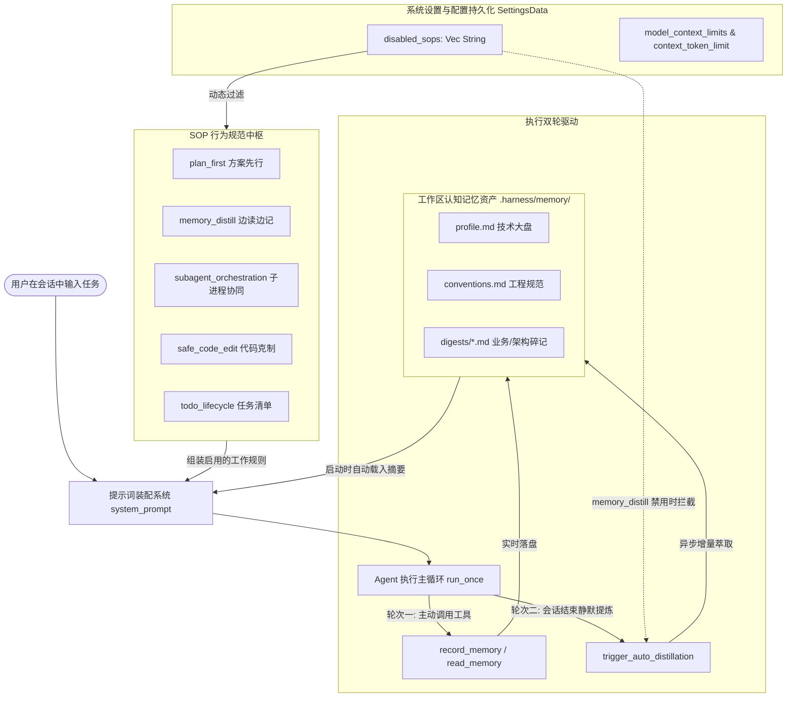
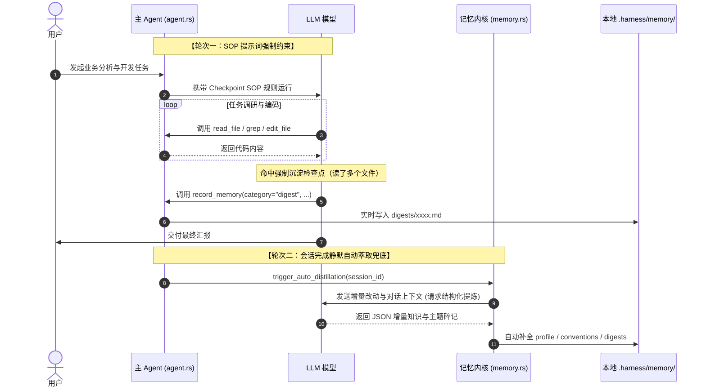

# 边读边记认知记忆沉淀与系统级 Agent SOP 动态治理规范
# Continuous Memory Distillation & System SOP Governance Specification

本文档全面梳理与总结本次技术迭代的全部核心内容，包括：**子进程大文件输出截断排查与上下文层级治理**、**边读边记与认知沉淀记忆系统（.harness/memory/）**、**主题碎记未生成问题复盘与双轮驱动自动化提炼**、**系统级 Agent SOP 规范体系与动态开关治理**，以及 **前端设置界面抗挤压弹性布局加固**。

---

## 目录
- [一、背景与核心痛点分析](#一背景与核心痛点分析)
- [二、问题复盘与排查解决过程（Troubleshooting）](#二问题复盘与排查解决过程troubleshooting)
  - [1. 子进程日志分析与输出截断问题](#1-子进程日志分析与输出截断问题)
  - [2. 对话后主题碎记（digests）未生成问题](#2-对话后主题碎记digests未生成问题)
  - [3. 设置弹窗「已启用」统计徽标被挤压变形问题](#3-设置弹窗已启用统计徽标被挤压变形问题)
- [三、架构全景图：认知记忆与 SOP 治理双轮驱动](#三架构全景图认知记忆与-sop-治理双轮驱动)
- [四、子进程协作与上下文分层控制体系](#四子进程协作与上下文分层控制体系)
  - [1. 四级上下文上限解析机制](#1-四级上下文上限解析机制)
  - [2. 会话级专属上下文 Token 覆盖](#2-会话级专属上下文-token-覆盖)
  - [3. 前端模型规格微调与弹窗交互](#3-前端模型规格微调与弹窗交互)
- [五、边读边记与认知记忆沉淀引擎（.harness/memory/）](#五边读边记与认知记忆沉淀引擎harnessmemory)
  - [1. 目录结构与资产类型划分](#1-目录结构与资产类型划分)
  - [2. 底层工具链路：record_memory 与 read_memory](#2-底层工具链路record_memory-与-read_memory)
  - [3. 运行时秒级召回与 Prompt 动态注入](#3-运行时秒级召回与-prompt-动态注入)
  - [4. 记忆生命周期衰减与修剪算法（Decay & Pruning）](#4-记忆生命周期衰减与修剪算法decay--pruning)
- [六、双轮驱动：主题碎记自动化生成保障](#六双轮驱动主题碎记自动化生成保障)
  - [1. 轮次一：提示词 SOP 强制沉淀检查点（Checkpoint SOP）](#1-轮次一提示词-sop-强制沉淀检查点checkpoint-sop)
  - [2. 轮次二：会话完成后的异步静默萃取引擎（Auto-Distillation）](#2-轮次二会话完成后的异步静默萃取引擎auto-distillation)
- [七、系统级 Agent SOP 规范体系与动态开关治理](#七系统级-agent-sop-规范体系与动态开关治理)
  - [1. 体系界定：项目级自动化验证 SOP vs 系统级行为准则 SOP](#1-体系界定项目级自动化验证-sop-vs-系统级行为准则-sop)
  - [2. 五大标准作业程序（SOP）规范定义](#2-五大标准作业程序sop规范定义)
  - [3. 数据持久化与后端动态提示词装配](#3-数据持久化与后端动态提示词装配)
  - [4. 后台自动提炼与 SOP 状态联动控制](#4-后台自动提炼与-sop-状态联动控制)
- [八、前端交互落地与抗挤压弹性布局加固](#八前端交互落地与抗挤压弹性布局加固)
  - [1. 「设置 -> Agent SOP」交互面板设计](#1-设置---agent-sop交互面板设计)
  - [2. 头部统计区域防挤压加固实现](#2-头部统计区域防挤压加固实现)
- [九、测试体系与工程验证](#九测试体系与工程验证)

---

## 一、背景与核心痛点分析

在早期的 AI Agent 开发与多轮编程过程中，随着任务复杂度提升与上下文增长，暴露了以下核心痛点：

1. **子进程截断与上下文失真**：
   - 当派生子 Agent 处理大型模块调研、读取多个上千行文件时，由于缺少对各模型窗口上限的精细化控制，上下文在滑动压缩时产生非预期截断，甚至丢失关键工具返回，导致子进程任务无法闭环。
2. **“读完即忘”，无法沉淀项目知识资产**：
   - 开发者反复提问“当前项目采用了什么技术栈”、“工程规范有哪些”，Agent 每次都需要重新全量调用文件工具扫描代码，耗时费 Token，无法做到“秒级即时回答”；
   - 任务探索阶段总结的核心排错链路、架构事实未随任务落盘，后续新会话无法复用。
3. **模型惰性导致碎记缺失**：
   - 即使提供了记忆记录工具，模型在多步执行完成后倾向于直接向用户输出纯文本报告，导致主题碎记（digests）无法实际固化到工作区。
4. **硬编码规则与用户自由度的冲突**：
   - 方案先行、边读边记、子进程拆解等规范是保证交付质量的有效约束，但在快速试验或紧急热修复场景下，硬性约束会增加交互轮次。缺少统一的控制中枢让用户按需开启或关闭各项 SOP。

---

## 二、问题复盘与排查解决过程（Troubleshooting）

### 1. 子进程日志分析与输出截断问题

#### 现象
项目根目录下 `主进程与子进程的调试日志.txt` 记录表明：子进程在收集多步信息、并发读取或处理大量文件内容时，模型返回内容或工具调用输出出现不可逆的截断与丢失。

#### 根本原因剖析
1. **全局上下文硬编码无法适配多元模型**：不同模型（如 DeepSeek 64K、Claude 200K、本地模型 8K/32K）的安全窗口阈值差异巨大。全局单一的 `contextTokenLimit` 导致小窗口模型频频撑爆，大窗口模型过早被强制压缩。
2. **活跃轮次（Active Turn）压缩策略过激**：在多步执行过程中，未对当前轮次中正在使用的工具结果与前序历史工具结果进行有效隔离，压缩过程误伤了子进程的关键分析数据。
3. **缺乏会话级独立调优**：主进程与专职调研的子进程共享相同的 token 上限，而子进程任务更加专注且吞吐量大，急需独立的上下文配置。

#### 解决措施
- **多层级上下文解析模型**：在后端 [`src-tauri/src/models.rs`](file:///d:/WorkSpace/Other/harness_mini/src-tauri/src/models.rs) 与前端 [`src/types.ts`](file:///d:/WorkSpace/Other/harness_mini/src/types.ts) 实现四级优先级继承体系（`provider:model` 专属精准配置 -> 同名全局配置 -> 模型名关键字启发式推断 -> 全局保底配置）；
- **会话专属上下文上限（`Session.context_token_limit`）**：支持单个会话在顶栏直接设定专属 Token 阈值，专职子进程可灵活调大上限；
- **前端模型规格微调弹窗**：新增 [`src/components/ModelContextModal.tsx`](file:///d:/WorkSpace/Other/harness_mini/src/components/ModelContextModal.tsx)，提供主流模型预设阈值一键应用与手动滑块微调。

---

### 2. 对话后主题碎记（digests）未生成问题

#### 现象
实现了长期记忆系统与 `record_memory` 工具后，用户在完整执行对话任务后检查 `.harness/memory/digests/` 目录，发现并没有生成任何碎记文件。

#### 根本原因剖析
1. **模型工具调用自主性衰减（模型惰性）**：
   大语言模型在多步执行后，随着上下文增大与推理接近尾声，天然倾向于尽快生成最终文字答复用户，忽略了“在输出回复前调用 `record_memory`”的提示；
2. **缺乏流程兜底（Fallback Guard）**：
   原系统仅依赖模型在主循环内自主调用工具。一旦模型在某一步跳过了调用，并在下一轮直接给出最终回复，该次会话的所有沉淀就会随会话结束而永久流失。

#### 解决措施（双轮驱动机制）
- **轮次一（强化约束）**：在 System Prompt 中设立 **强制沉淀检查点（Mandatory Checkpoint）**，规定只要阅读 2 个以上文件或深入排错，必须在最终文字回复前至少调用一次 `record_memory`，且优先沉淀碎记；
- **轮次二（后台兜底）**：在 [`src-tauri/src/agent.rs`](file:///d:/WorkSpace/Other/harness_mini/src-tauri/src/agent.rs) 的执行主循环末尾，挂载异步无感提炼钩子 [`trigger_auto_distillation`](file:///d:/WorkSpace/Other/harness_mini/src-tauri/src/memory.rs)。当主会话正常结束且用户未关闭该规范时，自动派发轻量 LLM 提炼任务，自动将本次探索萃取为结构化知识落盘。

---

### 3. 设置弹窗「已启用」统计徽标被挤压变形问题

#### 现象
在程序设置弹窗中，新增的「Agent SOP」及原有的「Agent 工具」面板顶部，当左侧说明文本长度较长时，右侧的 `已启用 5 / 5` 统计徽标被挤压换行，字符被纵向拆分，界面出现变形。

#### 根本原因剖析
1. **Flex 容器未声明对齐间距与收缩保护**：容器使用 `flex items-center justify-between`，未设置 `gap` 与 `items-start`；
2. **左侧说明文本未约束边界**：左侧 `div` 未声明 `flex-1 min-w-0` 与最大宽度，在渲染多行文本时长文本横向拉伸撑满空间；
3. **右侧统计区域缺少 `shrink-0`**：Flex 容器发生空间竞争时，默认允许子项收缩（`flex-shrink: 1`），且内部 `span` 未设置 `whitespace-nowrap`，直接导致文字拆行。

#### 解决措施
- 容器改为 `flex items-start justify-between gap-4 mb-3`；
- 左侧增加 `flex-1 min-w-0 max-w-[520px]`，文本设置 `leading-relaxed` 实现优雅折行；
- 右侧增加 `shrink-0 pt-0.5`，徽标文字增加 `whitespace-nowrap font-medium` 并包裹 `bg-panel3 px-2 py-0.5 rounded-md border border-edge/60` 胶囊框，彻底免疫挤压。

---

## 三、架构全景图：认知记忆与 SOP 治理双轮驱动



---

## 四、子进程协作与上下文分层控制体系

### 1. 四级上下文上限解析机制

为彻底杜绝不同厂商大模型因窗口容量差异导致截断报错，设计并实现了以下四级上下文安全上限解析逻辑：

| 优先级 | 作用范围 | 配置源 | 典型示例 |
| :--- | :--- | :--- | :--- |
| **P1（最高）** | 指定厂商下的指定模型 | `Settings.modelContextLimits["<providerId>:<model>"]` | 针对特定本地 Ollama 实例精细指定 `32,000` |
| **P2** | 全局同名模型配置 | `Settings.modelContextLimits["<model>"]` | 全局只要模型名为 `gpt-4o` 即采用 `110,000` |
| **P3** | 模型名称启发式预设 | `inferModelContextLimit(model)` | 名称包含 `deepseek` 预设 `56,000`，`claude` 预设 `180,000` |
| **P4（保底）** | 全局未识别模型保底 | `Settings.contextTokenLimit` | 默认 `64,000`，可在设置页面调节 |

### 2. 会话级专属上下文 Token 覆盖

- 在数据表 `sessions` 中新增持久化字段 `context_token_limit INTEGER`；
- 在会话启动、派生子 Agent 或执行每一步任务时，以 `session.context_token_limit` 为第一优先级，若未设置则自动回退至全局模型解析阈值；
- 专职子进程在派生时（如架构拆解调研、日志全量挖掘）可分配更大窗口，保证长文本不被早期截断。

### 3. 前端模型规格微调与弹窗交互

- 新增组件 [`src/components/ModelContextModal.tsx`](file:///d:/WorkSpace/Other/harness_mini/src/components/ModelContextModal.tsx)；
- 点击顶栏模型徽标或设置页模型标签，即可弹出配置界面；
- 内置主流模型规格矩阵（主流云端、国内厂商、超长上下文、本地模型）支持一键填充，并配备滑块自由微调。

---

## 五、边读边记与认知记忆沉淀引擎（.harness/memory/）

系统在工作区根目录下自动维护 `.harness/memory/` 专用目录，无需常驻 Python 进程或重型向量数据库，实现极致轻量、随代码版本管理与秒级直接召回。

### 1. 目录结构与资产类型划分

```text
<工作区根目录>/
  └── .harness/
      └── memory/
          ├── profile.md        # [技术大盘] 编程语言、框架体系、构建工具、核心依赖
          ├── conventions.md    # [工程规范] 代码风格、分支规范、架构避坑约定
          └── digests/          # [主题碎记] 业务模块深度分析、调用链路、复杂排错记录
              ├── auth_jwt_flow.md
              ├── payment_callback_retry.md
              └── ...
```

### 2. 底层工具链路：`record_memory` 与 `read_memory`

在 [`src-tauri/src/tools.rs`](file:///d:/WorkSpace/Other/harness_mini/src-tauri/src/tools.rs) 与 [`src-tauri/src/memory.rs`](file:///d:/WorkSpace/Other/harness_mini/src-tauri/src/memory.rs) 中实现了系统内置的记忆交互工具：

- **`record_memory`**：
  - `category`: `"profile"` | `"convention"` | `"digest"`
  - `title`: 碎记主题或模块标题
  - `content`: Markdown 格式核心事实
  - `importance`: 重要性评分（`1 ~ 5`，默认为 `3`）
  - 写入逻辑：`profile` 与 `conventions` 采用增量去重合并，`digest` 生成独立主题 Markdown 文件。
- **`read_memory`**：
  - `query`: 检索关键字或主题
  - `category`: 指定检索分类（可选）
  - 支持全文语义快速匹配并返回记忆详情与相关上下文。

### 3. 运行时秒级召回与 Prompt 动态注入

在每次模型交互前，`memory.rs::load_workspace_memory_context` 自动扫描当前工作区的 `profile.md`、`conventions.md` 与全部 `digests/*.md` 文件：
- 将技术大盘、工程规范全文以及碎记主题列表直接注入 System Prompt 下方；
- 当用户询问“本项目用了哪些技术”、“有什么开发规范”时，模型直接基于已注入的高信噪比资产作答，实现**零多余工具调用的秒级直接回答**。

### 4. 记忆生命周期衰减与修剪算法（Decay & Pruning）

为了防止项目随使用时间推移产生记忆冗余与过期噪音，设计了自然衰减机制：
- 每个碎记文件维护元数据头（`importance`, `last_accessed_at`, `access_count`）；
- 综合活跃度计算公式：
  $$\text{Score} = \text{Importance} \times 0.5 + \ln(1 + \text{AccessCount}) \times 0.3 - \frac{\Delta t_{\text{days}}}{30} \times 0.2$$
- 当碎记总数超过上限（默认 50 篇）且评分低于阈值时，自动归档并精简，保持高频核心知识的纯净度。

---

## 六、双轮驱动：主题碎记自动化生成保障

针对用户反馈的“对话完成后未见 digests 生成”问题，实施了**双轮驱动保障机制**：



### 1. 轮次一：提示词 SOP 强制沉淀检查点（Checkpoint SOP）
在系统提示词规则中强制声明：
> “凡是在当前任务中阅读了 2 个以上文件、深入分析了某个功能模块/流程/配置文件后，在给出最终答复前，必须至少调用一次 `record_memory` 工具将核心事实沉淀到工作区，严禁在多步阅读探索后只输出文字答复而不落盘留存。”

### 2. 轮次二：会话完成后的异步静默萃取引擎（Auto-Distillation）
- 在 `src-tauri/src/memory.rs` 中实现 `trigger_auto_distillation`；
- 会话收尾（`status == "idle"`）时在后台异步派发 Tokio 任务；
- 自动抓取会话中探索的文件清单、用户原始诉求与核心回答，提示模型按严格 JSON 输出提炼项：
  ```json
  {
    "profile_additions": ["增量技术栈与工具链..."],
    "convention_additions": ["发现的工程规范与避坑约定..."],
    "new_digests": [
      {
        "title": "主题名称",
        "content": "结构化总结内容",
        "importance": 4
      }
    ]
  }
  ```
- 提炼结果自动合并写入工作区，若相关 SOP 已被用户禁用，则直接退出不消耗额外 Token。

---

## 七、系统级 Agent SOP 规范体系与动态开关治理

### 1. 体系界定：项目级自动化验证 SOP vs 系统级行为准则 SOP

用户最初困惑于“为什么在 Agent 自我成长中心看不到 SOP 约束”。在此厘清两者职责边界：

| 维度 | 项目级自适应 SOP（成长中心） | 系统级 Agent SOP（程序设置） |
| :--- | :--- | :--- |
| **关注核心** | 代码修改后的工程自检与测试 | Agent 思考范式、沉淀行为与执行流程规范 |
| **生效范围** | 单个工作区项目定制 | 全局生效，控制模型行为准则 |
| **典型表现** | `cargo check`, `npm run test` 等自动化验证脚本 | 方案先行、边读边记、子进程协作、克制修改等 |
| **管理入口** | 顶栏「🌱 成长中心」->「🛡️ 交付自检 SOP」 | 顶栏「设置」->「Agent SOP」 |

### 2. 六大标准作业程序（SOP）规范定义

系统全面规范并导出了六大标准作业程序（详见 [`src/types.ts`](file:///d:/WorkSpace/Other/harness_mini/src/types.ts) 中的 `AGENT_SOPS`）：

| 标识 (ID) | 规范中文名 | 类别 | 详细规范要求 | 禁用后效果 |
| :--- | :--- | :--- | :--- | :--- |
| **`plan_first`** | 方案先行规范 | 思考范式 | 面对新需求、架构改动，必须先分析可行性并出具方案征询用户确认，严禁擅自直接改动代码。 | 允许 Agent 接到任务后直接上手改写代码，不强制事先出方案确认。 |
| **`memory_distill`** | 边读边记规范 | 知识资产 | 优先基于已有记忆秒级回答；深入探索后必须调用 `record_memory` 沉淀；任务完成后自动萃取 digests。 | 移除强制记录约束，会话结束后不再触发后台自动提炼。 |
| **`subagent_orchestration`** | 子进程编排规范 | 协同体系 | 面对复杂多模块任务时，遵循“规划拆解 ➔ 派生子进程 ➔ 汇聚等待 ➔ 全局验收”标准流程。 | 停用子进程协同强指引，Agent 倾向在单主进程内串行处理全部工作。 |
| **`safe_code_edit`** | 代码克制规范 | 工程质量 | 改动前必须 `read_file`，优先使用 `edit_file` 精确修改；动手前全面探索；改动后运行验证。 | 移除最小化精确修改与构建验证的强指引。 |
| **`surgical_code_reading`** | 精益代码研读规范 | 工程质量 | 探索业务时遵循漏斗式渐进探索（目录 ➔ `file_outline` 骨架 ➔ `grep` 线索 ➔ 局部靶向精读）；严禁无目的连续多轮分页切片（`offset_line`）式遍历大文件；修改前只精读最小必要上下文，严禁凭空盲猜。 | 允许 Agent 自由阅读大段源码，解除对连续分页通读与精益读取的强约束。 |
| **`todo_lifecycle`** | 任务清单规范 | 任务规划 | 多步任务先建立 todo 清单并实时推进；最终回复前必须将任务收尾为 `done`（杜绝遗留 `in_progress`）。 | 允许模型自由推进，不强制调用 todo 工具维护状态清单。 |

### 3. 数据持久化与后端动态提示词装配

1. **持久化模型**：
   - Rust: `SettingsData.disabled_sops: Vec<String>`（默认 `vec![]`，全启用）
   - TypeScript: `Settings.disabledSops?: string[]`
2. **动态装配逻辑 ([`src-tauri/src/agent.rs`](file:///d:/WorkSpace/Other/harness_mini/src-tauri/src/agent.rs))**：
   - 重构 `system_prompt` 签名：
     ```rust
     fn system_prompt(session: &Session, project_section: Option<&str>, disabled_sops: &[String]) -> String
     ```
   - 内部利用闭包 `let is_sop_enabled = |name: &str| !disabled_sops.iter().any(|s| s == name);` 对工作规则进行动态过滤与自然连续重新编号；
   - 基础 SOP 文本采用规范约束措辞，避免与单测断言的“项目约束”词汇冲突，确保系统提示词干净利落。

### 4. 后台自动提炼与 SOP 状态联动控制

在 `src-tauri/src/memory.rs` 中，自动提炼引擎在执行前会读取当前设置：
```rust
if settings.disabled_sops.contains(&"memory_distill".to_string()) {
    tracing::debug!("memory_distill SOP 已禁用，跳过后台自动提炼");
    return;
}
```
保证开关行为贯穿“提示词约束”与“后台静默行为”两个维度，给用户完全的掌控感。

---

## 八、前端交互落地与抗挤压弹性布局加固

### 1. 「设置 -> Agent SOP」交互面板设计

在 [`src/components/SettingsModal.tsx`](file:///d:/WorkSpace/Other/harness_mini/src/components/SettingsModal.tsx) 中完整实现了 SOP 选项卡：
- **菜单导航**：左侧菜单栏位于「Agent 工具」正下方，采用 `ShieldCheck` 图标；
- **状态统计与快捷操作**：顶部展示 `已启用 X / 5` 实时计数，并在存在禁用项时提供 `全部启用` 按钮；
- **分类色彩徽标体系**：
  - 思考范式（Cyan 蓝青）
  - 知识资产（Emerald 翡翠绿）
  - 协同体系（Purple 紫罗兰）
  - 工程质量（Blue 科技蓝）
  - 任务规划（Amber 琥珀橙）
- **规范说明卡片**：展示规范 ID 标签、中文标题、详细工作要求及关闭禁用后的具体影响，右侧配备流畅的 Switch 开关。

### 2. 头部统计区域防挤压加固实现

为解决用户指出的“已启用 5 / 5 被提示文字挤变形”问题，对头部排版实施了严格的弹性抗挤压重构：

```tsx
<div className="flex items-start justify-between gap-4 mb-3">
  {/* 左侧文本自适应折行区域 */}
  <div className="flex-1 min-w-0">
    <div className="font-medium text-[14px]">Agent SOP 规范管理</div>
    <div className="text-[12px] text-inkdim mt-0.5 leading-relaxed max-w-[520px]">
      配置 Agent 在执行任务时遵循的标准作业程序规范（SOP）。禁用后模型将免除对应的硬性提示词约束与相关自动化行为。
    </div>
  </div>

  {/* 右侧防挤压原子化徽标与动作区 */}
  <div className="flex items-center gap-2.5 shrink-0 pt-0.5">
    <span className="text-[12px] text-inkdim font-medium whitespace-nowrap bg-panel3 px-2 py-0.5 rounded-md border border-edge/60">
      已启用 {AGENT_SOPS.length - disabledSopCount} / {AGENT_SOPS.length}
    </span>
    {disabledSopCount > 0 && (
      <button
        className="text-[12px] text-accent hover:underline whitespace-nowrap"
        onClick={enableAllSops}
      >
        全部启用
      </button>
    )}
  </div>
</div>
```

---

## 九、测试体系与工程验证

本次会话的所有技术改动均通过了严苛的全量自动化测试与构建校验：

1. **Rust 后端单元与集成测试**：
   - 运行命令：`cargo test`
   - 测试结果：**74 个单元与集成测试全部通过 (0 failed, 74 passed)**；
   - 专项测试包括：
     - `agent::tests::system_prompt_respects_disabled_sops`（验证全部启用与部分禁用时的 Prompt 精确组装）；
     - `agent::tests::system_prompt_appends_project_section`（验证项目级约束注入与边界隔离）；
     - `memory::tests::*`（验证记忆目录结构建立、记录与载入、衰减遗忘算法与自动提炼 JSON 清理）。
2. **前端 TypeScript 静态类型检查**：
   - 运行命令：`npx tsc --noEmit`
   - 结果：**零类型错误 (Exit Code 0)**。
3. **前端生产环境打包构建**：
   - 运行命令：`npm run build`
   - 结果：**Vite 生产包顺利打包成功 (built in ~4.7s)**。
