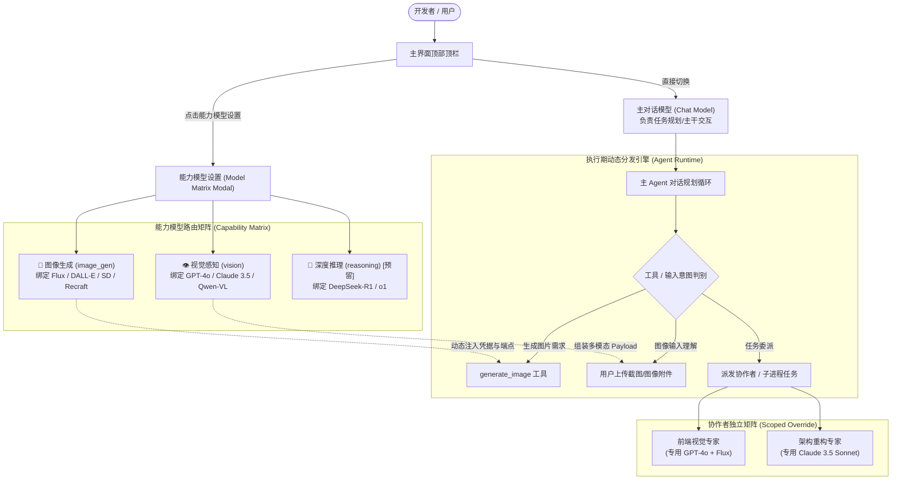

# 多模型对话与能力路由架构规范与实施方案 (MULTI_MODEL_CAPABILITY_ROUTING_SPEC)

| 项目 | 内容 |
| --- | --- |
| 文档名称 | 多模型对话与能力分流路由架构规范与实施方案 (Multi-Model Dialogue & Capability Routing Specification) |
| 版本 | v1.0 |
| 状态 | 规范落地与系统基线 |
| 关联模块 | `src/components/ModelMatrixModal.tsx`, `src/components/ModelCapabilitySelect.tsx`, `src/components/CreateCollaboratorModal.tsx`, `src/components/EditCollaboratorModal.tsx`, `src-tauri/src/agent.rs`, `src-tauri/src/tools.rs`, `src-tauri/src/store.rs`, `src/store.ts`, `src/types.ts` |

---

## 1. 背景与演进动力

在现代自主 AI Agent（如 `harness_mini`）的应用实践中，大语言模型早已超越了“单一端点处理所有请求”的初级阶段，呈现出高度的**特异化分工（Model Specialization）**趋势：
- **通用对话与逻辑推演**：擅长根据上下文制定任务流，通常选用推理能力平衡的指令模型；
- **视觉多模态理解 (Vision)**：需要处理用户上传的屏幕截图、UI 布局稿、错误日志图片，纯文本模型一旦接收带有 `image_url` 的 Content 即报错；
- **图像创意生成 (Image Gen)**：依赖 DALL-E 3、Flux、Recraft 等专门的文生图模型，向纯文本模型发送生图工具调用时往往导致 `400 Bad Request` 或产生格式错乱；
- **深度推理与反思思考 (Deep Reasoning)**：如 DeepSeek-R1、o1 等擅长前置规划长思考；
- **轻量快思与中间过滤 (Fast/Haiku)**：如 Claude 3.5 Haiku、GPT-4o-mini、Qwen-Turbo，适合高吞吐的工具参数验证、上下文精简与意图分类。

### 1.1 历史痛点与交互陷阱
1. **配置入口混杂错乱**：早期在全局设置、各处下拉菜单、会话编辑中各放一处模型选择，用户心智严重割裂；
2. **选错模型引发系统崩溃**：用户在生图工具或视觉环节误选纯文本模型，直接触发 API 报错或流程中断；
3. **主对话与特化能力冲突**：在同一弹窗中若同时选择“对话模型”和“视觉/生图模型”，极易与主界面顶栏直接选择的对话模型发生状态冲突；
4. **协作者与子任务能力固定**：协作者（如前端 UI 专家）需要视觉能力，而自动化代码重构专家需要强大的代码推理模型，过去的系统无法对每个协作者单独按能力分配模型。

本规范确立了**“顶栏极简、能力矩阵高级分流、智能置灰校验、会话级精准覆盖”**的统一多模型对话与能力分流架构。

---

## 2. 核心架构与分流路由体系



---

## 3. 能力分类法与特性元数据模型 (Capability Taxonomy)

系统确立了模型能力属性的检测与元数据字典规范：

### 3.1 核心能力枚举与元数据定义
```typescript
export type ModelCapability = "chat" | "image_gen" | "vision" | "reasoning" | "fast";

export interface ModelCapabilityMeta {
  id: ModelCapability;
  label: string;
  icon: string;
  description: string;
  badgeClass: string;
}

export const MODEL_CAPABILITY_METAS: Record<ModelCapability, ModelCapabilityMeta> = {
  chat: {
    id: "chat",
    label: "对话思考",
    icon: "💬",
    description: "驱动日常对话、任务规划、代码编写与执行逻辑推演",
    badgeClass: "bg-blue-500/15 text-blue-400 border-blue-500/30",
  },
  image_gen: {
    id: "image_gen",
    label: "图像生成",
    icon: "🎨",
    description: "驱动生图工具 (generate_image)，支持海报/图标/概念图生成",
    badgeClass: "bg-pink-500/15 text-pink-400 border-pink-500/30",
  },
  vision: {
    id: "vision",
    label: "视觉感知",
    icon: "👁️",
    description: "驱动图片多模态理解与视觉识别，支持分析用户截图与设计稿",
    badgeClass: "bg-purple-500/15 text-purple-400 border-purple-500/30",
  },
};
```

### 3.2 智能能力推断规则 (Heuristic Capability Inference)
当用户新添加自定义模型且未手动打标时，系统基于主流命名规范进行启发式自动化探测：
- **`image_gen`**：匹配正则 `/(dall[-_]?e|flux|stable[-_]?diffusion|midjourney|recraft|cogview|imagen|sdxl)/i`；
- **`vision`**：匹配正则 `/(vl|vision|4v|omni|gpt-4o|claude-3|gemini|glm-4v|qwen-vl|qwen2.5-vl)/i`；
- **`chat`**：所有非纯生图模型默认具备对话与指令能力。
用户可在模型设置中手动覆盖或微调具体模型的能力标签，该配置持久化在 `settings.modelCapabilities` 中。

---

## 4. 统一交互设计规范 (UX/UI Specification)

根据用户多轮明确提出的交互准则，界面设计必须严格遵循以下规范：

### 4.1 顶栏对话框入口准则（极简而不失专业）
1. **主下拉框保留精简**：顶栏保留原有的主模型快捷切换下拉框，显示当前活动厂商与模型名称；
2. **下拉菜单顶部常驻入口**：在打开下拉列表的最顶部，提供醒目的 **“能力模型高级设置”** 按钮（附带微光图标与快捷键提示）；
3. **避免冲突与心智负担**：点击该按钮后唤出专用模态框，外部主界面不受任何其他杂乱选择框干扰。

### 4.2 能力模型模态框规范 (`ModelMatrixModal`)
1. **取消模态框内的对话模型下拉框**：
   - **设计原则**：主对话模型已由顶栏直接控制，若在弹窗内重复提供“主对话模型”选择，会导致用户对“当前改的到底是不是主对话”产生严重冲突与误解；
   - **替代方案**：顶部展示简洁的只读状态栏，明确标注 `当前主对话模型：gpt-4o（在顶栏主菜单直接切换）`。
2. **能力槽位卡片化排版**：
   - 图像生成槽位（粉色基调，🎨 图标，详细提示“在调用 `generate_image` 时定向调度，杜绝纯文本模型下发导致的 400 Bad Request”）；
   - 视觉感知槽位（紫色基调，👁️ 图标，详细提示“在用户上传截图/UI设计稿时自动调度多模态模型”）；
3. **下拉选项智能置灰与语义提示 (`ModelCapabilitySelect`)**：
   - 下拉菜单按厂商分组（`<optgroup>`）；
   - 对不具备当前槽位能力（例如在生图槽位下的纯文本模型、在视觉槽位下不支持 VL 的模型）执行 **`disabled` 严格置灰**；
   - 选项文字后方附带 `(不支持图像生成)` 或 `(不支持视觉感知)`，背景加深、字体斜体，防止误触；
   - 若用户历史数据中保存了非法模型，输入框显示红色/黄色告警边框并弹出警示提示；
4. **去除多余的全局更新开关**：
   - 取消弹窗底部的“设为全局系统默认”勾选逻辑，简化交互；
   - 弹窗自动感知当前上下文：若在具体会话/协作者中打开，直接更新该会话专属配置；若在全局视图打开，直接更新全局默认。

### 4.3 协作者与子任务创建面板 (`CreateCollaboratorModal`)
1. 创建协作者（如“UI 前端专家”、“测试专家”）时，面板直接内嵌**模型能力选择模式**；
2. 清晰列出当前所有能力维度（对话、生图、视觉等），用户可针对每个能力自由指定最适配的模型，亦可选择“跟随系统全局默认”；
3. 保存后，该协作者在后续被调度或独立交互时，始终采用其专属的能力路由表。

---

## 5. 数据结构与持久化模型 (Data Schema)

### 5.1 前端状态与类型定义 (`src/types.ts`)
```typescript
export interface Session {
  id: string;
  title: string;
  providerId?: string | null;
  modelId?: string | null;
  
  // 能力模型路由专属字段
  imageProviderId?: string | null;
  imageModelId?: string | null;
  visionProviderId?: string | null;
  visionModelId?: string | null;
  // 扩展槽位（预留推理与快思）
  reasoningProviderId?: string | null;
  reasoningModelId?: string | null;
  
  // 兼容 snake_case
  image_provider_id?: string | null;
  image_model_id?: string | null;
  vision_provider_id?: string | null;
  vision_model_id?: string | null;
}

export interface Settings {
  providers: Provider[];
  activeProviderId?: string | null;
  activeModelId?: string | null;
  
  // 全局默认特化能力模型
  activeImageProviderId?: string | null;
  activeImageModelId?: string | null;
  activeVisionProviderId?: string | null;
  activeVisionModelId?: string | null;
  
  // 模型能力标签映射表 { "provider_id::model_name": ["chat", "vision"] }
  modelCapabilities?: Record<string, string[]>;
}
```

### 5.2 后端 SQLite 存储与数据库迁移 (`src-tauri/src/store.rs`)
在 SQLite `sessions` 数据表中新增持久化列：
```sql
ALTER TABLE sessions ADD COLUMN image_provider_id TEXT;
ALTER TABLE sessions ADD COLUMN image_model_id TEXT;
ALTER TABLE sessions ADD COLUMN vision_provider_id TEXT;
ALTER TABLE sessions ADD COLUMN vision_model_id TEXT;
```
同时系统配置统一序列化保存至 `settings.json`。

### 5.3 级联解析算法 (Cascading Fallback Resolution)
```
Target Session 配置
    │
    ├──> 存在专属配置？ ──[YES]──> 校验模型与凭据有效性 ──[有效]──> 命中生效
    │         │
    │        [NO]
    ▼         ▼
Global Settings 全局配置
    │
    ├──> 存在全局配置？ ──[YES]──> 校验模型与凭据有效性 ──[有效]──> 命中生效
    │         │
    │        [NO]
    ▼         ▼
Auto-Detect 自动寻优
    │
    ├──> 遍历所有已配置 Provider，自动寻找首个具备该能力特性的模型
    │         │
    │        [无匹配]
    ▼         ▼
Fallback 兜底
    └─> 回落至当前会话主对话模型 (Active Chat Model)
```

---

## 6. 运行时执行引擎与动态分发规范 (Runtime Dispatch Engine)

### 6.1 图像生成工具 (`generate_image`) 调度流
当 Agent 决策调用 `generate_image` 工具时：
1. **获取解析模型**：调用 `resolve_image_model_for_session(session_id)`；
2. **凭据提取**：根据绑定的 `image_provider_id` 从密钥库中获取专属 API Key 与 BaseURL；
3. **Payload 装配**：无论主对话使用的是 DeepSeek 还是 Claude，生图请求均被重定向封装为生图厂商的专用结构（如 OpenAI `/v1/images/generations` 或 Flux 原生接口）；
4. **落盘与协议绑定**：生成的图片由后端保存在工作区的 `generated_images/` 目录下，并以正斜杠绝对路径返回给上下文。

### 6.2 视觉输入多模态 Payload 组装流
当用户发送截图、粘贴图片或传入设计稿附件时：
1. **多模态能力检测**：若主会话绑定的模型为纯文本模型（不具备 `vision` 能力）；
2. **自动路由**：自动调用 `resolve_vision_model_for_session(session_id)` 解析多模态视觉模型；
3. **视觉分析转化**：以视觉模型对图片进行前置语义分析（OCR、布局结构抽取、设计元素提取），随后将分析成果作为结构化上下文传递给主对话流程，从而兼顾强逻辑与强视觉。

---

## 7. 质量保障与测试验证矩阵

| 测试项 | 验证内容 | 预期结果 |
| :--- | :--- | :--- |
| **置灰禁用验证** | 在生图槽位打开下拉列表，检查纯文本模型（如纯文本 deepseek-chat） | 选项呈现置灰状态，不可点击，提示 `(不支持图像生成)` |
| **独立会话隔离** | 主会话使用通用配置，协作者 A（视觉专家）指定专属视觉模型 | 协作者 A 的调用日志中采用其专属配置，主会话保持不变 |
| **非法配置告警** | 人为在配置文件中写入不支持该能力的模型名 | 前端界面显式标红告警，并提示用户重新选取合规模型 |
| **无缝降级测试** | 未配置专属视觉模型时上传图片 | 系统顺畅回落至主模型或全局具备视觉能力的首选模型 |
| **并发多模型调度** | 主会话进行复杂逻辑推理的同时，派发子任务调用生图模型绘制配图 | 双通道独立运行，无 Token 争抢与并发冲突 |

---

## 8. 总结与后续演进

通过本规范的全面实施，`harness_mini` 建立了清晰、稳健且高扩展性的多模型协同架构：
1. **心智减负**：顶栏纯粹简洁，高级分流按需唤出；
2. **运行零故障**：通过能力标签与下拉置灰机制，从源头杜绝了模型与任务特性的不匹配错误；
3. **专家矩阵**：主进程与各类常驻协作者各司其职，各自绑定最优模型底座，释放多模型组合的最佳生产力。
