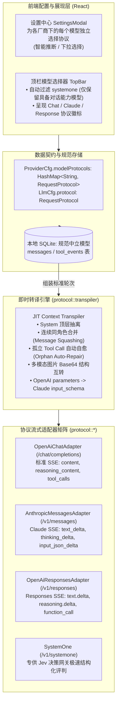

# 多请求协议适配体系与无感模型切换治理规范 (MULTI_PROTOCOL_ADAPTER_AND_MODEL_SWITCHING_SPEC)

| 项目 | 内容 |
| :--- | :--- |
| 文档名称 | 多请求协议适配体系与无感模型切换治理架构规范 (Multi-Protocol Request Adapters & Zero-Distortion Model Switching Governance Specification) |
| 版本 | v1.0 |
| 状态 | 规范落地与系统基线 |
| 关联模块 | `src/types.ts`, `src/components/SettingsModal.tsx`, `src/components/TopBar.tsx`, `src-tauri/src/models.rs`, `src-tauri/src/llm.rs`, `src-tauri/src/protocol/*`, `src-tauri/src/jev.rs`, `src-tauri/src/agent.rs` |

---

## 1. 背景与核心痛点

作为面向复杂编码与自动化执行的桌面级 AI Agent（`harness_mini`），系统依赖大语言模型实现多轮对话、任务规划、工具调用（Tool Calling）以及结构化质量门控。在早期实现中，系统默认仅面向 OpenAI 兼容的 `/chat/completions` 流式协议进行通信。

随着大模型生态的快速演变，现代 AI Agent 面临多协议并存与深度协同的客观诉求：
1. **OpenAI Chat Completions 协议**：业界应用最广的成熟对话标准（GPT-4o、DeepSeek-V3/R1、GLM-4、Qwen 等开源及商用模型）；
2. **Anthropic Claude Messages 协议**：头部代码与 Agent 模型原生协议（Claude 3.5 Sonnet / 3.7 Sonnet），具有严苛的消息交替、Content Blocks 块结构与原生 Extended Thinking 规范；
3. **OpenAI 新一代 Responses 协议**：面向未来 Agent 交互的状态化统一原语（`/v1/responses`），采用顶层 `instructions`、输入项数组与新一代工具事件体系；
4. **决策模型 SystemOne 协议**：以 TypeSafe AI (Jev) 为代表的判别/决策门控协议（`POST /v1/systemone`），专用于毫秒级二元判定（Noul）、离散选择（Choice）与量化评分（Score）。

### 1.1 核心顾虑：对话中途切换模型破坏上下文

用户在日常编码使用中，具有强烈的**“中途换模型”**诉求：例如前一轮用 DeepSeek 排查问题，随后希望切为 Claude 3.5 Sonnet 进行长代码重构。

然而，若不加治理直接向新模型转发未清洗的历史，跨协议切换会立即触发致命崩溃：
* **Role 角色格式断裂**：OpenAI 协议使用独立的 `role: "tool"` 承载工具结果；而 Anthropic 协议**严禁出现 `role: "tool"`**（必须作为 `user` 角色下的 `tool_result` content block）。直接切换会导致 Anthropic 服务端直接抛出 `400 Bad Request: unexpected role tool` 异常；
* **轮次交替破坏（Strict Alternation）**：Claude 强制要求必须是严格的 `user <-> assistant` 轮转，且首条必须为 `user`；如果连续插入多条 `user` 引导消息或连续工具结果，会直接触发 400 校验拦截；
* **孤立工具调用崩溃（Orphan Tool Call）**：用户在 Agent 执行工具过程中点击“停止”，随后切换模型并继续提问。历史中残留了 assistant 的 `tool_use`，但缺少对应的 `tool_result`。Anthropic 遇到孤立 `tool_use` 会强制拒绝请求；
* **思维链（Reasoning）上下文爆炸**：推理型模型（DeepSeek-R1 / Claude 3.7）生成的大段 `reasoning`，如果切换到小上下文或普通模型时原样携带，会导致上下文窗口溢出或网关无法识别字段；
* **系统提示词位置错位**：OpenAI 放在 `messages[0]`；Claude 要求提取到顶层 `system` 字段；Responses 要求提取到顶层 `instructions`；
* **能力与协议越界**：`systemone` 纯属单轮决策原语，若用户误在主会话中将其作为对话模型选出，会导致会话彻底瘫痪。

---

## 2. 业界标杆方案参考与心智模型

在设计本方案前，系统参考了业内成熟工具与网关的优秀设计实践：

### 2.1 标杆实践对照

| 业内工具 | 核心架构模式 | 解决切换影响的关键手段 |
| :--- | :--- | :--- |
| **Cline / Roo Code** (VSCode Agent 标杆) | **Canonical Internal Model + JIT Adapter** | 会话持久化层存储中立的 `ChatMessage`；在每次发起网络调用的瞬时，由目标 Provider 适配器实时转译为私有 Payload，历史数据不受任何污染。 |
| **LiteLLM / OpenRouter** (统一网关标准) | **Message Squashing & Repair Pipeline** | 自动合并连续同角色消息；对孤立 Tool Call 自动注入 Mock 占位结果；对不支持推理的模型自动剥离 `reasoning_content`。 |
| **Dify / LangChain** | **Capability & Protocol Decoupling** | 将模型能力（LLM 对话、Decision 决策、Image 生图）与协议绑定，主会话只允许绑定对话型协议，决策模型独立分配。 |

### 2.2 核心设计哲学

针对 `harness_mini` 的架构现状，确立三大基石原则：
1. **数据存储保持中立（Storage Neutrality）**：SQLite 数据库只存储中立规范模型（`role`, `content`, `reasoning`, `tool_calls_json`, `attachments`），绝不在数据库中固化任何厂商私有报文；
2. **网络调用即时转译（JIT Transpilation）**：在 HTTP 请求构建的最后一刻，依据当前激活模型的协议类型，动态翻译为目标 Payload；
3. **主从能力严格隔离（Capability-Protocol Gating）**：`systemone` 作为决策模型专项协议，严禁作为主对话模型选入主会话，从 UI 到运行时实现双保险拦截。

---

## 3. 全链路架构蓝图



---

## 4. 四大协议规范与即时转译细节

### 4.1 协议枚举契约 (`RequestProtocol`)

```rust
#[derive(Serialize, Deserialize, Clone, Copy, Debug, PartialEq, Eq, Default)]
#[serde(rename_all = "snake_case")]
pub enum RequestProtocol {
    #[default]
    ChatCompletions, // OpenAI 兼容标准接口 (/chat/completions)
    Messages,        // Anthropic Claude 接口 (/v1/messages)
    Response,        // OpenAI 新一代 Responses 接口 (/v1/responses)
    SystemOne,       // Jev / TypeSafe 决策专用接口 (/v1/systemone)
}
```

* **智能推断逻辑** (`RequestProtocol::infer`)：
  * 若 Base URL 或 Model 名包含 `systemone` / `typesafe`，推断为 `SystemOne`；
  * 若 Base URL 包含 `anthropic` 或 Model 以 `claude` 开头，推断为 `Messages`；
  * 若 Base URL 以 `/responses` 结尾或包含 `responses`，推断为 `Response`；
  * 默认回退为 `ChatCompletions`。

---

### 4.2 转译器自适应与自愈机制 (`protocol/transpiler.rs`)

#### ① 针对 Anthropic Claude (`messages` 协议) 的转译治理

1. **System 抽离**：扫描上下文中的全部 `role: "system"`，抽取其文本按 `\n\n` 拼接，赋值至请求根对象的 `system` 字段，消息列表中彻底过滤掉 system。
2. **多模态图片转换**：将通用多模态数据：
   ```json
   {"type": "image_url", "image_url": {"url": "data:image/png;base64,iVBOR..."}}
   ```
   自动拆解 MIME 类型与 Base64 负载，转化为 Anthropic 原生规范：
   ```json
   {"type": "image", "source": {"type": "base64", "media_type": "image/png", "data": "iVBOR..."}}
   ```
3. **工具调用与工具结果映射**：
   * `assistant` 的 `tool_calls` -> 转换为 content blocks 中的 `type: "tool_use", id, name, input`；
   * `tool` 角色的工具执行结果 -> **强制转换为 `user` 角色**，内部包裹 `type: "tool_result", tool_use_id, content`。
4. **同向连续消息压缩 (Message Squashing)**：
   * 顺序扫描过程中，若出现连续两条 `user` 消息（例如用户输入紧跟着工具返回结果，或连续引导输入），自动将其 `content` 数组合并为同一个 `user` 消息；
   * 确保合并后的消息严格遵循 `user` -> `assistant` -> `user` -> `assistant` 交替轮转。
5. **首消息保底**：若合并后的首条消息不是 `user`，自动在数组首部插入 `{"role": "user", "content": [{"type": "text", "text": "开始对话"}]}`。
6. **孤立工具调用自愈 (Orphan Tool Call Auto-Repair)**：
   * 当用户强行停止 Agent 时，历史可能停留在包含 `tool_use` 的 assistant 消息；
   * 转译器在校验时发现某个 `tool_use.id` 在后续的 `user` 消息中缺少对应的 `tool_result`，**立即自动合成注入一条虚拟结果**：
     ```json
     {"type": "tool_result", "tool_use_id": "<call_id>", "content": "(工具调用已被中断，无执行结果)"}
     ```
   * **彻底消除了因用户中断并切换模型引发的 400 协议校验报错**。
7. **工具定义转译**：将 OpenAI 风格的 `parameters` 自动映射为 Claude 风格的 `input_schema`。

#### ② 针对 OpenAI Responses (`response` 协议) 的转译治理

1. **顶层字段**：将系统提示词赋予顶层 `instructions`。
2. **输入序列化**：将对话历史平铺为 `input` 项：
   * `user` 消息 -> `{"type": "message", "role": "user", "content": [{"type": "input_text", "text": "..."}]}`
   * `assistant` 消息 -> `{"type": "message", "role": "assistant", "content": [{"type": "output_text", "text": "..."}]}`
   * 工具调用 -> `{"type": "function_call", "call_id": id, "name": name, "arguments": args}`
   * 工具返回 -> `{"type": "function_call_output", "call_id": id, "output": text}`

#### ③ 针对 SystemOne 协议的隔离治理

* `protocol::dispatch_chat_stream` 明确将 `SystemOne` 标记为非对话协议，若被主循环误调，立即返回友好指引；
* 在 `src-tauri/src/jev.rs` 统一决策执行器 `execute_decision` 中，依据 `provider.get_model_protocol(model) == RequestProtocol::SystemOne` 决定是调用极速原生 `POST /v1/systemone` 端点，还是回退至通用 JSON Prompt 决策流。

---

## 5. 协议流式适配器实现对照

| 适配器 | 文件路径 | 端点规范化逻辑 | 鉴权与必要请求头 | 流式事件处理重点 |
| :--- | :--- | :--- | :--- | :--- |
| **OpenAiChat** | `protocol/openai_chat.rs` | 容忍末尾包含 `/chat/completions`，规整为 `{base}/chat/completions` | `Authorization: Bearer <key>` | 解析 `choices[0].delta`，支持 `reasoning_content` 与多工具分片累加。 |
| **Anthropic** | `protocol/anthropic.rs` | 规整为 `{base}/v1/messages` 或 `{base}/messages` | `x-api-key: <key>`<br/>`anthropic-version: 2023-06-01` | 解析 `content_block_start`（开启 tool）、`content_block_delta`（`text_delta`, `thinking_delta`, `input_json_delta`）。 |
| **OpenAiResponses** | `protocol/openai_responses.rs` | 规整为 `{base}/v1/responses` 或 `{base}/responses` | `Authorization: Bearer <key>` | 解析 `response.output_item.added`, `response.text.delta`, `response.reasoning.delta`, `response.function_call_arguments.delta`。 |

---

## 6. 前端 UI 与交互防护体系

### 6.1 设置弹窗 (`SettingsModal.tsx`)
* **模型行专属协议下拉选择器**：每个厂商下的每个模型独立配置协议（`OpenAI Chat`、`Claude Messages`、`OpenAI Response`、`SystemOne (决策)`）；
* **添加模型智能联动**：输入新模型名称时，前端自动调用 `inferRequestProtocol` 设定最佳协议初值；
* **删除模型数据自愈**：删除模型时，同步清理 `modelProtocols` 中对应的映射键。

### 6.2 顶栏模型下拉选择器 (`TopBar.tsx`)
* **主动排除决策模型**：
  ```typescript
  const groups = settings.providers
    .map((p) => ({
      ...p,
      models: (p.models ?? []).filter((m) => isChatCapableProtocol(getModelProtocol(p, m))),
    }))
    .filter((p) => p.models.length > 0);
  ```
* **协议标识直观呈现**：每个模型选项右侧以紧凑徽标标识当前协议（`Chat`、`Claude`、`Response`），使用户在切换前即对模型通信协议一目了然。

---

## 7. 质量保证与测试基线

系统在 `src-tauri/src/protocol/tests.rs` 建立了覆盖全协议的单元测试套件：

1. `test_protocol_inference`：验证基于 Base URL 与模型命名的协议智能推断准确率；
2. `test_anthropic_transpile_basic_and_system_extraction`：验证系统提示词抽离与纯文本消息转译；
3. `test_anthropic_transpile_tool_calls_and_results_squashing`：验证工具调用转为 `tool_use`、工具结果转为 `tool_result`，以及同角色消息自动合并；
4. `test_anthropic_orphan_tool_call_self_healing`：验证用户强制中止后孤立 Tool Call 的虚拟结果自动补齐自愈；
5. `test_anthropic_multimodal_image_url_transpile`：验证多模态图片 Data URL 到 Anthropic Base64 对象的转换；
7. `test_serde_systemone_compatibility`：验证 `RequestProtocol` 反序列化对 `systemone` 与 `system_one` 的双向兼容；
8. `test_llm_cfg_effective_session_id`：验证全局会话 ID 路由与自动生成的有效性与稳定性。

测试套件已纳入工程基线，并通过 `npm run build` 和 `cargo check` 双重静态检查保证零回归。

---

## 8. 网关会话路由与缓存亲和性规范 (OpenCode / Session Routing)

现代大模型网关与托管路由服务（如 OpenCode Go、Cloudflare AI Gateway、Prompt Caching 反向代理等）对客户端网络请求提出了严格的路由亲和性要求：
1. **客户端标识（User-Agent）**：
   * 严禁直接使用底层 HTTP 库默认 UA（如 `reqwest/0.12`）；
   * 客户端全局统一注入 `User-Agent: harness-mini/0.1.0`。
2. **会话标识与路由头（`x-opencode-session` & `x-session-id`）**：
   * **作用机制**：网关依赖会话头将同一会话的多轮交互精确路由至同一推理算力节点，最大化激活服务端上下文 KV Cache（Prompt Caching），并防止单会话连接漂移；
   * **连通性测试场景**：自动注入唯一测试会话标识 `test-{uuid}`；
   * **Agent 主会话执行场景**：透传真实 `sessionId`，确保整个长程任务命中同一网关路由与缓存池；
   * **通用单次任务场景**：若无显式会话，通过 `LlmCfg::effective_session_id()` 自动生成规范 `sess-{uuid}`，保障所有对外 HTTP 调用 100% 具备有效会话头。

