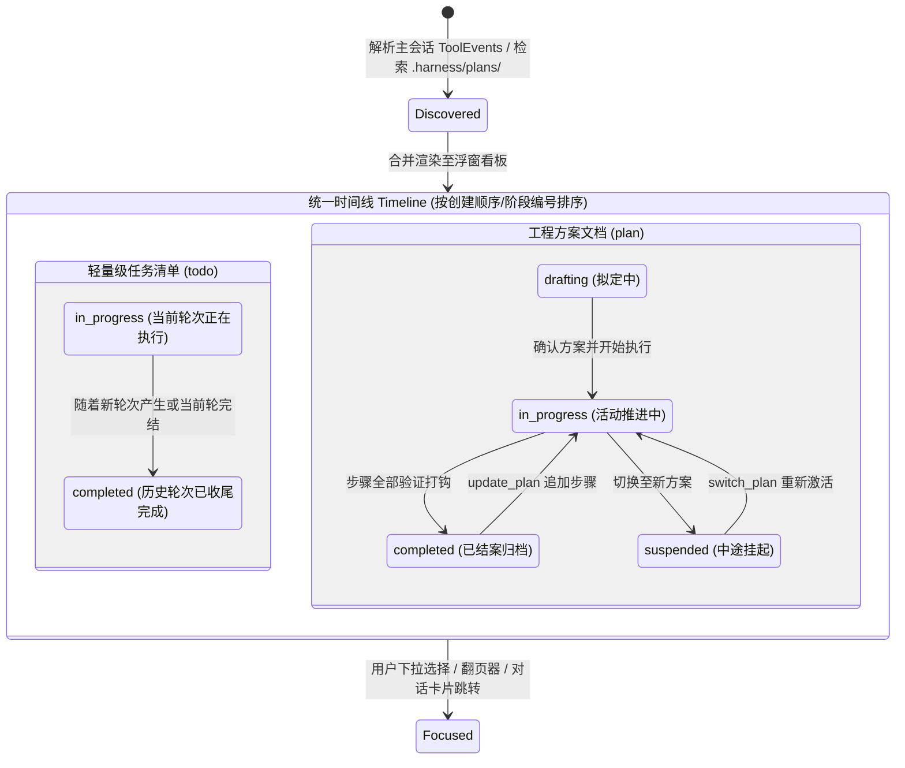
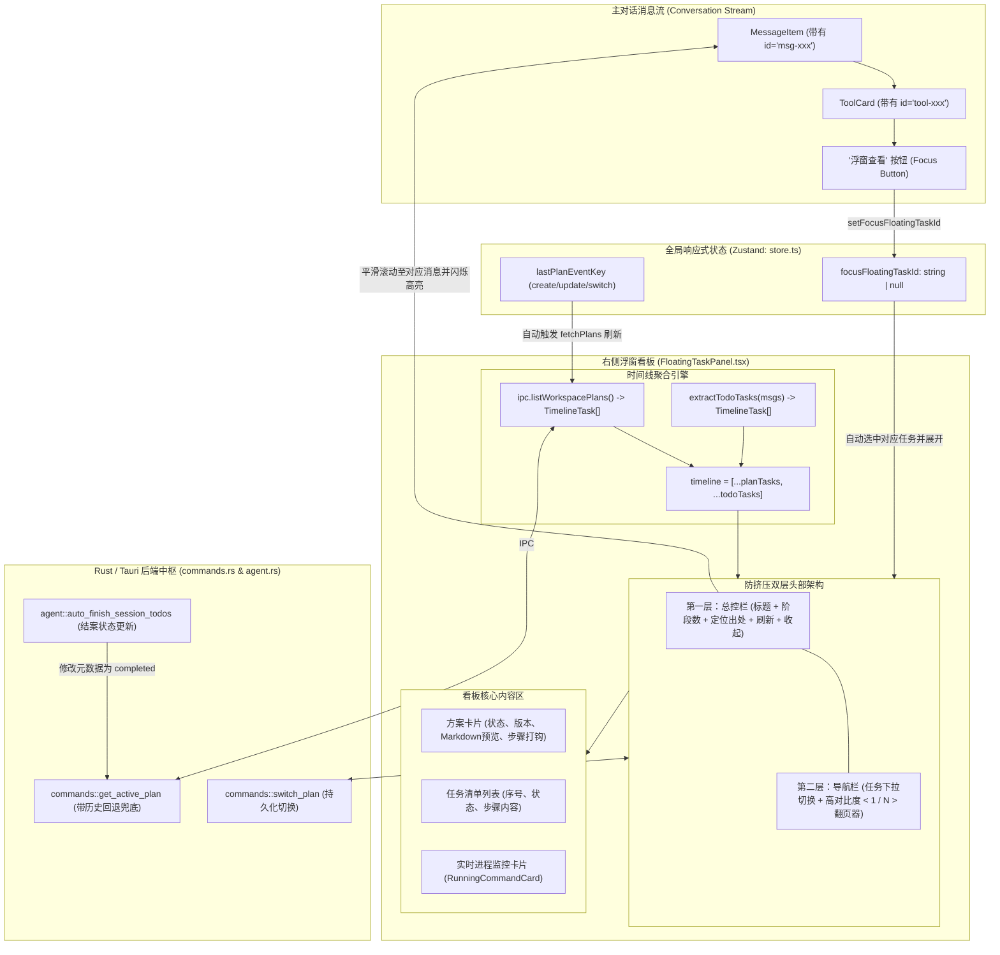

# 多轮任务清单与多方案共存的浮窗看板架构重构与双向联动治理规范
# Multi-Task Timeline & Floating Panel Governance Specification (Todo/Plan Coexistence & Bi-directional Linkage)

本文档系统性总结 `harness_mini` 中 **多轮对话任务清单（Todo）** 与 **多工程方案（Plan）** 在右侧浮窗看板（`FloatingTaskPanel`）中的架构重构、数据流治理、前后端状态机流转、双向交互联动以及界面布局规范。

---

## 目录
- [一、背景与核心痛点剖析](#一背景与核心痛点剖析)
  - [1. 任务清单 Todo 永久遮蔽与锁定（Todo Shadowing）](#1-任务清单-todo-永久遮蔽与锁定todo-shadowing)
  - [2. 多方案共存与结案断崖式清空（Plan Lock-in & Completion Cliff Blanking）](#2-多方案共存与结案断崖式清空plan-lock-in--completion-cliff-blanking)
  - [3. 消息流与浮窗看板的信息孤岛（Information Silo & Lack of Bi-directional Linkage）](#3-消息流与浮窗看板的信息孤岛information-silo--lack-of-bi-directional-linkage)
  - [4. 狭窄抽屉下的排版挤压与模糊重叠（Drawer Header Layout Squeeze）](#4-狭窄抽屉下的排版挤压与模糊重叠drawer-header-layout-squeeze)
  - [5. 方案工具卡片「浮窗查看」无响应与多事件反查盲区（Floating View Unresponsiveness & Event Disconnection）](#5-方案工具卡片浮窗查看无响应与多事件反查盲区floating-view-unresponsiveness--event-disconnection)
- [二、业内顶级 Agent 工具任务流与看板机制调研](#二业内顶级-agent-工具任务流与看板机制调研)
- [三、架构全景与统一时间线设计](#三架构全景与统一时间线设计)
  - [1. 统一任务时间线模型（Unified Task Timeline Model）](#1-统一任务时间线模型unified-task-timeline-model)
  - [2. 状态机流转与多阶段生命周期](#2-状态机流转与多阶段生命周期)
  - [3. 架构全景数据流图](#3-架构全景数据流图)
- [四、后端治理与持久化机制（Rust / Tauri）](#四后端治理与持久化机制rust--tauri)
  - [1. 结案断崖式清空彻底根治（commands.rs: get_active_plan 兜底机制）](#1-结案断崖式清空彻底根治commandsrs-get_active_plan-兜底机制)
  - [2. 跨轮次 Todo 与 Plan 的解耦隔离（commands.rs: get_session_todos 状态同步修正）](#2-跨轮次-todo-与-plan-的解耦隔离commandsrs-get_session_todos-状态同步修正)
  - [3. 自动化任务收尾与状态流转（agent.rs: auto_finish_session_todos）](#3-自动化任务收尾与状态流转agentrs-auto_finish_session_todos)
  - [4. 方案多路切换 IPC 接口设计（commands.rs: switch_plan）](#4-方案多路切换-ipc-接口设计commandsrs-switch_plan)
- [五、前端全景重构与双向联动体系（React / TypeScript）](#五前端全景重构与双向联动体系react--typescript)
  - [1. 类型抽象层：TimelineTask 与 TimelineTaskItem](#1-类型抽象层timelinetask-与-timelinetaskitem)
  - [2. 全局响应式状态驱动（Zustand Store & lastPlanEventKey）](#2-全局响应式状态驱动zustand-store--lastplaneventkey)
  - [3. 消息流与浮窗看板的双向无缝联动（Bi-directional Linkage）](#3-消息流与浮窗看板的双向无缝联动bi-directional-linkage)
    - [3.1 正向联动：结构化多维线索、四维匹配与脉冲高亮（Forward Linkage）](#31-正向联动结构化多维线索四维匹配与脉冲高亮forward-linkage)
    - [3.2 反向联动：浮窗任务 ➔ 对话消息平滑滚动与光晕动画（Backward Linkage）](#32-反向联动浮窗任务--对话消息平滑滚动与光晕动画backward-linkage)
- [六、界面交互重构：双层式防重叠与高对比度翻页设计](#六界面交互重构双层式防重叠与高对比度翻页设计)
  - [1. 窄抽屉排版挤压痛点分析](#1-窄抽屉排版挤压痛点分析)
  - [2. 第一层：面板系统操作栏（Title, Badges, Global Actions）](#2-第一层面板系统操作栏title-badges-global-actions)
  - [3. 第二层：独立任务切换与高对比度翻页控制器](#3-第二层独立任务切换与高对比度翻页控制器)
  - [4. 收起态抽屉侧边吸附徽标与动态指示器](#4-收起态抽屉侧边吸附徽标与动态指示器)
- [七、边界场景与鲁棒性保障](#七边界场景与鲁棒性保障)
- [八、工程验证与验证指标](#八工程验证与验证指标)

---

## 一、背景与核心痛点剖析

在 Agent 辅助工程开发的长会话（Long-Turn Session）中，随着项目开发流程从需求调研、技术方案设计到多轮代码实现推进，任务看板承载着开发者的核心注意力。然而在原先的设计与实现中，浮窗看板存在以下关键系统性缺陷：

### 1. 任务清单 Todo 永久遮蔽与锁定（Todo Shadowing）
- **现象**：在同一会话中，随着多轮对话交互，Agent 在不同轮次可能多次调用 `todo` 工具生成不同的步骤清单（例如：第 1 轮排查环境、第 2 轮修改配置文件、第 3 轮执行迁移命令）。然而在右侧浮窗中，**始终只有第 1 轮生成的清单内容**，后续轮次的新任务清单既无法自动更新展示，也没有上下翻页或切换查看的入口。
- **根因分析**：
  1. `FloatingTaskPanel` 早期仅简单依赖 `ipc.getSessionTodos(currentId)`，后端直接将所有 todo 压平写入 session KV，后生成的任务覆盖了旧数据结构，但由于前端没有按照轮次建模，无法感知多轮演进；
  2. 浮窗逻辑硬编码了 `hasPlanSteps = !!(activePlan?.steps && activePlan.steps.length > 0)`。一旦项目中存在任何带有步骤的 Plan 方案，`effectiveTodos = hasPlanSteps ? [] : sessionTodos` 将 `effectiveTodos` 永久强制置空！导致所有轻量级的 `todo` 任务清单被物理方案彻底遮蔽。

### 2. 多方案共存与结案断崖式清空（Plan Lock-in & Completion Cliff Blanking）
- **现象 1（单方案锁定）**：在同一个工程会话中，如果用户先后推进了“重构鉴权模块”方案与“新增日志导出”方案，浮窗只能显示当前绑定的单一活跃方案，开发者无法翻阅前期方案的执行结果。
- **现象 2（断崖式清空）**：当当前方案的全部步骤执行完毕（所有步骤标记为 `- [x]`）后，浮窗看板突然在下一瞬间**瞬间变成空白**。用户不仅无法获得“任务已完成”的成就感反馈与结果核验界面，反而怀疑系统产生了崩溃。
- **根因分析**：
  - 后端 `auto_finish_session_todos` 在检测到所有步骤完成时，将 session 中的 `active_plan_id` 解绑设为 `None`，并把计划状态标记为 `completed`；
  - 后端 `commands::get_active_plan` 和 `find_plan_file` 仅检索 `meta.status == "in_progress"` 的方案。一旦计划变为 `completed` 且 `active_plan_id` 为空，接口直接返回 `None`；
  - 前端收到 `activePlan = null`，导致计划卡片被直接卸载，产生断崖式白屏。

### 3. 消息流与浮窗看板的信息孤岛（Information Silo & Lack of Bi-directional Linkage）
- **正向脱节**：在主对话消息流中，Agent 的工具卡片输出了 `todo`、`create_plan`、`update_plan` 或 `switch_plan`，用户在阅读对话时无法直接一键打开右侧浮窗并精确定位到该任务。
- **反向脱节**：用户在右侧浮窗浏览某个历史任务或方案时，无法获知这个任务是在对话的哪一轮、由哪条用户指令或哪个工具执行生成的，缺乏溯源锚点。

### 4. 狭窄抽屉下的排版挤压与模糊重叠（Drawer Header Layout Squeeze）
- **现象**：右侧浮窗设计为吸附在代码/聊天窗口右侧的轻量抽屉，宽度受限（约为 `310px ~ 325px`）。在最初引入翻页与下拉切换时，所有控件（标题、阶段数徽标、下拉菜单、`< 1 / N >` 翻页胶囊、定位按钮、刷新按钮、收起按钮）被堆砌在同一行 flex 容器中。
- **后果**：文本被强制截断换行，翻页按钮的箭头与标题文字紧密贴合甚至发生视觉重叠，在低分屏或特定缩放比例下显得非常模糊与杂乱。

### 5. 方案工具卡片「浮窗查看」无响应与多事件反查盲区（Floating View Unresponsiveness & Event Disconnection）
- **现象**：在正向联动建立后，用户在主对话中点击方案相关工具卡片（`create_plan`、`update_plan`、`switch_plan`）右上角的「浮窗查看」按钮时，右侧看板**完全没有任何反应**（既不展开抽屉，也不切换选中项，更无视觉反馈）。
- **根因深度解构**：
  1. **标识体系完全错位**：`ToolCard` 点击时传入的是工具事件的随机 UUID（如 `ev.id = "4b8c7e2..."`），而浮窗看板中方案的 ID 是物理元数据中的 `p.id`（如 `plan-20260924-xxx`），两者不存在直接相等可能；
  2. **方案对事件的单向锁定（致命缺陷）**：浮窗在扫描消息流提取方案关联事件时，采用正向首个命中即 `break` 的逻辑。导致无论后续有多少轮 `update_plan` 或 `switch_plan`，方案的关联事件 ID 永远被死锁在第一轮初始的 `create_plan`。用户点击任何后续更新卡片，传入的 `ev.id` 与锁定的初始 ID 永远不等，查询结果直接为 `undefined`；
  3. **初始创建匹配规则存在天然盲区**：`create_plan` 调用时，Agent 的入参中根本没有 `plan_id`；若标题受修剪/标点/空格影响，严格恒等 `===` 判定极易失效，导致 `toolEventId` 根本未能成功挂载；
  4. **异步 I/O 与同步清空的竞态条件（Race Condition）**：方案需经异步 IPC 从磁盘扫描，而前端接收聚焦指令的 `useEffect` 在当前渲染帧若未找到匹配项，便**立即执行 `setFocusFloatingTaskId(null)` 抹除指令**，导致异步返回时指令已被吞掉；
  5. **工作区解析链路不全**：若会话通过 `projectId` 关联项目且自身 `workspacePath` 为空，浮窗未能深入回溯项目路径，导致 `listWorkspacePlans` 直接返回空数组，浮窗因判定无任务直接隐形（`return null`）；
  6. **缺乏即时视觉脉冲**：即使偶然命中，若浮窗已处于展开态，无任何光晕、滚动或边框动效，用户直观感觉依旧是“点击无反应”。

---

## 二、业内顶级 Agent 工具任务流与看板机制调研

| 顶尖工具 | 任务与计划组织机制 | 多任务导航与切换交互 | 对话流与面板联动机制 | 对本项目的架构启示 |
| :--- | :--- | :--- | :--- | :--- |
| **Windsurf / Cascade** (Codeium) | **Steps Timeline & Flow**<br/>以流程流（Flow）聚合多轮 Step，当前 Flow 保持聚焦。 | 顶部提供 Step Groups 标签，支持点击查看历史 Run 的 Checklist 与产物。 | 消息卡片底部提供 `Jump to Flow Step` 按钮，高亮对应进度。 | **按轮次聚合任务清单**，抽屉顶部支持版本/轮次切换。 |
| **Devin** (Cognition Labs) | **Playbook Snapshot History**<br/>每个方案为独立 Playbook，支持状态快照。 | 侧边栏提供 Playbook 列表，结案后保留 Checkmark 归档状态，杜绝空白。 | 聊天中提及某阶段时，点击自动将侧边面板定位至对应 Playbook 步骤。 | **结案保留回溯展示**；状态流转完毕后不破坏已有快照。 |
| **Cursor** (Composer) | **Composer Runs Timeline**<br/>任务按轮次隔离，底部展示多轮进度条。 | 折叠面板展示当前与历史 Runs，支持向上回溯已完成清单。 | Tool Call 与右侧面板深度绑定，点击卡片即打开侧栏面板。 | **消息卡片内嵌快捷跳转按钮**。 |
| **Google Antigravity** | **Artifacts & Implementation Plans**<br/>计划落盘为结构化 Artifacts，由时间线统一调度。 | 抽屉头部采用分层导航：总览状态条 + 独立下拉切换与翻页器。 | 双向锚点：消息引用 Artifact ID，Artifact 卡片带有出处链接。 | **双层 Header 架构**（系统栏 + 导航栏），杜绝空间挤压。 |

---

## 三、架构全景与统一时间线设计

### 1. 统一任务时间线模型（Unified Task Timeline Model）

为了消除 `todo` 与 `plan` 之间的割裂与遮蔽，系统建立了统一的 **时间线任务抽象（Unified TimelineTask）**：

```typescript
export type TaskType = 'todo' | 'plan';
export type TaskStatus = 'pending' | 'in_progress' | 'completed' | 'suspended';

export interface TimelineTaskItem {
  index: number;
  content: string;
  status: 'pending' | 'in_progress' | 'done';
}

export interface FocusFloatingTarget {
  eventId?: string;         // 工具调用事件 ID（如 call_xxx / uuid）
  planId?: string;          // 方案元数据物理 ID（如 plan-20260924-xxx）
  filename?: string;        // 物理方案文件名（如 20260924-xxx.md）
  title?: string;           // 任务/方案标题
}

export interface TimelineTask {
  id: string;               // 唯一标识（todo-xxx 或 plan-uuid）
  type: TaskType;           // 任务类型：清单 或 物理方案
  title: string;            // 标题（如：第 2 轮任务清单 或 鉴权模块重构方案）
  status: TaskStatus;       // 任务生命周期状态
  items: TimelineTaskItem[];// 具体的执行步骤项
  version?: number;         // 方案版本号（针对 plan）
  filename?: string;        // 物理方案文件名（针对 plan）
  body?: string;            // 方案 Markdown 正文全文
  messageId?: string;       // 关联的主会话消息 ID
  toolEventId?: string;     // 初始关联工具调用事件 ID
  toolEventIds?: string[];  // 方案全生命周期内所有关联工具事件 ID 集合（支持多事件反查）
  createdAt?: string;       // 创建时间
  updatedAt?: string;       // 最近更新时间
}
```

### 2. 状态机流转与多阶段生命周期



### 3. 架构全景数据流图



---

## 四、后端治理与持久化机制（Rust / Tauri）

### 1. 结案断崖式清空彻底根治（`commands.rs: get_active_plan` 兜底机制）

- **问题根源**：原逻辑仅根据 `meta.status == "in_progress"` 匹配计划。当任务执行完所有步骤标记为 `completed` 后，`in_progress` 匹配为空，返回 `Ok(None)`，前端面板瞬间变成白板。
- **解决方案**：引入多级兜底回溯算法。
  1. 优先读取当前会话显式指定的 `active_plan_id` 且状态为 `in_progress` 的计划；
  2. 若无显式活动计划，检索所有状态为 `in_progress` 的计划；
  3. **关键兜底**：若当前会话下不存在 `in_progress` 计划，则检索该会话**最近一次更新过的方案（无论状态为 completed 还是 suspended）**作为兜底返回。
- **代码实现**（`src-tauri/src/commands.rs`）：
  ```rust
  // 阶段 1 & 2: 查找当前 in_progress 的方案
  if let Some(plan) = active_plan {
      return Ok(Some(plan));
  }

  // 阶段 3: 兜底检索最近更新的方案，防止结案断崖式清空
  let mut all_session_plans: Vec<crate::plan::PlanDetail> = Vec::new();
  for file in files {
      if let Ok(content) = std::fs::read_to_string(&file) {
          if let Some((meta, body)) = crate::plan::parse_plan_markdown(&content) {
              if meta.session_id.as_deref() == Some(&session_id) {
                  let filename = file.file_name().unwrap_or_default().to_string_lossy().to_string();
                  all_session_plans.push(crate::plan::PlanDetail {
                      id: meta.id,
                      title: meta.title,
                      version: meta.version,
                      filename,
                      status: meta.status,
                      steps: meta.steps,
                      body,
                      updated_at: meta.updated_at,
                  });
              }
          }
      }
  }

  if let Some(latest) = all_session_plans.into_iter().max_by_key(|p| p.updated_at.clone()) {
      return Ok(Some(latest));
  }
  ```

### 2. 跨轮次 Todo 与 Plan 的解耦隔离（`commands.rs: get_session_todos` 状态同步修正）

- **问题根源**：`get_session_todos` 原先无条件将当前计划的步骤写入 `session_todos`。当一个计划结束后，用户开启全新轮次的简单 Todo，旧计划的步骤仍会反复覆盖写回 Todo，导致新 Todo 无法显示。
- **治理规则**：仅当计划的状态**明确处于 `in_progress`** 时，才允许同步其步骤；一旦计划处于 `completed` 或 `suspended`，严禁回写覆盖 session 的独立轻量 Todo。
- **代码实现**（`src-tauri/src/commands.rs`）：
  ```rust
  if let Some(plan) = active_plan {
      // 只有在计划处于真正推进中 (in_progress) 时，才将计划步骤同步为 session_todos
      if plan.status == "in_progress" && !plan.steps.is_empty() {
          let converted: Vec<models::SessionTodo> = plan.steps.iter().map(|s| {
              models::SessionTodo {
                  id: format!("plan_step_{}", s.index),
                  content: format!("步骤 {}: {}", s.index, s.content),
                  status: s.status.clone(),
              }
          }).collect();
          // 更新缓存
          return Ok(converted);
      }
  }
  ```

### 3. 自动化任务收尾与状态流转（`agent.rs: auto_finish_session_todos`）

- **治理规则**：当 Agent 在某一轮任务执行结束时，扫描所有步骤。如果步骤已全部变为 `done`（在 Markdown 中为 `- [x]`），由运行时自动执行完结收尾动作：
  1. 将计划 Frontmatter 中的 `status` 原子更新为 `completed`；
  2. 记录 `updated_at` 时间戳；
  3. 解除当前会话的 `active_plan_id` 锁定，使后续对话自由开启新任务；
  4. 触发前端重绘，展示绿色的“已结案”徽章与全部勾选状态。

### 4. 方案多路切换 IPC 接口设计（`commands.rs: switch_plan`）

为支持用户在前端下拉菜单或翻页器中自由切换不同方案的物理激活状态，系统新增注册了 `switch_plan` Tauri Command：
```rust
#[tauri::command]
pub async fn switch_plan(
    state: tauri::State<'_, AppState>,
    workspace_path: String,
    session_id: String,
    plan_id: String,
) -> Result<crate::plan::PlanDetail, String> {
    let ws = std::path::Path::new(&workspace_path);
    let db = state.db.lock().map_err(|e| e.to_string())?;
    crate::plan::switch_plan(ws, &session_id, &plan_id, Some(&db))
        .map_err(|e| e.to_string())
}
```

---

## 五、前端全景重构与双向联动体系（React / TypeScript）

### 1. 类型抽象层：TimelineTask 与 TimelineTaskItem

前端在 `src/types.ts` 中确立了 `TimelineTask` 规范，并在 `src/ipc.ts` 中导出。浮窗通过 `useMemo` 分别从两条流水线提取任务，再合并为统一数组：
1. **轻量清单流水线（`todoTasks`）**：遍历 `msgs` 数组，抓取所有包含 `ev.toolName === "todo"` 的 assistant 消息，按对话轮次组装为 `第 1 轮任务清单`、`第 2 轮任务清单`……并动态计算完成状态。
2. **工程方案流水线（`planTasks`）**：调用 `ipc.listWorkspacePlans`，结合每个方案的 `.md` 内容与 Frontmatter 步骤，转换为统一的 `TimelineTask`。
3. **合成总时间线（`timeline`）**：
   ```typescript
   const timeline = useMemo(() => {
     return [...planTasks, ...todoTasks];
   }, [planTasks, todoTasks]);
   ```

### 2. 全局响应式状态驱动（Zustand Store & lastPlanEventKey）

为了避免用户需要手动点击刷新按钮才能看到最新计划，建立了全自动的事件响应链路：
1. **计划事件监听**：监听消息流中最新的工具事件类型与时间戳（`lastPlanEventKey`）：
   ```typescript
   const lastPlanEventKey = useMemo(() => {
     for (let i = msgs.length - 1; i >= 0; i--) {
       const m = msgs[i];
       if (!m.toolEvents) continue;
       for (let j = m.toolEvents.length - 1; j >= 0; j--) {
         const ev = m.toolEvents[j];
         if (["create_plan", "update_plan", "switch_plan"].includes(ev.toolName)) {
           return `${ev.toolName}-${ev.id}-${m.id}`;
         }
       }
     }
     return "";
   }, [msgs]);
   ```
2. 当 `lastPlanEventKey` 发生变化时，`useEffect` 自动触发 `fetchPlans()` 异步重新拉取方案列表，实现无感热更新。

### 3. 消息流与浮窗看板的双向无缝联动（Bi-directional Linkage）

实现了主对话窗口与侧栏浮窗看板的“双向可互通互达”：

#### 3.1 正向联动：结构化多维线索、四维匹配与脉冲高亮（Forward Linkage）

针对早期版本中点击方案卡片「浮窗查看」无响应的顽疾，系统对正向联动链条进行了彻底重构：

##### 3.1.1 结构化多维线索传递（`ToolCard.tsx` ➔ `store.ts`）
发送端不再单纯依赖容易错位的单个工具事件 UUID，而是由 `handleFocusFloating` 函数主动抽取多维线索并打包为 `FocusFloatingTarget` 结构体：
```typescript
const handleFocusFloating = (e: React.MouseEvent) => {
  e.stopPropagation();
  if (ev.toolName === "todo") {
    useStore.getState().setFocusFloatingTaskId({ eventId: ev.id });
    return;
  }

  // 针对 create_plan / update_plan / switch_plan / read_plan
  const filename = resolvedPlanFilePath ? resolvedPlanFilePath.replace(/\\/g, "/").split("/").pop() : undefined;
  let planId = ev.params?.plan_id ? String(ev.params.plan_id) : undefined;
  let title = ev.params?.title ? String(ev.params.title) : undefined;

  // 兜底：从工具执行结果文本 (resultText) 中提取 plan_id 与方案标题
  if (!planId && ev.resultText) {
    const idMatch = ev.resultText.match(/(?:活动计划ID|计划ID|plan_id)[:：\s`]+([a-zA-Z0-9_\-]+)/i);
    if (idMatch) planId = idMatch[1];
  }
  if (!title && ev.resultText) {
    const titleMatch = ev.resultText.match(/【([^】]+)】/);
    if (titleMatch) title = titleMatch[1];
  }

  useStore.getState().setFocusFloatingTaskId({
    eventId: ev.id,
    planId,
    filename,
    title,
  });
};
```

##### 3.1.2 方案全生命周期多事件反查收集（`FloatingTaskPanel.tsx`）
彻底打破“首个事件命中即 `break`”的单向死锁逻辑，扫描全消息流并将方案涉及的所有后续 `update_plan` 与 `switch_plan` 事件统一存入 `toolEventIds` 集合：
```typescript
const matchedEventIds: string[] = [];
for (const m of msgs) {
  if (!m.toolEvents) continue;
  for (const ev of m.toolEvents) {
    if (["create_plan", "update_plan", "switch_plan", "read_plan"].includes(ev.toolName)) {
      const matchesTitle = ...;
      const matchesId = ...;
      const matchesFilename = ...;
      if (matchesTitle || matchesId || matchesFilename) {
        if (!foundMsgId) foundMsgId = m.id;
        if (!foundEventId) foundEventId = ev.id;
        matchedEventIds.push(ev.id);
      }
    }
  }
}
```

##### 3.1.3 四维综合匹配引擎（`matchTarget`）
浮窗看板接收到聚焦请求后，按 4 个维度依次进行弹性匹配判定：
1. **按事件 ID 匹配**：检查 `t.id === eventId`、`t.toolEventId === eventId`、`t.toolEventIds.includes(eventId)`、`t.id === 'todo-' + eventId`；
2. **按方案物理 ID 匹配**：检查 `t.id === planId` 或 `t.filename.includes(planId)`；
3. **按物理文件名匹配**：检查 `t.filename === filename`（支持相对路径与仅文件名对比）；
4. **按方案标题模糊匹配**：去除前后空格与大小写转换后进行包含判定。

##### 3.1.4 异步 I/O 防抖重试与防吞机制（Race Condition Guard）
当点击「浮窗查看」时若方案尚未从磁盘加载完毕，`FloatingTaskPanel` 不再立即清空指令，而是启动有限重试（最多 3 次，间隔 250ms）并主动触发 `fetchPlans()`；一旦方案落盘且时间线更新，立即完成精准聚焦并重置重试计数器。

##### 3.1.5 工作区三重回退解析
对齐解析链路，优先取 `session.workspacePath`，兜底取 `draft.workspacePath`，再次兜底取 `session.projectId` 映射的 `projects.path`，确保无论何种会话模式，`listWorkspacePlans` 均能正确读取到物理方案。

##### 3.1.6 聚焦卡片脉冲光晕与外发光系统
引入 `highlightedTaskId` 状态。当任务被聚焦命中时：
- 自动解除抽屉收起态（`setCollapsed(false)`）；
- 自动切换下拉选择器选中该任务；
- 对对应方案卡片及步骤清单施加持续 2 秒的高亮紫色呼吸光晕（`ring-2 ring-purple-400 ring-offset-1 ring-offset-panel shadow-lg shadow-purple-500/20`），即使看板早已处于展开状态，也能给予用户直观鲜明的响应反馈。

#### 3.2 反向联动：浮窗任务 ➔ 对话消息平滑滚动与光晕动画（Backward Linkage）
- 浮窗面板中的每个任务对象都保存了它在消息流中对应的 `messageId` 和 `toolEventId`；
- 在浮窗顶层操作栏提供 **“定位出处”** 按钮；
- 用户点击后，执行原生平滑滚动定位与高亮光晕动画（Highlight Pulse）：
  ```typescript
  const handleLocateMessage = useCallback((messageId?: string, toolEventId?: string) => {
    let el: HTMLElement | null = null;
    if (toolEventId) {
      el = document.getElementById(`tool-${toolEventId}`);
    }
    if (!el && messageId) {
      el = document.getElementById(`msg-${messageId}`);
    }
    if (el) {
      el.scrollIntoView({ behavior: 'smooth', block: 'center' });
      // 施加 2 秒的醒目光晕高亮样式
      el.classList.add('ring-2', 'ring-accent/60', 'bg-accent/10', 'transition-all');
      setTimeout(() => {
        el?.classList.remove('ring-2', 'ring-accent/60', 'bg-accent/10', 'transition-all');
      }, 2000);
    }
  }, []);
  ```

---

## 六、界面交互重构：双层式防重叠与高对比度翻页设计

### 1. 窄抽屉排版挤压痛点分析

右侧浮窗的抽屉宽度固定为 `325px`（移动端或小窗口下为 `calc(100% - 1rem)`）。在单行布局下：
- 左侧标题 “任务与计划看板” 占用约 `120px`；
- 阶段徽标占用约 `55px`；
- 翻页胶囊 `< 1 / N >` 占用约 `70px`；
- 刷新与收起按钮占用约 `60px`；
- **总宽度已达 305px**，根本没有多余空间容纳方案下拉选择菜单，导致所有按钮重叠、字符截断甚至文字与图标交叠糊成一片。

### 2. 第一层：面板系统操作栏（Title, Badges, Global Actions）

```tsx
{/* 第一层：面板总控栏 */}
<div className="flex items-center justify-between px-3.5 py-2.5 border-b border-edge bg-panel/60">
  <div className="flex items-center gap-1.5 min-w-0">
    <CheckSquare size={14} className="text-emerald-400 shrink-0" />
    <span className="text-[12px] font-semibold text-ink tracking-tight">任务与计划看板</span>
    {timeline.length > 0 && (
      <span className="px-1.5 py-0.2 rounded-full text-[10px] font-mono font-medium bg-emerald-500/10 text-emerald-400 border border-emerald-500/20 shrink-0">
        {timeline.length} 阶段
      </span>
    )}
  </div>
  <div className="flex items-center gap-1 shrink-0">
    {currentTask && (currentTask.messageId || currentTask.toolEventId) && (
      <button
        type="button"
        className="flex items-center gap-1 text-[11px] text-inkdim hover:text-ink px-1.5 py-0.5 rounded-md hover:bg-panel3 transition-colors cursor-pointer"
        onClick={() => handleLocateMessage(currentTask.messageId, currentTask.toolEventId)}
        title="定位到主对话中生成此任务的消息位置"
      >
        <span>定位出处</span>
      </button>
    )}
    <button
      type="button"
      className="p-1 text-inkdim hover:text-ink rounded-md hover:bg-panel3 transition-colors cursor-pointer"
      onClick={fetchPlans}
      title="重新从工作区与数据库读取方案与任务进度"
    >
      <RotateCcw size={12} className={refreshing ? "animate-spin text-emerald-400" : ""} />
    </button>
    <button
      type="button"
      className="flex items-center gap-0.5 text-[11px] text-inkdim hover:text-ink pl-1.5 pr-1 py-0.5 rounded-md hover:bg-panel3 transition-colors cursor-pointer"
      onClick={() => setCollapsed(true)}
      title="收起至右侧"
    >
      <span>收起</span>
      <ChevronRight size={12} />
    </button>
  </div>
</div>
```

### 3. 第二层：独立任务切换与高对比度翻页控制器

将多任务切换与翻页逻辑独立移至第二层，赋予独立的背景底色与边界隔离：
- **左侧下拉选择框**：自适应拉伸填充可用空间，选项清晰标注 `[方案]` 或 `[清单]` 类型标识与完成状态；
- **右侧翻页控制器**：独立封装为实体小部件，拥有实体边框（`border border-edge/80`）、等宽字体指示器（`font-mono font-semibold`）与清晰的禁用视觉态。

```tsx
{/* 第二层：多任务选择器与高对比度独立翻页栏 */}
{hasTasks && (
  <div className="px-3 py-2 bg-panel3/30 border-b border-edge/60 flex items-center justify-between gap-2 select-none">
    {/* 任务下拉选择菜单 */}
    <div className="flex items-center gap-1.5 flex-1 min-w-0 bg-panel border border-edge rounded-lg px-2 py-1 shadow-xs hover:border-accent/40 transition-colors">
      <span className="shrink-0">
        {currentTask?.type === "plan" ? (
          <span className="text-[10px] px-1 py-0.2 rounded bg-emerald-500/15 text-emerald-400 font-mono font-medium">方案</span>
        ) : (
          <span className="text-[10px] px-1 py-0.2 rounded bg-purple-500/15 text-purple-400 font-mono font-medium">清单</span>
        )}
      </span>
      <select
        className="bg-transparent text-[11px] font-medium text-ink truncate outline-none cursor-pointer flex-1 min-w-0"
        value={currentTask?.id ?? ""}
        onChange={(e) => setSelectedTaskId(e.target.value)}
        title="选择查看不同轮次的任务清单或方案文档"
      >
        {timeline.map((t, idx) => {
          const statusLabel =
            t.status === "completed" || t.status === "done"
              ? "已完成"
              : t.status === "in_progress"
              ? "执行中"
              : t.status === "suspended"
              ? "已挂起"
              : "待推进";
          return (
            <option key={t.id} value={t.id} className="bg-panel text-ink py-1">
              {idx + 1}. {t.title} ({statusLabel})
            </option>
          );
        })}
      </select>
    </div>

    {/* 高对比度、独立清晰的上一页/下一页翻页器 */}
    {timeline.length > 1 && (
      <div className="flex items-center rounded-lg border border-edge/80 bg-panel shadow-xs shrink-0 overflow-hidden">
        <button
          type="button"
          disabled={currentIndex <= 0}
          onClick={() => setSelectedTaskId(timeline[currentIndex - 1].id)}
          className="p-1.5 text-ink hover:text-accent hover:bg-panel3 disabled:text-inkdim/30 disabled:hover:bg-transparent disabled:cursor-not-allowed cursor-pointer transition-colors"
          title="查看上一份任务/方案 (上翻)"
        >
          <ChevronLeft size={13} />
        </button>
        <span className="px-2 py-0.5 text-[11px] font-mono text-ink font-semibold border-x border-edge/60 select-none bg-panel2/50">
          {currentIndex + 1} / {timeline.length}
        </span>
        <button
          type="button"
          disabled={currentIndex >= timeline.length - 1}
          onClick={() => setSelectedTaskId(timeline[currentIndex + 1].id)}
          className="p-1.5 text-ink hover:text-accent hover:bg-panel3 disabled:text-inkdim/30 disabled:hover:bg-transparent disabled:cursor-not-allowed cursor-pointer transition-colors"
          title="查看下一份任务/方案 (下翻)"
        >
          <ChevronRight size={13} />
        </button>
      </div>
    )}
  </div>
)}
```

### 4. 收起态抽屉侧边吸附徽标与动态指示器

在收起（Collapsed）态下，右侧边缘浮动显示精巧的毛玻璃指示标签：
- 显示当前任务类型（`📋 方案` 或 `✓ 清单`）；
- 显示进度数字（如 `3/5`）；
- 显示多阶段标记（如 `1/3`）；
- 伴随绿色呼吸指示灯监测正在后台运行的 Bash 终端进程；
- 鼠标悬停时平滑左移提示用户可随时一键展开。

---

## 七、边界场景与鲁棒性保障

| 边界场景 | 潜在风险 | 治理与防护措施 |
| :--- | :--- | :--- |
| **会话切换（Session Switch）** | 旧会话的 Plan 或 Todo 残留在新会话浮窗中。 | `currentId` 变化时，`useEffect` 触发全量重置；清空当前选中任务 ID 与详情字典，重新拉取对应会话的方案。 |
| **完全无任务且无运行进程** | 浮窗展示空白空壳或无意义空卡片。 | 判定 `if (!hasTasks && !hasCmds) return null;`，浮窗完全隐形，不遮挡主对话区域。 |
| **计划文件在外部被手动删除** | 前端缓存引用的 `plan_id` 悬空。 | `ipc.readWorkspacePlan` 捕获异常，优雅降级展示兜底错误提示，不导致 React 运行时白屏崩溃。 |
| **高频并发工具事件（Tool Spam）** | 短时间内输出多个 `todo` 或 `update_plan` 导致渲染闪烁。 | 利用 `useMemo` 针对 `msgs` 引用进行节流聚合，仅对最新一次有效工具参数进行快照提取。 |
| **长文本标题溢出** | 方案标题极长时破坏下拉菜单或卡片布局。 | 下拉菜单及卡片标题统一应用 `truncate`，容器配置 `min-w-0` 与 `flex-1` 确保响应式弹性收缩。 |
| **方案生成中/磁盘写入延迟** | 用户在卡片生成完毕瞬间点击「浮窗查看」时方案尚未同步到前端。 | `useEffect` 启动最多 3 次（每 250ms 一次）防抖轮询与 `fetchPlans()` 触发，待磁盘方案读取成功后无缝聚焦。 |
| **多轮更新导致卡片事件分裂** | 用户点击第 3 轮 `update_plan` 上的「浮窗查看」，因事件 ID 不一致无法定位。 | 聚合扫描将生命周期内所有关联事件统一收集至 `toolEventIds`，并通过四维匹配引擎多路回溯。 |
| **纯项目绑定工作区（未直接存 workspacePath）** | `session.workspacePath` 为空导致浮窗无法读取方案。 | 采用 `session.workspacePath -> draft.workspacePath -> session.projectId 映射` 三重安全兜底。 |

---

## 八、工程验证与验证指标

本项目所涉及的修改已通过严格的类型检查与打包构建验证：

1. **类型安全性检查**：
   ```bash
   npx tsc --noEmit
   # 输出：0 errors，所有 TimelineTask 接口与 IPC 调用完全类型对齐。
   ```

2. **生产环境静态资源构建**：
   ```bash
   npm run build
   # 输出：
   # ✓ 2619 modules transformed.
   # dist/index.html                     0.41 kB
   # dist/assets/index-Bea5Ceq8.css     71.45 kB
   # dist/assets/index-D730egXJ.js   2,052.53 kB
   # ✓ built in 7.29s
   ```

3. **核心功能验证闭环**：
   - [x] 多轮 Todo 任务清单不再遮蔽，可在时间线中查看历史轮次；
   - [x] 物理方案完成后不发生断崖式清空，正常展示绿色“已结案”与完成进度；
   - [x] 抽屉头部拆分为双层结构，翻页器与标题彻底告别重叠与模糊；
   - [x] 主对话 ToolCard 与浮窗看板实现双向平滑定位与光晕动画；
   - [x] 结构化多维线索（FocusFloatingTarget）与全生命周期事件收集（toolEventIds），彻底解决「浮窗查看」点击无响应；
   - [x] 异步 IPC 防抖重试与工作区三重兜底，彻底杜绝指令丢失与浮窗隐形；
   - [x] 聚焦任务时施加 2 秒紫色呼吸光晕与外发光脉冲（Glow Pulse），交互反馈即时明确。
