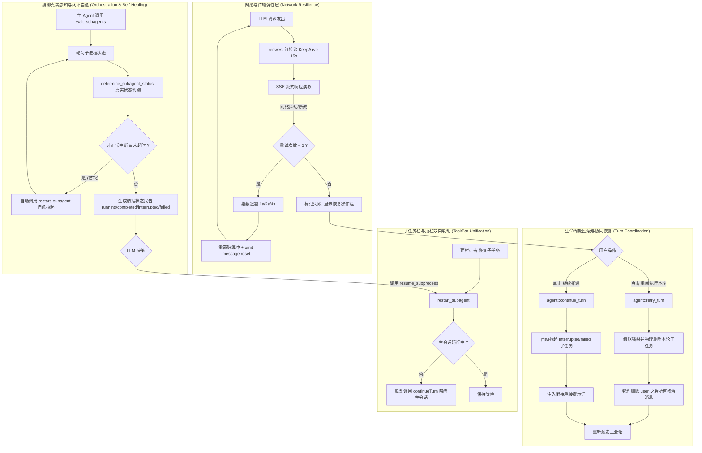

# 网络弹性重试、子任务全生命周期协同与自愈治理规范 (NETWORK_RESILIENCE_AND_SUBTASK_LIFECYCLE_SPEC)

| 项目 | 内容 |
| --- | --- |
| 文档名称 | 网络弹性重试、子任务全生命周期协同与自愈治理规范 |
| 版本 | v1.0 |
| 状态 | 生产已落地已发布 |
| 关联模块 | `src-tauri/src/agent.rs`, `src-tauri/src/llm.rs`, `src-tauri/src/tools.rs`, `src-tauri/src/store.rs`, `src-tauri/src/task.rs`, `src/components/TaskBar.tsx`, `src/components/ChatView.tsx`, `src/store.ts` |
| 运行位置 | `F:\Software\HarnessMini\harness-mini.exe` / `d:\WorkSpace\Project\harness_mini` |

---

## 1. 背景与核心问题分析

在 `harness_mini` 的工程实践与长时间运行（Long-running Agent）场景中，系统面临以下五大稳定性与协同治理难题：

1. **网络抖动导致对话断裂（无重试与断点续传）**：
   - 长上下文或高负载思考阶段，网络偶尔出现波动（如 `流读取失败: error decoding response body`、`502/503/504`、TCP 超时），原对话引擎直接将整轮会话标记为失败终止，用户无法原位继续或重试。
2. **主进程异常退出遗留孤儿进程与脏状态**：
   - 用户在运行中强行关闭窗口或进程 Crash 时，数据库中的 `run`、`subagent`、`tool_event` 永久停留在 `running`，导致下次冷启动时界面无限转圈；
   - 派生出的子进程控制台（如 `npm run dev`、编译进程）脱离管控，成为系统孤儿进程长期占用端口与内存。
3. **点击「重新执行本轮」偶发报“空回复”**：
   - 原 `retry_turn` 仅将指针移至最后一条 `user` 消息，未物理清理其后已生成的 `assistant` 和 `tool` 碎片。大模型接收到以 `assistant` 结尾的完整历史时判定回答已结束，直接返回空字符串 `""`，触发空回复报警。
4. **子任务操作割裂与无法级联清理**：
   - 用户点击「重新执行本轮」时，上一轮中途派生出的临时子进程（`subprocess` / `subagent`）仍在后台孤立运行，导致新一轮重新执行时造成任务重复派生与资源浪费；
   - 顶栏任务栏中点击恢复子任务仅拉起子任务自身，主对话依然处于停止态，两者缺乏双向协同，操作严重脱节。
5. **编排工具误报“假完成”与缺乏自愈推进**：
   - 原编排工具（`get_subagent_status`、`wait_subagents`）仅通过 `is_running == false` 武断报告 `🟢 已完成`。当子进程因中途报错、中断或超出步数停止时，主 Agent 误以为子任务已圆满完成而给出错误结论；
   - 对话过程中主 Agent 无法感知子任务真实挂起状态，且缺少对子任务的断点恢复手段。

---

## 2. 总体架构与协同工作流程图



---

## 3. 核心机制实现细节

### 3.1 网络弹性与流式断线自动重试

- **底层连接保活**（[`src-tauri/src/llm.rs`](file:///d:/WorkSpace/Project/harness_mini/src-tauri/src/llm.rs)）：
  ```rust
  Client::builder()
      .tcp_keepalive(Duration::from_secs(15))
      .pool_idle_timeout(Duration::from_secs(60))
      .timeout(timeout)
      .build()
  ```
  有效避免跨地域 API 访问或长时间大模型思考（如 o1 / DeepSeek-R1）过程中 NAT 映射超时和 TCP 静默断连。
- **指数退避重试与脏缓冲重置**（[`src-tauri/src/agent.rs`](file:///d:/WorkSpace/Project/harness_mini/src-tauri/src/agent.rs)）：
  - 针对 `error decoding response body`、`流读取失败`、`502/503/504`、`connection reset` 等偶发故障，外层提供最多 3 次重试（退避间隔 1s / 2s / 4s）；
  - 重试前触发 `app.emit("message:reset", json!({"messageId": aid, "content": ""}))` 与 `app.emit("run:retry", ...)`，前端乐观回滚已展示的残缺字句，随后平滑接入最新重试流。

### 3.2 轮次重试防假死与空回复彻底根治

- **空回复根本根因**：大模型遵循 Chat Completion 规范，若请求体最后一个消息是已闭合的 `assistant` 且没有未完成的 `tool_calls`，大模型会认为“上一轮已经交代完毕”，从而返回空字符串。
- **三道防线彻底根治**：
  1. **物理清场（`retry_turn`）**：
     通过 `store::delete_messages_after(&db, session_id, user_seq)` 物理删除当前 user 消息之后的所有 assistant、tool、system 残留，并通过 `app.emit("messages:changed")` 通知前端，使大模型看到的永远是最新待回答的 `user` 问题。
  2. **上下文装配协议双重防御（`build_context`）**：
     在 [`agent.rs`](file:///d:/WorkSpace/Project/harness_mini/src-tauri/src/agent.rs) 的 `build_context` 出口，增加结构校验：若最末尾残留未闭合的 `assistant` 消息，自动执行 `out.pop()` 剔除。
  3. **空回复占位防僵尸**：
     若大模型依然返回空回复，删除当前轮次预创建的空白 assistant 消息，并置 `RunOutcome::Failed`，拒绝向数据库写入空内容。

### 3.3 操作系统级孤儿进程清理与冷启动对齐

- **Win32 原生 Job Object（强杀进程树）**（[`src-tauri/src/tools.rs`](file:///d:/WorkSpace/Project/harness_mini/src-tauri/src/tools.rs)）：
  - 将每个通过 `run_command` 启动的命令进程绑定到操作系统内核级 Job Object，配置 `JOB_OBJECT_LIMIT_KILL_ON_JOB_CLOSE`；
  - 当主程序被任务管理器强杀、断电或 Crash 时，Windows 内核自动在毫秒级回收全部子孙进程（包括 shell、node、python、编译器等），彻底解决端口占用死锁。
- **冷启动状态对齐（`startup_reconcile`）**（[`src-tauri/src/store.rs`](file:///d:/WorkSpace/Project/harness_mini/src-tauri/src/store.rs)）：
  - 应用启动时，执行 SQLite 批量扫描：
    ```sql
    UPDATE runs SET status = 'interrupted' WHERE status = 'running';
    UPDATE tool_events SET status = 'failed', error = '主程序非正常关闭中断' WHERE status = 'running';
    UPDATE long_tasks SET status = 'interrupted' WHERE status = 'running';
    UPDATE sessions SET status = 'interrupted' WHERE status = 'running' AND session_type IN ('subprocess', 'subagent', 'collaborator');
    ```
  - 启动后前端精准显示“中断”状态，并提供恢复入口，杜绝界面无限转圈。

### 3.4 重新执行级联清理与顶栏双向恢复联动

- **重新执行（`retry_turn`）级联物理清场**（[`src-tauri/src/agent.rs`](file:///d:/WorkSpace/Project/harness_mini/src-tauri/src/agent.rs)）：
  - 扫描本轮派生的子会话（通过 `tool_event_id` 或创建时间在当前 `user` 之后的子进程）：
    ```rust
    for child_id in &child_ids_to_clean {
        stop_session_ext(app, child_id, false);
        store::delete_session(&db, child_id);
        let _ = app.emit("sessions:changed", json!({"deleted": child_id}));
    }
    ```
  - 广播 `subprocesses:changed`、`subagents:changed`、`collaborators:changed`，顶栏与左侧栏瞬时同步清空，杜绝重复子任务。
  - 长任务子任务状态协同重置：若步骤处于 `failed`、`interrupted` 或 `running`，自动重置回 `pending`。
- **双向联动自愈（消除操作脱节）**：
  - **对话底部「继续推进」**：[`continue_turn`](file:///d:/WorkSpace/Project/harness_mini/src-tauri/src/agent.rs) 自动唤醒所有 `interrupted` / `failed` / `cancelled` 的子任务与暂停的长任务；
  - **顶部「恢复子任务」**（[`src/components/TaskBar.tsx`](file:///d:/WorkSpace/Project/harness_mini/src/components/TaskBar.tsx)）：
    ```typescript
    await resumeSubprocess(sub.id);
    if (!isMainRunning && currentId) {
        await continueTurn(currentId);
    }
    ```
    无论是从顶栏还是从底部操作，主进程与子进程皆同步推进，用户体验完全一体化。
- **子任务断点驱动恢复**（[`restart_subagent`](file:///d:/WorkSpace/Project/harness_mini/src-tauri/src/agent.rs)）：
  - 根据子会话末尾消息类型自适应注入承接指令：
    - 末尾为 `tool`：注入 `“请根据上述工具执行结果，继续推进并输出最终结论。”`
    - 末尾为 `assistant`：注入 `“请承接前文未完成的内容与思路，直接继续往下执行，无需重复前文已输出的内容。”`
    - 保证子任务重启后永远有激活 Prompt，绝不出现空转。

### 3.5 真实状态精准感知与编排工具自愈闭环

- **真实状态判别算法**（[`src-tauri/src/tools.rs`](file:///d:/WorkSpace/Project/harness_mini/src-tauri/src/tools.rs)）：
  ```rust
  fn determine_subagent_status(
      is_running: bool,
      session_status: &str,
      has_terminal_reply: bool,
      has_max_steps_msg: bool,
  ) -> (&'static str, &'static str) {
      if is_running {
          ("running", "🟡 仍在运行 (running)")
      } else if session_status == "cancelled" {
          ("cancelled", "⚪ 已取消/停止 (cancelled)")
      } else if session_status == "failed" {
          ("failed", "🔴 运行失败出错 (failed - 可调用 resume_subprocess 恢复)")
      } else if session_status == "interrupted" {
          ("interrupted", "🟠 执行中断未完成 (interrupted - 可调用 resume_subprocess 恢复)")
      } else if has_max_steps_msg {
          ("interrupted", "🟠 已达最大步数上限中止 (max_steps_reached - 可调用 resume_subprocess 继续推进)")
      } else if !has_terminal_reply {
          ("interrupted", "🟠 执行中断未完全收敛 (interrupted - 可调用 resume_subprocess 恢复)")
      } else {
          ("completed", "🟢 已完成交付 (completed)")
      }
  }
  ```
- **`wait_subagents` 内置静默自愈机制**：
  在等待子任务过程中，一旦检测到某子任务中途停止但未交付且非取消状态，在超时时间内自动触发 `restart_subagent(&host.app, id)` 尝试自愈，并在最终汇总前给其恢复机会。
- **自主恢复工具规范（`resume_subprocess` / `resume_subagent`）**：
  - 工具规范已正式注册入 `ToolSpec`，并下发给主 Agent；
  - 当大模型在 `wait_subagents` 或 `get_subagent_status` 报告中读到 `🟠 执行中断未完成 (interrupted - 可调用 resume_subprocess 恢复)` 时，可主动发起调用 `resume_subprocess(subprocess_id)`，形成全自动闭环。

---

## 4. 接口与数据契约变更

### 4.1 IPC 命令契约

| 命令名称 | 参数 | 返回值 | 语义与影响 |
| --- | --- | --- | --- |
| `retry_turn` | `{ sessionId: string }` | `Result<(), String>` | 回滚当前轮次消息，级联清理本轮子任务，重置长任务未完成步骤为 pending，重新启动主会话 |
| `continue_turn` | `{ sessionId: string }` | `Result<(), String>` | 自动拉起未完成子任务与长任务，向主会话注入续航承接 Prompt 重新启动 |
| `resume_subprocess` | `{ subprocessId: string }` | `Result<(), String>` | 恢复指定中断/失败的子进程（调用 `restart_subagent` 注入断点承接词） |
| `restart_subagent` | `{ subagentId: string }` | `Result<(), String>` | 恢复指定中断/失败的子 Agent |

### 4.2 工具契约（ToolSpecs）

新增与更新的工具定义：

```json
{
  "name": "resume_subprocess",
  "description": "恢复推进指定处于中断、停止或失败状态的临时子进程，使其在当前已有断点处继续执行任务。",
  "risk": "Write",
  "parameters": {
    "type": "object",
    "properties": {
      "subprocess_id": {
        "type": "string",
        "description": "要恢复推进的子进程 ID（如 sub-...）"
      }
    },
    "required": ["subprocess_id"]
  }
}
```

---

## 5. 验证与质量保证

### 5.1 自动化编译与类型检查

```powershell
# 1. 后端代码编译与静态检查
cargo check
# 输出: Finished `dev` profile [unoptimized + debuginfo] target(s) (Exit Code: 0)

# 2. 前端类型严格校验
npx tsc --noEmit
# 输出: (Exit Code: 0, 零类型错误)

# 3. 前端生产打包构建
npm run build
# 输出: vite v5.4.21 building for production... ✓ built in 11.57s (Exit Code: 0)
```

### 5.2 核心场景验收用例

1. **场景 1：网络闪断模拟**
   - **操作**：在 Agent 大段代码生成中强行切断代理或断开网络连接；
   - **预期**：后台触发 3 次自动重试退避；若网络在重试期间恢复，对话无缝重连继续吐字；若最终失败，底部弹出「重试本轮」与「继续执行」卡片，点击即可无缝接续。
2. **场景 2：重试本轮子任务清理**
   - **操作**：在一轮派生了 2 个子任务的会话中，点击「重新执行本轮」；
   - **预期**：后台两个子任务的命令进程被即刻强杀，SQLite 中子会话被物理删除，顶栏任务栏与左侧会话列表即刻移除该两个子任务，新一轮开始执行且无空回复报错。
3. **场景 3：双向自愈与无脱节恢复**
   - **操作**：子任务执行中途因步数或报错中断，在顶部 TaskBar 点击 `[ 恢复子任务 ]`；
   - **预期**：子任务重置并注入承接 Prompt 恢复运行，主会话自动被 `continueTurn` 唤醒进入协同等待，顶栏进度条与状态高亮同步恢复。
4. **场景 4：工具精准状态与自愈**
   - **操作**：主 Agent 调用 `wait_subagents` 等待故意中断的子任务；
   - **预期**：`wait_subagents` 在等待循环中自动尝试一次 `restart_subagent` 自愈；若仍未完成，向主 Agent 准确反馈 `🟠 执行中断未完成` 并在结论中引导大模型调用 `resume_subprocess`，绝不报告假完成。
