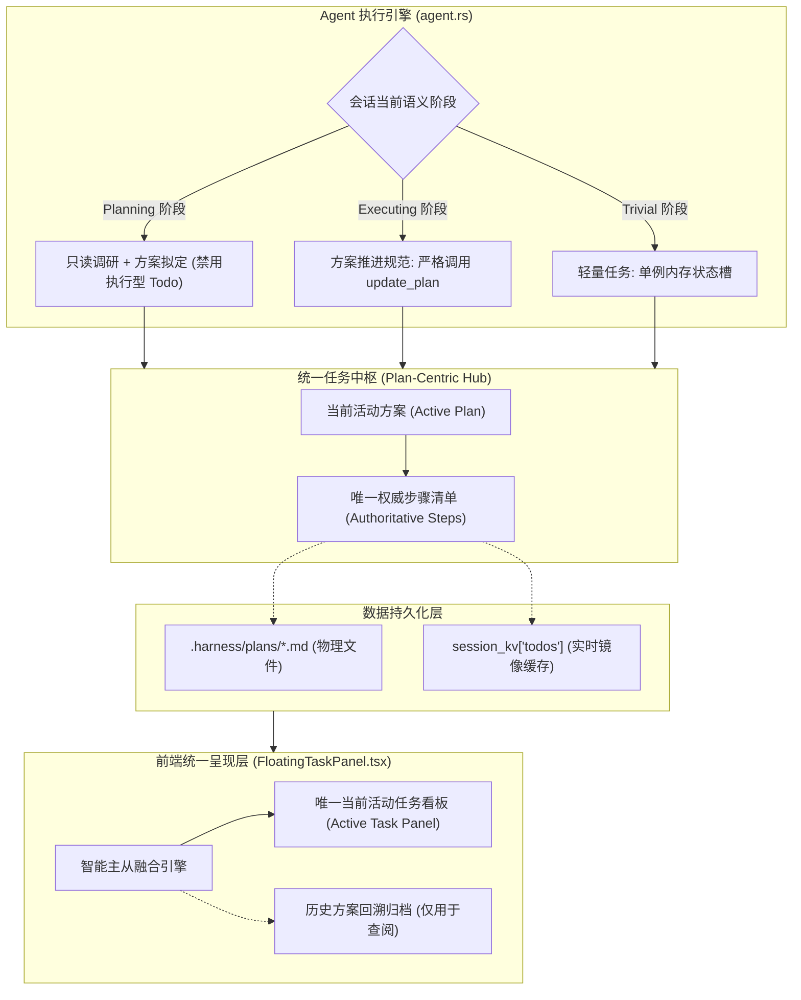

# 方案与待办一体化及任务状态机范式演进规范
# Plan & Todo Unification and Paradigm Evolution Specification (Plan-Centric Single Truth)

本文档系统性复盘 `harness_mini` 在实际双会话压测中暴露的“单轮对话产生两轮任务清单”缺陷，深度解构原有“方案（Plan）与待办（Todo）双轨并行”模式的根本性架构弊端，论证为何局部修补无法彻底根治，并确立全新的 **“单轨方案即进度（Plan-Centric Single Truth）”** 架构范式与落地规范。

---

## 目录
- [一、背景复盘与双会话实机问题解构](#一背景复盘与双会话实机问题解构)
  - [1. 实机测试会话定位](#1-实机测试会话定位)
  - [2. 核心痛点现象还原](#2-核心痛点现象还原)
  - [3. 伴生性深层缺陷排查](#3-伴生性深层缺陷排查)
- [二、深度思辨：为什么现有模式的“局部修补”无法根治问题](#二深度思辨为什么现有模式的局部修补无法根治问题)
  - [1. Prompt 负向约束的“确定性失效”](#1-prompt-负向约束的确定性失效)
  - [2. 前端启发式折叠的“下游盲猜困局”](#2-前端启发式折叠的下游盲猜困局)
  - [3. 后端终态篡改的“审计与语义割裂”](#3-后端终态篡改的审计与语义割裂)
- [三、当前模式的三大根本性架构缺陷](#三当前模式的三大根本性架构缺陷)
  - [1. 缺陷一：双轨制架构冲突（Plan 与 Todo“一仆二主”）](#1-缺陷一双轨制架构冲突plan-与-todo一仆二主)
  - [2. 缺陷二：范式错位（可变状态实体 vs 不可变事件日志）](#2-缺陷二范式错位可变状态实体-vs-不可变事件日志)
  - [3. 缺陷三：语义生命周期缺失（物理消息轮次 vs 任务阶段）](#3-缺陷三语义生命周期缺失物理消息轮次-vs-任务阶段)
- [四、业内领先 Agent 任务治理模式演进对比](#四业内领先-agent-任务治理模式演进对比)
  - [1. 模式横向调研大盘](#1-模式横向调研大盘)
  - [2. 演进路线决断：单轨方案即进度（Plan-Centric）](#2-演进路线决断单轨方案即进度plan-centric)
- [五、新范式架构全景与状态机设计](#五新范式架构全景与状态机设计)
  - [1. 整体架构全景图](#1-整体架构全景图)
  - [2. 三阶段语义生命周期模型（Phase-Aware Model）](#2-三阶段语义生命周期模型phase-aware-model)
  - [3. 单一真理源状态同步流图](#3-单一真理源状态同步流图)
- [六、分层落地改造技术方案](#六分层落地改造技术方案)
  - [1. 后端规则编排与互斥守卫（Rust / agent.rs）](#1-后端规则编排与互斥守卫rust--agentrs)
  - [2. 后端生命周期真实性对齐（Rust / agent.rs & plan.rs）](#2-后端生命周期真实性对齐rust--agentrs--planrs)
  - [3. 前端看板智能主从融合引擎（React / FloatingTaskPanel.tsx）](#3-前端看板智能主从融合引擎react--floatingtaskpaneltsx)
  - [4. 对话主消息流视觉降噪（React / ToolCard.tsx）](#4-对话主消息流视觉降噪react--toolcardtsx)
- [七、工程验证与验收指标](#七工程验证与验收指标)

---

## 一、背景复盘与双会话实机问题解构

在 2026-09-29 的实机研发压测中，测试人员在两个独立工作区先后发起了完全相同的复杂任务指令：
> *“我需要实现一个简单的jev对话测试工具，以了解jev的功能和调用协议，使用中转网站opencode内的jev-1.13-free；先分析需求，并推荐详细的实现方案，可参考业内其他工具和开源项目”*

通过对本地数据库 `.dev-data/harness_mini.db` 消息轨迹的全链路追踪，复现出如下严重缺陷：

### 1. 实机测试会话定位
- **会话 A**：`e1a47738-00e1-4243-875d-21935b19bf13`（归属项目 `test_jev_01`）
- **会话 B**：`1be981dc-4525-487b-9f78-876c46f33f96`（归属项目 `test_jev_03`）

### 2. 核心痛点现象还原
在两条会话中，用户**实际上都只发起了一轮真正的任务编码实施**（前 3 轮均为需求分析、协议调研与方案确认，直到第 4 轮用户回复“确认”才真正动手执行）。但右侧悬浮任务看板均分裂出多套清单：

```
【会话 A 看板呈现】: 顶部显示 "3 阶段"
  ├─ 阶段 1: 第 1 轮任务清单 (已完成, 7项)  <-- 实际上是第1轮调研时模型提前偷跑的实现步骤
  ├─ 阶段 2: jev实施计划方案 (已完成, 7项)  <-- 第2轮创建落盘的方案文档
  └─ 阶段 3: 第 2 轮任务清单 (已完成, 7项)  <-- 第4轮确认后真正执行的实现步骤

【会话 B 看板呈现】: 顶部显示 "2 阶段"
  ├─ 阶段 1: jev实现计划 (已挂起, 7/8完成) <-- 物理方案文档
  └─ 阶段 2: 当前任务清单 (已完成, 8/8完成) <-- 同一轮对话中模型并发调用的 todo 工具
```

### 3. 伴生性深层缺陷排查
1. **状态机终态语义严重对立（会话 B）**：
   - 步骤 7（在线真机联调）因缺少真实 API Key，模型在交付时调用 `update_plan(status: "suspended")` 将方案标记为**已挂起（7/8 完成）**；
   - 但 Agent 同时调用的 `todo` 工具及后端的 `auto_finish_session_todos` 逻辑，强行把 8 个步骤全部标记为 `done`；
   - 最终呈现为：方案显示黄色“已挂起”，待办清单却显示绿色“已完成”，同一任务在同一看板内自相矛盾。
2. **命令执行兼容性中断与反复重试（会话 A & B）**：
   - Agent 生成了不兼容当前 Windows PowerShell 语法的命令（如 `Start-Process -Environment`、`Write-Output` 管道传参丢失），导致命令反复失败中断，空耗了大量上下文和推理耗时。
3. **工具参数缺失与自纠机制触发（会话 A）**：
   - 模型在调用 `update_plan` 时遗漏必填参数 `reason` 导致报错，依赖系统的工具自纠机制才重试成功。

---

## 二、深度思辨：为什么现有模式的“局部修补”无法根治问题

面对上述问题，若仅在现有双轨制架构上做打补丁式的微调，已被事实证明会迅速遭遇瓶颈。

### 1. Prompt 负向约束的“确定性失效”
- **缺陷表现**：若在 System Prompt 中加入“调研阶段严禁调用 todo”、“有 plan 时不要调 todo”。
- **失效机理**：大语言模型（LLM）具有概率性、长上下文注意力衰减和“粉色大象效应（越强调禁止，越容易被负向 token 激活）”。面对 DeepSeek、GLM、Claude 等不同基模时，对负向 Prompt 的依从率差异极大；只要用户输入中包含“请帮我规划一下”、“分步分析”，模型便会再次越界调用 `todo`。

### 2. 前端启发式折叠的“下游盲猜困局”
- **缺陷表现**：若在前端通过字符串相似度比对、按 User 消息轮次折叠、或者识别是否包含确认词。
- **失效机理**：
  1. 用户在真实研发交互中，常常会追加“顺便把日志格式改一下”或“第三步换个库”，这属于同一任务的局部修正，而非新任务轮次；
  2. 前端永远是在下游去“猜测”上游大模型的黑盒意图，导致前端代码充斥着层层嵌套的三元运算符、真值短路陷阱与 fallback，一旦上游返回结构微调，前端即刻崩溃。

### 3. 后端终态篡改的“审计与语义割裂”
- **缺陷表现**：原方案设计的 `auto_finish_session_todos` 在会话结束时，强行遍历数据库把剩余项从 `pending` 覆盖为 `done`，甚至逆向篡改 `tool_events` 历史表。
- **失效机理**：
  1. **破坏审计日志不可变性**：大模型明明没有发起全量完成的调用，数据库历史入参却被后端强行篡改；
  2. **抹杀真实的未完成语义**：如会话 B 中，模型因为依赖外部环境故意挂起方案，后端一刀切标完成的行为直接摧毁了任务管理系统的真实性与严肃性。

---

## 三、当前模式的三大根本性架构缺陷

```mermaid
flowchart TD
    subgraph Defect1["缺陷一: 双轨制一仆二主"]
        D1A["Plan 物理文件 (.harness/plans/*.md)"]
        D1B["Todo 工具调用 (session_kv + tool_events)"]
        D1A <-->|概念重叠 / 数据流分叉| D1B
    end

    subgraph Defect2["缺陷二: 范式错位"]
        D2A["状态机实体 (Mutable State)"]
        D2B["被包装为追加型工具 (Append-only Log)"]
        D2A -->|每次变更全量重传几十行JSON| D2B
        D2B -->|Token剧烈浪费 / 消息流卡片刷屏| D2C["终态自然缺失"]
    end

    subgraph Defect3["缺陷三: 语义生命周期缺失"]
        D3A["物理消息切分 (User Msg 1, 2, 3...)"]
        D3B["粗暴等同于任务轮次 (第1轮, 第2轮...)"]
        D3A -->|调研草案与最终实施无法区分| D3B
    end
```



### 1. 缺陷一：双轨制架构冲突（Plan 与 Todo“一仆二主”）
- 系统内存在两套完全平行的任务进度模型：
  - **Plan 体系**：面向复杂任务，落盘为 Markdown，内含 `steps`（步骤 Checklist）；
  - **Todo 体系**：面向多步任务，通过 `todo` 工具调用，落盘为 `tool_events` 和 `session_kv["todos"]`。
- **两套体系既未物理隔离，也未主从归一**。后端虽有 `sync_steps_to_todos`，但在前端悬浮面板中直接做线性拼接 `[...planTasks, ...todoTasks]`，导致同一套任务在界面上分裂为两个完全重复的阶段。

### 2. 缺陷二：范式错位（可变状态实体 vs 不可变事件日志）
- **事件日志（Tool Call）** 本质是只追加的不可变轨迹（Immutable Event）；
- **任务进度（Checklist）** 本质是会话范围内的单一可变状态机（Mutable State Machine）。
- 强行用 Tool Call 承载状态机，导致 Agent 每次打勾都要重新全量输出整个 todos 数组：
  - 5 次更新浪费数千 Token；
  - 聊天主消息流被巨幅的重复卡片淹没；
  - 任务结束时，模型自然行为是向用户直接输出总结文本，天然缺失“尾部再调一次 todo 标全勾”的动机，倒逼后端写出黑魔法去篡改数据库。

### 3. 缺陷三：语义生命周期缺失（物理消息轮次 vs 任务阶段）
- 系统将用户的“消息条数”与“任务生命周期”画了等号；
- 真实工程任务往往跨越多个交互片段：
  $$\text{任务生命周期} = \text{调研对齐期 (Planning)} \to \text{正式实施期 (Executing)} \to \text{完工验收期 (Delivered)}$$
- 缺乏这一分层，使得系统把调研期的临时探索输出也收录为“正式任务”，造成“一轮实际执行，看板出现两轮清单”。

---

## 四、业内领先 Agent 任务治理模式演进对比

### 1. 模式横向调研大盘

| 知名产品 / 框架 | 任务管理范式 | 方案与待办的关系 | 步骤打勾与终态推进机制 | 本项目借鉴要点 |
| :--- | :--- | :--- | :--- | :--- |
| **Claude Code** (Anthropic) | **TodoWrite (Singleton State)** | 抛弃沉重的独立文档，只有唯一全局 TodoWrite 状态槽 | 模型按需调用更新，前端仅展示单一全局视图，不产生多轮堆叠 | **单状态槽理念**：杜绝时间线无限平铺。 |
| **Devin / Manus** (Cognition) | **Runtime-Driven Playbook** | 方案（Playbook）即进度，完全没有独立的 todo 工具 | 模型仅在首步制定步骤，后续由运行时（Runtime）根据执行动作自动推进打勾 | **运行时驱动**：减轻大模型打勾负担。 |
| **Roo Code / Cline** | **Plan Mode vs Act Mode** | Plan 模式整理分步，Act 模式严格按分步推进 | 双模式物理隔离，在 Plan 模式下硬性禁止产生执行型待办 | **阶段硬隔离**：调研期与执行期工具集隔离。 |
| **Google Antigravity** | **Plan-Centric Implementation Plan** | 方案为唯一真理源，轻量任务不落盘，复杂任务单轨方案推进 | 步骤全部内置在方案中，更新方案即更新进度 | **单轨方案即进度**：杜绝双轨数据分叉。 |

### 2. 演进路线决断：单轨方案即进度（Plan-Centric）
经过深度权衡，`harness_mini` 采纳 **“单轨方案即进度（Plan-Centric Single Truth）”** 作为核心架构范式：
- **方案是唯一的任务容器**：对于具有多个步骤、涉及代码修改的工程任务，`.harness/plans/*.md` 的 `steps` 就是唯一的 Checklist；
- **废黜/降级独立的 `todo` 工具**：有活动方案时，严禁模型另立 `todo`；无方案时，轻量级待办直接复用与方案完全一致的单例状态机。

---

## 五、新范式架构全景与状态机设计

### 1. 整体架构全景图



### 2. 三阶段语义生命周期模型（Phase-Aware Model）

```mermaid
stateDiagram-v2
    [*] --> Planning: 用户提出初始复杂需求
    
    state Planning {
        [*] --> Exploring: 只读调研 (grep/glob/read_file)
        Exploring --> DraftPlan: 拟定方案 (create_plan)
        DraftPlan --> AwaitingApproval: 停下等待用户审阅/确认
        note right of Planning: 严禁调用执行型 todo / 严禁写代码
    }
    
    Planning --> Executing: 用户确认方案 (发送"确认"/"执行")
    
    state Executing {
        [*] --> StepRunning: 执行当前步骤 (edit_file/run_command)
        StepRunning --> StepDone: 推进方案步骤 (update_plan)
        StepDone --> StepRunning: 继续下一步
    }
    
    Executing --> Delivering: 所有步骤执行完毕或遇到阻塞
    
    state Delivering {
        [*] --> CompleteValidation: 自检通过 -> update_plan(completed)
        [*] --> BlockedSuspended: 依赖缺失 -> update_plan(suspended)
    }
    
    Delivering --> Finished: 总结答复用户 (自然语言直出)
```

### 3. 单一真理源状态同步流图
1. **开局创建**：Agent 调用 `create_plan`，方案落地为 `.harness/plans/*.md`，其 steps 作为权威初始状态；
2. **执行推进**：每完成一个关键节点，Agent 仅调用 `update_plan(reason, modified_sections)`，后端自动单向更新内存与缓存；
3. **交付收敛**：若方案显式标记为 `suspended`，看板顶栏与所有分步进度精确保持挂起状态（例如 7/8 完成），**严禁后端无脑标为 100% 全完成**。

---

## 六、分层落地改造技术方案

### 1. 后端规则编排与互斥守卫（Rust / `agent.rs`）
- **互斥规则注入机制**：
  在 `build_system_prompt` 中，当检测到处于方案模式（`plan_first` 或 `always_plan`/`always_proceed`）时，**完全停用 `todo_lifecycle` 规则**；
- **注入强化指令**：
  ```rust
  // 核心规则变更
  if is_sop_enabled("plan_first") || plan_mode != "standard" {
      rules.push(format!(
          "{rule_num}. 【单轨方案推进规范（严禁另立清单）】：\n   \
           - 当前任务由结构化方案（Plan）全权接管进度。方案 Checklist 即为唯一任务清单！\n   \
           - 执行阶段，每完成关键步骤严格调用 `update_plan` 推进步骤状态；\n   \
           - 【严禁调用 `todo` 工具另立重复待办】，方案文档是系统唯一的进度真理源；\n   \
           - 在用户确认方案前（调研与方案对齐阶段），严禁输出执行型步骤清单。"
      ));
  } else if is_sop_enabled("todo_lifecycle") {
      // 仅在无方案的极简任务中，才降级使用轻量 todo 规则
  }
  ```

### 2. 后端生命周期真实性对齐（Rust / `agent.rs` & `plan.rs`）
- **重构 `auto_finish_session_todos`**：
  必须与方案物理状态强一致绑定：
  ```rust
  pub fn auto_finish_session_todos(state: &crate::AppState, app: &AppHandle, session_id: &str) {
      let db = state.db.lock().unwrap();
      
      // 1. 检查当前会话是否存在活动方案
      if let Ok(Some(active_plan_id)) = store::get_kv(&db, session_id, "active_plan_id") {
          if !active_plan_id.is_empty() {
              // 2. 若存在活动方案，查询其实际状态
              if let Ok(Some(plan_meta)) = store::get_plan_meta_by_id(&db, &active_plan_id) {
                  // 若方案本身未处于 completed（如 suspended、failed），严禁将 todos 强标为全 done！
                  if plan_meta.status != "completed" {
                      return; // 严格尊重方案挂起/部分完成的真实终态
                  }
              }
          }
      }
      
      // 3. 仅对真正正常完成的轻量任务执行安全收尾
      ...
  }
  ```

### 3. 前端看板智能主从融合引擎（React / `FloatingTaskPanel.tsx`）
- **废黜数组暴力平铺**：彻底移除 `timeline = [...planTasks, ...todoTasks]`；
- **主从判定算法**：
  ```typescript
  const timeline: TimelineTask[] = useMemo(() => {
    // 1. 优先提取归属于当前会话的方案任务
    const validPlanTasks = planTasks.filter(
      (p) => !p.sessionId || p.sessionId === currentId || relatedSessionIds.has(p.sessionId)
    );

    // 2. 若当前会话存在有效方案，以方案作为唯一任务实体
    if (validPlanTasks.length > 0) {
      // 方案即任务，不需要将 todoTasks 作为独立阶段并列排入
      return validPlanTasks.sort((a, b) => {
        const tA = a.createdAt ? new Date(a.createdAt).getTime() : 0;
        const tB = b.createdAt ? new Date(b.createdAt).getTime() : 0;
        return tA - tB;
      });
    }

    // 3. 仅在纯轻量任务模式下（无方案），才回退展示 todoTasks
    // 且只提取最终执行轮次的有效清单，过滤掉调研草案
    const latestExecutionTodo = todoTasks[todoTasks.length - 1];
    return latestExecutionTodo ? [latestExecutionTodo] : [];
  }, [planTasks, todoTasks, currentId, relatedSessionIds]);
  ```
- **消除“第 1 轮 / 第 2 轮”荒谬标题**：
  统一主标题呈现：方案模式下显示方案标题（如 `jev-1.13-free 对话测试工具实现计划`），轻量模式下统一显示 `当前任务清单`。

### 4. 对话主消息流视觉降噪（React / `ToolCard.tsx`）
- 在方案模式下，`update_plan` 工具卡片呈现紧凑的单行步骤推进视图（如 `已推进步骤 3/8: 实现 client.py`）；
- 避免在聊天窗口中连续输出全量 8 项 JSON 展开大卡片，保持交互流清爽聚焦。

---

## 七、工程验证与验收指标

| 验证项 | 验证前缺陷状态 | 验证后验收标准 |
| :--- | :--- | :--- |
| **会话 A 场景验证（先调研后确认）** | 第 1 轮调研即输出 7 项清单标完成；确认后又输出一轮清单；看板显示 3 阶段，含“第1轮/第2轮任务清单”。 | 第 1 轮只输出调研结论与方案；确认后统一通过方案推进；**看板只显示 1 个当前活动方案阶段**，绝无“第 1 轮/第 2 轮”。 |
| **会话 B 场景验证（部分完成挂起）** | 步骤 7 挂起，方案显示黄色已挂起（7/8），待办清单显示绿色已完成（8/8）。 | **状态完全统一**：看板顶部显示“已挂起”，步骤完成率精确显示为 7/8，绝无 Todo 强刷全绿现象。 |
| **轻量无方案任务验证** | 修复方案影响了简单修改任务的执行。 | 用户提问“改一下拼写错误”等微小任务时，依然能以单例待办正常流转，不强制要求创建大方案文档。 |
| **代码质量与编译自检** | / | `cargo check` 零编译告警；前端 `tsc --noEmit` / `npm run build` 零类型报错。 |
