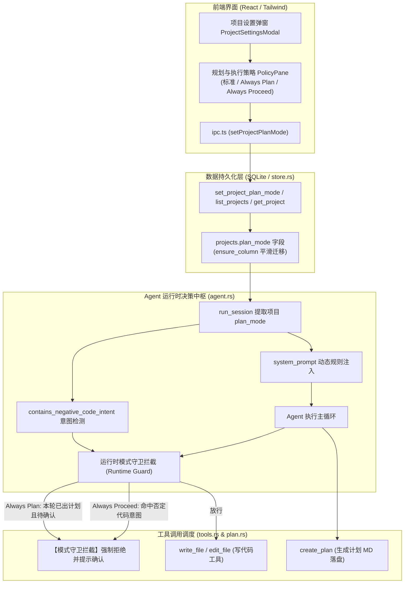
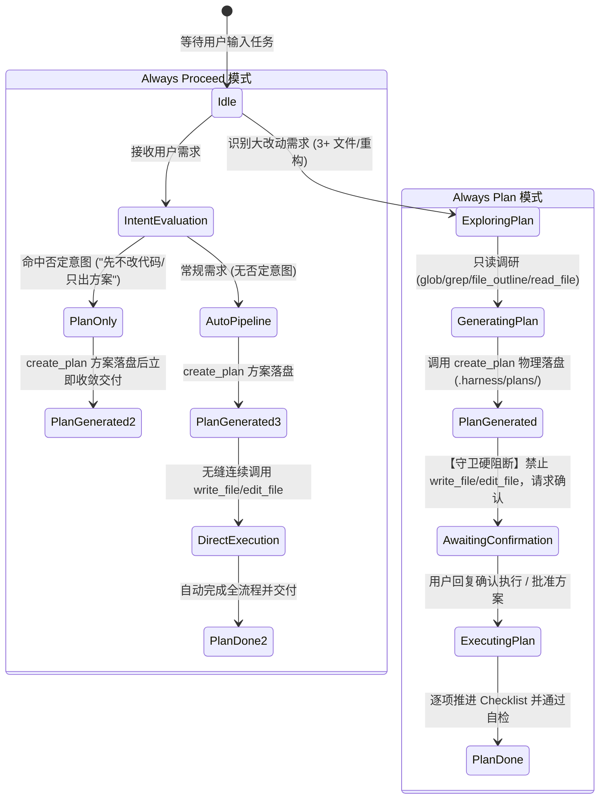

# 任务规划与执行策略模式及运行时守卫规范
# Task Plan Execution Policy & Runtime Guard Specification (Always Plan / Always Proceed)

本文档详细记录 `harness_mini` 中 **项目级任务规划与执行策略系统（Plan Execution Policy）** 与 **运行时双重守卫拦截引擎（Runtime Guard Engine）** 的架构设计、业内方案对比、数据持久化、提示词编排及前后端落地规范。

---

## 目录
- [一、背景与核心痛点剖析](#一背景与核心痛点剖析)
- [二、业内顶级 Agent 工具规划与执行机制调研](#二业内顶级-agent-工具规划与执行机制调研)
- [三、架构全景与策略状态机设计](#三架构全景与策略状态机设计)
  - [1. 架构全景图](#1-架构全景图)
  - [2. 三大核心执行模式定义](#2-三大核心执行模式定义)
  - [3. 策略状态机流转](#3-策略状态机流转)
- [四、核心机制与分层实现方案](#四核心机制与分层实现方案)
  - [1. 存储层与模型层（SQLite & Rust Model）](#1-存储层与模型层sqlite--rust-model)
  - [2. 规则与提示词编排层（System Prompt Orchestration）](#2-规则与提示词编排层system-prompt-orchestration)
  - [3. 运行时双重守卫拦截引擎（Runtime Guard Engine）](#3-运行时双重守卫拦截引擎runtime-guard-engine)
  - [4. 否定意图识别引擎（Negative Intent Detector）](#4-否定意图识别引擎negative-intent-detector)
- [五、前端界面与交互规范](#五前端界面与交互规范)
  - [1. 项目设置弹窗「规划与执行」面板](#1-项目设置弹窗规划与执行面板)
  - [2. 对话框顶部栏清爽设计准则](#2-对话框顶部栏清爽设计准则)
  - [3. 计划卡片交互与协同](#3-计划卡片交互与协同)
- [六、边界场景与鲁棒性保障](#六边界场景与鲁棒性保障)
- [七、测试体系与工程验证](#七测试体系与工程验证)

---

## 一、背景与核心痛点剖析

在实际使用 AI 编码助手推进工程任务时，开发者在**“安全性/可控性”**与**“吞吐效率/自动化”**之间面临核心矛盾：

1. **脱缰野马式的误改风险（Always Plan 的必要性）**：
   - 在生产核心代码库、复杂分布式项目或大型重构场景下，若 Agent 面对跨多文件的任务直接动手写代码，一旦技术选型偏离预期或理解偏差，将导致大面积代码被污染，排错与回滚成本极高。
   - **痛点**：缺乏强制方案前置与人工审阅门禁。
2. **频繁确认的交互疲劳（Always Proceed 的必要性）**：
   - 在敏捷开发、快速原型构建或日常中小型特性迭代中，用户希望 Agent 具备清晰的技术方案与步骤清单（以便追踪和生成规范文档），但不需要每一步都被弹窗或交互打断。
   - **痛点**：若每次出方案后都停下来等待人工回复“确认”，严重阻断连续交付的流畅性。
3. **“仅靠 Prompt 无法杜绝偷跑”的模型确定性缺陷**：
   - 大模型存在固有概率性与“执行热情”。仅在 System Prompt 中叮嘱“出完计划请等待确认”，模型仍常在同一个运行轮次（Turn）中连续调用 `create_plan` 紧接着调用 `write_file`，造成越界修改。
   - **核心诉求**：必须引入底层**运行时确定性拦截守卫（Runtime Guard）**，构成“软硬兼施”的双重防线。

---

## 二、业内顶级 Agent 工具规划与执行机制调研

通过对业内领先 AI Coding Agent 的系统性调研，梳理出如下核心机制：

| 工具产品 | 模式机制 | 计划制定与阻断逻辑 | 自动推进（Proceed）策略 | 对本项目的借鉴点 |
| :--- | :--- | :--- | :--- | :--- |
| **Claude Code** (Anthropic) | **Plan Mode vs Act Mode** (Shift+Tab 或 `/plan`) | 在 Plan Mode 下**硬性禁用所有修改/写入类工具**，仅开放 View/Search/LS 工具；拟定方案后主动退出并输出计划，等待用户按回车批准。 | 退出 Plan Mode 进入 Act Mode 后，Agent 获取写入权限并连续自动推进，不再逐步停顿。 | **权限层硬拦截**：用工具集权限约束保证在确认前绝不动代码。 |
| **Roo Code / Cline** (VS Code) | **Dual-Mode 体系** (Plan / Act Mode) + Auto-Approve | Plan 模式专注探索、梳理 Checklist，底部显示“切换至 Act Mode”按钮，不修改代码；Act 模式负责落地实施。 | 搭配 Auto-Approval 开关：在 Act 模式下若开启写权限自动批准，计划一经生效即连贯完成全部 Checklist。 | **前端显式确认卡片**：计划生成后，前端提供一键“批准并执行”的快捷交互。 |
| **Google Antigravity** | **Planning Mode** (Research ➔ Plan ➔ Approval ➔ Execute) | 对大改动强制生成 `implementation_plan.md`，置 `request_feedback: true`，**系统强制 STOP 等待用户显式 Approval**。 | 在非 Planning 模式或 Direct Execution 下，计划生成后自动顺延进入 Execute 流程。 | **大改动量化阈值**：以文件数量（3+）、重构幅度定义触发计划的硬指标。 |
| **Devin** (Cognition Labs) | **Playbook Review Gate** (企业风控策略) | 面对复杂任务先在侧边栏生成分步 Playbook。开启强风控策略时，Playbook 处于 Pending Review，执行引擎挂起。 | 默认模式下 Playbook 生成与代码编写同 Run 自动串联；若用户输入含 "just plan" 则自动进入审查挂起。 | **否定意图（Negative Intent）检测**：智能识别用户消息中“只出方案/先不改代码”等语义。 |
| **Aider** (Architect 模式) | **Architect / Code 双模型流水线** | Architect 负责产出技术方案并征询用户：“Execute these changes? (Y/n)”。 | 支持 `--yes` 自动放行参数：方案出完后直接驱动 Code Editor 编写代码。 | **计划与执行两阶段解耦**。 |

---

## 三、架构全景与策略状态机设计

### 1. 架构全景图



### 2. 三大核心执行模式定义

| 模式 | 存储值 | 行为准则 | 适用场景 |
| :--- | :--- | :--- | :--- |
| **标准模式 (Standard)** | `standard` (默认) | 维持原有灵活机制。面对复杂任务由 Agent 依据通用准则自主评估，常规任务直接处理。 | 日常对话与普通编码任务。 |
| **强计划确认模式 (Always Plan)** | `always_plan` | 凡涉及 3+ 文件修改、架构重构、新增功能特性，**必须先使用只读工具调研并调用 `create_plan` 落盘方案，底层硬性拦截同轮次代码修改，必须等待用户确认后才允许下一步改代码**。 | 生产级核心仓库、架构级重构、敏感代码库。 |
| **自动推进模式 (Always Proceed)** | `always_proceed` | 面对大改动**同样强制必须先调用 `create_plan` 生成方案**（确立任务锚点与 Checklist）；生成后：若用户明确说明“先不改代码 / 仅出方案”，则仅输出方案；若用户未说明，**无需等待用户确认，自动连续调用工具编写代码落地**。 | 快速特性迭代、敏捷开发、新功能原型推演。 |

### 3. 策略状态机流转



---

## 四、核心机制与分层实现方案

### 1. 存储层与模型层（SQLite & Rust Model）

- **数据表结构扩展**：
  在 `projects` 表中新增 `plan_mode` 字段，并通过 `ensure_column` 函数支持旧数据库无感知升级：
  ```sql
  ALTER TABLE projects ADD COLUMN plan_mode TEXT NOT NULL DEFAULT 'standard';
  ```
- **Rust 实体对齐 (`src-tauri/src/models.rs`)**：
  ```rust
  #[derive(Serialize, Deserialize, Clone, Debug)]
  #[serde(rename_all = "camelCase")]
  pub struct Project {
      ...
      /// 计划与执行模式："standard" | "always_plan" | "always_proceed"
      #[serde(default = "default_plan_mode")]
      pub plan_mode: String,
  }

  fn default_plan_mode() -> String {
      "standard".to_string()
  }
  ```
- **仓储更新与 IPC 命令 (`store.rs` & `commands.rs`)**：
  提供 `set_project_plan_mode(conn, id, mode)` 函数，在非法输入时自动 fallback 回 `"standard"`；Tauri 命令完成更新后派发 `projects:changed` 事件通知前端响应。

---

### 2. 规则与提示词编排层（System Prompt Orchestration）

在 `src-tauri/src/agent.rs` 的 `system_prompt` 中，根据项目当前的 `plan_mode`，动态注入最高优先级的行为准则：

#### (1) Always Plan 模式注入规则
```text
【严格规划先行与确认门禁准则（Always Plan 模式 - 强安全风控）】：
- 适用范围：凡是对项目进行较大改动（预计修改 3 个以上文件、架构重构、引入新架构或新增功能特性）：
- 阶段划分（严禁越界）：
  1. 【只读调研】：仅允许使用只读工具（glob / grep / list_dir / file_outline / read_file）摸清代码逻辑；
  2. 【生成计划】：必须先调用 create_plan 工具在 .harness/plans/ 目录下生成结构化计划 MD 文档；
  3. 【必须停止并等待确认】：生成计划后，当前轮次严禁调用任何写文件或编辑代码的工具（write_file / edit_file）！你必须在回复中简明扼要汇报方案核心、涉及文件与分步清单，并明确请用户审阅确认。只有在用户确认计划后，下一轮对话才可开始修改代码。
- 微小改动（如修改单文件拼写错误、纯问答解释）无需生成计划，可直接处理。
```

#### (2) Always Proceed 模式注入规则
```text
【规划先行与自动推进准则（Always Proceed 模式 - 敏捷高效）】：
- 适用范围：凡是对项目进行较大改动（预计修改 3 个以上文件、跨模块重构、新增功能特性）：
- 核心流程：
  1. 【必须先有计划】：同样必须调用 create_plan 工具生成结构化计划 MD 文档落盘，确立任务锚点与分步 Checklist；
  2. 【自动推进与意图判断】：生成计划后：
     * 若用户在指令中明确说明了“先不改动代码 / 仅出方案 / 暂勿修改 / 先评估”，则生成计划后停止，严禁改动代码；
     * 若用户没有明确说明先不改代码，生成计划后无需停下来等待用户确认，直接连贯执行计划、调用 edit_file / write_file 编写代码，按清单逐步推进直至完成并自检！
- 微小改动（如单文件微调、纯解释）可直接处理。
```

---

### 3. 运行时双重守卫拦截引擎（Runtime Guard Engine）

为彻底解决大模型“幻觉越界”问题，在 `agent.rs` 的主工具分发循环中加入硬性状态机拦截：

```rust
let is_modifying = tc.name == "write_file" || tc.name == "edit_file";
let guard_denied = if is_modifying {
    if project_plan_mode == "always_plan" && created_plan_in_this_turn {
        Some("【模式守卫拦截】: 当前项目启用了「Always Plan 模式」，执行方案刚刚生成，严禁在同一轮次中未经用户确认直接修改代码。请停止调用写入工具，向用户汇报当前计划核心并请求确认。".to_string())
    } else if project_plan_mode == "always_proceed" && negative_code_intent {
        Some("【模式守卫拦截】: 用户在当前任务中明确说明了先不改动代码（仅出方案/评估）。你已完成计划制定，严格禁止在当前轮次修改代码。请向用户输出方案说明并等待用户指示。".to_string())
    } else {
        None
    }
} else {
    None
};
```
- **效果**：命中拦截后，系统自动构造 `ToolEvent (status: "denied", approval_scope: "guard_blocked")`，不触发实际磁盘写入；
- **自愈收敛**：模型接收到明确的拦截原因后，会立刻停止调用写入工具，向用户输出方案汇报并等待确认。

---

### 4. 否定意图识别引擎（Negative Intent Detector）

在 `always_proceed` 模式下，系统在启动轮次前自动扫描用户 Prompt 中的否定词根：

```rust
fn contains_negative_code_intent(s: &str) -> bool {
    let text = s.to_lowercase();
    let keywords = [
        "先不改代码", "先别改代码", "暂时别改代码", "不要改代码", "暂不改动代码",
        "先出方案", "只出方案", "先不要改代码", "只给方案", "仅出方案", "先给出方案",
        "方案我看下", "方案我看看", "只评估", "仅评估", "先评估", "仅设计", "只设计",
        "don't edit code", "don't modify code", "plan only", "only plan",
    ];
    keywords.iter().any(|k| text.contains(k))
}
```

---

## 五、前端界面与交互规范

### 1. 项目设置弹窗「规划与执行」面板

在 `src/components/ProjectSettingsModal.tsx` 中：
- 侧边栏导航增加 **「规划与执行」**（Tab `"policy"`，配 Sliders 图标）；
- 采用 Radio Cards（单选卡片）交互，清晰呈现模式标题、场景徽章（默认模式 / 严格安全风控 / 敏捷连续交付）、核心规则与适用场景；
- 遵循统一的草稿状态（Drafting）管理与脏检查（`dirty`），通过底部统一的「应用 / 保存 / 取消」提交落库。

### 2. 对话框顶部栏清爽设计准则

遵循产品设计要求，**不在对话框顶部栏（TopBar）增加任何状态徽标或模式标签**：
- 保持对话主界面极简清爽；
- 模式信息内聚于「项目设置」中管理，行为边界通过 ToolCard 和 Agent 回复自解释。

### 3. 计划卡片交互与协同

在 `src/components/ToolCard.tsx` 中：
- 当调用 `create_plan` 成功后，渲染标准化计划卡片（展示标题、版本、目标、架构、分步实施清单）；
- 在 `Always Plan` 模式下，用户审查方案完毕后，回复“确认执行”即可自动激活后续代码修改。

---

## 六、边界场景与鲁棒性保障

1. **微小修改（Surgical Tweaks）绕过规则**：
   - 对于单文件小改动（如修改配置项、修复拼写、问答分析），`Always Plan` 和 `Always Proceed` 均允许直接处理，避免滥用计划造成流程笨拙与 Token 浪费。
2. **临时空间（Sandbox）继承规则**：
   - 临时空间会话默认继承原项目的 `plan_mode` 设置；
   - 临时空间内置快照与基线保护，与规划模式互为补充。
3. **协作子 Agent（Subagents）继承规则**：
   - 主会话派生的常驻协作者（如前端/后端专家）和临时子进程严格继承主项目执行策略，防止子进程绕过风控修改代码。

---

## 七、测试体系与工程验证

### 1. 自动化单元测试验证

| 模块 | 测试用例 | 验证目标 | 结果 |
| :--- | :--- | :--- | :--- |
| `store::tests` | `test_project_plan_mode_crud` | 数据库字段迁移、默认值 fallback、增删改查一致性 | **PASS (0.02s)** |
| `agent::tests` | `test_system_prompt_plan_mode` | 验证不同模式下 Prompt 规则的准确动态注入 | **PASS (0.00s)** |
| `agent::tests` | `test_negative_code_intent` | 验证中英文多种否定语义识别的召回率与准确率 | **PASS (0.00s)** |

### 2. 编译与类型验证
- **Rust 后端**：`cargo check` 通过，耗时 2.77s，零警告、零错误；
- **前端打包**：`npm run build` (`tsc && vite build`) 通过，耗时 7.17s，类型检查 100% 通过。
