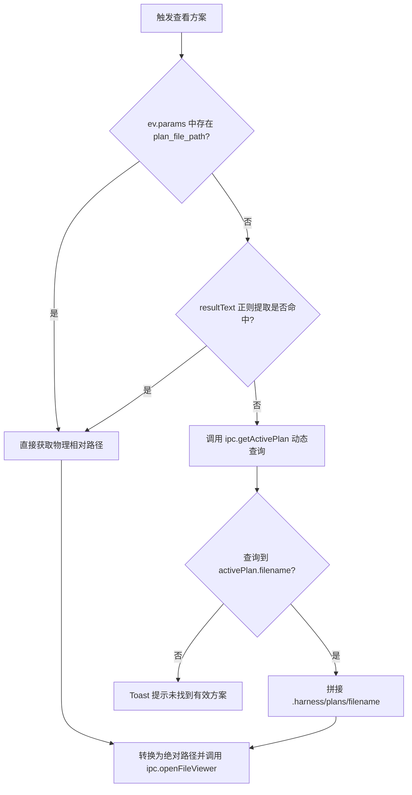
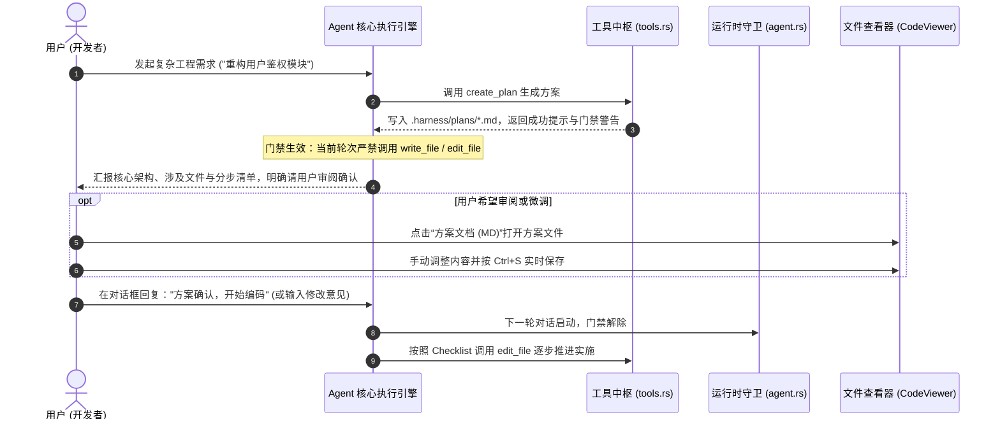

# 任务计划中枢演进：以文件为中心架构、运行时排错与对话驱动交互规范
# Plan Mode Refinement: File-Centric Architecture, Runtime Diagnostics & Conversational Workflow Specification

本文档系统性复盘并沉淀了 `harness_mini` 在**计划模式（Plan Mode）**迭代过程中遭遇的真实工程问题、排错诊断链、以物理文件为核心（File-Centric）的架构重构，以及全面去除显式批准按钮、统一回归自然语言对话驱动交互规范的设计决策。

---

## 目录
- [一、演进背景与核心诉求](#一演进背景与核心诉求)
- [二、关键故障根因剖析与诊断指南](#二关键故障根因剖析与诊断指南)
  - [1. 故障一：.harness 内部目录写操作审批死锁](#1-故障一harness-内部目录写操作审批死锁)
  - [2. 故障二：思考模型（Reasoning Models）纯思考流导致的空回复误报](#2-故障二思考模型reasoning-models纯思考流导致的空回复误报)
  - [3. 故障三：OpenAI 协议 tool_calls 消息缺少 content 键序列化异常](#3-故障三openai-协议-tool_calls-消息缺少-content-键序列化异常)
  - [4. 故障四：方案文档按钮置灰不可点击与跨平台路径失效](#4-故障四方案文档按钮置灰不可点击与跨平台路径失效)
  - [5. 故障五：方案看板脱离物理文件依赖 session_id 查询](#5-故障五方案看板脱离物理文件依赖-session_id-查询)
- [三、以物理文件为中心的设计（File-Centric Architecture）](#三以物理文件为中心的设计file-centric-architecture)
  - [1. 物理文件优先准则（Physical File as Source of Truth）](#1-物理文件优先准则physical-file-as-source-of-truth)
  - [2. 存储规范与跨平台路径归一化](#2-存储规范与跨平台路径归一化)
  - [3. 三级路径解析与动态兜底引擎](#3-三级路径解析与动态兜底引擎)
  - [4. 内置查看器中的 Markdown 渲染、编辑与 Ctrl+S 实时落盘](#4-内置查看器中的-markdown-渲染编辑与-ctrls-实时落盘)
- [四、对话驱动的统一流转交互范式（Conversational Workflow）](#四对话驱动的统一流转交互范式conversational-workflow)
  - [1. 为什么彻底去除显式“批准方案”按钮](#1-为什么彻底去除显式批准方案按钮)
  - [2. 业内顶级 Agent 对话驱动模式调研对比](#2-业内顶级-agent-对话驱动模式调研对比)
  - [3. 方案先行门禁与自然语言确认闭环](#3-方案先行门禁与自然语言确认闭环)
- [五、前后端架构落地与代码协同](#五前后端架构落地与代码协同)
  - [1. 后端 Rust 核心改动映射](#1-后端-rust-核心改动映射)
  - [2. 前端 React/TypeScript 核心改动映射](#2-前端-reacttypescript-核心改动映射)
- [六、工程验证与质量保障](#六工程验证与质量保障)

---

## 一、演进背景与核心诉求

在开启“规划先行（Plan First）”或“Always Plan”模式辅助复杂工程研发时，系统初期实现暴露出数项严重阻碍开发闭环的痛点：
1. **执行受阻与虚假错误**：规划阶段因为审批系统将系统自身内部治理目录（`.harness/`）拦截，导致计划落盘被挂起；或因大模型思考输出判定失误，给用户弹出虚假的“模型返回空回复”错误。
2. **计划文档孤岛化**：方案数据与底层 SQLite 数据库中的 `session_id` / `plan_id` 强耦合，用户无法直观把方案作为普通文件进行阅读、调整与复用。
3. **按钮状态僵死**：界面“方案文档 (MD)”按钮依赖脆弱的正则表达式解析，在 Windows 路径或更新迭代中频繁变成灰色不可点击状态。
4. **交互流程割裂**：界面各处分散着“🚀 批准执行方案”按钮，不仅容易因状态更新不及时而不可见，更割裂了以对话为主轴的自然语言交互体验。

为此，本次迭代确立了两大核心升级方向：
- **以物理 Markdown 文件为绝对实体（File-Centric）**：计划即文件（`.harness/plans/*.md`），生成了即可打开、查看、手动调整并即时保存；
- **对话驱动的交互统一（Conversational UX）**：完全移除外置的独立审批按钮，通过“方案出具 ➔ 门禁停止 ➔ 用户自然语言回复确认 ➔ 连贯编码实施”构建符合直觉的人机协同流水线。

---

## 二、关键故障根因剖析与诊断指南

### 1. 故障一：.harness 内部目录写操作审批死锁

#### 现象描述
开启 Plan 模式后，Agent 执行创建方案或更新记忆，用户没有看到审批卡片，对话流程意外挂起或中止。

#### 根因剖析
底层沙箱权限拦截机制（`handle_tool_call`）将写文件（`write_file` / `edit_file` / `create_plan`）统一视为高风险操作。当访问模式为 `confirm`（需确认模式）时，任何写操作都会触发审批挂起（`pending_approval`）。由于 `.harness/` 目录属于 Agent 自身记录工程记忆、运行状态和任务方案的私有目录，将其纳入写审批会导致 Agent 在“还没开始动用户业务代码”时就频繁被卡住。

#### 解决规范
在 `src-tauri/src/agent.rs` 的权限判定分支中，建立**全量系统白名单（Harness Whitelist）**机制：
```rust
let is_harness_operation = {
    let is_harness_tool = matches!(
        tool_name,
        "create_plan" | "update_plan" | "switch_plan" | "read_plan" | "record_memory"
    );
    let is_harness_path = path_arg.map(|p| {
        let p_norm = p.replace('\\', "/");
        p_norm.starts_with(".harness/")
            || p_norm == ".harness"
            || p_norm.contains("/.harness/")
            || p_norm.ends_with("/.harness")
    }).unwrap_or(false);
    is_harness_tool || is_harness_path
};

if full_access && tool_name != "temp_merge" {
    scope = Some("mode");
} else if is_harness_operation {
    // 方案/记忆/治理系统全量免审放行
    scope = Some("harness_whitelist");
}
```

---

### 2. 故障二：思考模型（Reasoning Models）纯思考流导致的空回复误报

#### 现象描述
使用具备深度思考能力（如 DeepSeek-R1、Claude Extended Thinking 或自定义推理模型）的模型时，对话报错：
> “模型返回了空回复。请检查设置中的模型名称是否正确、该模型是否支持工具调用（function calling），或更换模型后重试。”

#### 根因剖析
当推理模型在规划阶段调用工具或输出纯思考内容时，模型的 `content` 字段为空字符串 `""`，仅在 `reasoning`（或 `reasoning_content`）字段中吐出思考过程。旧版逻辑判断：
```rust
if result.content.trim().is_empty() && result.tool_calls.is_empty() {
    emit_error(app, session_id, "empty_response", ...);
}
```
该判断未检查 `result.reasoning`，当 `content` 与 `tool_calls` 为空但模型输出了数千字深入分析思考时，被系统误杀并截断。

#### 解决规范
在判定回复有效性时，充分尊重思考过程（Reasoning Fallback）：
```rust
let has_reasoning = !result.reasoning.trim().is_empty();
if result.content.trim().is_empty() && result.tool_calls.is_empty() {
    if has_reasoning {
        // 模型已完整输出思考分析，提供友好指引回填，避免直接抛错阻断
        result.content = "（模型已完成思考推演，未输出额外答复正文。请根据上方思考过程继续下达指令）".to_string();
    } else {
        emit_error(app, session_id, "empty_response", ...);
        return (RunOutcome::Failed, last_assistant_id, run_tokens);
    }
}
```

---

### 3. 故障三：OpenAI 协议 tool_calls 消息缺少 content 键序列化异常

#### 现象描述
在向第三方兼容 OpenAI 协议的模型转发带有工具调用的上一轮 `assistant` 历史消息时，服务端报错：
> `Invalid request: missing required field 'content' in assistant message`

#### 根因剖析
OpenAI 官方 JSON 规范明确要求：当 `role: "assistant"` 消息包含 `tool_calls` 时，`content` 字段**必须显式提供**，取值允许为 `null` 或字符串，不能缺失该键（omitted）。
旧版代码在转换历史消息时，若 `content` 为空便未添加该键，造成对规范严格的网关或代理拒绝请求。

#### 解决规范
在 `agent.rs` 中构建 `tool_calls` 消息时，显式保证 `"content": Value::Null`：
```rust
let mut obj = json!({
    "role": "assistant",
    "tool_calls": tc_arr,
    "content": Value::Null // 保证 OpenAI 兼容网关不报缺失字段
});
if let Some(c) = &m.content {
    if !c.is_empty() {
        obj["content"] = json!(c);
    }
}
```

---

### 4. 故障四：方案文档按钮置灰不可点击与跨平台路径失效

#### 现象描述
方案文件已在磁盘 `.harness/plans/` 下生成完毕，但工具卡片顶栏或操作区的“方案文档 (MD)”按钮一直显示为灰色禁用状态。

#### 根因剖析
1. **单一依赖正则匹配**：前端 `resolvedPlanFilePath` 仅靠 `ev.resultText.match(/\.harness\/plans\/([^`\s\n)]+\.md)/)` 提取相对路径；
2. **Windows 路径反斜杠失效**：Windows 系统下若工具返回路径使用了反斜杠 `\`（如 `.harness\plans\xxx.md`），或者文件名带有空格/括号，该正则直接失效返回 `null`；
3. **禁用条件过度绑定**：前端设置了 `disabled={ev.status !== "success" || !resolvedPlanFilePath}`，只要静态正则未命中，按钮永久置灰，无法挽救。

#### 解决规范
1. **后端透传显式字段**：在工具调用完成时，将物理路径直接注入 `ev.params.plan_file_path`；
2. **多模式智能正则**：归一化斜杠并扩大匹配宽容度：
   ```typescript
   const normalized = ev.resultText.replace(/\\/g, "/");
   const match = normalized.match(/(?:\.harness\/plans\/|plans\/)([^`\s\n"'<>]+\.md)/i);
   ```
3. **运行时异步兜底与状态解禁**：按钮仅在工具真正处于 `"running"` 极短时间禁用；非 running 态无论静态提取是否成功均允许点击，点击后触发 `ipc.getActivePlan(sessionId)` 兜底打开。

---

### 5. 故障五：方案看板脱离物理文件依赖 session_id 查询

#### 现象描述
在右侧任务总控面板点击“独立窗体”查看方案时，提示“未找到该任务方案文件或尚未生成方案”。

#### 根因剖析
右侧面板调用 `ipc.openFileViewer({ type: "plan", planId: ... })` 打开了老旧的虚拟看板 `PlanViewer`，后者通过复杂数据库关系链查找。若发生跨会话分叉、会话新建或草稿切换，根据 `sessionId` 查询极易落空。

#### 解决规范
遵循**“以文件为中心”**准则，统一调用 `ipc.openFileViewer({ type: "file", path: absPath })`，直接把方案作为磁盘实体 Markdown 文件打开，支持原生高亮和编辑。

---

## 三、以物理文件为中心的设计（File-Centric Architecture）

```
[用户工作区根目录]
  ├── src/ ...
  ├── package.json
  └── .harness/
        └── plans/
              ├── 20260922-user-auth-refactor.md     <-- 方案实体 v1/v2 (Markdown + YAML Frontmatter)
              ├── 20260922-export-excel-module.md    <-- 另一独立方案实体
              └── archive/                           <-- 结案归档目录
```

### 1. 物理文件优先准则（Physical File as Source of Truth）
- **实体落盘优先**：任何方案规划均必须在 `.harness/plans/` 生成独立的 `.md` 文件，不以内存或单一数据库字段作为唯一依赖；
- **全生命周期受控**：方案文件可提交至 Git，具备天然的代码版本追踪能力，团队成员间可直接对比 Diff；
- **脱敏与去绑定**：打开方案只需要方案文件路径，即便离开特定会话，依然可随时在内置查看器或外部编辑器中独立阅读。

### 2. 存储规范与跨平台路径归一化
- **命名规范**：`YYYYMMDD-<slug>.md`（如 `20260922-jwt-login-architecture.md`）。
- **Slug 过滤**：自动过滤非法字符，支持多语言（含中文 Unicode 字符）：
  ```rust
  pub fn sanitize_slug(name: &str) -> String {
      let s: String = name
          .chars()
          .map(|c| if c.is_alphanumeric() || c == '-' || c == '_' { c } else { '-' })
          .collect();
      let trimmed = s.trim_matches('-');
      if trimmed.is_empty() { "task-plan".into() } else { trimmed.to_string() }
  }
  ```
- **斜杠归一化**：在系统内外传递方案路径时，统一转换为 POSIX 风格 `/`，消除 Windows 环境下 `\` 造成的转义和正则匹配破损。

### 3. 三级路径解析与动态兜底引擎

前端在获取方案文档物理路径时，实行三级递进策略：



### 4. 内置查看器中的 Markdown 渲染、编辑与 Ctrl+S 实时落盘

在 `src/file-viewer/CodeViewer.tsx` 中增强对计划文档的支持：
- **语法渲染**：方案文档使用标准 Markdown 解析呈现分级标题、任务清单和代码块；
- **双模切换**：支持快捷切换至富文本/源码编辑模式；
- **热保存能力**：支持用户直接在界面修改方案内容，按 `Ctrl+S` 即时调用 `ipc.saveTextFile` 保存落盘；
- **防覆盖保护**：保存时同步更新大纲和文件校验元信息，确保模型与用户修改不产生静默覆盖。

---

## 四、对话驱动的统一流转交互范式（Conversational Workflow）

### 1. 为什么彻底去除显式“批准方案”按钮

在传统图形界面中，开发者常倾向于为每一个状态转换放置一个固定按钮（如“🚀 批准执行此方案”）。然而在 AI Coding Agent 的实际落地中，这种设计带来了明显的弊端：

| 维度 | 外置图形按钮模式 | 自然语言对话驱动模式（当前规范） |
| :--- | :--- | :--- |
| **交互一致性** | 界面多个角落（卡片内、查看器右上角）散落按钮，认知负荷大。 | **唯一交互主轴**：所有交互均在对话输入框中完成。 |
| **灵活性与附加意图** | 按钮只能传递单一的“确认”信号，无法夹带细化条件。 | 用户可以自由回复：“同意方案，但请先把步骤3中的数据库改用 PostgreSQL”。 |
| **状态可靠性** | 容易因事件未同步、卡片折叠或渲染条件失配导致按钮无法显示。 | **永不失效**：只要对话框可输入，指令随时可以下达。 |
| **心理心智模型** | 像是在操作机械化的工单审批流。 | 像是在与顶尖资深架构师进行结对编程（Pair Programming）。 |

因此，本次设计**全面移除了所有显式的“批准方案”按钮**，让计划推进完全收敛到自然语言对话流中。

### 2. 业内顶级 Agent 对话驱动模式调研对比

- **Devin** (Cognition Labs)：在输出 Playbook 后，会在聊天流末尾总结并等待用户在聊天框输入反馈。只要用户输入“looks good”、“proceed”或提出修改建议，系统自动恢复运行。
- **Claude Code** (Anthropic)：在交互式终端中输出规划，用户直接在命令行输入确认或意见回车即可。
- **Google Antigravity**：方案文件在专用标签页打开，用户阅读修改后，在主对话流直接下发进一步指令。

### 3. 方案先行门禁与自然语言确认闭环

为了确保在无按钮状态下 Agent 不会“抢跑（未经确认擅自写代码）”，构建了**“方案门禁 + 阶段拦截 + 对话唤醒”**闭环：



---

## 五、前后端架构落地与代码协同

### 1. 后端 Rust 核心改动映射

| 文件路径 | 核心改动点 | 说明 |
| :--- | :--- | :--- |
| `src-tauri/src/agent.rs` | 1. 注入全量 `.harness/` 白名单 | `is_harness_operation` 确保内部方案与记忆读写免除用户写审批阻断。 |
| `src-tauri/src/agent.rs` | 2. 思考模型兜底（Reasoning Fallback） | 识别仅有 `reasoning` 而无 `content` 的情况，消除虚假空回复报错。 |
| `src-tauri/src/agent.rs` | 3. OpenAI 历史消息 `"content": Value::Null` | 严格保证含 `tool_calls` 的 assistant 消息满足协议完整性。 |
| `src-tauri/src/agent.rs` | 4. 自动注入 `plan_file_path` | 工具执行完成后，将提取到的物理相对路径直接回填到 `ev.params` 中。 |
| `src-tauri/src/plan.rs` | 1. 结构化路径规范回传 | `create_plan`、`update_plan`、`switch_plan` 统一输出 `- 方案文件物理路径: .harness/plans/{filename}`。 |
| `src-tauri/src/plan.rs` | 2. 移除审批按钮引导指令 | 将 Prompt 中的“请点击批准方案”改为“明确请用户在对话中审阅确认方案，用户在对话中回复确认或给出调整指示后方可开始实施”。 |
| `src-tauri/src/commands.rs` | 1. 注册 `save_text_file` 命令 | 提供支持工作区与安全路径检测的通用文本文件即时保存接口。 |

### 2. 前端 React/TypeScript 核心改动映射

| 文件路径 | 核心改动点 | 说明 |
| :--- | :--- | :--- |
| `src/components/ToolCard.tsx` | 1. 增强型多模式路径解析与异步兜底 | 兼容反斜杠、Unicode 文件名；若静态未提取则点击时调用 `ipc.getActivePlan` 动态兜底。 |
| `src/components/ToolCard.tsx` | 2. 按钮状态彻底解禁 | 卡片顶栏 `方案文档 (MD)` 按钮在工具非 running 状态下常驻可用，不再置灰。 |
| `src/components/ToolCard.tsx` | 3. 彻底移除 `🚀 批准执行方案` 按钮 | 清理 `handleApprovePlan`，替换为温和友好的对话提示栏。 |
| `src/file-viewer/CodeViewer.tsx` | 1. 移除右上角审批按钮 | 清理 `approving` / `approved` / `handleApprovePlan`，简化顶栏交互。 |
| `src/file-viewer/CodeViewer.tsx` | 2. 编辑提示对齐对话驱动 | 更新底部提示文案为“修改后按 Ctrl+S 保存即可，可在对话框中直接告知 Agent 继续执行”。 |
| `src/components/FloatingTaskPanel.tsx` | 物理文件模式打开 | 将原老旧虚拟看板跳转改为直接调用 `ipc.openFileViewer({ type: "file", path: ... })` 打开物理文件。 |

---

## 六、工程验证与质量保障

为杜绝后续维护中出现逻辑回退，本规范要求满足以下自动化与手工验证标准：

1. **编译与静态检查**：
   - 后端：`cargo check --manifest-path src-tauri/Cargo.toml` 无警告报错通过；
   - 测试目标：`cargo test --manifest-path src-tauri/Cargo.toml --lib --no-run` 顺利构建；
   - 前端：`npm run build`（包含 `tsc` 类型检查与 `vite build` 产物打包）零报错通过。
2. **端到端行为回归点**：
   - [x] **免审落盘**：在 `confirm` 模式下要求 Agent 出具方案，`.harness/plans/` 文档顺利直接生成，不弹出非预期写审批弹窗；
   - [x] **按钮立即可点**：计划生成后，无论工具卡片折叠与否，顶栏“方案文档 (MD)”按钮均呈激活高亮状态，点击立刻在独立窗体弹出该 Markdown 文件；
   - [x] **编辑与实时保存**：在查看器中修改方案内容，按 `Ctrl+S` 即时落盘成功，重新打开内容一致；
   - [x] **纯对话驱动闭环**：全界面无残留多余的批准按钮；用户在对话框输入“确认方案，开始写代码”，Agent 即连贯推进 Checklist 并调用 `edit_file` / `write_file` 实施修改。
