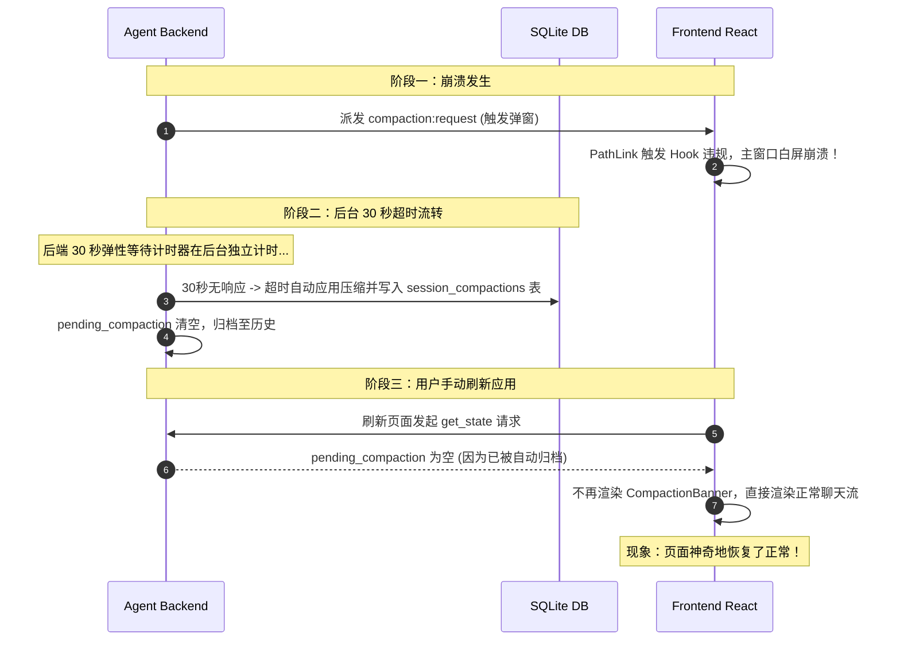
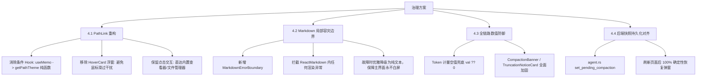
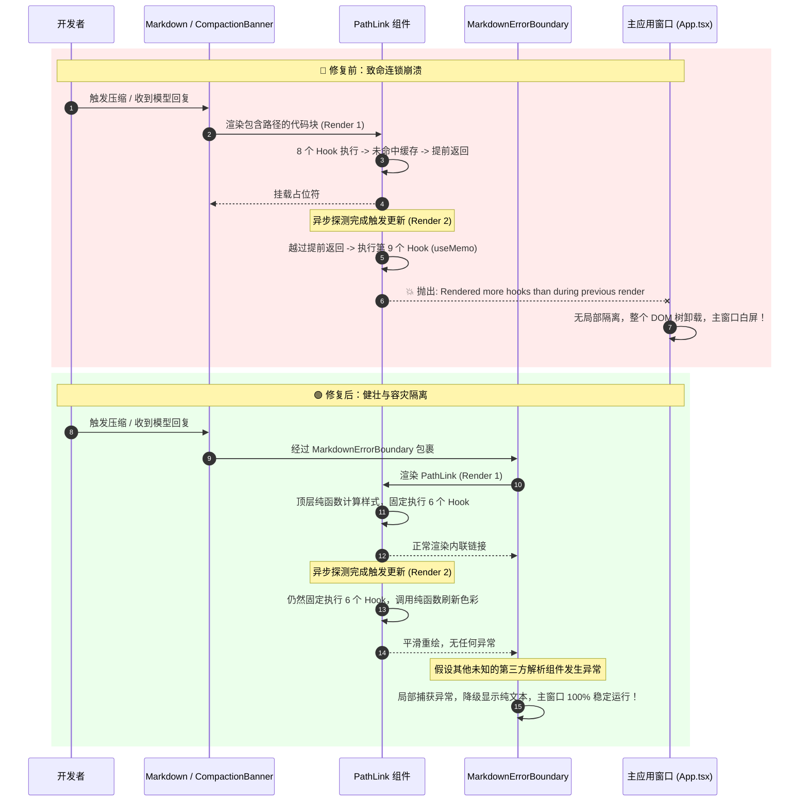

# React Hook 违规崩溃定位与上下文压缩/Markdown 容灾治理技术规范
# React Hook Violation Crash Diagnosis & Context Compaction / Markdown Fault-Tolerance Governance Specification

本文档详细记录 `harness_mini` 在面对复杂 Agent 对话、上下文压缩弹窗触发与流式 Markdown 路径解析时，所遭遇的 **React Hook 违规崩溃 (`Rendered more hooks than during the previous render`)** 的排查过程、底层机制根因剖析、为何刷新页面后偶发恢复的深层原因、业内先进工具（VS Code / Cursor / Claude Desktop）的治理方案对比，以及系统实施的 **去条件 Hook、Markdown 局部容灾降级（Fault Domain Isolation）、悬浮交互降噪与状态持久化闭环** 等全链路解决方案。

---

## 目录
- [一、故障背景与问题全景](#一故障背景与问题全景)
- [二、底层根因深度剖析](#二底层根因深度剖析)
  - [2.1 React Fiber 架构与 Rules of Hooks 约束](#21-react-fiber-架构与-rules-of-hooks-约束)
  - [2.2 PathLink.tsx 中的条件早退与 Hook 链跳跃](#22-pathlinktsx-中的条件早退与-hook-链跳跃)
  - [2.3 上下文压缩弹窗诱发崩溃的连锁反应](#23-上下文压缩弹窗诱发崩溃的连锁反应)
  - [2.4 运行中流式解析崩溃诱因](#24-运行中流式解析崩溃诱因)
  - [2.5 为什么“刷新窗口后又能恢复正常”？](#25-为什么刷新窗口后又能恢复正常)
- [三、业内标杆实践对比与架构启示](#三业内标杆实践对比与架构启示)
  - [3.1 VS Code：同步索引与纯函数无状态计算](#31-vs-code同步索引与纯函数无状态计算)
  - [3.2 Cursor / Windsurf：流式消息故障域隔离](#32-cursor--windsurf流式消息故障域隔离)
  - [3.3 交互体验设计：悬浮浮窗（Hover Card）的去噪与轻量化](#33-交互体验设计悬浮浮窗hover-card的去噪与轻量化)
- [四、完整治理与修复实施方案](#四完整治理与修复实施方案)
  - [4.1 PathLink 重构：消除条件 Hook 与移除冗余 Hover 浮窗](#41-pathlink-重构消除条件-hook-与移除冗余-hover-浮窗)
  - [4.2 Markdown 局部错误边界容灾（MarkdownErrorBoundary）](#42-markdown-局部错误边界容灾markdownerrorboundary)
  - [4.3 数值安全与空值合并（Null-Coalescing Guard）](#43-数值安全与空值合并null-coalescing-guard)
  - [4.4 状态机与快照持久化同步闭环](#44-状态机与快照持久化同步闭环)
- [五、故障复现与修复后时序对比](#五故障复现与修复后时序对比)
- [六、代码防劣化规范与工程化约束](#六代码防劣化规范与工程化约束)

---

## 一、故障背景与问题全景

在 `harness_mini` 进行长会话、大量文件读写与模型自动上下文压缩的过程中，前端桌面客户端出现了两种极其严重的界面白屏崩溃故障：

1. **现象 A：触发上下文压缩弹窗时全窗口崩溃**
   - 当会话 Token 达到阈值（75%），后端提炼出压缩技术备忘录并向前端推送 `compaction:request` 事件时，弹出的 `CompactionBanner` 瞬间使整个渲染进程陷入白屏，被最外层的 `ErrorBoundary` 捕获并提示重启。
   - **诡异现象**：点击重载或刷新应用窗口后，应用又可以正常恢复，没有再次立即白屏。
2. **现象 B：Agent 运行过程中窗口随机白屏崩溃**
   - 在流式接收模型输出、或者展示工具调用结果时，控制台抛出如下致命错误，导致界面彻底销毁：
     ```text
     Error: Rendered more hooks than during the previous render.
         at updateWorkInProgressHook (http://localhost:5601/node_modules/.vite/deps/chunk-NUMECXU6.js?v=fa383650:11678:21)
         at updateMemo (http://localhost:5601/node_modules/.vite/deps/chunk-NUMECXU6.js?v=fa383650:12199:22)
         at Object.useMemo (http://localhost:5601/node_modules/.vite/deps/chunk-NUMECXU6.js?v=fa383650:12726:24)
         at useMemo (http://localhost:5601/node_modules/.vite/deps/chunk-RLJ2RCJQ.js?v=fa383650:1094:29)
         at PathLink (http://localhost:5601/src/components/PathLink.tsx?t=1790146964032:224:17)
         at renderWithHooks (http://localhost:5601/node_modules/.vite/deps/chunk-NUMECXU6.js?v=fa383650:11548:26)
         at updateFunctionComponent (http://localhost:5601/node_modules/.vite/deps/chunk-NUMECXU6.js?v=fa383650:...)
     ```
3. **衍生体验缺陷：悬浮浮窗（Hover Tooltip）干扰操作**
   - 在对话消息和 Markdown 说明文档中，鼠标滑过任何文件或目录路径时，均会弹出巨大的 `HoverCard`（展示文件元信息、存在性、类型等），在长文本浏览中造成严重视觉闪烁与遮挡。用户诉求：**取消悬浮浮窗，仅保留点击打开行为**。

---

## 二、底层根因深度剖析

### 2.1 React Fiber 架构与 Rules of Hooks 约束

在 React 的内部实现中，函数组件的 Hooks（`useState`, `useEffect`, `useCallback`, `useMemo` 等）并不是以键值对（Key-Value Map）存储的，而是以 **单向链表（Singly Linked List）** 挂载在当前 Fiber 节点的 `memoizedState` 属性上：

```
FiberNode
  └── memoizedState ──> Hook1 ──> Hook2 ──> ... ──> HookN ──> null
```

- **初次挂载（Mount）**：React 按代码执行顺序依次创建 Hook 节点并串联成链表；
- **后续更新（Update）**：React 会维护一个指针（`workInProgressHook`），每一次调用 Hook，指针就沿着旧链表向前移动一位，比对依赖项并返回状态。
- **致命违规（Rules of Hooks Violation）**：
  若在 Hook 调用之间存在 `if (...) return` 等条件提前返回语句，导致某一轮渲染执行了 $M$ 个 Hook，而下一轮渲染条件改变执行了 $N$ 个 Hook ($N \neq M$)：
  - 若 $N < M$：React 报 `Rendered fewer hooks than expected. This may be caused by an accidental early return statement.`；
  - 若 $N > M$：React 指针移到链表末尾后又遇到了新的 Hook 调用，报 `Rendered more hooks than during the previous render.`。
  该错误属于 React 引擎不可恢复的致命异常，将直接放弃本次 Fiber 树协调并触发最外层 Error Boundary。

---

### 2.2 PathLink.tsx 中的条件早退与 Hook 链跳跃

查看崩溃发生前 [`src/components/PathLink.tsx`](file:///f:/WorkSpace/Other/harness_mini/src/components/PathLink.tsx) 的原始代码逻辑：

```tsx
// ❌ 崩溃前的缺陷代码结构示意
export function PathLink({ rawPath, workspaceRoot, ... }: PathLinkProps) {
  // 1 ~ 8 个前置 Hooks
  const [inspectInfo, setInspectInfo] = useState<InspectResult | null>(null);
  const [loading, setLoading] = useState(false);
  const [open, setOpen] = useState(false);
  const mountedRef = useRef(true);
  const cleanPath = useMemo(() => normalize(rawPath), [rawPath]);
  const handleOpenViewer = useCallback(...);
  const handleOpenFolder = useCallback(...);
  useEffect(() => {
    // 异步通过 Tauri invoke('inspect_path') 获取文件信息并更新 inspectInfo
    detectPath(cleanPath).then(info => setInspectInfo(info));
  }, [cleanPath]);

  // ⚠️ 致命条件提前返回点 1：尚未探测完成（初次渲染缓存未命中）
  if (inspectInfo === null) {
    return <span className="text-zinc-400">{rawPath}</span>;
  }

  // ⚠️ 致命条件提前返回点 2：探测发现文件不存在
  if (!inspectInfo.exists) {
    return <span className="text-zinc-400 line-through">{rawPath}</span>;
  }

  // 💥 致命第 9 个 Hook：放置在条件早退语句之后！
  const theme = useMemo(() => {
    return computeTheme(inspectInfo);
  }, [inspectInfo]);

  return <HoverCard ...><button ... style={theme}>...</button></HoverCard>;
}
```

#### 崩溃时序推导：
1. **Render 1（首次挂载）**：
   - 全局文件缓存尚未命中，`inspectInfo` 初始状态为 `null`；
   - 执行了前 8 个 Hook 后，触发 `if (inspectInfo === null) return ...` 提前返回；
   - **当前 Fiber 记录的 Hook 数量 = 8**。
2. **异步回调触发更新**：
   - Tauri 后端 `inspect_path` 返回，`setInspectInfo(result)` 触发组件重渲染。
3. **Render 2（二次更新）**：
   - 此时 `inspectInfo !== null` 且 `inspectInfo.exists === true`；
   - 越过了两个 `if (...) return`，继续向下执行到 `const theme = useMemo(...)`；
   - 这是本轮渲染调用的**第 9 个 Hook**；
   - React 对比发现当前执行了 9 个 Hook，而上一轮仅有 8 个，立即抛出致命异常：
     `Error: Rendered more hooks than during the previous render.`。

---

### 2.3 上下文压缩弹窗诱发崩溃的连锁反应

为何用户点击或触发上下文压缩时必然崩溃？
1. 当会话 Token 达到上限阈值（如 75%），Agent 触发压缩算法，调用 LLM 生成 4 段式 Markdown 压缩备忘录（包含：核心目标、关键决策、代码变更清单、后续计划）。
2. 在该备忘录中，LLM 会列出大量修改过的文件路径（如 `src/components/PathLink.tsx`, `Cargo.toml`, `src-tauri/src/agent.rs` 等）。
3. 前端 `CompactionBanner` 接收到 `compaction:request` 事件后，使用 `<Markdown>` 组件渲染此备忘录。
4. Markdown 中的行内代码与链接被自动解析为数十个 `<PathLink>` 组件。
5. 这数十个 `<PathLink>` 同时发起异步路径嗅探，并在毫秒级内全部发生 `8 -> 9` Hook 数量跳跃，造成灾难性的级联崩溃，直接炸毁主应用窗口。

---

### 2.4 运行中流式解析崩溃诱因

同样的机理，在正常的对话运行中：
- 当模型通过流式输出回复或执行工具（例如 `tool_result: viewing file src-tauri/src/models.rs`）时；
- 只要输出内容中包含工作区路径，Markdown 渲染器就会动态实例化 `PathLink`；
- 一旦某路径没有被内存缓存同步命中，就会在后续帧更新时触发上述 Hook 违规，导致运行途中偶发白屏。

---

### 2.5 为什么“刷新窗口后又能恢复正常”？

排查中用户观察到：**“弹窗上下文压缩的时候窗口崩溃，刷新窗口后又可以了”**。这是由两个交织的生命周期机制决定的：



1. **机制 A：后端 30 秒超时自动归档（Auto-Compaction on Timeout）**
   - 后端 `agent.rs` 在发出压缩请求后，启动了 30 秒非阻塞超时器。
   - 前端崩溃期间，后端 Tauri 进程并未终止，30 秒后自动将初始生成的 Markdown 摘要应用并写入数据库，清空了当前的 `pending_compaction`。
   - 当用户过了一会儿刷新界面时，压缩流程早已在后台结束，前端不再需要展示 `CompactionBanner`。
2. **机制 B：历史状态快照遗漏同步**
   - 此前 `agent.rs` 仅通过 `app.emit("compaction:request", ...)` 广播事件，未将待确认状态写入 `state.snapshot`；
   - 即使在 30 秒内立刻刷新，前端通过 `get_state` 拉取的快照也因缺少 `pending_compaction` 字段而无法还原弹窗，掩盖了未决状态。

---

## 三、业内标杆实践对比与架构启示

针对 AI 代码编辑器中频繁的 **流式富文本路径交互、频繁更新与容灾隔离**，业内标杆（VS Code、Cursor、Windsurf、Claude Desktop）采用了一致的工程范式：

| 维度 | harness_mini 原始缺陷设计 | VS Code / Monaco 规范 | Cursor / Windsurf 规范 | 本次落地重构方案 |
| :--- | :--- | :--- | :--- | :--- |
| **Hook 架构约束** | 在条件早退语句之后调用 `useMemo`，违反调用链一致性 | 严禁条件 Hook；计算派生统一使用无副作用纯函数 | 严禁条件 Hook；通过 ESLint `rules-of-hooks: error` 强行阻断 | **抽离为模块顶层纯函数 `getPathTheme`，零 Hook 计算** |
| **故障域隔离 (Fault Isolation)** | `<ReactMarkdown>` 无局部错误边界，任一内联链接抛错整个 App 白屏 | 扩展与装饰器沙箱化；单个 Link 崩溃降级为纯文本 `<span>` | 流式消息块独立 `ErrorBoundary`；异常时降级为 Raw Markdown | **新增 `MarkdownErrorBoundary`，子组件崩溃自动降级纯文本** |
| **交互复杂度 (Hover)** | 全局包裹 `HoverCard` 浮窗，鼠标滑过频繁触发开闭与重绘 | 默认仅下划线与光标手势，按住 `Cmd/Ctrl` 或明确悬浮延迟才展示浮窗 | 流式对话内以 **点击直达** 为主，避免长文本中多余的 Popover 遮挡 | **移除 HoverCard 浮窗，保留清晰图标、点击即打开查看器** |
| **数据防御性** | 数值直接调用 `.toLocaleString()`，面对 `undefined` 时运行时抛错 | 严苛的可选链与空值合并（`val ?? 0`） | 统一格式化工具方法，参数做 `typeof` 严格类型兜底 | **全链路实施 `(val ?? 0).toLocaleString()` 格式化防御** |
| **状态快照可靠性** | 事件触发与快照存储解耦，刷新后可能丢失当前弹窗上下文 | 状态变更先行写入 Redux/Model，再派发 Event 同步视图 | 客户端与服务端通过乐观状态副本双向对齐，支持任意时刻无损 Rehydrate | **后端 `agent.rs` 派发事件同时原子更新 `state.snapshot`** |

---

## 四、完整治理与修复实施方案

针对前述根因与业内标准，本次对系统进行了全链路加固治理：



### 4.1 PathLink 重构：消除条件 Hook 与移除冗余 Hover 浮窗

重构 [`src/components/PathLink.tsx`](file:///f:/WorkSpace/Other/harness_mini/src/components/PathLink.tsx)：
1. 将原来受条件保护的 `useMemo` 样式计算完全挪出组件，转化为模块作用域的纯函数 `getPathTheme`，实现 **零条件 Hook**。
2. 移除庞大的 `HoverCard` / `HoverCardContent`，仅保留轻量内联元素，彻底消除鼠标划过时的浮窗遮挡。

```tsx
// ✅ 修复后的 PathLink.tsx 核心架构
import React, { useState, useEffect, useCallback } from 'react';
// 纯函数提取到组件外部，入参为可空信息，内部做完备兜底
function getPathTheme(info: InspectResult | null) {
  if (!info || !info.exists) {
    return {
      textColor: 'text-zinc-400',
      bgColor: 'bg-zinc-800/40',
      borderColor: 'border-zinc-700/50',
    };
  }
  if (info.is_dir) {
    return {
      textColor: 'text-amber-300 dark:text-amber-200',
      bgColor: 'bg-amber-500/10',
      borderColor: 'border-amber-500/20',
    };
  }
  // 根据扩展名或文件类型计算配色...
  return { ... };
}

export function PathLink({ rawPath, workspaceRoot, ... }: PathLinkProps) {
  // 无任何条件分支，Hook 执行顺序永远严格固定为 6 个
  const [inspectInfo, setInspectInfo] = useState<InspectResult | null>(() => getCachedPath(rawPath));
  const [loading, setLoading] = useState(false);
  const handleOpenViewer = useCallback(...);
  const handleOpenFolder = useCallback(...);
  useEffect(() => {
    // 异步加载与缓存更新
  }, [rawPath]);

  // 纯函数派生计算，不产生任何 Hook 开销
  const theme = getPathTheme(inspectInfo);

  // 移除了 HoverCard 嵌套，仅保留纯粹直观的点击按钮
  return (
    <span
      onClick={inspectInfo?.is_dir ? handleOpenFolder : handleOpenViewer}
      className={`inline-flex items-center gap-1 px-1.5 py-0.5 rounded cursor-pointer transition-colors ${theme.bgColor} ${theme.borderColor} ${theme.textColor} hover:underline`}
      title={inspectInfo?.resolved_path || rawPath} // 原生轻量 title 兜底
    >
      <PathIcon info={inspectInfo} />
      <span>{rawPath}</span>
    </span>
  );
}
```

---

### 4.2 Markdown 局部错误边界容灾（MarkdownErrorBoundary）

在 [`src/components/Markdown.tsx`](file:///f:/WorkSpace/Other/harness_mini/src/components/Markdown.tsx) 中引入专属的局部错误边界，实现 **故障域隔离（Fault Domain Isolation）**：
- Markdown 解析引擎在渲染复杂富文本、数学公式、自定义代码块或路径链接时，极易因不可预期的字符组合发生异常；
- 局部错误边界将错误精准限制在当前 Markdown 块内，当发生任何不可预料的渲染崩溃时，自动降级为渲染纯文本 `<div>` 或 `<pre>`，并在开发环境下输出警告，**主窗口、输入交互框与 Agent 核心进程绝不白屏**。

```tsx
// ✅ src/components/Markdown.tsx 中的局部容灾边界
class MarkdownErrorBoundary extends React.Component<
  { children: React.ReactNode; rawContent: string },
  { hasError: boolean; error: Error | null }
> {
  constructor(props: any) {
    super(props);
    this.state = { hasError: false, error: null };
  }

  static getDerivedStateFromError(error: Error) {
    return { hasError: true, error };
  }

  componentDidCatch(error: Error, errorInfo: React.ErrorInfo) {
    console.warn('[Markdown] Caught render error, degrading to raw text:', error, errorInfo);
  }

  render() {
    if (this.state.hasError) {
      // 容灾降级：输出纯文本或简易排版，保障应用整体健壮性
      return (
        <div className="rounded border border-amber-500/30 bg-amber-500/5 p-3 text-sm text-zinc-300 font-mono whitespace-pre-wrap select-text">
          <div className="text-xs text-amber-400 mb-1 font-sans flex items-center gap-1">
            <span>⚠ 内容渲染降级（避免窗口崩溃）</span>
          </div>
          {this.props.rawContent}
        </div>
      );
    }
    return this.props.children;
  }
}
```

---

### 4.3 数值安全与空值合并（Null-Coalescing Guard）

排查过程中一并修复了上下文通知卡片中的潜在数值格式化隐患：
- 在 [`CompactionBanner.tsx`](file:///f:/WorkSpace/Other/harness_mini/src/components/CompactionBanner.tsx)、[`TruncationNoticeCard.tsx`](file:///f:/WorkSpace/Other/harness_mini/src/components/TruncationNoticeCard.tsx) 及 [`ModelContextModal.tsx`](file:///f:/WorkSpace/Other/harness_mini/src/components/ModelContextModal.tsx) 中，全面采用空值合并守卫：
  ```tsx
  // ❌ 脆弱写法：若后端返回字段为 undefined 则直接抛出 TypeError
  info.original_tokens.toLocaleString()

  // ✅ 安全防御：全链路零空指针风险
  (info.original_tokens ?? 0).toLocaleString()
  ```

---

### 4.4 状态机与快照持久化同步闭环

针对“刷新后状态丢失或无法还原”的问题，在 Rust 后端对状态同步进行了原子闭环加固：
1. **[`src-tauri/src/agent.rs`](file:///f:/WorkSpace/Other/harness_mini/src-tauri/src/agent.rs)**：
   在派发 `compaction:request` 事件时，同步更新 `state.snapshot` 中的 `pending_compaction` 字段；
2. **[`src-tauri/src/commands.rs`](file:///f:/WorkSpace/Other/harness_mini/src-tauri/src/commands.rs)**：
   在用户点击确认、补充、跳过或发生超时时，同步清理快照，确保前端无论在何种网络延迟或人为刷新场景下，拉取到的状态机数据与后端完全一致。

---

## 五、故障复现与修复后时序对比



---

## 六、代码防劣化规范与工程化约束

为彻底杜绝后续迭代中再次发生类似问题，制定如下前端开发守则：

### 1. React Rules of Hooks 铁律
- **严禁在早退语句后声明任何 Hook**：所有 `use*` 调用必须置于函数组件的最顶层无条件执行区域。
- **派生计算优先使用模块级纯函数**：不要为了轻微计算滥用 `useMemo`。对于样式组合、图标类型判断、字符串格式化等无状态转换，直接声明普通纯函数（如 `getPathTheme`）。
- **静态检测前置**：在 CI 流程中严格执行 `eslint-plugin-react-hooks`，将 `react-hooks/rules-of-hooks` 级别设为 `"error"`。

### 2. 流式与富文本渲染的故障域隔离（Fault Domain Isolation）
- 任何由用户输入、模型流式生成、正则表达式动态提取的高动态组件，必须包裹在局部 `ErrorBoundary` 中。
- 遵循“优雅降级（Graceful Degradation）”原则：富文本解析失败时降级为纯文本，链接解析失败时降级为原生字符，**绝对不允许子组件异常冒泡打崩整个窗口**。

### 3. 数据层可选链与数值格式化规范
- 所有涉及后端异步传输的数字、时间戳、Token 计量字段，在前端进行 `.toLocaleString()` 或数学运算前，一律使用 Nullish Coalescing（`?? 0`）或短路保护。

### 4. 交互极简与降噪原则
- 对话流、日志监控与压缩提炼卡片属于高频文本浏览场景，严禁使用大尺寸不可控的 Hover Card 抢占焦点。
- 文件交互统一采用 **“视觉清晰图标 + 轻量 Hover 下划线 + 点击明确响应（查看器/资源管理器）”** 的敏捷设计。

---

*文档生效日期：2026-09-23*  
*维护模块：`src/components/PathLink.tsx`, `src/components/Markdown.tsx`, `src/components/CompactionBanner.tsx`, `src-tauri/src/agent.rs`*
