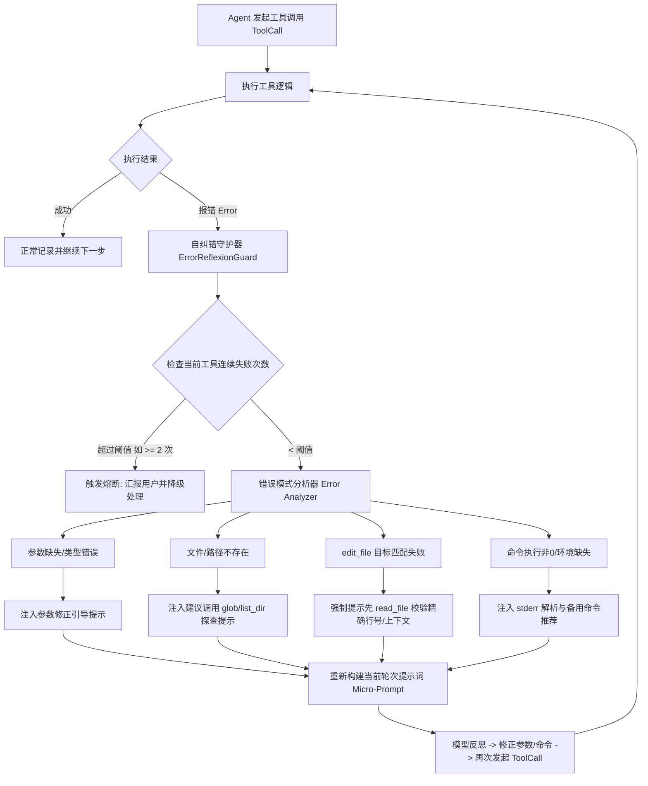

# Agent 工具级自纠错与自举模式（Self-Evolution Mode）深度实施方案

本文档详细阐述两项核心优化方向的架构设计、数据流、状态机与落地实现方案：
1. **工具执行报错时的“自动反思与自纠错”机制（Autonomous Tool Error Reflexion）**：无需等待用户拒绝或手动干预，内部自动分析失败原因、修正参数并重新调用。
2. **打通“自举模式（Self-Evolution Mode）”**：为 Agent 构建专门面向 `harness_mini` 自身源码的专属指令流，在隔离的 `temp_` 沙箱空间内实现自身特性的安全开发、双重验证与平滑合入。

---

## 优化方向一：工具执行报错自动反思与自纠错机制

### 1. 现状痛点分析

在现有的 Agent 执行循环（[`src-tauri/src/agent.rs`](file:///d:/WorkSpace/Project/harness_mini/src-tauri/src/agent.rs)）中：
- 当工具执行出现错误（例如 `read_file` 路径不存在、`edit_file` 的 `target_content` 不匹配、`run_command` 语法错误或退出码非 0）时，系统仅将错误文本包裹为普通 `ToolResult` 注入对话上下文。
- 模型在缺乏强约束纠错引导时，容易出现以下不良行为：
  1. **无效重复尝试**：用完全相同或轻微变动的错误参数再次调用同一工具；
  2. **中途放弃**：直接将报错文本甩给用户（如“读取文件失败，请检查文件是否存在”），中断任务流；
  3. **误报完成**：忽视工具报错，假装任务已成功完成。
- **目标**：建立内部闭环的**微反思与自愈引擎（Micro-Reflexion Engine）**。当工具报错时，系统截获错误并注入针对性的自纠提示词，强制模型自查、自修正参数或切换备用工具，在设定阈值内自动完成自纠错重试。

---

### 2. 自纠错架构设计与错误分类



#### 错误模式分类与诊断策略（Diagnostic Strategies）

| 错误分类 (Error Category) | 常见错误特征 | 诊断与自愈引导策略 (Self-Correction Prompt Guidance) |
| :--- | :--- | :--- |
| **`EditMismatch`** | `target_content 未匹配到`、`找到多处匹配` | **严禁盲猜替换**。强制提示：“`edit_file` 目标文本未找到。请先调用 `read_file` 重新读取该文件相关行（核对精确空格、缩进和换行符），确认精确原文后再发起编辑。” |
| **`FileNotFound`** | `系统找不到指定的文件`、`路径不存在` | **严禁继续硬编码路径**。强制提示：“指定路径不存在。请先调用 `glob` 或 `list_dir` 搜索工作区，确认文件真实相对路径与拼写后再试。” |
| **`ParamInvalid`** | JSON 解析失败、必填字段缺失 | **参数契约纠错**。提取工具的 `ToolSpec.schema`，提示：“参数校验失败：[具体错误]。请对照工具参数规范，修正 JSON 结构后重试。” |
| **`CommandFailed`** | 退出码非 0、命令不存在、语法错误 | **环境与命令行适配**。提示：“命令执行失败（Exit code != 0）。请分析 stderr 错误原因：若为 PowerShell 语法差异请适配 Windows 命令；若为依赖缺失请提示或自动补充前置步骤。” |

---

### 3. 具体落地实现方案

#### 3.1 核心数据结构与状态追踪
在 [`src-tauri/src/agent.rs`](file:///d:/WorkSpace/Project/harness_mini/src-tauri/src/agent.rs) 中引入工具执行连续失败计数器与自纠状态：

```rust
// src-tauri/src/agent.rs

/// 工具级连续失败状态追踪器
#[derive(Default)]
pub struct ToolErrorTracker {
    pub consecutive_failures: std::collections::HashMap<String, u32>,
    pub max_retry_limit: u32, // 默认 2 次
}

impl ToolErrorTracker {
    pub fn new(limit: u32) -> Self {
        Self {
            consecutive_failures: Default::default(),
            max_retry_limit: limit,
        }
    }

    /// 记录执行结果：若成功则清零该工具的失败计数
    pub fn record_success(&mut self, tool_name: &str) {
        self.consecutive_failures.remove(tool_name);
    }

    /// 记录失败，并返回是否可以重试
    pub fn record_failure(&mut self, tool_name: &str) -> (bool, u32) {
        let count = self.consecutive_failures.entry(tool_name.to_string()).or_insert(0);
        *count += 1;
        (*count <= self.max_retry_limit, *count)
    }
}
```

#### 3.2 动态自纠提示词构造器（Micro-Reflexion Prompt Builder）

```rust
pub fn build_tool_reflexion_prompt(
    tool_name: &str,
    error_msg: &str,
    attempt: u32,
    max_retries: u32,
) -> String {
    let specific_advice = match tool_name {
        "edit_file" => {
            "【自纠建议】: 目标文本未精确匹配。请务必先调用 `read_file` 重新读取该文件相关代码段，获取最新内容与准确缩进/换行后再执行编辑。"
        }
        "read_file" | "glob" | "list_dir" => {
            "【自纠建议】: 文件或路径不存在。请检查路径拼写，或使用 `glob` 模糊匹配查找实际存在的文件路径。"
        }
        "run_command" | "run_skill" => {
            "【自纠建议】: 命令执行报错。请仔细阅读错误流（stderr），排查命令参数、环境变量或 Windows PowerShell 语法兼容性。"
        }
        _ => "【自纠建议】: 请检查工具参数是否符合规范，修正后重新尝试。",
    };

    format!(
        "【⚠️ 工具调用错误自纠提示（第 {}/{} 次尝试）】\n\
         工具 `{}` 执行失败，错误信息如下：\n{}\n\n{}\n\
         请根据上述原因，自主分析并修正参数后再次调用；严禁直接重复相同参数！",
        attempt, max_retries, tool_name, error_msg, specific_advice
    )
}
```

#### 3.3 前端可视化状态广播
在执行自纠错循环时，后端向前端广播轻量事件 `agent:tool_retry`：
- 前端在对应消息下方或状态指示器中展示：`🔄 工具 edit_file 执行报错，Agent 正在自动排查并修正参数重试 (1/2)...`
- 让用户直观感知到 Agent 正在“内部自我排查与纠正”，大幅提升交互信任感。

---

## 优化方向二：打通“自举模式（Self-Evolution Mode）”

### 1. 自举模式的本质与定位

**自举模式（Self-Evolution Mode）** 是指让 `harness_mini` 自身作为开发工具，安全、闭环、自动化地改造并升级 `harness_mini` 自身的源代码。

**技术壁垒与挑战**：
1. **进程冲突**：正在运行的客户端若被直接写入二进制或改写后端核心代码，可能导致当前进程 Crash 或文件写锁定（Access Denied）；
2. **依赖隔离**：前端 `node_modules` 与后端 `target` 体积庞大，如果全量拷贝进沙箱会导致磁盘开销过大、拷贝缓慢；若不拷贝则沙箱内无法执行 `npm run build` 验证；
3. **架构理解偏差**：Agent 对本项目的 Rust + Tauri + React 架构缺乏精准感知，容易改错位置。

---

### 2. 自举全生命周期指令流

```mermaid
flowchart TD
    subgraph 1. 空间初始化与环境映射
        A[用户触发自举开发模式: /evolve 或侧边栏] --> B["创建专属自举临时空间 temp-project/&lt;code&gt;"]
        B --> C[核心源码极速拷贝: 排除 target/dist]
        C --> D[Windows Junction 软链接 node_modules]
        D --> E[Git 初始化专属基线提交 Baseline]
    end

    subgraph 2. 自举上下文精准注入
        E --> F[自动注入: harness_mini 架构自举守则 System Prompt]
        F --> G[注入当前核心模块映射图与单元测试规范]
    end

    subgraph 3. 需求拆解与沙箱编码
        G --> H[Agent 探索并阅读目标模块源码]
        H --> I["Agent 修改代码: src/ 或 src-tauri/src/"]
    end

    subgraph 4. 双重沙箱自动化自检
        I --> J{检测修改的代码类型}
        J -->|包含 Rust 后端| K[执行 cargo test / check]
        J -->|包含前端 React| L[执行 npm run build]
        K & L --> M{验证是否通过}
        M -->|未通过| N[注入编译报错 -> Agent 自动自纠修复]
        N --> I
        M -->|通过| O[标记自检通过 🛡️]
    end

    subgraph 5. 差异审阅与原子写回
        O --> P[前端 DiffModal 可视化审阅逐行变更]
        P -->|用户确认合并| Q[原子性写回真实工程根目录]
    end

    subgraph 6. 平滑热重载与生效
        Q --> R{改动类型判定}
        R -->|纯前端改动| S[Vite HMR 实时热替换生效 无需重启]
        R -->|Rust 后端改动| T[提示一键编译重启 / tauri dev 自动重启]
```

---

### 3. 自举模式具体实施方案

#### 3.1 环境映射与软链接优化（Junction for `node_modules`）
为解决沙箱内前端无法执行 `npm run build` 或拷贝几百兆 `node_modules` 的痛点，在 [`src-tauri/src/temp.rs`](file:///d:/WorkSpace/Project/harness_mini/src-tauri/src/temp.rs) 中实现快速软链接机制：

```rust
// src-tauri/src/temp.rs

/// 在临时空间为前端项目创建 node_modules 目录链接 (Junction on Windows, Symlink on Unix)
#[cfg(windows)]
pub fn link_node_modules(src_workspace: &Path, temp_workspace: &Path) -> Result<(), String> {
    let src_modules = src_workspace.join("node_modules");
    let dst_modules = temp_workspace.join("node_modules");
    
    if src_modules.exists() && !dst_modules.exists() {
        // 使用 Windows 专用的 Directory Junction，不需要管理员权限
        std::os::windows::fs::symlink_dir(&src_modules, &dst_modules)
            .map_err(|e| format!("创建 node_modules 链接失败: {e}"))?;
    }
    Ok(())
}
```
*优势*：临时空间初始化耗时保持在 **< 200 毫秒**，同时又能无缝在沙箱内运行 `npm run build` 和 `tsc` 检查。

#### 3.2 专属自举指令提示词（Self-Evolution Prompt System）
当检测到当前工作区为 `harness_mini` 自身且处于临时空间时，自动追加专属自举指令段落：

```markdown
## 🚀 harness_mini 自举开发守则（最高优先级）
你当前正在为 harness_mini 自身开发新功能或修复缺陷。你的改动直接影响本系统：
1. **代码架构约束**：
   - 后端逻辑归入 `src-tauri/src/`：
     - `agent.rs`: 核心执行循环与提示词组装；
     - `tools.rs`: 工具定义、参数 Schema 与执行调度；
     - `store.rs`: SQLite 数据表、迁移与数据持久化；
     - `growth.rs`: 反思提炼引擎；
     - `skills.rs`: 动态技能文件管理；
     - `sop.rs`: 项目技术栈探测与交付自检；
     - `temp.rs`: 临时空间与原子合并。
   - 前端逻辑归入 `src/components/`：React 18 + Tailwind CSS，使用 Zustand 管理全局状态。
2. **质量红线**：
   - 修改后端代码后，必须保证现有全部单元测试（`cargo test` 55+ 测试）100% 通过；
   - 新增后端模块必须附带单元测试（`#[cfg(test)] mod tests`）；
   - 修改前端组件必须保证 `npm run build` 零类型报错与零打包错误。
3. **交付前要求**：
   - 自主运行 `cargo test` 与 `npm run build` 确保完全通过；
   - 调用 `temp_changes` 汇总所有变更文件，向用户简明汇报修改重点。
```

#### 3.3 前端一键自举入口与快捷指令
1. **快捷指令支持**：
   - 用户在输入框键入 `/evolve <需求描述>`，系统自动在后台创建 `harness_mini` 的临时空间会话，并将自举专属 Prompt 打底，直接开启沙箱自举开发。
2. **合并后智能提示**：
   - 监听 `temp:merged` 事件：
     - 若合并文件全部位于 `src/`：提示 `✨ 前端代码已通过 Vite HMR 实时热更生效！`；
     - 若包含 `src-tauri/` 下的文件：提示 `⚙️ 检测到后端 Rust 核心更新。当前开发模式（tauri dev）将自动重载；如在生产版本，请点击「重启程序」生效。`

---

## 实施路线图与排期

| 阶段 | 任务重点 | 预期产出 |
| :---: | :--- | :--- |
| **阶段 1** | **工具自纠错引擎（Error Reflexion）** | 实现 `ToolErrorTracker`、自纠提示词生成器、前端重试徽标，并在 `edit_file` / `read_file` 常见失败场景落地。 |
| **阶段 2** | **自举环境隔离增强** | 实现 `node_modules` 快速软链接（Junction），确保沙箱内能顺利执行 `npm run build`。 |
| **阶段 3** | **自举专属提示词与指令流** | 落地 `/evolve` 快捷指令与系统级自举架构提示词注入。 |
| **阶段 4** | **双重 SOP 自动化自检** | 完善交付前自检流程，实现 Rust（`cargo test`）与前端（`npm run build`）的双通道自愈验证。 |
