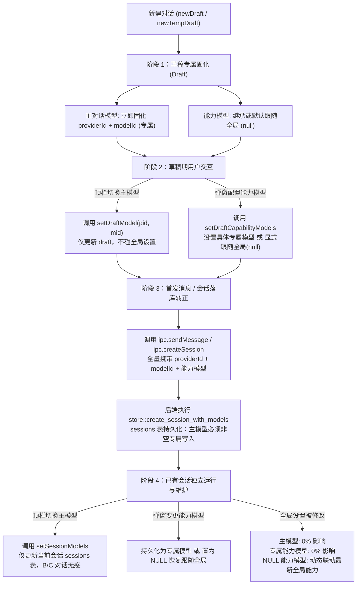

# 会话专属模型与能力模型双态治理架构规范 (SESSION_EXCLUSIVE_MODEL_AND_CAPABILITY_GOVERNANCE_SPEC)

| 项目 | 内容 |
| :--- | :--- |
| 文档名称 | 会话专属模型与能力模型双态治理架构规范 (Session-Exclusive Model & Capability Dual-Track Governance Specification) |
| 版本 | v1.0 |
| 状态 | 规范落地与系统基线 |
| 关联模块 | `src/components/TopBar.tsx`, `src/store.ts`, `src/types.ts`, `src/ipc.ts`, `src/components/Composer.tsx`, `src/components/ContextUsageGauge.tsx`, `src/components/ModelMatrixModal.tsx`, `src-tauri/src/store.rs`, `src-tauri/src/commands.rs`, `src-tauri/src/server.rs`, `src-tauri/src/agent.rs`, `src-tauri/src/tools.rs` |

---

## 1. 背景与缺陷溯源

在 AI Agent 桌面应用（`harness_mini`）的多会话交互场景中，用户通常会在不同的任务对话中选用针对性适配的大模型。例如：
- 在对话 A 中进行长代码重构与系统设计，需要调用推理能力极强的模型（如 `Claude 3.5 Sonnet` / `GPT-4o`）；
- 在对话 B 中进行日常轻量答疑或快速脚本编写，希望调用响应极快且成本更优的模型（如 `GPT-4o-mini` / `DeepSeek-V3`）；
- 同时，会话可能需要调用特化能力模型（文生图 `image_gen`、视觉感知 `vision`）。

### 1.1 历史严重缺陷：多会话模型串线

在既有实现中，用户遇到了严重的状态污染问题：**“在 A 对话切换了对话模型后，B 对话的模型会跟着变”**。

经过端到端链路追踪，排查出 4 层层层叠加的系统缺陷：
1. **顶栏切换污染全局应用设置**：在 `TopBar.tsx` 的 `handleSelectModel` 中，用户在下拉菜单选择模型时，直接调用了 `ipc.setSettings(next)`，将选择写入了应用级全局配置 `SettingsData.activeModelId`，并未对当前会话进行独立持久化；
2. **顶栏展示完全忽视会话上下文**：`TopBar.tsx` 显示模型时仅执行 `resolveActiveModel(settings)` 读取全局设置，完全未读取 `session.modelId` 或 `draft.modelId`；
3. **会话创建时主模型缺失（长期置空）**：无论是草稿状态 `draft`，还是后端会话创建接口 `create_session` / `send_message`，均未设计主模型入参，导致数据表 `sessions.provider_id` 与 `sessions.model_id` 长期硬编码写入为 `NULL`；
4. **后端运行时全量回退全局模型**：后端 `agent.rs` 在执行推理时，发现 `session.model_id` 为 `None`，全部回落至全局配置 `resolve_active_model(&settings)`。当 A 对话修改了全局设置后，B 对话在后端运行时也会使用被 A 污染的新模型。

---

## 2. 治理目标与双态心智模型

为了从根源上杜绝模型串线，并满足用户对于不同能力类型的细粒度控制，系统确立了**“对话模型全生命周期专属化，能力模型专属优先/显式跟随全局”**的双态治理规范：

### 2.1 核心心智模型对照

| 维度 | 对话模型（主对话模型 Chat Model） | 能力模型（生图 image_gen / 视觉感知 vision） |
| :--- | :--- | :--- |
| **功能定位** | 对话的核心执行大脑，驱动任务规划与主干思考 | 按需调用的专业插件式能力槽位 |
| **隔离策略** | **完全专属化（Session-Exclusive by Default）** | **双态模式（专属优先 / 显式跟随全局）** |
| **跟随全局概念** | **不存在“跟随全局”**，自诞生起即独立 | **显式支持“跟随全局”**（配置为跟随全局时才联动） |
| **草稿期初值** | 继承上一对话或取全局默认，**立即固化为专属值** | 继承上一对话配置（继承其具体专属模型或跟随全局状态） |
| **顶栏切换影响** | 仅修改当前草稿或当前会话，**绝不修改全局设置** | 不在顶栏快捷切换，在能力模型弹窗中独立管理 |
| **数据库落库值** | `sessions.provider_id` / `model_id` **必须为具体值，禁止 NULL** | 专属时存具体值，显式跟随全局时写入 `NULL` |

### 2.2 全生命周期状态流转图



---

## 3. 端到端实现架构与技术规范

### 3.1 草稿生命周期与模型初值固化（Draft Creation）

在用户打开应用或点击“新建对话”时，草稿必须具备完全自主的专属模型标识，不再是未决的“裸奔”状态：

- **Store 状态扩充 (`src/store.ts`)**：
  在 `draft` 状态中增加 `providerId` 与 `modelId`：
  ```typescript
  draft: {
    projectId: string | null;
    workspacePath: string | null;
    accessMode: "confirm" | "full_access";
    contextTokenLimit?: number | null;
    /** 草稿专属主对话模型（诞生即专属） */
    providerId?: string | null;
    modelId?: string | null;
    /** 草稿专属能力模型 */
    imageProviderId?: string | null;
    imageModelId?: string | null;
    visionProviderId?: string | null;
    visionModelId?: string | null;
    reasoningEffort?: string | null;
  } | null;
  ```
- **草稿初始化原则 (`newDraft` / `newTempDraft`)**：
  1. 若 `inherit = true` 且存在上一条会话，继承该会话的 `providerId` 和 `modelId`；
  2. 若为纯新对话或无前序会话，以系统全局激活模型 `resolveActiveModel(st.settings)` 作为草稿的初始专属值；
  3. 增加 `setDraftModel(providerId, modelId)`，支持在草稿期间独立修改主模型。

### 3.2 顶栏模型解析与无污染切换（TopBar Scoped Switching）

- **优先级解析引擎 (`src/types.ts`)**：
  新增统一的会话专属模型解析函数 `resolveSessionActiveModel`：
  ```typescript
  export function resolveSessionActiveModel(
    settings: Settings,
    session?: { providerId?: string | null; modelId?: string | null; provider_id?: string | null; model_id?: string | null } | null,
    draft?: { providerId?: string | null; modelId?: string | null } | null
  ): { provider: Provider; model: string } | null {
    const pid = session?.providerId || session?.provider_id || draft?.providerId;
    const mid = session?.modelId || session?.model_id || draft?.modelId;

    if (pid && mid) {
      const p = settings.providers.find((item) => item.id === pid && (item.models ?? []).includes(mid));
      if (p) {
        return { provider: p, model: mid };
      }
    }

    // 仅在历史遗留数据或模型异常失效时回退全局默认模型
    return resolveActiveModel(settings);
  }
  ```
- **顶栏展示绑定 (`src/components/TopBar.tsx`)**：
  顶栏模型展示计算由 `resolveActiveModel(settings)` 切换为：
  ```typescript
  const active = resolveSessionActiveModel(settings, session, currentId === DRAFT_ID ? draft : null);
  ```
- **模型切换动作重构 (`handleSelectModel`)**：
  **彻底移除对 `ipc.setSettings` 的调用**，按当前会话状态严格分流：
  - **已有会话**：调用 `setSessionModels`，仅更新当前 `sessionId`，并保留该会话既有的专属能力模型；
  - **草稿会话**：调用 `setDraftModel(providerId, model)`，仅在当前草稿状态中更新；
  - **彻底杜绝全局状态漂移与跨会话联动**。

### 3.3 首发消息落库与数据库持久化（Persistence Guarantee）

- **IPC 接口协议升级 (`src/ipc.ts` / `src/types.ts`)**：
  - `SessionCreateInput`、`createSession` 与 `sendMessage` 完整扩充 `providerId?: string | null` 与 `modelId?: string | null`。
- **前端发送触发 (`src/components/Composer.tsx`)**：
  - 在草稿状态首次发送消息时，将 `draft.providerId` 与 `draft.modelId` 随请求透传。
- **后端数据库写入 (`src-tauri/src/store.rs`)**：
  - `store::create_session_with_models` 接入 `provider_id` 与 `model_id`；
  - 在 `INSERT INTO sessions` 中持久化写入：
    ```rust
    conn.execute(
        "INSERT INTO sessions(
            id, title, workspace_path, access_mode, project_id, status, 
            last_message_at, created_at, updated_at, 
            parent_session_id, session_type, subagent_role, subagent_task,
            last_reported_msg_id, auto_report,
            provider_id, model_id,
            image_provider_id, image_model_id, vision_provider_id, vision_model_id,
            reasoning_effort
         ) VALUES(?1,?2,?3,?4,?5,?6,?7,?8,?9,NULL,'main',NULL,NULL,NULL,NULL,?10,?11,?12,?13,?14,?15,?16)",
        params![
            s.id, s.title, s.workspace_path, s.access_mode, s.project_id, s.status,
            s.last_message_at, s.created_at, s.updated_at,
            s.provider_id, s.model_id,
            s.image_provider_id, s.image_model_id, s.vision_provider_id, s.vision_model_id,
            s.reasoning_effort,
        ],
    )?;
    ```
- **后端命令接入 (`src-tauri/src/commands.rs`)**：
  - `create_session` 与 `send_message` 在从草稿初始化会话时，完整提取传入的 `provider_id` 与 `model_id`，杜绝新会话主模型为 `None` 的历史隐患。

### 3.4 能力模型弹窗的双态管理与防覆盖机制 (`ModelMatrixModal.tsx`)

- **草稿态感知**：
  在草稿状态打开能力模型弹窗时，顶部主对话模型展示栏准确呈现 `draft.modelId`，而非错误回退全局设置。
- **主模型保护机制**：
  在已有会话中保存能力模型（生图/视觉）时，安全提取并保留当前会话的 `providerId` 和 `modelId`，若为旧历史会话则自动补全为当前有效模型，绝不因保存能力模型而导致主模型被清空或被覆盖。
- **双态精确落库**：
  - 用户选定具体生图/视觉模型 -> 保存具体值，成为该会话专属能力模型；
  - 用户选定“跟随全局” -> 传值 `null`，写入 SQLite 为 `NULL`，恢复动态跟随全局最新配置。

### 3.5 运行时上下文与 Token 仪表盘联动 (`ContextUsageGauge.tsx`)

- `computeContextUsage` 接入 `resolveSessionActiveModel(settings, session, draft)`；
- 无论是已有会话还是未落库草稿，Token 负载计量表与有效上下文上限均严格按照该会话/草稿专属模型的窗口限制进行精确计算，杜绝跨模型度量偏差。

---

## 4. 关键接口与代码修改矩阵

| 文件路径 | 变更类型 | 关键改动说明 |
| :--- | :--- | :--- |
| `src-tauri/src/store.rs` | 核心逻辑 / 测试 | 1. `create_session_with_models` 接入 `provider_id` / `model_id`；<br>2. `INSERT INTO sessions` 写入两字段；<br>3. 更新单测验证字段持久化。 |
| `src-tauri/src/commands.rs` | 接口实现 | 1. `create_session` 接入 `provider_id` / `model_id` 并下传；<br>2. `send_message` 接入两字段并在新建会话分支写入；<br>3. 协作者结果汇报调用入参补全。 |
| `src-tauri/src/server.rs` | API 网关 | HTTP 模式 `send_message` 提取 `providerId` 与 `modelId` 并转发。 |
| `src/types.ts` | 协议定义 | 1. `SessionCreateInput` 新增主模型字段；<br>2. 新增 `resolveSessionActiveModel` 会话级专属解析函数。 |
| `src/ipc.ts` | IPC 封装 | `createSession` 与 `sendMessage` 参数签名扩充两字段。 |
| `src/store.ts` | 状态机 | 1. `draft` 增加专属模型字段；<br>2. `newDraft` / `newTempDraft` 初始固化专属模型；<br>3. 新增 `setDraftModel`；<br>4. `createCollaborator` 创建父会话时透传模型。 |
| `src/components/TopBar.tsx` | 视图交互 | 1. 采用 `resolveSessionActiveModel` 展示模型；<br>2. `handleSelectModel` 彻底移除 `setSettings`，按会话/草稿分别更新，杜绝全局污染。 |
| `src/components/Composer.tsx` | 视图交互 | 视觉模型校验适配草稿专属模型；`doSend` 首发转正透传草稿主模型。 |
| `src/components/ContextUsageGauge.tsx` | 视图联动 | Token 计算根据会话/草稿专属模型动态计算。 |
| `src/components/ModelMatrixModal.tsx` | 弹窗治理 | 展示草稿模型名称；保存能力模型时保留补全主模型，精确落库“专属/跟随全局”。 |

---

## 5. 质量保证与验证矩阵

系统完成了全方位的质量验证，确保架构改造零回归、全覆盖：

### 5.1 后端单元测试覆盖
执行 `cargo test`，全套 120 项单元测试全部通过（耗时 2.27s）：
```text
test store::tests::test_create_session_with_models_persists_capability_models ... ok
test store::tests::test_fork_session_at_message ... ok
test agent::tests::test_build_context_with_compactions ... ok
...
test result: ok. 120 passed; 0 failed; 0 ignored; 0 measured; 0 filtered out
```

### 5.2 前端类型与构建校验
执行 `npm run build` (`tsc && vite build`)，前端 TypeScript 类型检查与生产构建 100% 通过，无类型冲突与遗漏。

### 5.3 关键场景验证清单

1. **场景 1：多会话模型切换隔离性**
   - 在已有会话 A 中将主模型切换为 `Model-X`；
   - 切换进入会话 B，会话 B 依然展示并保持其原有的 `Model-Y`；
   - 查看全局设置（SettingsModal），全局激活模型依然保持原样，未被会话 A 篡改。
2. **场景 2：草稿模型自闭环**
   - 点击“新建对话”，草稿立即携带初始专属模型；
   - 在草稿中切换为 `Model-Z`；
   - 切换到其他会话后再切回草稿，草稿专属模型依然为 `Model-Z`；
   - 发送首条消息落库，SQLite 中新会话的 `model_id` 确认为 `Model-Z`。
3. **场景 3：能力模型双态验证**
   - 在会话 A 中为生图选择指定模型 `Flux`，保存为专属；
   - 在全局设置中修改全局默认生图模型为 `DALL-E 3`；
   - 会话 A 的生图调用依然严格使用其专属模型 `Flux`；
   - 在会话 B 中未配置专属（保持“跟随全局”），会话 B 的生图调用动态联动使用 `DALL-E 3`。
4. **场景 4：历史遗留数据平滑过渡**
   - 历史旧数据中 `provider_id / model_id` 为 NULL 的旧会话，加载时平滑通过 `resolveSessionActiveModel` 兜底为全局默认模型展示；
   - 用户在顶栏一旦进行模型切换，立即为其持久化固化为专属模型。

---

## 6. 结论

本规范彻底解决了模型跨会话串线的历史顽疾，确立了清晰的会话级主模型专属机制与能力模型双态管理体系。系统在保持代码轻量、不破坏现有数据表结构的前提下，实现了从草稿创建、顶栏交互、IPC 通讯、数据库持久化到运行时调度的全链路闭环，为多模型协同和精细化 Agent 任务分工提供了坚固的架构基石。
