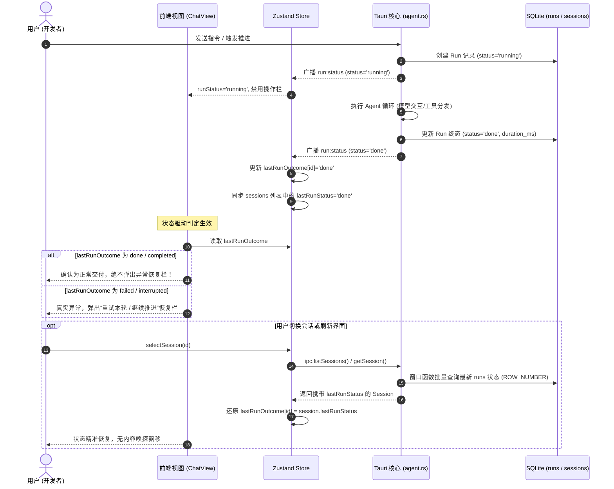

# 会话执行状态机治理与异常恢复判定规范 (SESSION_EXECUTION_STATE_AND_FAILURE_RECOVERY_SPEC)

| 项目 | 内容 |
| --- | --- |
| 文档名称 | 会话执行状态机治理与异常恢复判定规范 |
| 版本 | v1.0 |
| 状态 | 生产已落地已验证 |
| 关联模块 | `src/components/ChatView.tsx`, `src/store.ts`, `src/types.ts`, `src-tauri/src/models.rs`, `src-tauri/src/store.rs`, `src-tauri/src/agent.rs` |
| 核心目标 | 彻底根除基于“正文字符串嗅探”导致的异常误判，打通后端 SQLite `runs` 表到前端 `Session` 的真实状态驱动链路，建立端到端确定性的执行生命周期与恢复判定机制 |

---

## 1. 背景与核心痛点

### 1.1 触发场景与典型表象
在 `harness_mini` 中，用户下发带约束的规划指令：
> “分析当前项目使用技术，要求：先创建一个计划，并列出任务清单，等我确认后再开始”

Agent 核心引擎严格执行了规范流程：
1. 探索项目结构并调用 `create_plan` 工具，在 `.harness/plans/` 下生成物理方案文档；
2. 工具触发“方案先行门禁”，Agent 停止调用修改类工具，调用 `todo` 初始化待办清单；
3. 输出结构化总结，包含核心目标、分析维度、影响文件清单及注意事项；
4. 后端 `runs` 记录为 `status = "done"`，耗时约 45 秒，正常完成单轮交互退出。

**但交互结束时，前端主视图（`ChatView.tsx`）底部却意外弹出了黄色异常恢复条：**
> **“对话执行中断或遇到异常”**  
> *“您可以选择重试本轮，或让 Agent 基于当前已有上下文继续向下推进。”*

用户在已经得到完整正确输出的情况下，被界面提示误导为“系统崩溃或执行中断”，严重破坏了操作信任感。

---

### 1.2 根因深度剖析

#### 痛点 1：启发式正文子串嗅探反模式（Heuristic String Sniffing）
为了在用户刷新浏览器或切换会话后仍能向用户提供“重试/继续”操作，早期前端引入了以下兜底判定逻辑：

```typescript
// ❌ 历史反模式代码：ChatView.tsx
if (lastMsg.role === "assistant") {
  const content = lastMsg.content || "";
  if (
    content.includes("⚠️") ||               // 致命误判源头
    content.includes("流读取失败") ||
    content.includes("Agent 运行出错") ||
    content.includes("error decoding response body")
  ) {
    return true;
  }
}
```

#### 痛点 2：门禁规范与 Markdown 语法碰撞
- 在规划门禁中，`create_plan` 工具返回了系统规范指令：`【⚠️ 重要阶段指令 - 方案先行门禁】...`；
- Agent 在生成答复时，严格遵循规范在文末标注了提示：`> ⚠️ 说明：本任务为**纯只读分析**，不会修改任何业务代码...`；
- 正常的 Markdown 引用块、注意事项、警示图标 `⚠️` 被上述逻辑无差别捕获，直接将正常交互定性为崩溃。

#### 痛点 3：消息角色（Role）职责混淆
- 当 Rust 后端真正发生基础设施或网络异常（如 SSE 流中断、API 401/429、模型空回复）时，后端 `emit_error` 写入的实际上是 **`role = 'system'`** 消息（`store::new_message(..., "system", "⚠️ {message}")`）；
- 但前端却在检查 `lastMsg.role === "assistant"`，造成了“系统真正报错时没有针对性判定，AI 正常吐字带图标时反而误报”的错位。

#### 痛点 4：持久化层与前端 Store 的状态断层
- 后端 SQLite 库中一直有完整的 `runs` 表与 `get_last_run_status` 函数，记录了每次调度的真实终态（`running / done / failed / interrupted / cancelled`）；
- 但此前 `Session` 实体对外返回时未挂载该状态，前端的 `lastRunOutcome` 只是纯内存字典。当用户刷新页面或在侧边栏切换会话时，内存状态丢失，促使前端退化为使用脆弱的正文猜测。

---

## 2. 总体架构与状态流转

### 2.1 会话运行执行全生命周期状态机

```mermaid
stateDiagram-v2
    [*] --> idle: 会话就绪
    idle --> running: 发送消息 / 重试本轮 / 继续推进
    
    state running {
        [*] --> StreamingLLM: 流式请求模型
        StreamingLLM --> ExecutingTools: 模型返回工具调用
        ExecutingTools --> StreamingLLM: 工具反馈继续循环
        ExecutingTools --> WaitingApproval: 触发高危/权限确认
        WaitingApproval --> ExecutingTools: 用户审批放行
        WaitingApproval --> Interrupted: 用户拒绝/撤销
    }

    running --> done: 文本回复落盘且完成交付 (RunOutcome::Done)
    running --> failed: 达到重试上限或底层不可逆异常 (RunOutcome::Failed)
    running --> cancelled: 用户主动点击“停止” (stop_session)
    running --> interrupted: 运行态强杀或会话关闭级联中断

    done --> idle: 状态持久化至 runs 表
    failed --> idle: 激活重试/恢复操作条
    cancelled --> idle: 激活重新发起提示
    interrupted --> idle: 激活断点推进操作条
```

---

### 2.2 端到端状态装配与分发数据流



---

## 3. 详细改造实现

### 3.1 后端：模型扩展与窗口函数状态装配

#### 1. 数据模型增加 `last_run_status` 字段
在 [`src-tauri/src/models.rs`](file:///f:/WorkSpace/Other/harness_mini/src-tauri/src/models.rs) 的 `Session` 结构体及 `Default` 实现中，新增持久化执行终态映射：

```rust
#[derive(Serialize, Deserialize, Clone, Debug)]
#[serde(rename_all = "camelCase")]
pub struct Session {
    pub id: String,
    pub title: String,
    // ...
    /// 最近一次 Run 的执行终态（'done' | 'failed' | 'interrupted' | 'cancelled' | 'running'）
    #[serde(default)]
    pub last_run_status: Option<String>,
}
```

#### 2. SQLite 高效窗口函数聚合装配
在 [`src-tauri/src/store.rs`](file:///f:/WorkSpace/Other/harness_mini/src-tauri/src/store.rs) 中，新增批量状态装配函数，采用 SQLite 3.25+ 原生窗口函数按会话分组高效获取最新一轮运行记录：

```rust
fn attach_session_last_runs(conn: &Connection, sessions: &mut [Session]) -> Result<(), String> {
    if sessions.is_empty() {
        return Ok(());
    }
    let mut stmt = conn
        .prepare(
            "SELECT session_id, status FROM (
                SELECT session_id, status, ROW_NUMBER() OVER (PARTITION BY session_id ORDER BY started_at DESC, id DESC) as rn
                FROM runs
            ) WHERE rn = 1",
        )
        .map_err(|e| e.to_string())?;
    let map: std::collections::HashMap<String, String> = stmt
        .query_map([], |r| Ok((r.get::<_, String>(0)?, r.get::<_, String>(1)?)))
        .map_err(|e| e.to_string())?
        .filter_map(|r| r.ok())
        .collect();

    for s in sessions.iter_mut() {
        s.last_run_status = map.get(&s.id).cloned();
    }
    Ok(())
}
```

在 `get_session`、`list_sessions`、`list_subagents`、`list_collaborators`、`list_subprocesses` 等所有涉及会话输出的查询中统一挂载装配。

---

### 3.2 前端：Store 全生命周期状态同步

#### 1. 类型定义扩充
在 [`src/types.ts`](file:///f:/WorkSpace/Other/harness_mini/src/types.ts) 中对齐：
```typescript
export interface Session {
  id: string;
  // ...
  /** 最近一次 Run 执行终态（done | failed | interrupted | cancelled | running） */
  lastRunStatus?: "done" | "failed" | "interrupted" | "cancelled" | "running" | null;
}
```

#### 2. 状态初始化与双向同步
在 [`src/store.ts`](file:///f:/WorkSpace/Other/harness_mini/src/store.ts) 中：
1. **全局初始化 (`init`)**：从接口加载会话列表时，批量填充 `lastRunOutcome` 初始字典：
   ```typescript
   const initialOutcomes: Record<string, string> = {};
   for (const s of sessions) {
     if (s.lastRunStatus) {
       initialOutcomes[s.id] = s.lastRunStatus;
     }
   }
   set((st) => ({
     // ...,
     lastRunOutcome: { ...st.lastRunOutcome, ...initialOutcomes },
   }));
   ```
2. **会话切换 (`selectSession`)**：从当前会话实体中秒级提取 `lastRunStatus` 还原，杜绝内存丢失：
   ```typescript
   const curSession = get().sessions.find((s) => s.id === id);
   const initialOutcome = curSession?.lastRunStatus;
   set((st) => ({
     // ...,
     lastRunOutcome: initialOutcome ? { ...st.lastRunOutcome, [id]: initialOutcome } : st.lastRunOutcome,
   }));
   ```
3. **运行时广播更新 (`onRunStatus`)**：更新实时状态的同时，同步写回 `sessions` 列表中的对应项，保持 Store 内部实体一致。

---

### 3.3 视图层：纯状态驱动与精准兜底判定

在 [`src/components/ChatView.tsx`](file:///f:/WorkSpace/Other/harness_mini/src/components/ChatView.tsx) 中重构 `isInterruptedOrFailed`：

```typescript
const lastMsg = msgs[msgs.length - 1];
const isInterruptedOrFailed = useMemo(() => {
  if (running || !currentId || msgs.length === 0) return false;

  // 1. 核心依据：以持久化或实时事件广播的真实执行终态为准
  if (
    lastRunOutcome === "cancelled" ||
    lastRunOutcome === "interrupted" ||
    lastRunOutcome === "failed" ||
    lastRunOutcome === "error"
  ) {
    return true;
  }

  // 2. 正常交付完成（done / completed）时，绝不展示异常恢复条（无论正文包含什么格式符号）
  if (lastRunOutcome === "done" || lastRunOutcome === "completed") {
    return false;
  }

  // 3. 兜底边缘异常
  if (lastMsg) {
    // 边缘场景 A：用户刚发出消息，但进程在创建 assistant 消息前意外崩溃退出
    if (lastMsg.role === "user") return true;

    // 边缘场景 B：系统级致命报错（后端 emit_error 创建 role === 'system' 且内容以 ⚠️ 开头）
    if (lastMsg.role === "system") {
      const content = lastMsg.content || "";
      if (
        content.startsWith("⚠️") ||
        content.includes("流读取失败") ||
        content.includes("Agent 运行出错") ||
        content.includes("error decoding response body")
      ) {
        return true;
      }
    }

    // 边缘场景 C：AI 生成了回复但工具卡片停留在 running / failed 等未决异常态
    if (lastMsg.role === "assistant") {
      if (lastMsg.toolEvents?.some((e) => e.status === "failed" || e.status === "interrupted" || e.status === "running")) {
        return true;
      }
    }
  }

  return false;
}, [running, currentId, msgs.length, lastRunOutcome, lastMsg]);
```

---

## 4. 治理原则与避坑约定 (Governance & Rules)

### 准则 1：状态与正文绝对解耦（State/Content Segregation）
- **严禁**通过正则表达式、关键字匹配（`content.includes`）去推断 Agent 的执行生命周期或业务终态；
- AI 模型的输出正文属于不可控的自然语言域（可能包含引用、代码注释、Warning Callout、Emoji 等）；状态机必须由确定的系统枚举字段驱动。

### 准则 2：消息角色职责严格隔离（Role Isolation）
- **`system` 消息**：保留给平台级干预、环境注入、致命报错（如网络断开、上下文超限、引擎崩溃）；
- **`assistant` 消息**：模型业务输出，仅承载给用户的交付答复、思考链和工具调用意图。

### 准则 3：前后端生命周期对齐保证（Lifecycle Alignment）
- 后端数据库记录的 `runs` 是全系统执行状态的单一事实来源（Single Source of Truth）；
- 前端任何试图通过内存变量表示的运行态，在发生会话切换、窗口刷新、多标签激活时，必须能够通过持久化字段无损还原。

---

## 5. 验证基线与质量达标情况

| 验证维度 | 验证命令 / 测试集 | 结果 | 说明 |
| --- | --- | --- | --- |
| **前端静态类型** | `npx tsc --noEmit` | **0 Error / 0 Warning** | 前端 Session 扩展与 Store 赋值类型严格契合 |
| **后端编译检查** | `cargo check` | **通过 (0.57s)** | Rust 窗口函数与结构体字段修改无语法与生命周期警告 |
| **单元回归测试** | `cargo test --lib` | **99 Passed / 0 Failed** | 覆盖单测全绿，涵盖计划模式、记忆提炼、存储生命周期等所有测试集 |
| **真实指令复测** | 包含计划门禁与 `⚠️` 声明的交互 | **通过** | 正常结束单轮交付后，界面干净清爽，不再误显异常恢复条 |
