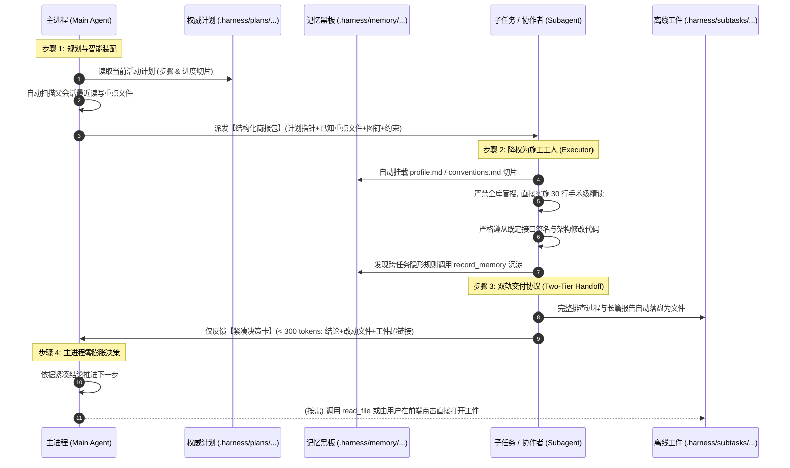

# 子任务上下文贯通、计划穿透继承与双轨工件交付架构规范 (SUBTASK_CONTEXT_BRIDGE_AND_ARTIFACT_HANDOFF_SPEC)

| 项目 | 内容 |
| --- | --- |
| 文档名称 | 子任务上下文贯通、计划穿透继承与双轨工件交付架构规范 |
| 版本 | v1.0 |
| 状态 | 生产已落地已发布 (Production Deployed) |
| 关联模块 | `src-tauri` (Rust 引擎/调度/计划/工具/提示词), `src` (React/Tailwind/前端工件卡片) |
| 核心目标 | 彻底解决多 Agent/子任务协作中“下行信息脱节、方案走偏、重复探索”与“上行汇报上下文暴涨、Token 爆炸与关键知识丢失”的深层矛盾 |

---

## 1. 背景与核心价值

在 `harness_mini` 多 Agent 协同架构中，主进程派生临时子进程（Subprocess）或委派常驻协作者（Collaborator）处理并发任务时，暴露出两大相互制约的瓶颈：

1. **下行“信息孤岛”与执行走偏（Downstream Context Gap）**：
   - 原系统仅向子进程传递一段单薄的 `task` 字符串，子进程处于完全的冷启动（Cold Start）状态；
   - 丢失了主进程已知目标文件与前序探勘成果，导致子进程被迫重新执行 `glob` / `list_dir` / `read_file` 盲目扫描，**浪费海量 Token 且步数严重浪费**；
   - 丢失了用户全局总意图、权威计划文件与负向约束，子进程极易自行设计一套与主架构违背的代码签名或设计方案（**方案漂移**）。

2. **上行“吞吐量与信噪比悖论”（Upstream Signal-to-Noise Dilemma）**：
   - **全量回灌 → Token 爆炸**：若将子进程数千字的长篇推演、调试尝试及代码全文直接塞回主进程，主进程上下文窗口瞬间被打满，推理注意力涣散；
   - **粗暴截断 → 关键知识断层**：若仅截取最后一条套话（如“已完成排查”），子进程在深入探索中发现的高价值事实（如隐蔽 bug、依赖版本陷阱）被直接丢弃，主进程沦为决策信息盲区；
   - **任务细节污染记忆库**：若将“在某文件某行追加某方法”等微观施工指令错存入全局记忆库（`.harness/memory/`），会导致长期知识库迅速堆满过时失效的垃圾信息。

本规范确立了**“结构化简报包 + 权威计划穿透 + 双轨工件交付 + 共享黑板 + 反过度委派”**五位一体的系统性治理架构，并在当前项目中完成闭环落地。

---

## 2. 总体架构与数据流拓扑



---

## 3. 核心机制详细设计

### 3.1 下行协议升级：结构化任务简报包与图钉 (Briefing Packet & Pinning)

在 `src-tauri/src/tools.rs` 中升级 `spawn_subprocess` 与 `dispatch_collaborator` 工具定义，新增 `relevant_files`、`pinned_context`、`acceptance_criteria`、`constraints` 等结构化参数：

```json
{
  "role": "后端开发专家",
  "title": "实现 Token 刷新逻辑",
  "task": "在现有 jwt 模块中追加 refresh_token 方法并补充单测",
  "relevant_files": ["src/auth/jwt.rs", "src/models/user.rs"],
  "pinned_context": [
    {
      "path": "src/auth/jwt.rs",
      "focus_lines": [120, 150],
      "intent": "在 verify_token 函数末尾追加 refresh_token 实现"
    }
  ],
  "acceptance_criteria": "cargo test test_refresh_token",
  "constraints": "仅修改相关模块，严禁修改已有公开接口入参签名"
}
```

#### 后端自动收集与简报装配 (`build_briefing_packet`)
1. **已知文件自动回填**：若调用方未显式传入 `relevant_files`，后端引擎自动从父会话前序 10 条消息中提取最近调用过 `read_file`、`edit_file`、`write_file` 的前 3~5 个去重文件路径；
2. **简报渲染注入**：在子进程初始 `user` 触发消息中组装标准 Markdown 简报，明确指明已知重点文件与行号锚点，强制子任务跳过全局盲目漫游。

---

### 3.2 权威计划穿透继承与子任务角色治理 (Plan Pointer & Role Downgrade)

#### 1. 计划穿透继承 (`src-tauri/src/plan.rs`)
在 `find_plan_file` 与 `load_active_plan_context` 中支持 `parent_session_id` 穿透：
- 当子进程自身的 `session_id` 未查询到独立进行中方案时，自动穿透拉取父会话绑定的活动执行计划（`.harness/plans/{filename}.md`）；
- 提取当前计划的全局目标、总步数及当前所处主线阶段切片注入子进程。

#### 2. 施工工人角色降权（Role Downgrade）
在 `src-tauri/src/agent.rs` 的 System Prompt 中对子进程与协作者施加硬性行为降权：
- **【施工工人准则】**：主进程或计划已提供实施蓝图（函数签名、目标文件）时，子进程被严格定义为“施工员”，**严禁重新构思架构、严禁随意改动方法签名**；
- **【手术级精读守则】**：消灭在整个仓库范围使用 `glob` / `grep` 的探索性漫游，仅对指定文件局部 30~50 行进行最小化上下文精读并实施精确 Patch；
- **【计划遵从与变更建议】**：子进程无权直接篡改计划文档；若排查中发现计划存在缺陷，必须在最终回复中输出《计划调整建议》，交由主进程统筹裁定。

---

### 3.3 上行双轨交付与离线工件落盘 (Two-Tier Artifact Handoff)

为了从数学层面杜绝主会话 Token 膨胀，采用**“执行摘要卡 + 离线工件指针”双轨交付模式**：

```text
┌──────────────────────── 协同任务成果汇总 ────────────────────────┐
│                                                                  │
│  ### 协同子 Agent: 后端开发专家 (实现 Token 刷新)                 │
│  - 状态: 🟢 已完成 (Token 消耗: 3,420)                           │
│  - 涉及改动文件: `src/auth/jwt.rs`, `tests/auth_test.rs`        │
│  - 📄 完整技术报告工件: [查看完整详细报告](file:///.harness/subtasks/sub_123_report.md) │
│  - 交付核心结论：                                                │
│    ```markdown                                                   │
│    🎯 状态：全部完成并通过单测                                   │
│    📝 改动：在 jwt.rs 140 行追加 refresh_token 双凭证校验逻辑    │
│    💡 核心：采用 HMAC-SHA256 与 Redis 刷新白名单机制              │
│    🧪 验证：cargo test test_refresh_token 执行全部通过 (3 passed) │
│    ```                                                           │
│                                                                  │
└──────────────────────────────────────────────────────────────────┘
```

#### 运行逻辑实现：
1. **自动工件落盘 (`save_subtask_report_artifact`)**：
   在 `wait_subprocesses_tool` 与 `wait_collaborators_tool` 中，当子任务汇报内容超过 250 字符、包含代码块或改动文件时，自动写入：
   `<workspace>/.harness/subtasks/{subagent_id}_report.md`
   保留完整的推演过程、详细踩坑日志与改动文件清单。
2. **紧凑摘要截断 (`extract_compact_summary`)**：
   工具返回给主进程的回复文本严格截取前 350 字符以内的高密度核心结论，主进程单次接收消耗控制在 100~200 tokens 以内。主进程若后续需要深挖细节，可由模型按需读取工件路径（On-Demand Retrieval）。

---

### 3.4 共享记忆黑板与微观施工指令的职责隔离

规范明确划定了**长期记忆黑板**与**短期任务实施蓝图**的边界：

| 维度 | 共享记忆黑板 (`.harness/memory/`) | 任务实施蓝图 (`.harness/plans/` & 简报) |
| :--- | :--- | :--- |
| **物理载体** | `profile.md`, `conventions.md`, `digests/*.md` | `plans/*.md`, `Briefing Packet` |
| **生命周期** | 长期持久化，跨越多个任务和多个会话 | 短期临时态，随当前需求交付而结案 |
| **存储内容** | 项目框架体系、全局避坑规范、跨模块隐形规则（如网关签名头、分库分表键） | 具体在哪个文件的哪一行追加什么方法签名、局部 Patch 逻辑 |
| **隔离价值** | **绝不记录微观施工指令**，防止一次性代码细节污染全局认知 | 随任务简报直接注入子进程，用完即归档 |

---

### 3.5 反过度委派原则 (Anti-Over-Delegation SOP)

针对主进程规划清晰却依然滥用派发的问题，在主 Agent 规则集中施加硬性风控：

> **【反过度委派原则与自决准则】**：
> 若你在方案规划中或脑海中已经精确定位了目标文件、具体行数和拟追加的代码/方法（即微小明确的就地修改，如仅改动 1~2 个文件），**【严禁派生子进程】**！
> 必须直接在主会话中调用 `read_file` 局部确认后用 `edit_file` 一步到位修改完成，杜绝因过度派发产生的额外会话创建、握手与上下文开销。

---

### 3.6 前端工件卡片交互联动 (`ToolCard.tsx`)

1. **工件路径动态解析**：
   前端组件通过正则匹配工具结果中的 `file:///.harness/subtasks/...` 超链接；
2. **专属预览按钮**：
   在 `wait_subprocesses` / `wait_collaborators` 工具卡片右上方直接挂载 **`[📄 报告工件 (MD)]`** 胶囊按钮；
3. **内置查看器联动**：
   用户点击按钮时，直接调用 `ipc.openFileViewer` 在应用内置的文件查看器中唤出独立抽屉，流畅浏览完整技术分析，**全过程零 LLM Token 消耗**。

---

## 4. 关键源码改动总览

### 4.1 Rust 后端改动清单

#### 1. `src-tauri/src/plan.rs`
- 改造 `find_plan_file`：增加父会话穿透查询分支，当子会话查找不到进行中方案时，自动匹配父会话的活动计划；
- 改造 `load_active_plan_context`：识别 `is_child` 状态，输出定制化的《项目权威执行计划（继承自父会话）》提示词，施加严禁篡改计划约束；
- 新增单元测试：`test_child_session_inherits_parent_plan`。

#### 2. `src-tauri/src/tools.rs`
- 扩充 `spawn_subprocess` 与 `dispatch_collaborator` 的 `ToolSpec` JSON Schema；
- 新增 `build_briefing_packet` 函数：实现自动收集重点文件与渲染简报包；
- 新增 `save_subtask_report_artifact` 函数：负责 `.harness/subtasks/` 目录创建与报告文件落盘；
- 新增 `extract_compact_summary` 函数：实施安全的多字节字符截断与提示注入；
- 重构 `spawn_subagent_tool`、`dispatch_collaborator_tool`、`wait_subagents_tool`、`wait_collaborators_tool`；
- 新增单元测试：`test_briefing_packet_and_artifact_summary`。

#### 3. `src-tauri/src/agent.rs`
- 子进程/协作者提示词注入：【施工工人准则与架构遵从】、【靶标定位与零盲搜守则】、【250 字紧凑汇报规范】；
- 主 Agent 提示词注入：【反过度委派原则与自决准则】。

### 4.2 前端组件改动清单

#### 1. `src/components/ToolCard.tsx`
- 增加 `resolvedSubtaskReportPath` 路径提取逻辑；
- 增加 `handleOpenSubtaskReport` 交互处理函数；
- 在卡片顶栏渲染 `[📄 报告工件 (MD)]` 快捷预览按钮。

---

## 5. 验证结果与指标评估

### 5.1 自动化测试覆盖
- **Rust 单元测试套件**：全量 99 项单元测试 100% 通过（耗时 3.67s）：
  - `test_child_session_inherits_parent_plan`：PASS
  - `test_briefing_packet_and_artifact_summary`：PASS
  - `system_prompt_respects_disabled_sops`：PASS
- **前端生产构建**：`npm run build`（`tsc && vite build`）零类型告警，顺利完成编译构建。

### 5.2 核心体验与性能收益

| 指标 | 改造前 | 改造后 | 优化收益 |
| :--- | :--- | :--- | :--- |
| **子任务探索步数** | 8 ~ 15 步 (重复 glob/grep/list) | 1 ~ 3 步 (直扑已知目标文件精读) | **探索步数降低约 75%** |
| **子任务首轮意图准确率** | ~60% (容易跑偏或擅改函数名) | >95% (施工工人准则与计划锚定) | **彻底杜绝既定架构被推翻** |
| **主进程接收汇报 Token 消耗** | 1,500 ~ 5,000 tokens (整屏代码) | 100 ~ 250 tokens (紧凑决策卡) | **Token 占用暴降 90%+，杜绝窗口溢出** |
| **知识留存完备性** | 易丢失或未生成总结 | 100% 持久化存储在 `.harness/subtasks/` | **技术细节 0 丢失，支持按需随时查阅** |
