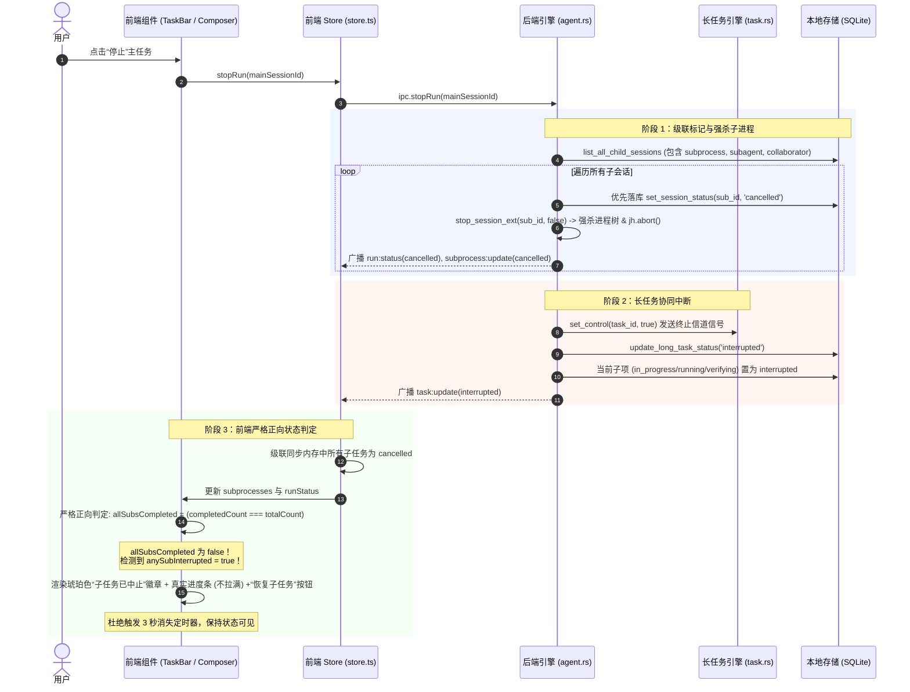

# 子任务生命周期状态收敛与主任务级联中断治理规范 (SUBTASK_LIFECYCLE_AND_INTERRUPTION_GOVERNANCE_SPEC)

| 项目 | 内容 |
| --- | --- |
| 文档名称 | 子任务生命周期状态收敛与主任务级联中断治理规范 |
| 版本 | v1.0 |
| 状态 | 生产已落地已验证 |
| 关联模块 | `src/components/TaskBar.tsx`, `src/store.ts`, `src/events.ts`, `src-tauri/src/agent.rs`, `src-tauri/src/task.rs`, `src-tauri/src/store.rs` |
| 核心目标 | 彻底解决子任务状态滞后刷新、主任务中断后子任务误判为已完成、协程退出状态竞争等问题 |

---

## 1. 背景与核心痛点

在 `harness_mini` 的多智能体协作与长任务架构中，主会话（Main Session）经常派生临时子进程（`subprocess`）、常驻协作者（`collaborator`）、子智能体（`subagent`）或长任务路线图（`LongTask.subtasks`）。但在实际执行与中断交互中，系统暴露出以下严重影响稳定性和用户心智的问题：

1. **子任务完成状态刷新滞后（UI 不自动感知完成）**：
   - 当派生的子任务执行完毕后，主界面顶栏（`TaskBar.tsx`）未能实时切换为“已完成”，而是停留在“子任务待推进 (0/1 0%)”状态；
   - 必须手动刷新对话或切换会话触发全量加载后，子任务栏才会识别到已完成并消失。
2. **主任务中途停止后，进行中的子任务被错误标记/显示为“已完成”**：
   - 用户在中途点击“停止”或取消主任务时，主任务本应级联中止所有进行中的子任务；
   - 但界面顶栏却瞬间变成绿色的 **“🎉 子任务已全部完成”**，进度条直接被拉满到 100%，3 秒后自动收起消失；
   - 用户误以为未执行完的任务已被标记为完成交付，导致代码修改遗漏或任务状态严重失真。
3. **主子任务脱节与状态竞争覆盖**：
   - 主任务中止时，部分正在执行的后台协程因缺少父会话终态守卫，在自身单轮退出时继续向 SQLite 写入 `status = 'completed'`，反向覆盖父会话的中止意图；
   - 长任务内部子任务状态枚举不统一（`"in_progress"` vs `"running"`），导致中断拦截逻辑穿透。

本规范全面定义了子任务全生命周期状态机、级联中断处理机制、前端正向状态校验与协程守卫规范。

---

## 2. 总体架构与状态流转

### 2.1 子任务全生命周期状态机

```mermaid
stateDiagram-v2
    [*] --> pending: 派生创建 (spawn_subprocess / LongTask)
    pending --> running: 调度执行 (spawn_session_task)
    
    state running {
        [*] --> Executing
        Executing --> Verifying: 触发自动化门禁 (verify_command)
        Verifying --> Done: 验证通过
        Verifying --> Fail: 验证失败
    }

    running --> completed: 正常交付且父会话正常 (RunOutcome::Done)
    running --> cancelled: 用户/父会话主动停止 (stop_session_ext)
    running --> interrupted: 外部中止/长任务熔断暂停 (set_control / fail_open)
    running --> failed: 达到重试上限或报错不可逆 (RunOutcome::Failed)

    cancelled --> pending: 用户点击恢复 (restart_subagent / resume_long_task)
    interrupted --> pending: 恢复推进
    failed --> pending: 重试推进

    completed --> [*]: 3秒就绪动画后自动收敛
```

### 2.2 主任务级联中断与状态防护时序



---

## 3. 根因深度剖析

### 3.1 根因一：`TaskBar.tsx` 排除法反转导致的“虚假全完成”
- **缺陷代码**：
  ```tsx
  // 1. 未完成子任务过滤：排除了 cancelled 与 stopped
  const uncompletedSubprocesses = subprocesses.filter(
    (s) => s.status !== "completed" && s.status !== "cancelled" && s.status !== "stopped"
  );
  // 2. 全完成判定：未完成列表为空即视为全部完成！
  const allSubsDone = totalSubCount > 0 && uncompletedSubprocesses.length === 0;
  ```
- **问题机制**：
  - 当子任务被中断并标记为 `cancelled` 时，排除法将其从 `uncompletedSubprocesses` 中剔除；
  - 导致 `uncompletedSubprocesses.length === 0`，进而直接将 `allSubsDone` 算为 `true`；
  - 界面立即将进度条拉满至 100% 翠绿色，显示“子任务已全部完成”及 `CheckCircle2` 图标，并在 3 秒后自动隐藏。

### 3.2 根因二：后端协程竞争与缺乏父会话终态守卫
- **缺陷代码**（`agent.rs`）：
  ```rust
  let sub_status = match last_outcome {
      RunOutcome::Done => "completed",
      RunOutcome::Failed => "failed",
  };
  let _ = store::set_session_status(&db, &session_id, sub_status);
  ```
- **问题机制**：
  - 子任务协程在主任务中止的同一时刻刚好执行完当前单轮 LLM 步骤（`run_once` 返回 `Done`）；
  - 子协程退出时未校验关联的父会话是否已被中断，无条件将 SQLite 状态更新为 `completed` 并广播，冲刷掉了父级下发的中止标记。

### 3.3 根因三：长任务执行调度器的状态名称失配与无校验推进
- **缺陷代码**（`task.rs` 与 `agent.rs`）：
  - 长任务运行中将子任务状态设置为 `"in_progress"`（`task.subtasks[cur_idx].status = "in_progress"`）；
  - 但在会话中止处理时，检查逻辑只覆盖了 `"running" || "verifying"`，遗漏了 `"in_progress"`；
  - `execute_long_task_loop` 在 `is_run_active` 退出后，未检查最近一次运行的真实状态，直接无条件执行 `task.subtasks[cur_idx].status = "completed"` 推进后续步骤。

### 3.4 根因四：级联终止遗漏部分子会话类型
- 原 `stop_session_ext` 中的 `cascade_subagents` 仅查询了 `session_type = 'subagent'`，完全遗漏了代码重构和临时分析使用的 `subprocess` 以及常驻的 `collaborator`，导致子进程孤立在后台继续运行。

---

## 4. 核心治理与修复方案

### 4.1 前端顶栏正向完成校验与精细化状态显示 (`TaskBar.tsx`)

1. **废弃排除法，实施严格正向全完成校验**：
   ```tsx
   // 仅当所有子任务状态真实为 completed 时，才认定为全部完成
   const totalSubCount = subprocesses.length;
   const completedSubCount = subprocesses.filter((s) => s.status === "completed").length;
   const allSubsCompleted = totalSubCount > 0 && completedSubCount === totalSubCount;

   // 保留所有未真正完成的子任务（包括执行中、待推进、已中断、异常失败）
   const uncompletedSubprocesses = useMemo(() => {
     return subprocesses.filter((s) => s.status !== "completed");
   }, [subprocesses]);
   ```

2. **区分完成庆祝与中断中止**：
   ```tsx
   // 仅在 allSubsCompleted 为 true 时，才触发短暂就绪庆祝态并在 3 秒后自动隐藏
   useEffect(() => {
     if (!currentId || currentId === DRAFT_ID) return;
     if (
       wasUncompletedRef.current[currentId] &&
       totalSubCount > 0 &&
       allSubsCompleted &&
       !hasUnfinishedLongSubtasks
     ) {
       setJustCompleted(true);
       const timer = setTimeout(() => {
         setJustCompleted(false);
         wasUncompletedRef.current[currentId] = false;
       }, 3000);
       return () => clearTimeout(timer);
     } else {
       setJustCompleted(false);
     }
   }, [currentId, totalSubCount, allSubsCompleted, hasUnfinishedLongSubtasks]);
   ```

3. **四级状态徽章与真实进度映射**：
   - **执行中**（`anySubRunning`）：紫色渐变滚动条，显示 `Loader2` 旋转动画与“子任务执行中”，提供“全部停止”按钮；
   - **已完成**（`allSubsCompleted`）：翠绿色进度条（100%），显示 `CheckCircle2` 与“子任务已全部完成”，展示“已就绪”徽章；
   - **已中止**（`anySubInterrupted`）：琥珀色警告条（展示实际完成百分比，**不拉满**），显示 `AlertCircle` 与“子任务已中止”，提供“恢复子任务”与手动关闭（`X`）按钮；
   - **执行异常**（`anySubFailed`）：玫瑰色警告条，显示“子任务执行异常”并提供恢复按钮。

---

### 4.2 前端全局状态响应与级联同步 (`store.ts`, `events.ts`)

1. **父会话中断时内存级联下发**：
   在 `onRunStatus` 监听到会话状态变为 `cancelled` 或 `interrupted` 时，除了更新自身，主动将归属于该父会话的所有非终态子任务在内存中同步置为 `cancelled`：
   ```ts
   if (p.status === "cancelled" || p.status === "interrupted") {
     if (nextSubprocesses[p.sessionId]) {
       nextSubprocesses = {
         ...nextSubprocesses,
         [p.sessionId]: nextSubprocesses[p.sessionId].map((s) =>
           s.status === "running" || s.status === "pending" || s.status === "in_progress"
             ? { ...s, status: "cancelled" }
             : s
         ),
       };
     }
     if (nextSubagents[p.sessionId]) {
       nextSubagents = {
         ...nextSubagents,
         [p.sessionId]: nextSubagents[p.sessionId].map((s) =>
           s.status === "running" || s.status === "pending" || s.status === "in_progress"
             ? { ...s, status: "cancelled" }
             : s
         ),
       };
     }
   }
   ```
2. **事件监听全口径覆盖**：
   在 `events.ts` 中全面接入 `subprocess:update`、`subprocess:updated`、`subprocesses:changed`，彻底消灭手动刷新对话才能更新状态的问题。

---

### 4.3 后端级联终止与父会话终态守卫 (`agent.rs`)

1. **加固终止先验持久化**：
   在 `stop_session_ext` 级联终止子进程时，先在数据库持久化标记 `status = 'cancelled'`，再执行 `jh.abort()` 与进程树强杀：
   ```rust
   for sub in subs {
       {
           let db = state.db.lock().unwrap();
           let _ = store::set_session_status(&db, &sub.id, "cancelled");
       }
       stop_session_ext(app, &sub.id, false);
       let _ = app.emit("subprocess:update", json!({
           "parentId": session_id,
           "parentSessionId": session_id,
           "subprocessId": sub.id,
           "status": "cancelled"
       }));
       // ... 广播 run:status(cancelled)
   }
   ```

2. **子会话完成落库的双重父级状态守卫**：
   在 `run_loop` 退出收敛时，如果该会话属于衍生子会话，进入严格准入检查：
   ```rust
   // 1. 若当前子会话已被标记为非活跃状态，严禁覆盖为 completed
   if s.status == "cancelled" || s.status == "stopped" || s.status == "interrupted" {
       return;
   }
   // 2. 若最后一次 run 的终态为中断或取消，强制收敛为 cancelled
   let last_run_status = store::get_last_run_status(&db, &session_id);
   if matches!(last_run_status.as_deref(), Some("interrupted") | Some("cancelled")) {
       let _ = store::set_session_status(&db, &session_id, "cancelled");
       return;
   }
   // 3. 若关联的父会话已被取消、中断或停止，严禁子任务独立冲刷为 completed！
   if let Some(ref pid) = s.parent_session_id {
       if let Ok(Some(ps)) = store::get_session(&db, pid) {
           if ps.status == "cancelled" || ps.status == "stopped" || ps.status == "interrupted" {
               let _ = store::set_session_status(&db, &session_id, "cancelled");
               return;
           }
       }
   }
   ```

3. **长任务子项状态兼容统一**：
   在会话中止处理中，将判断条件拓展为覆盖所有中间执行态：
   ```rust
   if lt.subtasks[cur_idx].status == "running"
       || lt.subtasks[cur_idx].status == "verifying"
       || lt.subtasks[cur_idx].status == "in_progress"
   {
       lt.subtasks[cur_idx].status = "interrupted".to_string();
   }
   ```

---

### 4.4 长任务调度循环与信道中断保护 (`task.rs`)

1. **信道中断即时落库**：
   在 `run_task_loop` 监听循环中，当 `*rx.borrow()` 收到终止信号时，退出前显式将长任务和当前子任务状态写入 SQLite 置为 `interrupted` 并向前端广播：
   ```rust
   while agent::is_run_active(&state, &task.session_id) {
       if *rx.borrow() {
           agent::stop_session(&app, &task.session_id);
           task.subtasks[cur_idx].status = "interrupted".to_string();
           task.status = "interrupted".to_string();
           task.updated_at = store::now();
           {
               let db = state.db.lock().unwrap();
               let _ = store::update_long_task(&db, &task);
           }
           let _ = app.emit("task:update", &task);
           return;
       }
       tokio::time::sleep(Duration::from_millis(300)).await;
   }
   ```
2. **退出后的运行终态强校验**：
   等待 `is_run_active` 退出后，通过 `store::get_last_run_status` 严格检验最后一次执行状态。若非正常完成（`done`），严禁执行 `status = "completed"`，直接标记为 `interrupted` 或 `failed` 并安全退出。

---

### 4.5 数据库持久化扩展 (`store.rs`)

1. **多类型子会话统一索引**：
   新增 `list_all_child_sessions`，一次性查出 `parent_session_id` 下的所有 `subprocess`、`subagent`、`collaborator`，杜绝遗漏。
2. **会话运行终态查询**：
   新增 `get_last_run_status`，高效获取指定会话最近一轮运行记录的准确状态（`done` / `failed` / `cancelled` / `interrupted`）。

---

## 5. 状态流转与边界对齐矩阵

| 场景操作 | 主会话状态 | 子任务/长任务后台状态 | 前端 Store 内存状态 | `TaskBar` 顶栏显示文案与徽章 | 进度条表现 |
| :--- | :--- | :--- | :--- | :--- | :--- |
| **派生执行中** | `running` | `running` / `in_progress` | `running` | 紫色滚动条 + `Loader2` 旋转 +“子任务执行中” | 动态流光按实际步数推进 |
| **正常顺利完成** | `idle` | `completed` | `completed` | 翠绿色打勾 + `CheckCircle2` +“子任务已全部完成” | 100% 翡翠绿，3 秒就绪后平滑收起消失 |
| **中途停止主任务** | `idle` (cancelled) | `cancelled` / `interrupted` | `cancelled` / `interrupted` | 琥珀色告警 + `AlertCircle` + **“子任务已中止”** | 保留中断时刻实际完成百分比（**不拉满**），提供“恢复子任务”与“X” |
| **执行异常失败** | `idle` (failed) | `failed` | `failed` | 玫瑰色告警 + `AlertCircle` +“子任务执行异常” | 玫瑰色，提供“恢复子任务” |
| **点击“恢复子任务”** | `running` | 重置为 `pending` 继而进入 `running` | `running` | 恢复为紫色滚动条 +“子任务执行中” | 承接历史进度继续递增 |

---

## 6. 验证结论与工程保障

### 6.1 自动化测试矩阵

1. **Rust 后端单元测试**：
   - 命令：`cargo test`
   - 结果：**99 项单元测试全部通过**（`99 passed; 0 failed; 0 ignored; finished in 3.83s`）。
   - 覆盖范围：会话 CRUD、生命周期状态回退、协同标记流转、长任务检查点物理快照、SOP 门禁验证等。

2. **前端类型系统与生产构建检查**：
   - 命令：`npm run build` (`tsc && vite build`)
   - 结果：**TypeScript 类型检查零错误，生产打包顺利完成**（✓ 2614 modules transformed）。

### 6.2 关键边界防护断言

1. **断言一：中止不伪装**。主任务被外部停止、点击终止或进程崩溃时，顶栏**严禁**渲染绿色 `CheckCircle2` 或触发“已全部完成”就绪定时器。
2. **断言二：状态无孤儿**。主会话被停止时，其下所有子进程、子协作者、长任务子项**必须全部**在 200ms 内收敛为 `cancelled` 或 `interrupted`，绝不留下后台孤立运行的僵尸进程。
3. **断言三：重启即自愈**。所有处于 `interrupted` / `cancelled` / `failed` 状态的子任务，在点击“恢复子任务”时，状态自动复位为 `pending` 并精准承接历史上下文继续推进。
