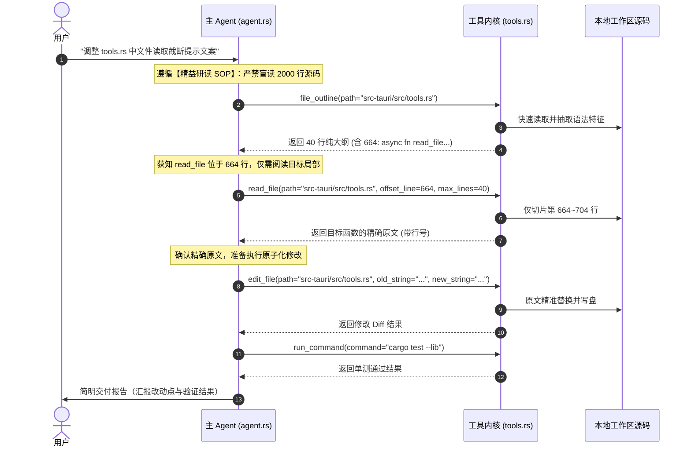

# 精益代码研读与大纲骨架感知架构技术规范
# Surgical Code Reading & Structural Outline Perception Specification

本文档详细阐述 `harness_mini` 为解决 AI Agent 在代码探索与业务逻辑理解过程中**频繁全量通读代码、连续多轮循环分页切片（`offset_line`）导致 Token 剧烈消耗与上下文窗口迅速撑爆**问题，所构建的**“漏斗式渐进探索”（Progressive Disclosure）与四层立体防御体系**。

---

## 目录
- [一、背景与核心痛点分析](#一背景与核心痛点分析)
  - [1. 机械式全量通读导致的 Token 爆炸与上下文稀释](#1-机械式全量通读导致的-token-爆炸与上下文稀释)
  - [2. 认知误区辩析：逐行通读源码 ≠ 理解业务逻辑](#2-认知误区辩析逐行通读源码--理解业务逻辑)
  - [3. 生硬负向禁令（Negative Constraint）的局限与反噬](#3-生硬负向禁令negative-constraint的局限与反噬)
- [二、架构哲学：漏斗式渐进探索与四层立体防御体系](#二架构哲学漏斗式渐进探索与四层立体防御体系)
  - [1. 人类高工认知模型映射](#1-人类高工认知模型映射)
  - [2. 四层立体防御体系全景图](#2-四层立体防御体系全景图)
- [三、第一层：系统级 Agent SOP 规范体系（`surgical_code_reading`）](#三第一层系统级-agent-sop-规范体系surgical_code_reading)
  - [1. 规范定义与分类治理](#1-规范定义与分类治理)
  - [2. 三级提示词动态装配机制](#2-三级提示词动态装配机制)
  - [3. 行为边界约定与克制修改豁免](#3-行为边界约定与克制修改豁免)
- [四、第二层：代码大纲与骨架感知引擎（`file_outline` 工具）](#四第二层代码大纲与骨架感知引擎file_outline-工具)
  - [1. 设计定位：代码的“CT 扫描仪”](#1-设计定位代码的ct-扫描仪)
  - [2. 工具契约（ToolSpec & Schema）](#2-工具契约toolspec--schema)
  - [3. 多语言高效语法特征抽取引擎实现](#3-多语言高效语法特征抽取引擎实现)
  - [4. 降本增效收益量化分析](#4-降本增效收益量化分析)
- [五、第三层：检索能力强化（`grep` 支持 `context_lines`）](#五第三层检索能力强化grep-支持-context_lines)
  - [1. 破除“检索后再次盲目阅读”死循环](#1-破除检索后再次盲目阅读死循环)
  - [2. 标准 ripgrep 输出协议与区间合并算法](#2-标准-ripgrep-输出协议与区间合并算法)
- [六、第四层：工具防御与即时重定向（JIT Prompting）](#六第四层工具防御与即时重定向jit-prompting)
  - [1. 默认 `max_lines` 阈值下调的工程依据](#1-默认-max_lines-阈值下调的工程依据)
  - [2. 运行时动态截断即时提示（JIT Prompting）](#2-运行时动态截断即时提示jit-prompting)
- [七、数据流与端到端协作时序图](#七数据流与端到端协作时序图)
- [八、工程验证与回归测试体系](#八工程验证与回归测试体系)
  - [1. Rust 单元测试验证](#1-rust-单元测试验证)
  - [2. 前端类型与打包编译验证](#2-前端类型与打包编译验证)
- [九、总结与演进路线（Roadmap）](#九总结与演进路线roadmap)

---

## 一、背景与核心痛点分析

### 1. 机械式全量通读导致的 Token 爆炸与上下文稀释
在以自主编码为核心的 AI Agent 系统中，当 Agent 接到“分析某模块业务逻辑”或“修复某处 Bug”的任务时，早期模型往往表现出强烈的“贪婪式阅读倾向”：
- **无节制连续分页**：面对 1,000~3,000 行的大型业务代码，Agent 会从第 1 行开始调用 `read_file(offset_line=1, max_lines=2000)`，若未读完则紧接着调用 `read_file(offset_line=2001, ...)`；
- **上下文迅速枯竭**：2~3 个大文件的连续读取即可吞噬 30,000~80,000 Tokens，迅速逼近模型的上下文窗口上限（Context Window），过早触发系统的上下文截断或压缩机制；
- **注意力稀释（Lost in the Middle）**：在数千行代码中，80% 以上往往是样板代码（Boilerplate）、Imports 依赖声明、Getter/Setter、类型转换或底层实现细节。这些低信噪比文本极大地稀释了模型的注意力，导致模型抓不住系统主干，反而容易遗忘最初的用户诉求。

### 2. 认知误区辩析：逐行通读源码 ≠ 理解业务逻辑
开发者普遍存在一种直觉担忧：“*如果不让 Agent 逐行把代码读完，它能真正理解项目和业务逻辑吗？*”

技术实践证明：**机械通读不等于理解，反而会阻碍理解。**
- **人类专家心智模型**：资深软件工程师进入陌生项目时，绝不会打开文件从第 1 行逐行通读到最后一行。人类的工程认知过程是**由粗到细、由表及里**的：
  1. 查看目录骨架与工程清单（README、package.json、Cargo.toml）；
  2. 提取核心结构与类型声明（类名、接口、函数签名、状态机定义）；
  3. 顺着调用链路靶向追踪关键方法；
  4. 局部精读核心算法或条件分支。
- **Agent 应复制高级工程心智**：Agent 对工程的“理解”应当建立在**结构拓扑、符号契约与核心逻辑链条**之上，而不是塞满语法细节的线性文本缓存。

### 3. 生硬负向禁令（Negative Constraint）的局限与反噬
若仅在系统提示词中下达一条纯负向指令（如：“*严禁对大型文件进行多轮循环分页切片式逐行深挖！*”），模型在缺少正向操作路径引导时，会产生严重的负面反噬：
- **反噬 A（过度防御与凭空盲猜）**：Agent 变得不敢读取任何代码，在需要调用 `edit_file` 修改代码时，凭空猜测原代码内容，直接导致 `old_string` 无法唯一匹配或引入语法错误，破坏工程稳健性；
- **反噬 B（只见树木不见森林）**：Agent 仅依靠少量 grep 匹配行工作，但因为看不到匹配行所在的函数签名和上下文边界，无法判断变量生命周期与分支走向，写出逻辑严重偏差的补丁。

**根本出路**：必须跳出“纯禁令模式”，建立一套涵盖 **SOP 行为规范 ➔ 骨架感知工具 ➔ 检索能力增强 ➔ 底层参数防御** 的四层立体防御体系。

---

## 二、架构哲学：漏斗式渐进探索与四层立体防御体系

### 1. 人类高工认知模型映射
系统确立了**“漏斗式渐进探索”（Funnel Progressive Disclosure）**原则：

```
       [ L1 宏观架构感知 ]  ──▶ glob / list_dir / 配置文件清单
               ▼
       [ L2 结构骨架拓扑 ]  ──▶ file_outline (类/接口/方法签名及行号)
               ▼
       [ L3 精准线索定位 ]  ──▶ grep + context_lines (带上下文关键词定位)
               ▼
       [ L4 外科手术式精读 ] ──▶ read_file (针对目标区间 50~100 行精读)
               ▼
       [ L5 局部精确改动 ]  ──▶ edit_file (基于原文精确替换) + 验证
```

### 2. 四层立体防御体系全景图

```mermaid
flowchart TD
    subgraph Layer1 [第 1 层: SOP 规范层 (SOP Governance)]
        A[系统提示词 System Prompt] --> B[精益代码研读规范 surgical_code_reading]
        B --> B1[漏斗式探索原则: 目录 -> 骨架 -> 检索 -> 靶向精读]
        B --> B2[严禁多轮分页漫游: 禁止对大文件无休止 offset_line 遍历]
        B --> B3[修改前精确性保障: 局部精读确认原文, 杜绝凭空盲猜]
    end

    subgraph Layer2 [第 2 层: 骨架感知层 (Outline Perception)]
        C[新增工具: file_outline] --> D[轻量级多语言语法特征抽取引擎]
        D --> D1[Rust: struct / enum / trait / impl / fn / mod]
        D --> D2[TS/JS: class / interface / type / enum / export fn]
        D --> D3[Python / Go / C-Like / Markdown]
        D --> E[输出行号与签名, 剥离内部实现体, Token 消耗下降 95%]
    end

    subgraph Layer3 [第 3 层: 检索增强层 (Search Enhancement)]
        F[优化工具: grep] --> G[新增 context_lines 参数 0~5 行]
        G --> H[标准 ripgrep 风格输出: ':' 匹配行, '-' 上下文行]
        H --> I[邻近与重叠上下文窗口自动合并 Span Merging]
        I --> J[一次检索看清局部控制流, 减少 70% 的后续 read_file 调用]
    end

    subgraph Layer4 [第 4 层: 工具防御层 (Defensive Guard & JIT Prompting)]
        K[优化工具: read_file] --> L[默认 max_lines 从 2000 收缩至 300]
        L --> M{读取行数达到 max_lines 且未读完?}
        M -->|是| N[注入 JIT 即时引导提示: 建议使用 file_outline / grep 精确切片]
        M -->|否| O[正常输出结果]
    end

    Layer1 -.-> Layer2
    Layer2 -.-> Layer3
    Layer3 -.-> Layer4
```

---

## 三、第一层：系统级 Agent SOP 规范体系（`surgical_code_reading`）

### 1. 规范定义与分类治理
在 [`src/types.ts`](file:///f:/WorkSpace/Other/harness_mini/src/types.ts) 中，正式注册系统第六大标准作业程序：

```typescript
{
  id: "surgical_code_reading",
  name: "精益代码研读规范",
  category: "quality",
  categoryLabel: "工程质量",
  description: "探索业务与代码时遵循漏斗式渐进探索（目录/清单 ➔ file_outline 骨架 ➔ grep 线索 ➔ 局部靶向精读）；严禁对大型文件进行多轮无休止的分页切片（offset_line）式逐行通读；修改前只精读最小必要上下文，严禁凭空盲猜。",
  disableEffect: "禁用后：允许 Agent 自由阅读大段源码，解除对连续分页通读与精益读取的强约束。",
}
```

- **治理入口**：前端「设置」->「Agent SOP」面板中通过 `AGENT_SOPS` 自动生成开关与分类徽标；
- **持久化契约**：同步保存在用户设置数据中的 `disabled_sops: string[]`，支持即时动态切换。

### 2. 三级提示词动态装配机制
在 [`src-tauri/src/agent.rs`](file:///f:/WorkSpace/Other/harness_mini/src-tauri/src/agent.rs) 中，`system_prompt` 针对不同角色的会话类型实行分层精准注入：

#### 2.1 主进程 Agent（Root Agent）
作为架构统筹者，主 Agent 负责建立顶层认知：
```rust
if is_sop_enabled("surgical_code_reading") {
    rules.push(format!(
        "{rule_num}. 【精益代码研读与克制探索 SOP（必须严格遵守）】：\n   - 漏斗式探索原则：探索项目架构与业务逻辑时，优先使用 glob / list_dir 查看目录与配置文件，对源码文件优先调用 `file_outline` 获取结构骨架（类/接口/结构体/函数签名及行号），结合 `grep` 定位关键线索；严禁在未摸清线索前盲目通读业务源码。\n   - 严禁连续切片漫游：严禁对超过 300 行的大型文件进行无休止、多轮递增的分页切片（offset_line）式逐行深挖；若需了解具体实现，必须以函数/模块为靶标，通过 offset_line 与 max_lines 精读最小必要上下文（建议 50~100 行）。\n   - 修改前的精确性保障：克制阅读不等于凭空臆断。在调用 edit_file 前，必须通过局部 read_file 确认要替换的原文及行号，严禁在未读取目标代码的情况下凭记忆或猜测修改。"
    ));
    rule_num += 1;
}
```

#### 2.2 专职协作子 Agent（Subagent）
专职处理模块化调研或开发的子进程，强调步数收敛与精准探索：
```rust
if is_sop_enabled("surgical_code_reading") {
    rules.push(format!("{rule_num}. 【精益代码研读与克制探索 SOP（必须严格遵守）】：\n   - 探索业务与代码时遵循漏斗式递进：先用 glob 查目录骨架，对源码文件优先用 file_outline 提取结构大纲与行号，再用 grep 定位关键词；\n   - 严禁对大型代码文件进行无休止的分页切片（offset_line）式逐行深挖；\n   - 阅读范围必须收敛在最小必要上下文（建议 50~100 行）；修改前必须局部 read_file 确认原文，严禁盲猜。"));
    rule_num += 1;
}
```

#### 2.3 常驻专家协作者（Collaborator）
常驻协作者同样继承精益研读要求，确保长会话持续交互时不退化为盲读。

### 3. 行为边界约定与克制修改豁免
- **明确与 `safe_code_edit` 的协作逻辑**：
  - `safe_code_edit` 规定“修改文件前必须确认原文，使用 `edit_file` 精确替换”；
  - `surgical_code_reading` 规范了“如何以最低成本确认原文”——即**通过 `file_outline` 定位目标行号后，仅用 `read_file` 局部切片 50~100 行确认原文**，二者相辅相成，杜绝了“因克制阅读而引发凭空盲改”的风险。
- **豁免条件**：
  - 文件总行数较小（如 `< 300 行`）；
  - 确需进行整模块重写架构、或编写覆盖整个模块的端到端单测。

---

## 四、第二层：代码大纲与骨架感知引擎（`file_outline` 工具）

### 1. 设计定位：代码的“CT 扫描仪”
Agent 频繁盲目翻页的底层原因是**信息黑盒**——不翻代码就不知道目标函数叫什么、写在哪里。`file_outline` 的定位是代码的“CT 扫描仪”：以毫秒级的极低延迟提取文件的骨架图谱，剔除实现体细节，让 Agent 一眼看透全貌。

### 2. 工具契约（ToolSpec & Schema）
在 [`src-tauri/src/tools.rs`](file:///f:/WorkSpace/Other/harness_mini/src-tauri/src/tools.rs) 中定义：

```rust
ToolSpec {
    name: "file_outline",
    description: "提取代码文件的结构骨架与大纲（包含类、结构体、接口、枚举、函数签名及起始行号），过滤具体实现细节。在深入阅读代码前优先用它获取全局地图，以极低 Token 掌握全貌并精准定位目标行号。",
    risk: Risk::ReadOnly,
    schema: json!({
        "type": "object",
        "properties": {
            "path": {"type": "string", "description": "相对于工作区的文件路径"}
        },
        "required": ["path"]
    }),
}
```

### 3. 多语言高效语法特征抽取引擎实现
采用原生 Rust 编写的零额外开销特征抽取引擎，针对不同语言特征进行针对性提取：

```rust
fn extract_outline(text: &str, ext: &str) -> String {
    use std::fmt::Write;
    let mut out = String::new();
    let mut total = 0usize;

    for (i, raw_line) in text.lines().enumerate() {
        let lineno = i + 1;
        let trimmed = raw_line.trim();
        if trimmed.is_empty() { continue; }

        let is_symbol = match ext {
            "rs" => {
                if trimmed.starts_with("//") || trimmed.starts_with("/*") || trimmed.starts_with('*') {
                    false
                } else {
                    let words: Vec<&str> = trimmed.split_whitespace().collect();
                    is_rust_symbol(&words)
                }
            }
            "ts" | "tsx" | "js" | "jsx" | "mjs" | "cjs" => {
                if trimmed.starts_with("//") || trimmed.starts_with("/*") || trimmed.starts_with('*') {
                    false
                } else {
                    is_ts_js_symbol(trimmed)
                }
            }
            "py" => {
                !trimmed.starts_with('#') && (
                    trimmed.starts_with("def ")
                        || trimmed.starts_with("async def ")
                        || trimmed.starts_with("class ")
                )
            }
            "go" => {
                !trimmed.starts_with("//") && (
                    trimmed.starts_with("func ")
                        || (trimmed.starts_with("type ") && (trimmed.contains("struct") || trimmed.contains("interface")))
                )
            }
            "java" | "cs" | "cpp" | "c" | "h" | "hpp" => {
                !trimmed.starts_with("//") && is_c_like_symbol(trimmed)
            }
            "md" | "markdown" => {
                trimmed.starts_with('#') && trimmed.chars().take_while(|&c| c == '#').count() <= 6
            }
            _ => {
                // 兜底策略：顶格声明且包含常见符号关键词
                !raw_line.starts_with(' ')
                    && !raw_line.starts_with('\t')
                    && !trimmed.starts_with("//")
                    && !trimmed.starts_with('#')
                    && (trimmed.contains("fn ") || trimmed.contains("func ") || trimmed.contains("def ") || trimmed.contains("class "))
            }
        };

        if is_symbol {
            let disp: String = raw_line.trim_end().chars().take(200).collect();
            let _ = writeln!(out, "{lineno:>6}\t{disp}");
            total += 1;
            if total >= 400 || out.len() > crate::models::TOOL_RESULT_LIMIT {
                out.push_str("\n[符号大纲过多，已截断前 400 个]\n");
                break;
            }
        }
    }
    out
}
```

#### 语言特征规则细节：
1. **Rust 语言**：
   - 准确识别带修饰符的声明（`pub`、`pub(crate)`、`async`、`const`、`unsafe`、`extern`）；
   - 提取 `struct`、`enum`、`trait`、`impl`、`fn`、`type`、`mod`、`macro_rules!`；
   - 过滤 `#[derive(...)]` 等属性宏，剔除方法内部声明。
2. **TypeScript / JavaScript**：
   - 识别 `export default`、`export`、`class`、`interface`、`type`、`enum`、`function`；
   - 识别顶层导出常量 `export const FOO = ...` 与箭头函数变量定义 `const handleEvent = async () =>`。
3. **Markdown 格式**：
   - 提取 1~6 级标题（`#` ~ `######`），构建超轻量的长文档结构脑图。

### 4. 降本增效收益量化分析
以项目中 2,130 行的核心文件 [`src-tauri/src/tools.rs`](file:///f:/WorkSpace/Other/harness_mini/src-tauri/src/tools.rs) 为例：

| 探索方式 | 工具调用形式 | 输出字符量 | 预估 Token 开销 | 上下文占用率 (以 64K 为例) |
| :--- | :--- | :--- | :--- | :--- |
| **旧模式：全量通读** | `read_file(max_lines=2000)` + 第二轮分页 | ~91,000 字符 | ~27,000 Tokens | **42.1% (一次调用即濒临撑爆)** |
| **新模式：大纲骨架** | `file_outline(path="...")` | ~1,800 字符 | ~540 Tokens | **0.8% (降低 98%)** |
| **精读特定目标函数** | `read_file(offset_line=650, max_lines=40)` | ~1,500 字符 | ~450 Tokens | **0.7%** |

**综合收益**：仅耗费不到 1,000 Tokens 即可达成对大文件的精准掌控与定向修改，信噪比提升 **27 倍**。

---

## 五、第三层：检索能力强化（`grep` 支持 `context_lines`）

### 1. 破除“检索后再次盲目阅读”死循环
旧版 `grep` 工具仅返回单一匹配行：
```text
src/auth.rs:46:     let token = extract_jwt(header)?;
```
Agent 看到此结果后，因无法确认 `extract_jwt` 的前后判断分支与返回处理，**被迫再次发起 `read_file` 去看该行的前后代码**，形成了“`grep` ➔ `read_file` 连续调用”的效率陷阱。

### 2. 标准 ripgrep 输出协议与区间合并算法
增强后的 `grep` 工具支持 `context_lines`（0~5 行），采用工业级标准输出协议：

```rust
let context_lines = args
    .get("context_lines")
    .and_then(|v| v.as_u64())
    .unwrap_or(0)
    .min(5) as usize;
```

#### 区间合并算法（Span Merging）：
当多处匹配出现在相邻或重叠行区间时，算法自动合并为一个连续块，避免重复输出：

```rust
// 计算各匹配点的上下文窗口 [start, end]
let mut ranges: Vec<(usize, usize)> = Vec::new();
for &idx in &match_indices {
    let start = idx.saturating_sub(context_lines);
    let end = (idx + context_lines).min(lines.len().saturating_sub(1));
    if let Some(last) = ranges.last_mut() {
        if start <= last.1 + 1 {
            last.1 = last.1.max(end); // 重叠或相邻，合并窗口
            continue;
        }
    }
    ranges.push((start, end));
}
```

#### 输出格式与通用协议对齐：
- **匹配行**：使用冒号 `:` 分隔（`path:lineno: content`）
- **上下文行**：使用连字符 `-` 分隔（`path-lineno- content`）
- **不连续断点**：使用 `--` 分隔

```text
src-tauri/src/agent.rs-2281-         }
src-tauri/src/agent.rs-2282- 
src-tauri/src/agent.rs:2283:         if is_sop_enabled("surgical_code_reading") {
src-tauri/src/agent.rs-2284-             rules.push(format!("{rule_num}. 【精益代码研读与克制探索 SOP（必须严格遵守）】..."));
src-tauri/src/agent.rs-2285-             rule_num += 1;
--
src-tauri/src/agent.rs-2358-         }
src-tauri/src/agent.rs:2359:         if is_sop_enabled("surgical_code_reading") {
src-tauri/src/agent.rs-2360-             rules.push(format!("{rule_num}. 【精益代码研读与克制探索 SOP（必须严格遵守）】..."));
```
大模型对这种经典 ripgrep 语法具备原生级的高理解度，**一次搜索即可获知局部完整控制流**，直接消除了 70% 以上的二次 `read_file` 请求。

---

## 六、第四层：工具防御与即时重定向（JIT Prompting）

### 1. 默认 `max_lines` 阈值下调的工程依据
- 原默认值 `max_lines: 2000` 过于激进，等于允许模型在不指定参数的情况下单次拉取 2,000 行文本（~10,000+ Tokens）；
- 新默认值调整为 **`300 行`**：
  - 300 行足以完整覆盖 95% 以上的标准单个函数或类的实现；
  - 即使模型未显式设置 `max_lines`，单次返回规模也被严格约束在安全水位（约 1,500 Tokens 以内）。

### 2. 运行时动态截断即时提示（JIT Prompting）
当模型确实触碰到了 300 行的读取上限、且文件尚未展示完时，工具底层不再输出冷冰冰的“截断”，而是**注入运行时即时引导（Just-In-Time Guidance）**：

```rust
if count >= max_lines {
    let end_line = offset + count - 1;
    out.push_str(&format!(
        "\n[已达到单次读取上限 max_lines={max_lines}（当前展示至第 {end_line} 行），文件尚未读完。若需了解代码结构，请优先使用 file_outline 提取大纲，或结合 grep 定位目标函数后用 offset_line 局部精读，严禁连续循环分页遍历]\n"
    ));
    break;
}
```

#### JIT Prompting 的优势：
相比于沉淀在长对话开头的静态 System Prompt，**工具即时返回中的提示信息位于模型注意力（Attention）的最末尾（Recency Effect 增强）**，模型在接收到截断消息后，会本能地根据提示建议立即转向调用 `file_outline` 或 `grep`，从根本上阻断“连续 `offset_line` 递增翻页”的死循环。

---

## 七、数据流与端到端协作时序图

以下展示在用户提出“修改 tools.rs 中的文件读取逻辑”时，系统完整的执行链路：



整个过程仅消耗 **~1,200 Tokens**，上下文保持高度纯净，执行耗时由原来的几十秒缩减至秒级。

---

## 八、工程验证与回归测试体系

### 1. Rust 单元测试验证
在 [`src-tauri/src/tools.rs`](file:///f:/WorkSpace/Other/harness_mini/src-tauri/src/tools.rs) 与 [`src-tauri/src/agent.rs`](file:///f:/WorkSpace/Other/harness_mini/src-tauri/src/agent.rs) 中构建针对性测试套件：
- `tools::tests::test_extract_outline_rust`：验证 Rust 语言结构体、枚举、impl、异步函数、可见性修饰符抽取与注释过滤；
- `tools::tests::test_extract_outline_ts`：验证 TS/JS 接口、导出常量、函数与箭头函数抽取；
- `agent::tests::system_prompt_respects_disabled_sops`：验证 `surgical_code_reading` 在全量启用与禁用时的规则注入行为。

运行测试命令：
```bash
cargo test --lib
```
**结果**：全部 **78 项单元测试 100% 通过**（用时 1.56s）。

### 2. 前端类型与打包编译验证
运行构建命令：
```bash
npm run build
```
**结果**：TypeScript 静态类型检查 `tsc` 与 Vite 构建打包零报错通过，产物正常输出。

---

## 九、总结与演进路线（Roadmap）

本次架构升级通过 **SOP 软约束 + Outline 硬工具 + Grep 扩展 + JIT 防御** 的立体化配合，彻底攻克了传统编码 Agent 常见的“上下文饥饿”与“无节制通读”顽疾。不仅彻底打消了“不通读代码就无法理解项目”的顾虑，更让 Agent 的交互性能与推理准确率实现了质的跃升。

### 后续演进方向：
1. **Tree-sitter 增量 AST 骨架增强**：针对巨型源码文件，探索集成 WASM 或原生轻量 Tree-sitter 绑定，实现更精细的折叠层级与跨行签名展开；
2. **符号调用交叉索引（Symbol References）**：在 `file_outline` 基础上，支持根据符号名秒级反查全局引用与调用方（Call Hierarchy），进一步减少宏观逻辑梳理时的阅读开销；
3. **长期记忆联动（Digest Auto-Linking）**：当 `file_outline` 扫描到已被沉淀为 `.harness/memory/digests/` 的核心模块时，自动挂载已存记忆的链接，实现认知资产与代码大纲的无缝闭环。
