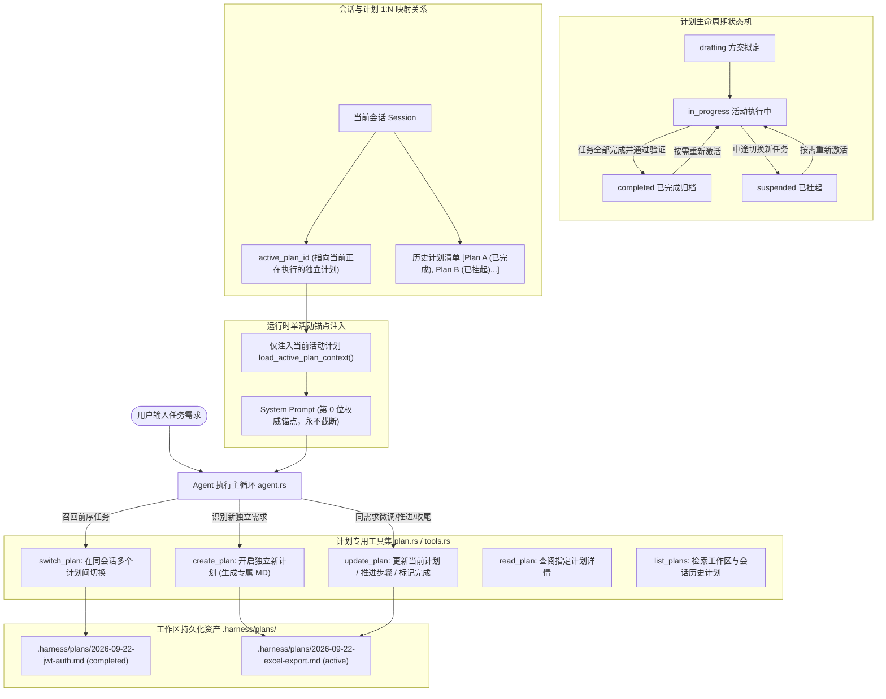

# 任务方案计划中枢与多轮需求防失真治理规范
# Task Plan Governance & Multi-Turn Anti-Distortion Specification

本文档详细记录 `harness_mini` 中 **任务方案计划中枢（.harness/plans/）** 与 **多轮需求防失真治理系统** 的完整架构设计、数据持久化机制、状态机流转模型以及前后端落地规范。

---

## 目录
- [一、背景与核心痛点剖析](#一背景与核心痛点剖析)
- [二、业内领先 Agent 工具实现方案调研](#二业内领先-agent-工具实现方案调研)
- [三、架构全景图：1 会话 : N 任务计划流模型](#三架构全景图1-会话--n-任务计划流模型)
- [四、计划目录与 Markdown 文档规范（.harness/plans/）](#四计划目录与-markdown-文档规范harnessplans)
  - [1. 目录存储结构](#1-目录存储结构)
  - [2. 计划文档结构标准（Frontmatter + 六维正文）](#2-计划文档结构标准frontmatter--六维正文)
- [五、计划生命周期与状态机设计](#五计划生命周期与状态机设计)
- [六、专用工具链设计与接口规格](#六专用工具链设计与接口规格)
  - [1. create_plan：独立新计划创建](#1-create_plan独立新计划创建)
  - [2. update_plan：需求调整与步骤推进](#2-update_plan需求调整与步骤推进)
  - [3. switch_plan：多计划切换与重激活](#3-switch_plan多计划切换与重激活)
  - [4. read_plan 与 list_plans：计划查阅与清单检索](#4-read_plan-与-list_plans计划查阅与清单检索)
- [七、运行时防失真装配引擎与 SOP 规范联动](#七运行时防失真装配引擎与-sop-规范联动)
  - [1. 单活动锚点装配（load_active_plan_context）](#1-单活动锚点装配load_active_plan_context)
  - [2. 增强版 plan_first SOP 行为准则](#2-增强版-plan_first-sop-行为准则)
  - [3. 需求变更自动同步与双向同步机制](#3-需求变更自动同步与双向同步机制)
- [八、前端可视化与交互集成](#八前端可视化与交互集成)
  - [1. 悬浮面板 FloatingTaskPanel 计划状态条](#1-悬浮面板-floatingtaskpanel-计划状态条)
  - [2. 工具卡片 ToolCard 计划定制渲染](#2-工具卡片-toolcard-计划定制渲染)
- [九、测试体系与工程验证](#九测试体系与工程验证)

---

## 一、背景与核心痛点剖析

在实际使用 AI Agent 辅助复杂工程编码的过程中，随着任务复杂度提升与交互轮次增长，暴露了以下核心痛点：

1. **长多轮对话下的需求漂移与衰减（Context Drift & Loss）**：
   - 当任务经历多次迭代，或触发历史上下文压缩（Compaction）与滑动截断时，早期轮次确立的核心架构设计、接口约束与业务细节极易被模型稀释或遗忘；
   - 用户在后续轮次提出补充或修正时，大语言模型容易“顾此失彼”，甚至违背前期共识，导致最终交付的代码偏离初衷。
2. **大改动任务缺乏物理锚点（Lack of Grounding Anchor）**：
   - 面对跨多文件修改、模块级重构等大改动任务，若无物理落盘的结构化方案，Agent 容易陷入散漫盲目探索或“黑盒直接编码”；
   - 现有 `todo` 工具仅能维护简略的任务项清单，缺少架构设计背景、文件映射全貌和历史版本演进记录。
3. **同会话连续多需求杂糅冲突（Multi-Task Collision in Single Session）**：
   - 开发者常在同一会话中连续推进多个独立任务（例如：先做“登录鉴权重构”，再做“导出 Excel”，接着做“修复暗黑模式 Bug”）；
   - 若将计划与会话简单粗暴地按 1:1 绑定，会导致多个毫无关联的需求强行堆砌在同一个文档中，造成**计划文档杂糅膨胀**与**严重的上下文污染**（已完成的旧需求继续干扰新需求）。
4. **需求变更后的脱节执行（Desynchronized Execution）**：
   - 需求在工程开发中高频变动，若无“先调计划、再改代码”的强制闭环，模型容易口头承诺但实际代码仍残留旧逻辑。

---

## 二、业内领先 Agent 工具实现方案调研

通过对业内领先 AI Coding Agent 的系统性调研，梳理出如下典型模式：

| 工具产品 | 会话与任务建模 | 跨多需求处理机制 | 核心优势与借鉴点 |
| :--- | :--- | :--- | :--- |
| **Devin** (Cognition Labs) | **Session ➔ Runs / Playbooks (1:N)** | 每个需求独立生成 Playbook；任务经验收后置为 `Resolved`，Prompt 锚点复位，后续任务开启新 Playbook。 | **状态机流转**：任务收尾后解除活动状态，严禁旧执行方案污染新任务。 |
| **Roo Code / Cline** | **Task State Machine + Memory Bank** | 分离 `activeContext.md`（仅记录当前聚焦的活跃任务）与 `progress.md`（所有已完成特性的历史清单）。 | **双层解耦**：只将当前唯一焦点注入 Prompt，历史成果以轻量摘要留存。 |
| **GitHub Copilot Workspace** | **Issue ➔ Specification ➔ Plan** | 每次需求作为独立的 Plan Artifact 文件化落盘，不同需求拥有独立实体，支持独立 Git 差异比对。 | **Plan as Code**：一需求一文档，独立受版本控制。 |
| **Windsurf / Cascade** | **Thread ➔ Ephemeral Plan / Scratchpad** | 同一 Thread 内，随着任务完成通过 Checkpoint 归档旧步骤，自动重置暂存区并针对新 Prompt 建立新 Plan。 | **会话时间线承载多个计划流**。 |

---

## 三、架构全景图：1 会话 : N 任务计划流模型

基于上述调研与工程实践，`harness_mini` 采用 **1 会话 : N 独立任务计划（1 Session : N Plans）** 的生命周期模型：



---

## 四、计划目录与 Markdown 文档规范（.harness/plans/）

### 1. 目录存储结构
```text
<工作区根目录>/
  └── .harness/
      ├── memory/          # 认知记忆与技术大盘 (profile.md, conventions.md, digests/)
      ├── skills/          # 工作区可复用脚本与工具技能
      └── plans/           # 【核心】任务方案计划中枢
          ├── 2026-09-22-user-auth-refactor.md  # 结构化计划 MD (已完成)
          ├── 2026-09-22-excel-export.md        # 结构化计划 MD (当前活动中)
          └── archive/                          # 历史归档目录 (可选)
```

### 2. 计划文档结构标准（Frontmatter + 六维正文）
每个 `.md` 计划文档均由标准化元数据与六维结构化内容组成：

```markdown
---
id: "plan-20260922-auth-refactor"
title: "用户鉴权重构与 JWT 改造计划"
status: "in_progress" # drafting | in_progress | completed | suspended | archived
created_at: "2026-09-22T09:30:00+08:00"
updated_at: "2026-09-22T09:45:00+08:00"
version: 2
session_id: "4408212d-b34a-425a-81bf-74234d064429"
---

# 任务方案：用户鉴权重构与 JWT 改造计划

## 一、需求背景与目标 (Requirements & Goals)
- **核心目标**：将传统的 Session 鉴权改造为无状态 JWT，支持分布式水平扩展。
- **约束条件**：兼容旧客户端的 Token 传递格式，不影响现有的用户表结构。

## 二、架构设计与技术方案 (Architecture & Design)
- 采用 jsonwebtoken crate 进行 HS256 编解码。
- 在 Axum 中间件层统一拦截请求，提取 `Authorization: Bearer <token>`。
- 异常场景统一返回 401 结构化 JSON 错误响应。

## 三、涉及文件与影响范围 (Scope & Affected Files)
- `[NEW] src/auth/jwt.rs` - JWT 生成与验证工具集
- `[MODIFY] src/middleware/auth.rs` - 替换原有 Session 解析逻辑为 JWT 校验
- `[MODIFY] Cargo.toml` - 引入 jsonwebtoken 与 chrono 依赖
- `[DELETE] src/auth/session_store.rs` - 清理废弃的内存 Session 存储

## 四、分步执行清单 (Execution Checklist)
- [x] 步骤 1：引入依赖并在 `src/auth/jwt.rs` 实现核心 Token 编解码与单元测试
- [/] 步骤 2：重构 `src/middleware/auth.rs` 中间件并对接 Claims 上下文
- [ ] 步骤 3：清理废弃 Session 代码与未使用的依赖
- [ ] 步骤 4：运行回归测试与静态编译检查

## 五、验证与验收策略 (Verification Strategy)
- 自动化验证：`cargo test --package auth`
- 边界测试：测试 Token 过期、签名篡改、空 Header 等异常输入

## 六、需求变更历史 (Revision History)
- **v2 (2026-09-22 09:45)**：根据用户多轮对话反馈，增加针对 Redis 黑名单注销逻辑的补充支持。
- **v1 (2026-09-22 09:30)**：初始化创建鉴权重构方案。
```

---

## 五、计划生命周期与状态机设计

| 状态 | 含义说明 | 活跃挂载行为 | 触发转换事件 |
| :--- | :--- | :--- | :--- |
| **`drafting`** | 方案分析与拟定中 | 仅作备忘，提示用户确认方案 | Agent 初步分析可行性并起草方案 |
| **`in_progress`** | 正式执行中（当前活跃计划） | **强力注入 System Prompt 顶层** | 用户确认方案，开始执行代码修改 |
| **`completed`** | 任务完成并通过验证 | **自动解除活动注入** | 所有步骤收尾，测试通过，最终交付 |
| **`suspended`** | 中途挂起（切换至其他需求） | 解除活动注入，保留断点进度 | 用户提出插队处理新需求 |
| **`archived`** | 归档结案 | 归档至 `archive/` 目录 | 用户或系统显式归档旧计划 |

---

## 六、专用工具链设计与接口规格

### 1. `create_plan`：独立新计划创建
- **触发时机**：当识别到跨多文件（3+ 文件）、模块级重构、或预计长多轮的新需求时，在改动代码前调用。
- **参数规格**：
  - `title` (string, 必填): 计划简明标题
  - `goals` (string, 必填): 核心需求与业务目标
  - `architecture` (string, 必填): 架构方案与关键设计决策
  - `files` (array of string, 必填): 预估涉及的文件清单及变更类型
  - `steps` (array of string, 必填): 分步实施 Checklist（默认均为未完成）
  - `verification` (string, 选填): 验证与自检命令
- **行为**：在 `.harness/plans/` 生成专属 `.md`，将当前会话的 `active_plan_id` 指向该计划，置为 `in_progress`。

### 2. `update_plan`：需求调整与步骤推进
- **触发时机**：用户提出需求微调、步骤推进勾选、或全部完成收尾时。
- **参数规格**：
  - `plan_id` (string, 选填): 缺省为当前会话 Active Plan
  - `reason` (string, 必填): 调整原因或阶段总结
  - `status` (string, 选填): 变更状态（如完成时传 `"completed"`）
  - `step_updates` (array of object: `{ index, status }`, 选填): 更新步骤状态
  - `modified_sections` (object, 选填): 覆盖需求、设计或文件清单
  - `revision_note` (string, 选填): 追加至 Revision History 的变更摘要
- **行为**：更新文档内容，Frontmatter `version += 1`，若置为 `completed` 则自动解除活跃挂载。

### 3. `switch_plan`：多计划切换与重激活
- **触发时机**：用户要求回溯前序任务（如：“先停一下当前功能，回到之前的鉴权任务改个参数”）。
- **参数规格**：
  - `plan_id` (string, 必填): 目标计划 ID 或文件名 Slug
- **行为**：将当前活动计划置为 `suspended`，并将目标计划恢复为 `in_progress` 并绑定为 `active_plan_id`。

### 4. `read_plan` 与 `list_plans`：计划查阅与清单检索
- **`read_plan(plan_id?)`**：读取指定计划或当前活动计划的完整 Markdown 内容。
- **`list_plans(include_archived?)`**：列出当前工作区与会话名下的所有计划条目（包含 ID、标题、状态、版本、完成进度百分比）。

---

## 七、运行时防失真装配引擎与 SOP 规范联动

### 1. 单活动锚点装配（load_active_plan_context）
在 `src-tauri/src/agent.rs` 的 `run_once` 执行主循环中，系统动态读取当前工作区与会话绑定的 Active Plan：
- **位置**：注入 System Prompt 顶层的 `project_section`（第 0 位）；
- **永久驻留**：不受用户消息滚动截断或压缩备忘录影响；
- **纯净单锚点**：同会话中不论历史存在多少个计划，**仅注入当前唯一处于 `in_progress` 的活动计划**，彻底杜绝多需求上下文污染。

### 2. 增强版 `plan_first` SOP 行为准则
在 `system_prompt` 中强化升级 `plan_first` 规范：
1. **方案先行与物理落盘**：面对跨多文件或复杂业务需求，严禁无计划直接写代码，必须调用 `create_plan` 固化为 Markdown 计划并征询用户确认；
2. **需求变更优先更新**：多轮对话中用户提出修正或增删时，**必须先调用 `update_plan` 刷新文档并追加版本历史，严禁口头承诺却跳过计划同步**；
3. **闭环收尾与解挂**：验证全部通过后，必须调用 `update_plan(status="completed")` 结案并解除活动挂载；
4. **独立新任务分流**：在同一会话中开启新特性时，必须开启独立的 `create_plan`，禁止不同需求乱序杂糅。

---

## 八、前端可视化与交互集成

1. **悬浮面板 `FloatingTaskPanel`**：
   - 顶部增加活动计划胶囊条：`[📋 计划: 用户鉴权重构 (v2) · 2/4 步骤]`；
   - 支持一键展开计划详情弹窗或快速打开本地 `.harness/plans/xxx.md`。
2. **工具卡片 `ToolCard`**：
   - 针对 `create_plan` / `update_plan` 呈现专用的计划卡片；
   - 清晰展示计划标题、版本号、步骤 Checkbox 列表与需求变更日志（Revision Note）。

---

## 九、测试体系与工程验证

1. **单元测试 (`cargo test plan::tests`)**：
   - 测试 Frontmatter 解析、修改与序列化的一致性；
   - 测试创建计划、版本递增、步骤状态流转与历史计划切换；
   - 测试空工作区与异常目录的容错处理。
2. **全流程场景端到端验证**：
   - 场景一：单任务大改动触发 `create_plan`；
   - 场景二：多轮对话用户提出需求调整触发 `update_plan`；
   - 场景三：完成首个需求后，发起第二个不相干需求触发新计划创建与活动计划切换。
