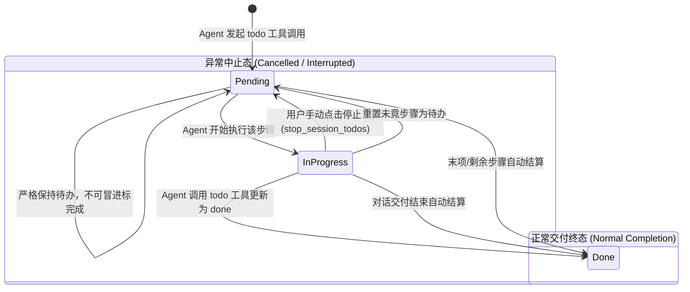
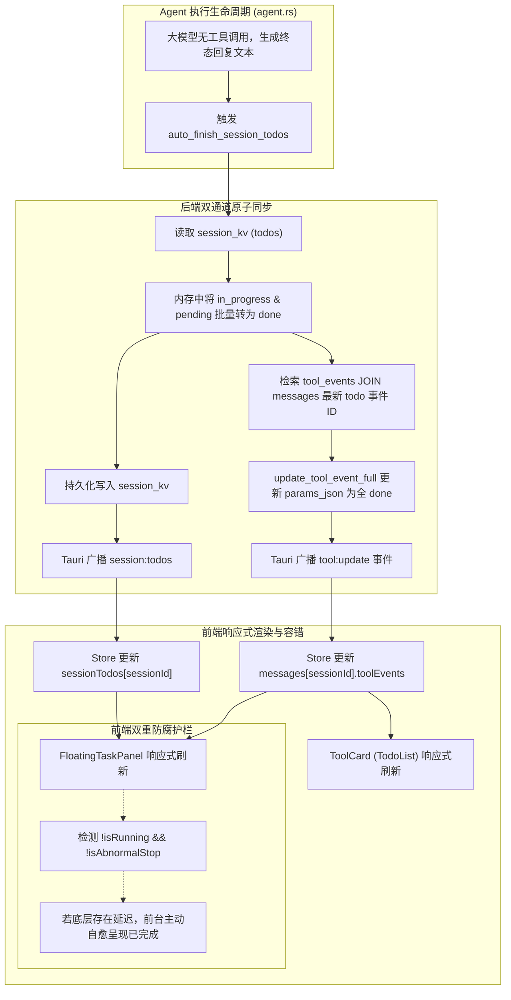

# 待办清单全生命周期与末项完成态治理规范
# Todo Completion State & Lifecycle Governance Specification

本文档系统性总结 `harness_mini` 中 **会话待办任务清单（Todo）** 的全生命周期状态流转、单轮多步骤防重治理、对话终态末项自动结案（Auto-finish Pending Todo）、数据库双通道（`session_kv` 与 `tool_events`）同步以及前后端数据一致性保障机制。

---

## 目录
- [一、背景与核心痛点剖析](#一背景与核心痛点剖析)
  - [1. 任务清单单轮多步骤重复创建问题（Turn-level Todo Duplication）](#1-任务清单单轮多步骤重复创建问题turn-level-todo-duplication)
  - [2. 终态交付时末项待办未完成残留问题（Final Pending Todo Unsettled）](#2-终态交付时末项待办未完成残留问题final-pending-todo-unsettled)
- [二、技术根因深度解构](#二技术根因深度解构)
  - [1. Agent 执行行为特征：终态回复直出，天然缺失尾部工具调用](#1-agent-执行行为特征终态回复直出天然缺失尾部工具调用)
  - [2. 前端三元运算符真值短路陷阱（Falsy Fallback Pitfall）](#2-前端三元运算符真值短路陷阱falsy-fallback-pitfall)
  - [3. 后端双通道存储数据分叉与事件广播缺失（Dual-Storage Split-Brain）](#3-后端双通道存储数据分叉与事件广播缺失dual-storage-split-brain)
  - [4. 会话加载与初始化自愈盲区（Initialization Self-Healing Blind Spot）](#4-会话加载与初始化自愈盲区initialization-self-healing-blind-spot)
- [三、架构全景与状态机设计](#三架构全景与状态机设计)
  - [1. 待办项状态转移模型（Todo State Machine）](#1-待办项状态转移模型todo-state-machine)
  - [2. 双通道持久化与响应式广播流图](#2-双通道持久化与响应式广播流图)
- [四、后端自愈治理与原子持久化（Rust / Tauri）](#四后端自愈治理与原子持久化rust--tauri)
  - [1. 对话交付自动结算（agent.rs: auto_finish_session_todos）](#1-对话交付自动结算agentrs-auto_finish_session_todos)
  - [2. 用户中断主动重置（agent.rs: stop_session_todos）](#2-用户中断主动重置agentrs-stop_session_todos)
  - [3. 会话加载幂等自愈（commands.rs: get_session_todos）](#3-会话加载幂等自愈commandsrs-get_session_todos)
- [五、前端全景容错与多组件响应式更新（React / TypeScript）](#五前端全景容错与多组件响应式更新react--typescript)
  - [1. 悬浮面板智能状态归敛（FloatingTaskPanel.tsx）](#1-悬浮面板智能状态归敛floatingtaskpaneltsx)
  - [2. 历史与实时工具卡片视觉闭环（ToolCard.tsx）](#2-历史与实时工具卡片视觉闭环toolcardtsx)
  - [3. 异常中止（Cancelled / Interrupted）防误伤护栏](#3-异常中止cancelled--interrupted防误伤护栏)
- [六、工程验证与测试保障](#六工程验证与测试保障)
  - [1. 单元测试套件（Rust Unit Tests）](#1-单元测试套件rust-unit-tests)
  - [2. 数据库实机检查与验证结论](#2-数据库实机检查与验证结论)
- [七、开发指导原则与防腐规范（Best Practices）](#七开发指导原则与防腐规范best-practices)

---

## 一、背景与核心痛点剖析

在 Agent 辅助软件研发的过程中，轻量级待办清单（`todo` 工具）是大模型拆解任务、展示工作进度、给予用户确定性预期的核心机制。用户与系统在实际交互中先后遇到了两类严重影响使用体验的关键缺陷：

### 1. 任务清单单轮多步骤重复创建问题（Turn-level Todo Duplication）
- **痛点现象**：
  Agent 在执行单轮对话期间，往往伴随着“思考 ➔ 规划 ➔ 执行工具 ➔ 总结回复”的多步循环。在此过程中，经常出现第 1 步创建了一张待办清单，第 2 步在推进过程中又创建了一张一模一样的新任务清单；在浮窗看板中呈现为“第 1 轮任务清单（未完成）”与“第 2 轮任务清单（已完成）”，内容完全重复，严重干扰用户视线。
- **治理原则**：
  同一轮对话（由同一条 User Message 触发的 Assistant 连续工具调用）中，多次调用的 `todo` 属于同一张清单的逐步推进版本，必须聚合成单一轮次任务卡片，仅展示最新快照并串联所有关联事件。

### 2. 终态交付时末项待办未完成残留问题（Final Pending Todo Unsettled）
- **痛点现象**：
  当 Agent 已经完整完成了用户的需求、并在正文中给出了最终解决方案、总结报告或交付成果时，用户检查右侧浮窗看板和聊天卡片，发现清单中的**最后一条待办项（例如“输出最终方案报告与结论汇报”）始终未勾选，依然显示为空心圆圈 `○` 或处于未完成状态**，整张任务清单卡片的完成率无法达到 100%，看板标题也无法标记为 `completed`（绿色已完成）。
- **用户困惑**：
  AI 明明已经回答完了，为什么界面上总留着最后一条没做完？是系统漏执行了步骤，还是模型卡死中途断开了？这种不确定性极大地削弱了用户对 Agent 可靠性的信任。

---

## 二、技术根因深度解构

经过对后端代码执行链路、数据库存储层以及前端 React 渲染机制的全链路追踪，梳理出导致末项待办未完成的 4 个根本原因：

### 1. Agent 执行行为特征：终态回复直出，天然缺失尾部工具调用
在典型的多步骤规划场景中，大模型的待办清单通常拆解为如下形式：
1. 步骤 1：排查依赖与环境准备（`done`）
2. 步骤 2：核心业务代码编写与修改（`done`）
3. 步骤 3：运行测试与自动化验证（`in_progress` ➔ `done`）
4. 步骤 4：输出最终方案报告与答复用户（`pending`）

当模型执行完步骤 3 的工具调用（如 `run_command` 执行构建和测试）后，下一步模型需要向用户进行答复。**在大模型推理引擎机制中，输出自然语言文本即代表当前轮次交付完毕，模型不会、也不应当为了仅仅把最后一条标记为 `done` 而多消耗一次推理 Token 发起一个无意义的 `todo` 工具调用**。因此，数据库和快照中留下的最后一次 `todo` 工具入参中，最后一条步骤天然处于 `pending` 状态。

### 2. 前端三元运算符真值短路陷阱（Falsy Fallback Pitfall）
在 `FloatingTaskPanel.tsx` 原先的状态映射实现中：
```typescript
// 错误代码示例
const items: TimelineTaskItem[] = pt.rawItems.map((t: any, idx: number) => ({
  index: idx + 1,
  content: String(t.content || ""),
  status: isTaskRunning
    ? (t.status || "pending")
    : t.status === "in_progress"
    ? "done"
    : t.status || "done", // <-- 致命缺陷点
}));
```
在非运行态（`!isTaskRunning`）下：
- 当 `t.status === "pending"` 时，判断 `t.status === "in_progress"` 为 `false`；
- 执行后半段表达式：`t.status || "done"`；
- 在 JavaScript 中，非空字符串 `"pending"` 是**真值（Truthy）**，逻辑或运算符 `||` 会发生**真值短路**，直接返回 `"pending"`，永远不会回退到 `"done"`！
- 最终导致 `items.every((t) => t.status === "done")` 判定失败，看板无法转为 `completed`。

在 `ToolCard.tsx` 中也存在类似判断盲区：
```typescript
// 错误代码示例
const isDone = t.status === "done" || (!isRunning && t.status === "in_progress");
```
未考虑非运行态下已交付完成的末项 `pending` 任务，导致其视觉上始终为空心圆。

### 3. 后端双通道存储数据分叉与事件广播缺失（Dual-Storage Split-Brain）
系统中存在两套维护任务状态的数据源：
1. **轻量会话 KV 存储（`session_kv` 表）**：通过键 `todos` 记录当前活跃任务项；
2. **对话历史工具事件（`tool_events` 表）**：记录每一轮对话中每一次工具调用的快照（`params_json` 字段）。

在原有的 `agent.rs: auto_finish_session_todos` 逻辑中：
- 后端在检测到对话正常交付结束时，仅遍历并修改了 `session_kv` 中的 JSON，将 `in_progress` 和 `pending` 改为 `done`，并发射了 `session:todos` 事件；
- **但完全遗漏了对 SQLite 中 `tool_events` 表对应记录的持久化更新，且未发射 `tool:update` 广播**！

**导致的后果**：
- 前端的消息流（Message Stream）以及 `FloatingTaskPanel` 解析的都是关联的工具事件对象（`turnLastTodoEv`）；
- 即使 `session_kv` 已经完成了更新，工具事件内部的 `params_json` 依旧被死死冻结在历史的 `"status": "pending"`；
- 用户刷新页面或重新载入消息时，前端从 `tool_events` 反序列化出来的依然是未完成状态，形成“存储分叉”（Split-Brain）。

### 4. 会话加载与初始化自愈盲区（Initialization Self-Healing Blind Spot）
在 `commands.rs: get_session_todos`（打开会话时被调用）中：
```rust
// 修复前的缺陷代码
for item in todos_arr.iter_mut() {
    if item.get("status").and_then(|s| s.as_str()) == Some("in_progress") {
        item["status"] = if should_mark_done {
            serde_json::json!("done")
        } else {
            serde_json::json!("pending")
        };
        changed = true;
    }
}
```
该自愈逻辑仅针对 `in_progress` 执行修复，若会话已经完成（`should_mark_done == true`），`pending` 状态的项目完全被忽略，使得遗留会话中的历史末尾待办永久失去自动修复的机会。

---

## 三、架构全景与状态机设计

### 1. 待办项状态转移模型（Todo State Machine）



### 2. 双通道持久化与响应式广播流图



---

## 四、后端自愈治理与原子持久化（Rust / Tauri）

### 1. 对话交付自动结算（`agent.rs: auto_finish_session_todos`）
在对话正常结束、输出 `message:final` 之后，立即调用 `auto_finish_session_todos` 进行收敛：
- **双向自愈取值**：优先读取 `session_kv`；若不存在，兜底从 `tool_events` 的最新记录中提取当前清单；
- **全量终态标记**：不仅把 `in_progress` 标为 `done`，同时把所有仍为 `pending` 的项目（特别是最后的答复步骤）标记为 `done`；
- **同步工具事件表**：通过 SQL 精确关联查询，更新 `tool_events` 表中的 `params_json`，并由 `emit_tool` 广播 `tool:update`。

```rust
pub fn auto_finish_session_todos(state: &crate::AppState, app: &AppHandle, session_id: &str) {
    let db = state.db.lock().unwrap();
    let raw: Option<String> = store::get_kv(&db, session_id, "todos").ok().flatten();
    let mut val: Option<Value> = raw.and_then(|r| serde_json::from_str(&r).ok());

    // 若 session_kv 中未找到，尝试从最近的 todo tool event 中获取
    if val.is_none() {
        let ev_params: Option<String> = db
            .query_row(
                "SELECT te.params_json FROM tool_events te JOIN messages m ON te.message_id = m.id WHERE m.session_id = ?1 AND te.tool_name = 'todo' ORDER BY te.created_at DESC LIMIT 1",
                rusqlite::params![session_id],
                |r| r.get(0),
            )
            .ok()
            .flatten();
        if let Some(p) = ev_params {
            val = serde_json::from_str(&p).ok();
        }
    }

    let Some(mut val) = val else { return };
    let Some(todos_arr) = val.get_mut("todos").and_then(|v| v.as_array_mut()) else { return };

    let mut changed = false;
    for item in todos_arr.iter_mut() {
        let st = item.get("status").and_then(|s| s.as_str());
        if st == Some("in_progress") || st == Some("pending") {
            item["status"] = json!("done");
            changed = true;
        }
    }
    if changed {
        let new_raw = val.to_string();
        let _ = store::set_kv(&db, session_id, "todos", &new_raw);
        if let Some(todos) = val.get("todos") {
            let _ = app.emit("session:todos", json!({ "sessionId": session_id, "todos": todos }));
        }

        // 同步更新最近的 todo 工具事件 params_json，并广播 tool:update，使前端卡片与历史记录保持一致
        let last_todo_ev_id: Option<String> = db
            .query_row(
                "SELECT te.id FROM tool_events te JOIN messages m ON te.message_id = m.id WHERE m.session_id = ?1 AND te.tool_name = 'todo' ORDER BY te.created_at DESC LIMIT 1",
                rusqlite::params![session_id],
                |r| r.get(0),
            )
            .ok();
        if let Some(ref ev_id) = last_todo_ev_id {
            let _ = store::update_tool_event_full(&db, ev_id, "success", None, None, None, Some(&new_raw));
            if let Ok(Some((ev, _))) = store::get_tool_event_with_session(&db, ev_id) {
                emit_tool(app, session_id, &ev);
            }
        }
    }
}
```

### 2. 用户中断主动重置（`agent.rs: stop_session_todos`）
用户点击停止按钮或前端中断当前会话执行时：
- 仅将正在进行的 `in_progress` 步骤安全重置为 `pending`；
- 严禁将 `pending` 或 `in_progress` 错误转为 `done`；
- 同样原子更新 `session_kv` 与 `tool_events`，广播 `tool:update` 停止转圈动画。

### 3. 会话加载幂等自愈（`commands.rs: get_session_todos`）
在用户重新进入某个会话时：
- 检查该会话的最后一次运行记录 `runs.status`；
- 若为 `done` 或无运行记录（代表已交付完结），自动将 `in_progress` 和 `pending` 项目自愈为 `done`；
- 写入 `session_kv` 并同步覆盖 SQLite `tool_events` 最新记录。

---

## 五、前端全景容错与多组件响应式更新（React / TypeScript）

### 1. 悬浮面板智能状态归敛（`FloatingTaskPanel.tsx`）
在 `FloatingTaskPanel` 的时间线任务生成逻辑中，引入会话最新运行结果 `lastRunOutcome`，进行严谨的分流判定：

```typescript
const lastRunOutcome = useStore((s) => (s.currentId ? s.lastRunOutcome[s.currentId] : undefined));

const isAbnormalStop =
  lastRunOutcome === "cancelled" ||
  lastRunOutcome === "interrupted" ||
  lastRunOutcome === "failed" ||
  lastRunOutcome === "error";

const items: TimelineTaskItem[] = pt.rawItems.map((t: any, idx: number) => {
  let itemStatus: TaskStatus;
  if (isTaskRunning) {
    itemStatus = t.status || "pending";
  } else if (isAbnormalStop && pt.isLatestTurn) {
    // 异常中止时，未竟任务保留未完成
    itemStatus = t.status === "in_progress" ? "pending" : (t.status || "pending");
  } else {
    // 正常交付完成：优先采用已由后端校准的 rawTodos，剩余 pending 任务归敛为 done
    const rawMatch = pt.isLatestTurn ? rawTodos[idx]?.status : undefined;
    if (rawMatch === "done" || t.status === "in_progress" || t.status === "pending" || !t.status) {
      itemStatus = "done";
    } else {
      itemStatus = t.status;
    }
  }
  return {
    index: idx + 1,
    content: String(t.content || ""),
    status: itemStatus,
  };
});
```

### 2. 历史与实时工具卡片视觉闭环（`ToolCard.tsx`）
在聊天消息流内嵌入的 `TodoList` 组件中，同步接收 `lastRunOutcome`：
- 若会话已交付完成（`!isRunning && !isAbnormalStop`），末项待办及未结步骤自动展现为绿色已完成图标（`CheckCircle2`）并加上文字划线样式（`line-through`）；
- 若处于执行中或异常终止态，准确还原旋转进度圈（`Loader2`）或空心未完成圆圈（`Circle`）。

```tsx
function TodoList({
  todos,
  isRunning,
  lastRunOutcome,
}: {
  todos: any[];
  isRunning: boolean;
  lastRunOutcome?: string;
}) {
  const isAbnormalStop =
    lastRunOutcome === "cancelled" ||
    lastRunOutcome === "interrupted" ||
    lastRunOutcome === "failed" ||
    lastRunOutcome === "error";

  return (
    <div className="flex flex-col gap-1.5 py-1.5 pl-5">
      {todos.map((t, i) => {
        const isDone =
          t.status === "done" ||
          (!isRunning &&
            !isAbnormalStop &&
            (t.status === "in_progress" || t.status === "pending" || i === todos.length - 1));
        const inProgress = t.status === "in_progress" && isRunning;
        return (
          <div key={i} className="flex items-center gap-2 text-[13px]">
            {isDone ? (
              <CheckCircle2 size={14} className="text-green-400 shrink-0" />
            ) : inProgress ? (
              <Loader2 size={14} className="text-blue-400 animate-spin shrink-0" />
            ) : (
              <Circle size={14} className="text-inkdim/60 shrink-0" />
            )}
            <span className={isDone ? "text-inkdim line-through" : "text-ink"}>{t.content}</span>
          </div>
        );
      })}
    </div>
  );
}
```

### 3. 异常中止（Cancelled / Interrupted）防误伤护栏
为了防止“只要停下来就全算完成”的粗暴误判，方案严格依赖底层 `runs.status` 与前端状态机中的 `lastRunOutcome`：
- 用户点击停止、或网络异常中断、执行失败时，`isAbnormalStop` 判定为 `true`；
- 所有未完成待办项被完整保全，绝对不会发生“任务中途断开却虚假显示 100% 完成”的严重失真问题。

---

## 六、工程验证与测试保障

### 1. 单元测试套件（Rust Unit Tests）
在 `src-tauri/src/agent.rs` 中新增单元测试 [`test_auto_finish_todos_heals_pending_and_in_progress`](file:///f:/WorkSpace/Other/harness_mini/src-tauri/src/agent.rs#L3897)：
- 构造包含 `done`、`in_progress`、`pending` 混合状态的测试任务清单；
- 写入 `session_kv` 并生成对应的工具事件记录；
- 触发结算逻辑，断言：
  1. `session_kv` 内所有任务状态变为 `done`；
  2. `tool_events` 数据库记录被成功检索并更新；
  3. 重新提取的 `ToolEvent.params` 中全部步骤准确置为 `done`。

执行结果：
```bash
cargo test test_auto_finish_todos_heals_pending_and_in_progress
# 运行结果：test agent::tests::test_auto_finish_todos_heals_pending_and_in_progress ... ok
# 全量测试：120 passed; 0 failed
```

### 2. 前端类型检查与构建验证
前端执行完整 TypeScript 编译与 Vite 生产打包验证：
```bash
npm run build
# vite v5.4.21 building for production...
# ✓ 2619 modules transformed.
# dist/assets/index-BHkTBGhM.js 2,066.50 kB
# ✓ built in 6.16s
```

---

## 七、开发指导原则与防腐规范（Best Practices）

在后续功能迭代与 Agent 工具扩展中，务必遵守以下架构防腐准则：

1. **严禁仅更新内存或仅更新 KV 缓存**：
   任何影响界面展示的工具状态变更，必须保持 **`SQLite 物理落盘 ➔ KV 状态同步 ➔ Tauri 事件广播 ➔ 前端响应式消费`** 的完整闭环，杜绝产生持久层与内存层的状态分叉。
2. **区分“计划文档（Plan）”与“待办清单（Todo）”的生命周期**：
   - 物理计划文档（`.harness/plans/*.md`）拥有独立的生命周期、方案切换机制与多步骤阶段，**严禁在对话单轮结束时被自动批量标记为完成**；
   - 内存待办清单（`todo` 工具）从属于当前对话会话，遵循单轮多步骤防重聚合与交付完结自动结算原则。
3. **避免逻辑或运算符在非布尔状态下的盲目使用**：
   对于枚举状态字段（如 `"done" | "in_progress" | "pending"`），切忌直接使用 `status || "fallback"`，必须进行显式的枚举值比对，防止非空字符串真值导致逻辑短路。
4. **异常态防穿透原则**：
   所有前后台的自愈或补全机制，必须以前置断言“当前运行非异常、非手动中止”为必要条件，保护现场未完成上下文以便后续轮次继续执行。
