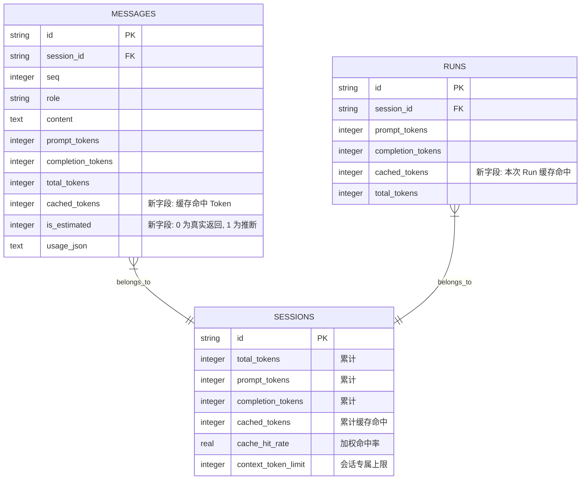

# 模型真实 Token 计量、多维缓存命中率与上下文窗口环形仪表盘技术规范
# (TOKEN_REAL_USAGE_CACHE_HIT_AND_CONTEXT_GAUGE_SPEC)

| 项目 | 内容 |
| --- | --- |
| 文档名称 | 模型真实 Token 计量、多维缓存命中率与上下文窗口环形仪表盘技术规范 (Token Real Usage, Cache Hit Rate & Context Window Gauge Specification) |
| 版本 | v1.0 |
| 状态 | 规范落地与系统基线 |
| 关联模块 | `src-tauri/src/models.rs`, `src-tauri/src/store.rs`, `src-tauri/src/agent.rs`, `src/types.ts`, `src/store.ts`, `src/components/ContextUsageGauge.tsx`, `src/components/TokenStatsModal.tsx`, `src/components/MessageItem.tsx`, `src/components/ExecutionProcessBlock.tsx`, `src/components/Composer.tsx`, `src/components/SubagentView.tsx`, `src/components/CollaboratorView.tsx`, `src/components/SubprocessView.tsx` |

---

## 1. 背景与演进动力

在长程自主编程 AI Agent（如 `harness_mini`）的实际应用中，Agent 会频繁调用外部工具（文件读取、代码修改、命令执行、全局搜索），对话轮次多、单次工具吞吐大（如单次 `read_file` 可能输入数千行代码）。在这样的工程场景下，系统的 Token 监控与上下文管理面临三个维度的核心痛点：

### 1.1 历史痛点与核心矛盾
1. **真实数据被字符推断掩盖**：
   - 过去系统在大量场景下采用 `estimate_tokens`（字符加权：非 ASCII × 0.7，ASCII × 0.3）作为 Token 统计基础。即使大模型实际返回了精准的 `usage`，也会被粗估值覆盖或因字段解析不全而遗失。
   - 用户无法确切获知每次交互究竟产生了多少物理 Token 计费，也无法区分“真实回传”还是“字符估算”。
2. **提示词缓存（Prompt Cache）红利隐形，缺乏可观测性**：
   - 现代顶级模型厂商（如 DeepSeek、Anthropic Claude、OpenAI、Google Gemini 等）均普及了上下文提示词缓存机制，命中缓存的 Token 成本仅为常规输入的 10% 甚至更低。
   - 过去系统没有采集、存储并展示 `cached_tokens`，用户与开发者无法了解缓存命中表现，更无法在宏观统计、会话排行和步骤明细中评估 Prompt 构造效率与成本节约情况。
3. **“会话累计消耗”与“当前上下文负载”概念混淆**：
   - 过去界面底栏仅有一个 `Coins` 胶囊，展示该会话历史上所有轮次的累积 Token（属于“历史账单”概念，只增不减，长对话可达几十万）。
   - 用户无法获知当前活跃上下文窗口（Context Window）已被占用了多少、还剩多少可用空间、距离 75% 智能语义压缩阈值还有多远，极易产生“为什么我刚花了 30 万 Token，上下文上限却只有 128k”的认知困惑。

针对上述问题，本系统构建了**“原生 Usage 解析优先 ➔ 缓存命中率全链路下发 ➔ 全局/项目/时序看板透视 ➔ 底栏微缩环形进度条”**的统一 Token 计量与可观测性体系。

---

## 2. 核心架构与数据流管道

系统从模型 API 调用层开始，逐级解析、持久化、统计并向前端全景投影：

```mermaid
flowchart TD
    subgraph ProviderLayer [模型服务调用与 Usage 采集]
        API[LLM API 流式 / 非流式响应] --> RawUsage[提取原生 usage / prompt_tokens_details]
        RawUsage --> Parser[crate::models::parse_llm_usage]
        Parser --> Parsed[ParsedTokenUsage 结构体<br/>• prompt_tokens<br/>• completion_tokens<br/>• cached_tokens<br/>• is_estimated: false]
    end

    subgraph StorageLayer [持久化与数据库迁移]
        Parsed --> DB_Msg[messages 表存储<br/>• cached_tokens 列<br/>• is_estimated 列]
        Parsed --> DB_Runs[runs 表持久化<br/>• cached_tokens]
        DB_Msg --> Backfill[系统启动自动回填历史 usage_json]
    end

    subgraph EngineLayer [聚合统计与上下文引擎]
        DB_Msg --> GetStats[get_token_stats IPC 聚合]
        GetStats --> StatsSummary[汇总/项目/时序/会话加权命中率]
        DB_Msg --> CtxBuild[build_context 组装判定]
        CtxBuild --> ActiveCtx[当前活跃上下文真实输入量 activeContextTokens]
    end

    subgraph FrontendLayer [前端全景投影与交互]
        StatsSummary --> TokenModal[TokenStatsModal 统计大屏<br/>• 5大 KPI 卡片<br/>• 项目矩阵<br/>• 三段堆叠时序图<br/>• 会话消耗排行榜]
        Parsed --> MsgDetails[MessageItem / ExecutionProcessBlock<br/>• ⚡ 85.2% 缓存徽章<br/>• (模型实际返回) / (估算) 提示]
        ActiveCtx --> BottomBar[Composer / Subagent / Collab 底栏]
        BottomBar --> Gauge[ContextUsageGauge 环形进度条<br/>• 绿/黄/红 3色健康态<br/>• 悬停富卡片<br/>• 点击微调上限]
    end
```

---

## 3. 多模型原生 Usage 精准解析（`parse_llm_usage`）

在 [`src-tauri/src/models.rs`](file:///f:/WorkSpace/Other/harness_mini/src-tauri/src/models.rs) 中实现了健壮的多厂商适配函数 `parse_llm_usage`，优先提取实际返回值，无法解析时优雅回退至粗估并设置 `is_estimated = true`：

```rust
pub struct ParsedTokenUsage {
    pub prompt_tokens: u64,
    pub completion_tokens: u64,
    pub cached_tokens: u64,
    pub total_tokens: u64,
    pub reasoning_tokens: Option<u64>,
    pub is_estimated: bool,
}
```

### 3.1 厂商字段适配规范

| 厂商 / 协议 | 提示词输入 (`prompt_tokens`) | 缓存命中 (`cached_tokens`) | 特殊处理与对齐逻辑 |
| :--- | :--- | :--- | :--- |
| **DeepSeek** | `prompt_tokens` | `prompt_cache_hit_tokens` | 原生即包含缓存数，直接读取 |
| **OpenAI / Azure** | `prompt_tokens` | `prompt_tokens_details.cached_tokens` | 兼容 `reasoning_tokens` |
| **Anthropic Claude** | `input_tokens` | `cache_read_input_tokens` | 很多代理回传的 `input_tokens` 未包含缓存，若 `prompt < cached`，自动修正为 `prompt + cached` |
| **Google Gemini** | `promptTokenCount` | `cachedContentTokenCount` | 兼容驼峰命名与下划线命名 |
| **兼容中转代理** | 支持 `cachedTokens`、`prompt_tokens_details` 或根级 `prompt_cache_hit_tokens` | 支持自动回退兼容 | 兜底时打标 `is_estimated: true` |

---

## 4. 多层级加权缓存命中率体系

### 4.1 行业标准加权命中率公式
在统计学与观测领域（参考 LangSmith、Langfuse、OpenRouter），针对多轮对话与跨项目聚合，**禁止使用各轮次百分比的简单算术平均值**，必须使用加权命中率：

$$\text{Cache Hit Rate} = \frac{\sum_{i=1}^{n} \text{cached\_tokens}_i}{\sum_{i=1}^{n} \text{prompt\_tokens}_i} \times 100\%$$

*注：只有当单次交互的大上下文命中了缓存，其节省的成本才与 Token 权重成正比；算术平均值会因微型请求放大偏差。*

### 4.2 全局统计看板升级（`TokenStatsModal.tsx`）
1. **顶部 5 大 KPI 卡片**：
   - 扩展为 5 列布局，新增「**全局缓存命中率**」高亮卡片（展示累计命中率 `85.6%`、累计节约命中总量与今日命中率）。
   - 「总消耗」与「今日消耗」卡片副标题中同步展现 `输入 X (缓存 Y) · 输出 Z`。
2. **TAB 1（按项目统计）**：
   - 在各项目的指标矩阵中新增「缓存命中」指标列，显示命中数量与项目专属加权命中率。
3. **TAB 2（每日时序图表与清单）**：
   - **三段堆叠 SVG 柱状图**：
     - 底部：**非缓存输入**（蓝色 `bg-blue-500`）
     - 中间：**缓存命中**（青色 `bg-cyan-400`）
     - 顶部：**模型输出**（绿色 `bg-emerald-400`）
   - 鼠标悬停 Tooltip 呈现缓存命中 Tokens 与当天加权命中率。
   - 每日明细清单新增 `缓存命中 (Rate)` 专属列。
4. **TAB 3（会话消耗排行）**：
   - 为高消耗会话标注 `⚡ 缓存 X%` 胶囊，展示缓存命中的绝对数值与比例。

### 4.3 详情视图与多步骤感知
- **消息级底栏（`MessageItem.tsx`）**：
  - 单步与整轮汇总均显示 `⚡ X% 缓存` 徽章。
  - Tooltip 中透明区分 `(模型实际返回)` 与 `(基于字符估算)`，并展示 `输入: X (缓存命中: Y · 85.2%) · 输出: Z`。
- **执行过程抽屉（`ExecutionProcessBlock.tsx`）**：
  - 折叠头与展开头实时聚合多步执行过程的整体 Token 与整体缓存命中率。

---

## 5. 对话框底栏上下文窗口负载与环形进度条

在底栏 Token 消耗前面引入了全新的上下文窗口监控控件（[`ContextUsageGauge.tsx`](file:///f:/WorkSpace/Other/harness_mini/src/components/ContextUsageGauge.tsx)），对齐 Cursor、Cline、Claude Code 的设计范式。

### 5.1 视觉布局与层级
在输入框底栏右侧区域编排：
```
[ 工作区路径 (左) ] ... [ ⭕ 19% 上下文 ] [ 🪙 24.5k tokens ⚡85% ] [ Enter 发送 ]
                              ▲                    ▲
                     【上下文环形进度】         【会话累计总账单】
```

### 5.2 矢量环形进度条（SVG Donut Gauge）
- 规格：外包围 $16\text{px} \times 16\text{px}$，半径 $r = 6.2$，周长 $C \approx 38.96$。
- 动态描边公式：
  $$\text{strokeDashoffset} = C \times \left(1 - \frac{\min(P, 100)}{100}\right)$$
- **三段式健康色阶**：
  - **安全健康（`< 60%`）**：翠绿（`text-emerald-400`），外圈边框低调高亮。
  - **中度负载（`60% ~ 75%`）**：琥珀色（`text-amber-400`）。
  - **临界告警（`≥ 75%`）**：玫瑰红（`text-rose-400`），外带呼吸脉冲光效（`animate-pulse`），提示即将触发系统的 **75% 智能语义压缩触发线**。

### 5.3 鼠标悬停详情浮层（Hover Popover）
悬停时自适应展开毛玻璃面板（`backdrop-blur-md`）：

```
┌─────────────────────────────────────────────────────────────┐
│ 🧠 上下文窗口负载 (Context Window)               [ 空间充裕 ] │
│ 模型: deepseek-chat (DeepSeek)                             │
├─────────────────────────────────────────────────────────────┤
│ 24,512 tokens                      上限 128k tokens (19.1%) │
├─────────────────────────────────────────────────────────────┤
│ [████████░░░░░░░░░░░░░░░░░░░░░░░░░░░░░░░░░░░░░░░░░░░░░░░░░] │
│                                      ↑ 75% 压缩警戒线        │
├─────────────────────────────────────────────────────────────┤
│ • 剩余可用空间:     103,488 tokens                          │
│ • 智能压缩阈值:     96,000 tokens (75%)                     │
│ • 距触发自动压缩:   剩余 71,488 tokens                      │
│ • 历史压缩状态:     未发生压缩 (历史完整)                   │
├─────────────────────────────────────────────────────────────┤
│ ⚙️ 点击调整本次对话上下文上限规格               128,000 tokens │
└─────────────────────────────────────────────────────────────┘
```

- **交互闭环**：点击胶囊或浮层操作，可一键调起会话级 [`ModelContextModal`](file:///f:/WorkSpace/Other/harness_mini/src/components/ModelContextModal.tsx)，随时扩充或调整当前会话的上下文限制。

---

## 6. 数据库存储与迁移设计

在 SQLite 中保证了平滑的向前与向后兼容：



- **增量迁移**：使用 `ensure_column(&conn, "messages", "cached_tokens", "INTEGER")` 等保证无损热更新。
- **启动回填（Backfill）**：应用启动时运行 `backfill_message_tokens`，遍历历史消息已存的 `usage_json`，将过去的真实缓存数据还原至数据库索引字段。

---

## 7. 前端组件拓扑与状态机联动

各层级组件各司其职，保证了整个系统底栏与明细体验的高度一致：

| 视图 / 组件 | 承担职责与视觉表达 |
| :--- | :--- |
| **`Composer.tsx`** | 主对话框底栏，左侧挂载 `ContextUsageGauge`，右侧挂载 `Session Total Tokens`（带 `⚡` 徽章）。 |
| **`SubagentView.tsx`** | 子 Agent 独立执行视图底栏，挂载专属 `ContextUsageGauge` 与独立会话累计 Token。 |
| **`CollaboratorView.tsx`** | 协作者与临时子进程视图底栏，完整对齐上下文圆环与 Token 指标。 |
| **`SubprocessView.tsx`** | 独立临时子进程视图底栏，对齐上下文圆环与 Token 指标。 |
| **`MessageItem.tsx`** | 单步与整轮汇总消息卡片，呈现单步 Token、整轮 Token、缓存率徽章与真实/估算提示。 |
| **`ExecutionProcessBlock.tsx`** | 复杂执行过程折叠块，呈现整个多步执行过程的聚合消耗与缓存命中率。 |
| **`TokenStatsModal.tsx`** | 全局 Token 消耗与缓存命中监控大屏。 |
| **`ModelContextModal.tsx`** | 上下文上限微调弹窗，由 `ContextUsageGauge` 一键点击唤起。 |

---

## 8. 业界标杆工具对比与总结

| 对比维度 | 传统 Agent 方案 | 业内标杆 (Cursor / Cline) | `harness_mini` 当前实现 |
| :--- | :--- | :--- | :--- |
| **用量计量真实度** | 多数基于字符数估算，误差达 30%~50% | 原生 Usage 为主 | **原生 Usage 绝对优先**，透明打标 `(模型实际返回)` 与 `(估算)` |
| **缓存观测与收益** | 黑盒不可见，缺乏命中统计 | 部分工具在底栏显示简单百分比 | **全链路透传**：单步/整轮/过程/底栏/全局时序图表全方位展示 |
| **上下文空间感知** | 仅显示会话累计账单，易爆仓 | 提供小环形仪表盘或百分比 | **环形 Donut 仪表盘 + 75% 警戒线 + 悬停富卡片 + 一键微调上限** |
| **多 Agent 体验一致性** | 仅主窗口有状态显示 | 通常不支持多 Agent 协作监控 | **主会话、子 Agent、协作者、子进程全部统一对齐** |

---

## 9. 维护与扩展建议

1. **新模型厂商接入**：
   - 扩展新 Provider 时，只需在 `src-tauri/src/models.rs` 中的 `parse_llm_usage` 补充其特定的缓存与用量字段映射，前端与数据库无需任何改动即可自动生效。
2. **多模态生图与音频 Token 计量**：
   - 若引入生图（Flux/DALL-E）或音频模型，可在 `ParsedTokenUsage` 中扩展专用字段，并在 `TokenStatsSummary` 中开辟专属维度统计。
3. **压缩建议主动推送**：
   - 未来可借助 `ContextUsageGauge` 的 `status === "critical"` 状态，在用户输入超长文本时主动弹出“推荐先进行上下文压缩”的温和建议，进一步提升超长任务的稳健性。
