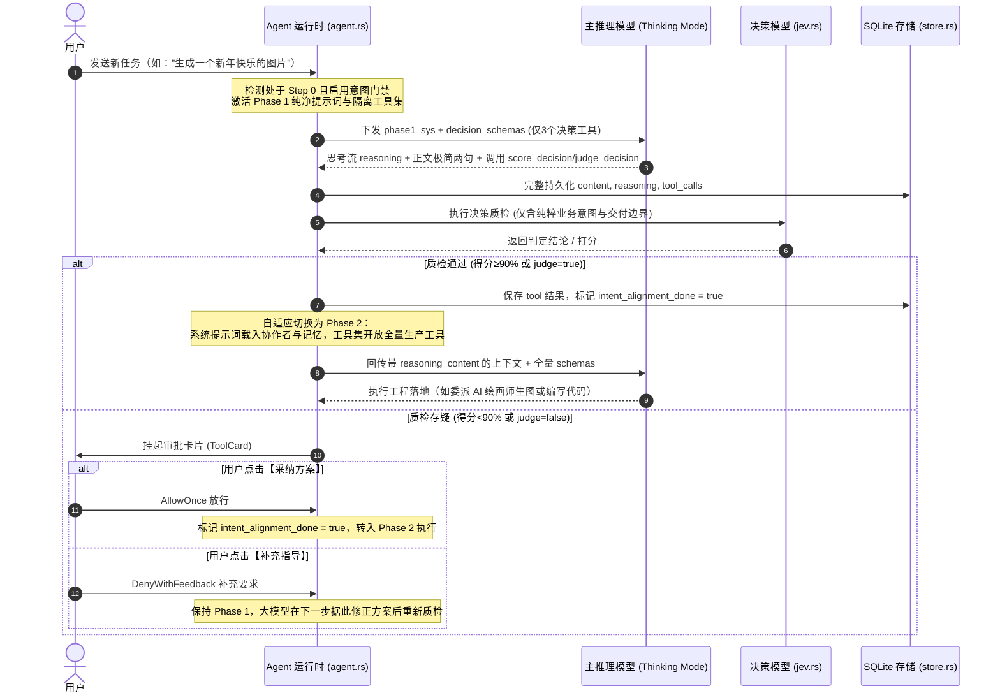

# 两阶段自适应意图对齐、场景化决策流程与思考模式协议治理规范 (TWO_PHASE_DECISION_AND_INTENT_ALIGNMENT_GOVERNANCE_SPEC)

| 属性 | 说明 |
| :--- | :--- |
| **文档代号** | `TWO_PHASE_DECISION_AND_INTENT_ALIGNMENT_GOVERNANCE_SPEC` |
| **创建时间** | 2026-10-10 |
| **适用范围** | `harness_mini`（Tauri 2 + Rust + React 桌面 AI Agent 架构体系） |
| **关联核心模块** | [`src-tauri/src/agent.rs`](file:///f:/WorkSpace/Other/harness_mini/src-tauri/src/agent.rs), [`src-tauri/src/tools.rs`](file:///f:/WorkSpace/Other/harness_mini/src-tauri/src/tools.rs), [`src-tauri/src/jev.rs`](file:///f:/WorkSpace/Other/harness_mini/src-tauri/src/jev.rs), [`src-tauri/src/protocol/openai_chat.rs`](file:///f:/WorkSpace/Other/harness_mini/src-tauri/src/protocol/openai_chat.rs), [`src/types.ts`](file:///f:/WorkSpace/Other/harness_mini/src/types.ts), [`src/components/ToolCard.tsx`](file:///f:/WorkSpace/Other/harness_mini/src/components/ToolCard.tsx), [`src/components/SettingsModal.tsx`](file:///f:/WorkSpace/Other/harness_mini/src/components/SettingsModal.tsx) |
| **知识密级** | 核心架构演进与决策流工程治理规范 |

---

## 目录

1. [演进历程与痛点深度复盘](#一演进历程与痛点深度复盘)
   - 1.1 [阶段一：外置旁路门禁与历史割裂](#11-阶段一外置旁路门禁与历史割裂)
   - 1.2 [阶段二：内生型决策 SOP 与提示词污染困境](#12-阶段二内生型决策-sop-与提示词污染困境)
   - 1.3 [阶段三：Thinking Mode 下 400 Bad Request 协议硬拦截故障](#13-阶段三thinking-mode-下-400-bad-request-协议硬拦截故障)
2. [两阶段自适应物理隔离架构设计](#二两阶段自适应物理隔离架构设计)
   - 2.1 [核心设计原则](#21-核心设计原则)
   - 2.2 [端到端全链路状态机流转图](#22-端到端全链路状态机流转图)
3. [Phase 1 前置纯粹业务意图定性规范](#三phase-1-前置纯粹业务意图定性规范)
   - 3.1 [纯净提示词设计（彻底剥离内部流水线与记忆）](#31-纯净提示词设计彻底剥离内部流水线与记忆)
   - 3.2 [物理隔离工具下发（仅限决策三原语）](#32-物理隔离工具下发仅限决策三原语)
   - 3.3 [正文表达规范（极致极简双句）](#33-正文表达规范极致极简双句)
4. [场景化决策三原语鲁棒性增强](#四场景化决策三原语鲁棒性增强)
   - 4.1 [`judge_decision`（二元明确性判定）](#41-judge_decision二元明确性判定)
   - 4.2 [`choice_decision`（分支路径裁决）](#42-choice_decision分支路径裁决)
   - 4.3 [`score_decision`（意图精准性百分制打分）](#43-score_decision意图精准性百分制打分)
5. [人机协同挂起审批流与自适应阶段切换](#五人机协同挂起审批流与自适应阶段切换)
   - 5.1 [质检通过（自动静默放行）](#51-质检通过自动静默放行)
   - 5.2 [质检存疑（线程挂起与卡片多态交互）](#52-质检存疑线程挂起与卡片多态交互)
   - 5.3 [转入 Phase 2（全量恢复生产工具与工程规范）](#53-转入-phase-2全量恢复生产工具与工程规范)
6. [Thinking Mode 思考流协议合规治理](#六thinking-mode-思考流协议合规治理)
   - 6.1 [400 报错根因：丢弃 `reasoning_content` 的严重后果](#61-400-报错根因丢弃-reasoning_content-的严重后果)
   - 6.2 [上下文重组（`build_context`）保留思考链修复方案](#62-上下文重组build_context保留思考链修复方案)
7. [质量基线与回归验证结论](#七质量基线与回归验证结论)

---

## 一、演进历程与痛点深度复盘

### 1.1 阶段一：外置旁路门禁与历史割裂
系统早期采用独立前置函数 `run_intent_alignment_gate` 进行质检：
- **致命缺陷**：外置门禁脱离常规 Agent 循环，导致大模型的思考流 `<think>` 无法展现，决策卡片无法作为正常消息存入 SQLite 消息历史，导致用户无法在历史记录中回溯当时的决策过程；
- **用户诉求**：决策流程必须与正常的对话流程深度融合，在常规对话中产生思考、文本和工具卡片。

### 1.2 阶段二：内生型决策 SOP 与提示词污染困境
将决策流程重构成首步大模型自主调用 `score_decision` 后，遇到了严重的提示词污染问题：
- **提示词前摄干扰**：在首步（`_step == 0`），大模型接收到的完整系统提示词中包含了**协作者名录**（如 AI 绘画师及其调度规则）、**长期记忆大盘**（`conventions.md`、`profile.md`）以及多项第二层级重型工程规范；
- **Schema 误导性诱导**：`score_decision` 工具 schema 中对 `plan` 字段的描述为 `"拟定下一步要执行的分步行动方案与工具调用路径"`；
- **导致的后果**：以“生成一个新年快乐的图片”为例，大模型在首步意图定性时，先入为主地把底层工具名（`get_collaborators`、`recognize_image`、`record_memory`）作为计划填入参数。专职打分模型评估时发现用户原本简单的业务诉求被塞满了系统内部流水线与过度假设，给出 88.7% 保守扣分，导致即使意图明确也频频触发挂起卡片。

### 1.3 阶段三：Thinking Mode 下 400 Bad Request 协议硬拦截故障
在引入决策模型质检后，具备深度思考能力（Thinking Mode）的模型（如 DeepSeek-R1、硅基流动 SiliconFlow 上的推理模型）在执行完 Step 0 决策工具后，进入 Step 1 发起后续请求时突然报错崩溃：
```
LLM 返回 400 Bad Request: {"error":{"param":null,"type":"invalid_request_error","code":"invalid_request_error","message":"Upstream request failed: [invalid_request_error] The `reasoning_content` in the thinking mode must be passed back to the API. (request_id: ...)"}}
```
- **根因确证**：Thinking 模式下，若 Assistant 消息调用了工具，后续回传 Tool 结果时，上游网关强制要求 Assistant 消息必须携带原先生成的 `reasoning_content`。后端在组装上下文时将该字段丢失，导致被上游硬拦截。

---

## 二、两阶段自适应物理隔离架构设计

### 2.1 核心设计原则
1. **物理分层隔离**：在 Step 0 物理隔离生产工具与复杂工程规范，仅提供决策工具，让大模型只做纯粹的业务意图定性与交付边界约定；
2. **场景化决策选择**：废除单一死板的打分模式，根据任务类型在二元判定（`judge`）、路线裁决（`choice`）与量化打分（`score`）中自适应选用；
3. **顺畅自适应转入**：一旦意图对齐放行，系统自适应转入第二阶段（Phase 2），完整恢复全局系统提示词（含协作者与记忆大盘）与全量生产工具；
4. **思考流协议合规**：完整保留并回传 `reasoning_content`，完美适配各类深度思考推理模型。

### 2.2 端到端全链路状态机流转图



---

## 三、Phase 1 前置纯粹业务意图定性规范

### 3.1 纯净提示词设计（彻底剥离内部流水线与记忆）
在 [`src-tauri/src/agent.rs`](file:///f:/WorkSpace/Other/harness_mini/src-tauri/src/agent.rs) 中实现独立的 `phase1_intent_system_prompt(&session)`：
- **物理剥离项**：
  - 严禁注入长期记忆大盘（`conventions.md`、`profile.md`、`digests`）；
  - 严禁注入可用项目协作者名录（Collaborators）；
  - 严禁注入第二阶段的工程规范（代码克制修改、强制沉淀记忆、任务清单更新等）；
- **核心指导原则**：
  - 纯粹业务视角：只描述用户要什么、交付什么；
  - 提炼合理默认假设：若用户未指定规格、风格或细节，给出通用业务默认值（如未指定尺寸默认按 1024x1024 海报交付）；
  - 严禁提及底层工具名与流水线（`get_collaborators`、`record_memory` 等）。

### 3.2 物理隔离工具下发（仅限决策三原语）
在 Step 0 且 `!intent_alignment_done` 时，给大模型下发的 `step_schemas` 仅包含 3 个决策工具：
```rust
let decision_tool_names = ["judge_decision", "choice_decision", "score_decision"];
let step_schemas = if is_in_phase1 {
    decision_schemas.clone()
} else {
    schemas.clone()
};
```
大模型在物理上无法感知文件读写、命令执行或生图工具的存在，彻底杜绝越界调用与流水线妄想。

### 3.3 正文表达规范（极致极简双句）
强制要求大模型在正文文本中只输出两句话：
- **第 1 句**：核心意向陈述（≤30 字，说明用户要做什么）；
- **第 2 句**：下一步交付方向（≤30 字，说明交付边界或默认假设）。
严禁长篇大论或提前展开具体技术方案，保证界面的极致清爽。

---

## 四、场景化决策三原语鲁棒性增强

在 [`src-tauri/src/tools.rs`](file:///f:/WorkSpace/Other/harness_mini/src-tauri/src/tools.rs) 中，对 3 个决策工具的 Schema 和执行函数进行了全面重构：

### 4.1 `judge_decision`（二元明确性判定）
- **定位**：简单即时任务（单点问答、简单生图、单处微调）；
- **Schema 优化**：将 `required` 简化为 `["state"]`，内置高质量兜底判定准则；
- **参数容错**：自动兼容 `state`、`statement`、`understanding`、`content` 等多模型常见别名，以及 `instruction` 与 `question` 别名。

### 4.2 `choice_decision`（分支路径裁决）
- **定位**：方案存在多条路线（如自研 vs 第三方库、方案 A vs 方案 B、直接做 vs 委派专职协作者）；
- **参数容错**：自动兼容 `options` 与 `choices` 别名，`instruction` 与 `question` 别名。

### 4.3 `score_decision`（意图精准性百分制打分）
- **定位**：复杂多步业务改造、架构重构、全流程实施计划；
- **Schema 优化**：
  - `understanding`: "对用户核心业务意向与诉求细节的简洁精准剖析（只描述用户要什么，严禁提及内部工具名、协作者或执行流水线）"；
  - `plan`: "业务交付目标与交付边界/合理默认假设（例如交付规格、视觉风格、默认尺寸等业务约定；严禁提及内部底层工具调用与协作者名录）"；
- **评分标准**：默认审查用户意图透彻度与缺省假设的业务合理性，≥90 分放行。

---

## 五、人机协同挂起审批流与自适应阶段切换

### 5.1 质检通过（自动静默放行）
当决策工具返回结论：
- `score_decision`：得分 ≥ 90%；
- `judge_decision`：判定为 `true`；
- `choice_decision`：选中了明确方案且非“需向用户澄清”分支；

系统自动判定放行，将 `intent_alignment_done` 置为 `true`，追加放行提示后无缝进入 Phase 2。

### 5.2 质检存疑（线程挂起与卡片多态交互）
当得分 < 90% 或判定为 false 时：
1. 后端将工具事件置为 `pending_approval` 并调用 `approval::request_approval` 挂起线程；
2. 前端 [`src/components/ToolCard.tsx`](file:///f:/WorkSpace/Other/harness_mini/src/components/ToolCard.tsx) 自动渲染出质检卡片：
   - 呈现专职模型的质检意见、扣分原因与方案预览；
   - 提供醒目的操作按钮：
     - **【采纳方案，继续执行】**（绿色高亮）：代表用户认可当前理解与默认假设，无需反复修改；
     - **【补充指导 / 调整方案】**（暗紫按钮 + 输入框）：允许用户纠偏并注入补充提示。

### 5.3 转入 Phase 2（全量恢复生产工具与工程规范）
无论是由模型自评通过，还是用户在卡片上点击【采纳方案】：
- 下一步循环自动判定 `!intent_alignment_done == false`；
- 上下文系统提示词切换为包含项目约束、记忆大盘与协作者名录的全局完整 `sys`；
- 工具列表切换为全量生产工具 `schemas`；
- 大模型从容开展具体工程落地（如调用 `dispatch_collaborator` 委派生图、使用 `edit_file` 修改代码等）。

---

## 六、Thinking Mode 思考流协议合规治理

### 6.1 400 报错根因：丢弃 `reasoning_content` 的严重后果
深度思考推理模型（DeepSeek-R1、硅基流动等）在输出内容时分为两个通道：
1. `content`：面向用户的正文内容；
2. `reasoning_content`：内在的思考链推导过程。

当处于 Thinking 模式时，如果 Assistant 消息调用了 `tool_calls`，上游服务端会在 session 状态机中记录该上下文处于“思考后派发工具”状态。当客户端回传该 Assistant 消息以拼接后续对话时，**必须将原始的 `reasoning_content` 一同传回**。如果客户端仅回传 `role`、`content` 和 `tool_calls`，上游网关会判定请求结构缺失关键推理上下文，硬性抛出 400 错误。

### 6.2 上下文重组（`build_context`）保留思考链修复方案
在 [`src-tauri/src/agent.rs`](file:///f:/WorkSpace/Other/harness_mini/src-tauri/src/agent.rs) 的 `build_context` 中，显式从数据库读取 `m.reasoning` 并重组成 `reasoning_content` 字段注入上下文：

```rust
"assistant" => {
    let mut obj = json!({"role": "assistant"});
    let content = m.content.clone().unwrap_or_default();
    
    // 思考模式协议合规支持：回传上下文时保留 reasoning_content，满足上游强制校验
    if let Some(ref r) = m.reasoning {
        if !r.trim().is_empty() {
            obj["reasoning_content"] = Value::String(r.clone());
            est += estimate_tokens(r);
        }
    }
    
    match &m.tool_calls {
        Some(tcs) if !tcs.is_null() && tcs.as_array().map(|a| !a.is_empty()).unwrap_or(false) => {
            if !content.is_empty() {
                obj["content"] = Value::String(content.clone());
            } else {
                obj["content"] = Value::Null;
            }
            obj["tool_calls"] = tcs.clone();
            est += estimate_tokens(&content) + crate::models::estimate_value_tokens(tcs);
            out.push(obj);
            // 补齐 tool 结果 ...
        }
        _ => {
            if !content.is_empty() || obj.get("reasoning_content").is_some() {
                obj["content"] = Value::String(content.clone());
                est += estimate_tokens(&content);
                out.push(obj);
            }
        }
    }
}
```

---

## 七、质量基线与回归验证结论

1. **Phase 1 纯净性单元测试**：
   - `test_phase1_intent_system_prompt_pure`：断言 Phase 1 提示词必须包含决策工具说明，且绝对不包含“可用项目协作者名录”、“本项目持久化认知与沉淀记忆”与 `conventions.md`。验证通过。
2. **思考链回传单元测试**：
   - `test_build_context_preserves_reasoning_content`：断言在存在思考流与工具调用时，`build_context` 生成的 Assistant 消息中必须 100% 存在 `reasoning_content`。验证通过。
3. **真实场景回归**：
   - 单点健康问答测试（乳糖不耐受利弊）：大模型在 Step 0 纯净输出两句话，调用 `judge_decision`，置信度 95% 通过；进入 Step 1 时完整带回 `reasoning_content`，顺利通过上游 API 校验并完成最终作答。
4. **编译与类型基线**：
   - `cargo check --manifest-path src-tauri/Cargo.toml`：0 错误，0 警告；
   - `npm run build`：前端构建通过。
