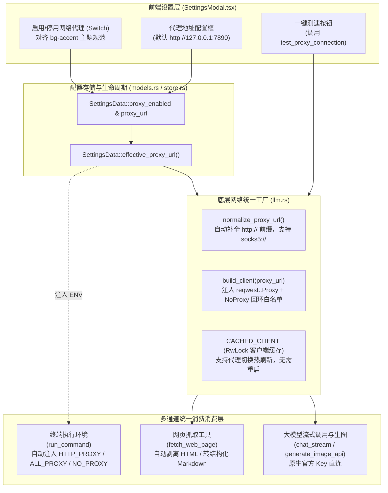

# 统一网络代理配置与网页访问能力治理规范 (UNIFIED_PROXY_AND_WEB_ACCESS_SPEC)

| 项目 | 内容 |
| --- | --- |
| 文档名称 | 统一网络代理配置与网页访问能力治理规范 |
| 英文代号 | `UNIFIED_PROXY_AND_WEB_ACCESS_SPEC` |
| 版本 | v1.0 |
| 状态 | 生产已落地已发布 |
| 关联模块 | `src-tauri/Cargo.toml`, `src-tauri/src/models.rs`, `src-tauri/src/llm.rs`, `src-tauri/src/tools.rs`, `src-tauri/src/agent.rs`, `src-tauri/src/commands.rs`, `src-tauri/src/lib.rs`, `src-tauri/src/growth.rs`, `src-tauri/src/memory.rs`, `src-tauri/src/task.rs`, `src-tauri/src/temp.rs`, `src/types.ts`, `src/store.ts`, `src/ipc.ts`, `src/components/SettingsModal.tsx` |
| 运行位置 | `f:\WorkSpace\Other\harness_mini` |

---

## 1. 背景与核心问题分析

在 `harness_mini` 作为轻量级 AI Agent 编码工具的日常使用场景中，网络连通性是阻碍 Agent 自主运行与模型调用的关键卡点：

1. **Agent 缺乏原生网页读取能力，查阅海外技术资料频繁超时**：
   - 编码型 Agent 在处理多步任务或遇到新型开源框架时，高度依赖对官方文档（如 MDN、Rust Doc、GitHub README / Issue、npm、PyPI 等）的实时阅读。
   - 原系统未内置网页抓取工具，Agent 只能通过 `run_command` 尝试执行 `curl` 或 PowerShell 命令；而在未注入代理环境的子进程中，这些命令面对境外网络资源经常报 `Connection timed out` 或 `Connection reset by peer`，导致整个任务卡死中断。
2. **纯靠第三方 API“中转站”无法解决根本问题**：
   - 虽然部分海外模型厂商（OpenAI、Anthropic Claude、Google Gemini 等）可通过第三方的反向代理/中转站中转，但中转站仅支持 `/chat/completions` 等固定推理接口，**绝对无法替客户端执行任意网页的抓取与终端依赖下载**。
   - 此外，第三方中转站存在核心项目代码与 Prompt 泄露风险、费率二次加价、并发受限以及稳定性不可控的问题。
3. **“工具需要代理”与“模型需要代理”本质同源，边际开发成本极低**：
   - 既然为了解决网页读取问题，客户端已经必须建立全局的正向代理基础设施，那么将模型调用也一并接入该代理层，在工程上只需复用相同的底座网络客户端，边际成本几乎为零。
4. **避免“配置膨胀”，契合用户真实网络心智**：
   - 绝大多数需要代理的开发者，系统内常驻的都是 Clash、Sing-box、v2ray、Surge 等工具，代理端口通常是全局且唯一固定的（如 `127.0.0.1:7890`）。
   - 若在 UI 上分别拆分“网页是否走代理”、“终端是否走代理”、“模型 A 走不走、模型 B 走不走”，会带来极高的配置认知负担；**统一极简处理（一个启用开关 + 一个地址配置框）才是最自然且符合心智的最优解**。
   - 本地代理工具通常运行在规则分流模式（Rule Mode），发送给本地代理的国内流量会自动直连，海外流量自动走代理节点，因此无需在客户端重复造复杂的路由轮子。

---

## 2. 总体架构与路由设计



---

## 3. 核心设计与技术实现细节

### 3.1 数据模型扩展与向下兼容 (`src-tauri/src/models.rs`)
在 `SettingsData` 中新增两个字段，利用 Serde 默认值实现无痛向下兼容：
```rust
pub fn default_proxy_url() -> Option<String> {
    Some("http://127.0.0.1:7890".to_string())
}

pub struct SettingsData {
    // ...
    #[serde(default)]
    pub proxy_enabled: bool,
    #[serde(default = "default_proxy_url")]
    pub proxy_url: Option<String>,
}

impl SettingsData {
    /// 获取当前生效的代理地址（若未启用代理或地址为空则返回 None）
    pub fn effective_proxy_url(&self) -> Option<String> {
        if self.proxy_enabled {
            self.proxy_url
                .as_ref()
                .map(|s| s.trim())
                .filter(|s| !s.is_empty())
                .map(|s| s.to_string())
                .or_else(default_proxy_url)
        } else {
            None
        }
    }
}
```

### 3.2 动态客户端工厂与热重载 (`src-tauri/src/llm.rs`)
1. **SOCKS5 协议支持**：在 `Cargo.toml` 中为 `reqwest` 开启 `socks` 特性。
2. **协议头自动补全**：若用户省略 `http://` 仅输入 `127.0.0.1:7890`，自动补齐；同时原生支持 `socks5://`。
3. **强制本地回环白名单**：
   ```rust
   let proxy = proxy.no_proxy(reqwest::NoProxy::from_string("localhost,127.0.0.1,::1"));
   ```
   **关键防护**：避免因开启代理导致客户端内部与本地 Daemon 健康检查（`server.rs` 端口探测）或本地模型（如 Ollama `localhost:11434`）失联或发生死循环。
4. **客户端热缓存与即时生效**：
   使用 `OnceLock<RwLock<(Option<String>, reqwest::Client)>>` 维护缓存。当代理 URL 或启用状态发生变化时，读锁发现地址不一致立即触发写锁重建连接池，无需重启客户端即可完成网络热切换。

### 3.3 网页抓取工具实现 (`fetch_web_page` & `html_to_markdown`)
在 `src-tauri/src/tools.rs` 中正式注册 `fetch_web_page`：
* **输入契约**：
  * `url` (string, 必须以 `http://` 或 `https://` 开头)
  * `max_chars` (integer, 默认 8000 字符)
* **HTML 高效清洗与 Markdown 转换算法**：
  * 使用高效正则剔除 `<script>`、`<style>`、`<noscript>`、`<svg>`、`<head>` 等噪声标签。
  * 将 `<h1>`~`<h6>` 转换为对应的 Markdown 标题语法（`# `~`###### `）。
  * 将超链接 `<a href="...">text</a>` 解析为 `[text](href)`。
  * 剥离所有 HTML 标签并统一还原常用 HTML 实体符号（`&nbsp;`, `&amp;`, `&lt;`, `&gt;`, `&quot;`, `&#39;`）。
  * 压缩多余空行，限制返回字符上限并给出截断标注，有效防御超大页面引起的上下文 Token 溢出。

### 3.4 终端命令代理环境注入 (`tools.rs::run_command`)
在每次通过 `tokio::process::Command` 启动 PowerShell（Windows）或 `sh`（Unix）之前，检查当前 `ctx.proxy_url`：
```rust
if let Some(ref proxy) = ctx.proxy_url {
    let norm = crate::llm::normalize_proxy_url(proxy);
    if !norm.is_empty() {
        cmd.env("HTTP_PROXY", &norm);
        cmd.env("HTTPS_PROXY", &norm);
        cmd.env("ALL_PROXY", &norm);
        cmd.env("http_proxy", &norm);
        cmd.env("https_proxy", &norm);
        cmd.env("all_proxy", &norm);
        cmd.env("NO_PROXY", "localhost,127.0.0.1,::1");
        cmd.env("no_proxy", "localhost,127.0.0.1,::1");
    }
}
```
使得终端内的 `curl`、`git clone`、`npm install`、`pip`、Python 脚本等无缝走代理网络。

### 3.5 连通性测试命令 (`commands.rs::test_proxy_connection`)
新增 Tauri 命令，支持在设置面板中直接测试当前配置的代理可用性与往返延迟：
* 优先探测全球高可用节点（如 `https://www.google.com`），超时限制 6 秒。
* 若发生异常自动回退至备用探测端点（`https://1.1.1.1`）。
* 成功返回往返耗时（毫秒），失败返回具体网络报错信息。

### 3.6 前端设置面板与交互一致性 (`SettingsModal.tsx`)
1. **左侧侧边栏**：新增“网络代理”选项卡，搭配 Lucide `Globe` 图标。
2. **顶部开关**：对齐项目内原有“Agent 工具”与“Agent SOP”的原生样式：
   * 采用 `button[role="switch"]` 结构。
   * 激活状态统一使用项目主题色 `bg-accent`（`#3b82f6`），未激活状态为 `bg-panel3 border-edge`。
3. **下方地址框**：
   * 未启用时透明度置灰，启用时高亮可用。
   * “测试连接”按钮带有测试中 Loading 态及彩色结果条提示（成功显示绿色延迟，失败显示红色错误信息）。

---

## 4. 关键避坑与工程防御记录

1. **Rust 正则引擎不支持反向引用 (Backreferences)**：
   * **现象**：测试 `(?i)<h([1-6])[^>]*>(.*?)</h\1>` 时，Rust `regex` 报错 `error: backreferences are not supported`。这是由于 `regex` 库为保证 O(N) 线性执行复杂度，刻意不包含回溯与反向引用机制。
   * **修复**：改写为 `(?i)<h([1-6])[^>]*>(.*?)</h[1-6]>`，通过字符组匹配结束标签，完美兼顾速度与格式提取。
2. **Tailwind 自定义色值规范**：
   * 界面主色必须使用 `accent`（而非 Tailwind 默认的 `primary`），输入框激活使用 `focus:border-accent`，开关使用 `bg-accent`，确保整体深色系视觉一致。
3. **Windows 虚拟内存与多进程构建瓶颈**：
   * 当全量测试时，并行链接大二进制文件偶发引发操作系统内存映射异常（`os error 1455: 页面文件太小`）；在 CI 或高负载本地测试时，指定线程限制（如 `cargo test -j 2`）可有效控制瞬时虚拟内存峰值。

---

## 5. 验证标准与测试清单

| 测试项 | 验证手段 | 预期结果 | 状态 |
| :--- | :--- | :--- | :--- |
| **Rust 编译** | `cargo check` | 0 错误，0 警告 | ✅ 通过 |
| **前端打包** | `npm run build` | 0 错误，模块全量编译通过 | ✅ 通过 |
| **协议规整单元测试** | `test_normalize_proxy_url` | 自动补全 `http://`，保留 `socks5://` | ✅ 通过 |
| **网页清洗单元测试** | `test_html_to_markdown` | 剔除 script/svg/style，保留正文及 Markdown 格式 | ✅ 通过 |
| **全量核心测试** | `cargo test --lib` | 119 个测试全部通过 | ✅ 通过 |
| **开关样式对齐** | UI 视觉与交互测试 | 开启时呈现统一的 `bg-accent` 品牌蓝，关闭时灰色收起 | ✅ 通过 |
