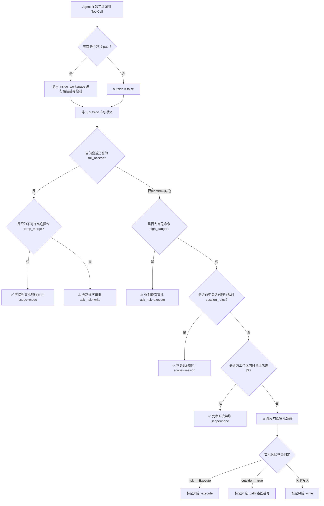

# 工作区路径安全治理与多级访问模式规范
# Workspace Path Security & Access Mode Specification

本文档详细记录 `harness_mini` 中 **Agent 工作区路径安全边界控制**、**系统提示词去负面化（Prompt De-refusal）**、**运行时越界审批引擎（`inside_workspace`）** 以及 **完全访问模式（Full Access）免审放行机制** 的架构演进、业内对比、代码改造与落地规范。

---

## 目录
- [一、背景与核心痛点剖析](#一背景与核心痛点剖析)
- [二、业内顶级 Agent 工具路径权限与模式调研](#二业内顶级-agent-工具路径权限与模式调研)
- [三、架构全景与权限决策流水线](#三架构全景与权限决策流水线)
  - [1. 权限判定决策流程图](#1-权限判定决策流程图)
  - [2. 核心访问模式定义与边界](#2-核心访问模式定义与边界)
- [四、核心机制与分层落地实现](#四核心机制与分层落地实现)
  - [1. 系统提示词重构：消除过度审查（`agent.rs`）](#1-系统提示词重构消除过度审查agentrs)
  - [2. 运行时越界检测算法升级：支持新建文件（`tools.rs`）](#2-运行时越界检测算法升级支持新建文件toolsrs)
  - [3. 权限判定层协同流（`agent.rs`）](#3-权限判定层协同流agentrs)
- [五、边界场景与鲁棒性保障](#五边界场景与鲁棒性保障)
- [六、工程验证与回归体系](#六工程验证与回归体系)

---

## 一、背景与核心痛点剖析

在 AI 编码助手的设计中，如何平衡 **“安全可控性（Safety）”** 与 **“开发自主性（Autonomy）”** 是架构核心难题：

1. **Prompt 负向硬性规则引发的“过度自我审查”（Over-refusal）**：
   - 原系统提示词中存在硬性规则：
     `“所有路径相对于工作区根目录，不要访问工作区之外的路径。”`
   - 大语言模型对否定词极度敏感。当开发者在对话中主动要求访问外部资源（例如：*“帮我读取 `~/.cargo/config.toml` 配置”*、*“比对同目录下另一个开源库 `../ref_repo` 的实现”*、*“检查上级目录的全局环境配置”*）时，模型在思考链中直接触发防御性拒答：
     `“抱歉，根据我的安全工作规则，我不能访问工作区之外的路径。”`
   - **痛点**：正当开发需求被人为阉割，严重影响协作效率。

2. **控制平面错位（Prompt 约束 vs. Runtime 守卫）**：
   - 提示词本质上是概率性的文字引导，不应充当“不可逾越的安全防火墙”。
   - 正确的架构设计应将安全防御下沉到**运行时的安全守卫（Execution Guard）**，而提示词仅负责**提供空间基准坐标系（Positional Guidance）**。

3. **越界检测中新建文件被误杀（`canonicalize` 缺陷）**：
   - 后端原判定函数 `inside_workspace` 直接使用标准库 `Path::canonicalize()`：若目标文件尚未创建（例如调用 `write_file` 创建新源文件），`canonicalize` 会直接返回 `Err(NotFound)`，导致新文件被错误标记为“越界路径（`outside = true`）”，误报高风险警告。

---

## 二、业内顶级 Agent 工具路径权限与模式调研

通过对业内领先 AI 编码工具的系统调研，梳理出如下核心架构实践：

| 工具产品 | 系统提示词设计 | 审批模式（Confirm Mode）行为 | 完全访问模式（Full Access / Yolo）行为 | 架构借鉴意义 |
| :--- | :--- | :--- | :--- | :--- |
| **Claude Code** (Anthropic) | **声明 CWD，不提禁令**：告知当前工作根目录，相对路径基于 CWD，绝无“禁止越界”词汇。 | 访问非当前目录文件或执行高危命令，CLI 终端弹出确认交互。 | 开启 `--dangerously-skip-permissions` 后，所有读写与越界操作静默自动执行。 | **正向中立引导**，将安全完全托管给权限引擎。 |
| **Cursor** (Agent Mode) | **工作区锚定**：提供项目根目录作为主上下文，支持通过绝对路径或符号链接引入外部参考代码。 | 文件变更生成 Diff 卡片，命令执行需点击 Approve。 | 开启 **Yolo Mode** 后，文件读写与命令连贯执行，不再弹窗中断。 | **工作区为主，全局透明调用**。 |
| **Cline / Roo Code** | **相对路径基准**：说明相对路径基准目录，明确外部文件推荐传入绝对路径。 | 外部路径访问时，前端审批卡片明确高亮标出外部物理路径。 | 开启 Auto-approve 对应项后，越界与常规读写同等直接放行。 | 审批 UI 中区分常规风险与路径越界风险。 |
| **Devin** (Cognition Labs) | **虚拟机沙箱**：提示词要求聚焦指定 repo，但开放全局 `/tmp`、`/etc` 等用于排错。 | 核心敏感操作依赖 Playbook Gate 确认。 | 企业完全授权模式下自主调用所有系统级命令。 | 物理沙箱隔离，而非靠提示词自我阉割。 |

**业内共识准则**：
1. **Prompt 绝不硬编码负向禁止**：仅声明“工作区是主要目标，相对路径以此为根”；
2. **安全网全部后置在执行层**：通过运行时沙箱与权限守卫裁决；
3. **完全访问模式下一视同仁**：用户切到完全访问模式后，越界读写统一免审放行。

---

## 三、架构全景与权限决策流水线

### 1. 权限判定决策流程图



### 2. 核心访问模式定义与边界

* **确认模式（Confirm Mode，默认）**：
  - **工作区内只读免审**：读取、搜索工作区内代码文件（`read_file`、`glob`、`grep`、`file_outline`、`list_dir`）无需打扰用户。
  - **写入与执行受控**：工作区内修改、创建文件或执行终端命令，默认走用户确认弹窗。
  - **越界行为强制审查**：一旦参数路径指向工作区外部（`outside == true`），即使只是只读工具，也会被提升至 `ask_risk = "path"` 强制弹窗，防止私自窥探或篡改敏感系统文件。
* **完全访问模式（Full Access）**：
  - 用户知情且明确授权的主动模式，专为长任务、重型重构与敏捷开发设计。
  - 除沙箱合并回原项目（`temp_merge`）这一不可逆影响物理工程的操作强制确认外，所有文件读写（包含工作区内外）及常规终端命令全部**免审静默放行**。

---

## 四、核心机制与分层落地实现

### 1. 系统提示词重构：消除过度审查（`agent.rs`）

在 [`src-tauri/src/agent.rs`](file:///f:/WorkSpace/Other/harness_mini/src-tauri/src/agent.rs#L2571-L2575) 中，重构主会话 System Prompt 生成逻辑：

```diff
- rules.push(format!("{rule_num}. 所有路径相对于工作区根目录，不要访问工作区之外的路径。"));
- rule_num += 1;
+ rules.push(format!(
+     "{rule_num}. 路径基准说明：所有相对路径默认相对于工作区根目录解析。当前工作区为主要开发上下文；若任务明确需要读取、比对或操作工作区外部文件（如系统配置、全局依赖或关联工程），请使用规范的绝对路径，系统会根据权限策略处理。"
+ ));
+ rule_num += 1;
```

**设计要点**：
- **保留坐标系声明**：明确相对路径相对于工作区，防止模型在调用工具时混淆工作区与宿主进程 CWD；
- **指引合法跨界路径**：当任务确实需要时（用户主动指示），引导模型使用规范的绝对路径（Absolute Path）；
- **免除道德心理包袱**：说明“系统会根据权限策略处理”，将权限裁决责任交还系统底层，模型不再自作主张提前拒答。

### 2. 运行时越界检测算法升级：支持新建文件（`tools.rs`）

在 [`src-tauri/src/tools.rs`](file:///f:/WorkSpace/Other/harness_mini/src-tauri/src/tools.rs#L676-L697) 中，重构 `inside_workspace` 实现：

```rust
/// 路径是否位于沙箱内（用于审批判定；临时空间会话的沙箱为整个临时空间根目录）
pub fn inside_workspace(ctx: &ToolCtx, rel: &str) -> bool {
    let p = resolve(ctx, rel);
    let root = ctx.sandbox_root.as_ref().unwrap_or(&ctx.workspace);
    let Ok(root_canon) = root.canonicalize() else {
        return false;
    };

    // 若目标已存在，直接比对真实规范化路径
    if let Ok(p_canon) = p.canonicalize() {
        return p_canon.starts_with(&root_canon);
    }

    // 若目标尚不存在（如新建文件），向上追溯查找最近的已存在父目录进行比对
    let mut curr = p.as_path();
    while let Some(parent) = curr.parent() {
        if let Ok(parent_canon) = parent.canonicalize() {
            return parent_canon.starts_with(&root_canon);
        }
        curr = parent;
    }
    false
}
```

**算法优势**：
1. **解决新文件不存在报错**：若在工作区内调用 `write_file(path: "src/new_module.rs")`，虽然该文件尚不存在，但算法能追溯至已存在的 `src/` 或根目录，正确判定在工作区内部（`outside = false`）；
2. **阻断路径穿透逃逸**：若传入 `../../outside_dir/new_file.txt`，追溯到的现有父目录为工作区外层目录，`starts_with` 判定失败，准确标记为越界（`outside = true`）。

### 3. 权限判定层协同流（`agent.rs`）

在 [`src-tauri/src/agent.rs`](file:///f:/WorkSpace/Other/harness_mini/src-tauri/src/agent.rs#L1391-L1424) 中，核验并保证权限流优先级：

```rust
// 1. 完全访问模式：处于最高优先分支，无条件放行（除 temp_merge 外）
if full_access && tool_name != "temp_merge" {
    scope = Some("mode");
} else {
    // 2. 确认模式分支：
    let high_danger = ...;
    if high_danger {
        need_ask = true;
        ask_risk = "execute";
        force_once = true;
    } else if tool_name == "temp_merge" {
        need_ask = true;
        ask_risk = "write";
        force_once = true;
    } else if session_rules.iter().any(...) {
        scope = Some("session");
    } else if risk == Risk::ReadOnly && !outside {
        scope = Some("none"); // 仅工作区内只读免审
    } else {
        need_ask = true;
        ask_risk = if risk == Risk::Execute {
            "execute"
        } else if outside {
            "path"            // 越界标记为专属路径风险
        } else {
            "write"
        };
    }
}
```

---

## 五、边界场景与鲁棒性保障

1. **Windows 路径前缀（`\\?\`）规整**：
   - Windows 下 `canonicalize()` 会返回 UNC 扩展长路径前缀（例如 `\\?\F:\WorkSpace\...`）；
   - 由于目标路径与根目录路径均经过 `canonicalize()` 处理后再行比对，前后缀形态保持 100% 一致，规避了原生字符串前缀匹配失效的 Windows 专属 Bug。
2. **纯对话模式保护（未绑定工作区）**：
   - 会话若未绑定任何本地工作区（`workspace_path.is_empty()`），除 `todo` 与 `generate_image` 外，所有文件和命令工具直接在前置拦截并返回错误提示，防止野指针式路径污染。
3. **临时空间（Temp Project）沙箱隔离**：
   - 在临时空间会话中，`ctx.sandbox_root` 被设置为包含主项目副本及关联项目副本的整个隔离临时目录；
   - `inside_workspace` 判定时以 `sandbox_root` 为边界，保证临时对话内跨主辅工程文件改动均受控在隔离沙箱内，不外溢到宿主主目录。

---

## 六、工程验证与回归体系

### 1. 单元测试用例设计

在 [`src-tauri/src/tools.rs`](file:///f:/WorkSpace/Other/harness_mini/src-tauri/src/tools.rs#L2409-L2429) 中内置针对 `inside_workspace` 的多场景回归测试：

```rust
#[test]
fn test_inside_workspace() {
    let temp = std::env::temp_dir();
    let ctx = ToolCtx {
        workspace: temp.clone(),
        sandbox_root: None,
        command_timeout: std::time::Duration::from_secs(10),
        temp: None,
        host: None,
        event_id: None,
    };

    // 1. 工作区根路径自身与已存在子目录
    assert!(inside_workspace(&ctx, "."));
    // 2. 工作区内尚不存在的新文件
    assert!(inside_workspace(&ctx, "non_existent_file_abc123.txt"));
    // 3. 工作区内深层不存在子路径
    assert!(inside_workspace(&ctx, "a/b/c/new_file.txt"));
    // 4. 尝试通过 .. 路径遍历越界
    assert!(!inside_workspace(&ctx, "../../outside_something_abc123"));
}
```

### 2. 自动化构建与编译检查

执行 `cargo check`，工程后端完整通过类型检查与生命周期推断：
- 退出代码：`0`（Clean Exit）
- 错误数量：`0`
- 警告数量：`0`
